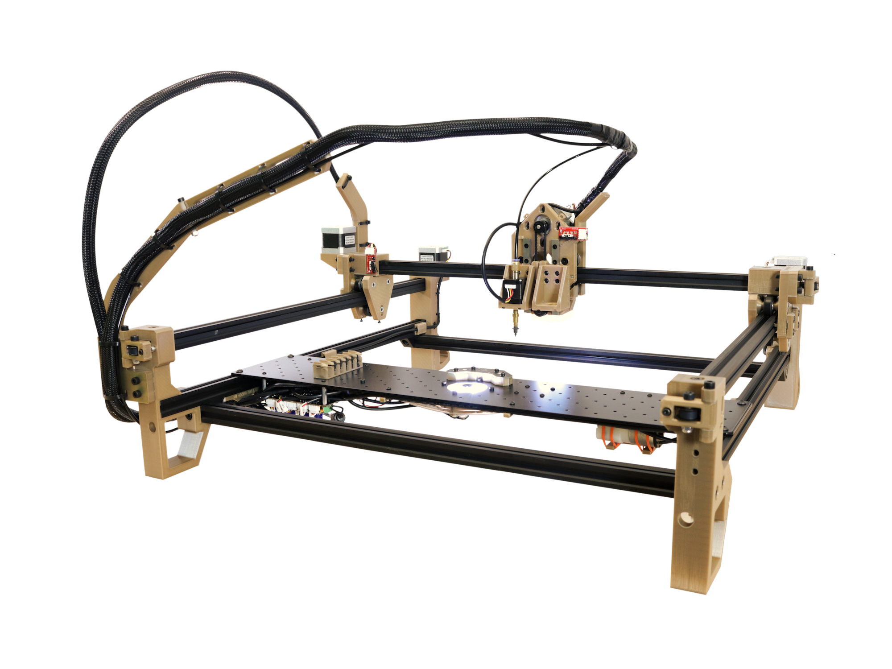

## What is the LumenPnP?

The LumenPnP is an open source Pick and Place project led by [Opulo](https://www.opulo.io/). The LumenPnP is designed to be low cost and suited towards [mid-scale manufacturing](http://stephenhawes.com/level-2-manufacturing/).

The LumenPnP is capable of placing parts as small as 0402, with support for down to 0603. It is currently set up to use strip feeders, but development around active, powered feeders is ongoing.

It is completely open source and hackable. The main controller has three AUX ports, allowing anyone to add on peripherals or communicate with other machines.

!!! danger "WARNING"
    This documentation corresponds with a specific machine **Build Number**. The Build Number represents what hardware and 3D printed parts your machine has. The first number is what version of the Opulo hardware kit you have. If you're building a BYOP kit, **you have a v2 kit, and these docs are for you!** You should see "v2" on the pamphlet that was included in your kit.

## What's on this site?

* How to assemble the hardware in a LumenPnP Kit
* How to connect the electrical components in a LumenPnP Kit
* How to complete basic calibration in OpenPnP

## READ BEFORE STARTING

### Referencing Source Files

As you go through this guide, you might find that you'd like to refer to the source files for a number of parts in the machine. The exported build files and source for your machine can be found on the [Releases Page](https://github.com/opulo-inc/lumenpnp/releases). Make sure to reference the same Build Number as your machine kit!

### Machine Orientation and Terminology

Throughout this guide we'll be referring to different orientations and directions of the machine as "left, right, front, back, up, and down." In general, these words are in reference to the typical view of the machine, facing it directly, as shown below.

We'll also refer to putting the machine "back on its haunches." This refers to a feature of the LumenPnP where it can be lifted up by the front rail and let to rest upright on its back feet. This orientation is tremendously helpful for installing things to the staging plate and plugging things into the motherboard. Whenever putting your machine back, make sure the Y gantry is pushed all the way to the back of the machine to prevent backdriving the Y stepper motor driver. An image of this orientation is below.

### Help

If you find that there's something unclear in this documentation, please [submit a ticket on Github](https://github.com/opulo-inc/lumenpnp/issues/new/choose) about it! Select the "Index Documentation Issue" template. You can also file an issue using the link in the upper right of any page on this site. We're trying to make this as clear and understandable as possible, so every issue you tag helps us make it better for everyone else. You can also check out the [Discord server](https://discordapp.com/invite/TCwy6De) and ask questions to the community.

### Timing

Expect assembly to take about **eight hours** provided all parts are printed and ready to use.

### Tools Needed

* M2 Allen Wrench (Long, ball-end)
* M2.5 Allen Wrench (Long, ball-end)
* M3 Allen Wrench (Long, ball-end)
* M4 Allen Wrench (Long, ball-end)
* Small Phillips Screwdriver
* Small Flathead Screwdriver
* Soldering Iron and Solder
* Needle-nose Pliers
* Mallet
* Flush Cutters
* Wire Stripper
* Measuring Tape
* Calipers
* Hot Air

## Next steps

Let's dive in! The first step is the mechanical assembly, and [printing all the parts](mechanical-assembly/1-printing-parts/index.md).