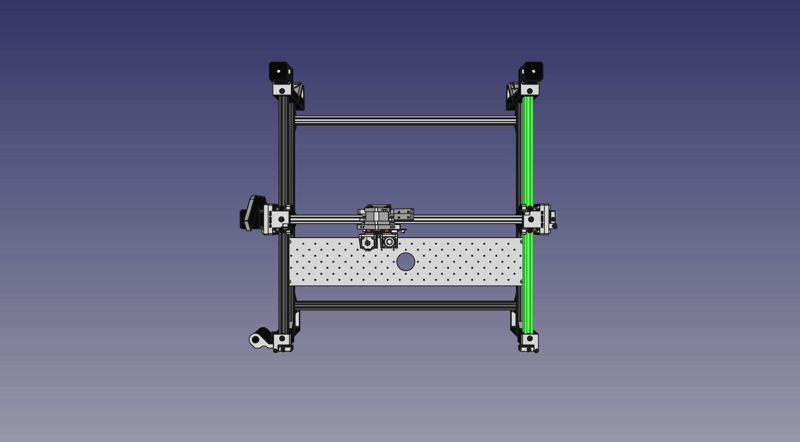
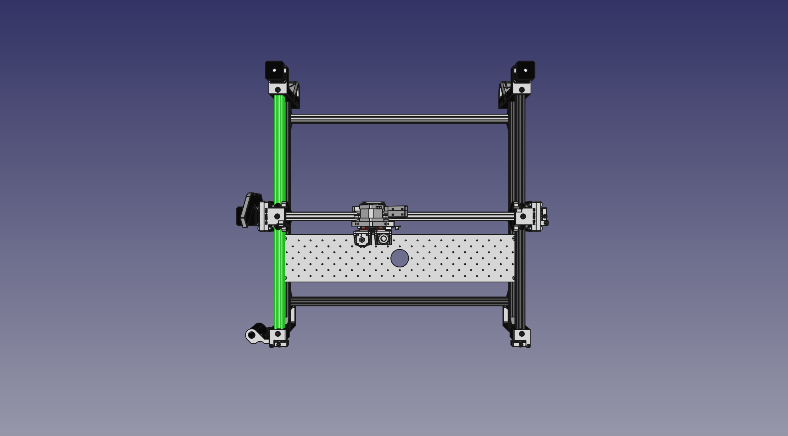

# Attaching Belts

With a complete frame assembled, we can now route the GT2 timing belt that makes everything move!

|  Qty | Part                  |
| ---: | --------------------- |
|    1 | GT2 Timing Belt       |
|    4 | FDM-0027 (Belt Clamp) |
|    8 | M5x10 machine screw   |

1. We'll start with the Y axis. If you'd like to precut your belt instead of routing the entirety of it through the machine, you can cut two 1400mm lengths for the Y axis motors. To help guide the belt through the openings in the prints, bend it backwards as shown below so that the belt has a curve to it.
  { loading=lazy }
  { loading=lazy }

1. Take your length of GT2 belt and stick it inside the extrusion (smooth side facing outward), behind the `Y Gantry` as shown below. Getting the belt to come out of the slot in the Y axis gantry can be difficult. Here's some strategies:
   1. Try using a small allen wrench with a ball tip to guide the belt out of the hole. (Photos below)
   2. Or, attach a twist tie to the end of the belt and guide that out the hole instead. When you're done, the belt should be coming out of the hole on the side closest to the front of the machine.
   3. Running a long zip tie through the hole from the front, you may be able to catch the ridges of the zip tie with the ridges of the belt, and pull it through by retracting the zip tie.
  { loading=lazy }
  { loading=lazy }
  { loading=lazy }
  { loading=lazy }

1. Using 4 M5x10mm machine screws and 2 `Belt Clamps` on the `Y Gantry`, slide the belt underneath the `Belt Clamps` and tighten them down with the GT2 belt flush with the edge of the `Y Gantry`.

2. Now, take the other end of your belt and feed it through the `Front Right Leg`. Guide it through and around the idler in the `Belt Tension Arm`, and feed it back through the other side of the `Front Right Leg` as shown below.
  { loading=lazy }
  { loading=lazy }

1. Continue to feed your belt along the inner side of the aluminum extrusion. Pass behind the `Y Gantry Support` between it and the aluminum extrusion.

2. Feed the belt through the inner side of the `Back Right Leg`. Then loop the belt around the GT2 pulley on the stepper motor and feed it through the outer side of the `Back Right Leg`.
  { loading=lazy }

1. Run the belt along the outer side of the aluminum extrusion. Take the end and feed it through the other opening of the Y gantry, like we did in step 1. Feed the end between the Y gantry and the `Belt Clamps`. Make sure the belt tensioner on the front leg is completely unscrewed, meaning it's angled as close to the leg as it can be. This will give us the most possible stroke to tension the belt in the next step.

2. Pull on the belt with one hand, while holding the Y gantry steady with the other. Getting it generally taught is preferable, but don't worry about getting it perfect; we'll tension it correctly next. Push down on the belt clamp to hold the belt in place, and tighten the two screws to clamp it down. Cut the belt with at least 20mm remaining out the back side of the Y gantry.

3. Now we can tension the belt. Slowly tighten in the M3 screw on the belt tensioner to increase the belt tension. Pulling back on the belt tensioner arm should be difficult, but possible. A tug should result in only a 2mm deflection.

4. Perform the same steps on the left side Y axis.
  { loading=lazy }

1.  We're going to do the exact same operation for the X axis, but with one small thing to keep in mind: when looking at the back of the machine, start by clamping the belt on the **right** side of the X gantry (the side closest to the motor). This way, the excess belt will be sticking out of the X gantry on the side opposite of the limit switch, and prevent a problem with homing. You can precut a 1500mm strip of belt for the X axis or just use the rest of your belt and trim the excess.
  { loading=lazy }

## Next steps

Continue to [populating the staging plate](../11-populating-staging-plate/index.md).
