# Populating the Staging Plate

We now have the main structure of the machine assembled! Now we'll mount some components to the bottom of the staging plate.

## Overview

Refer to the images below for referencing where to mount parts on the staging plate.

{ loading=lazy }
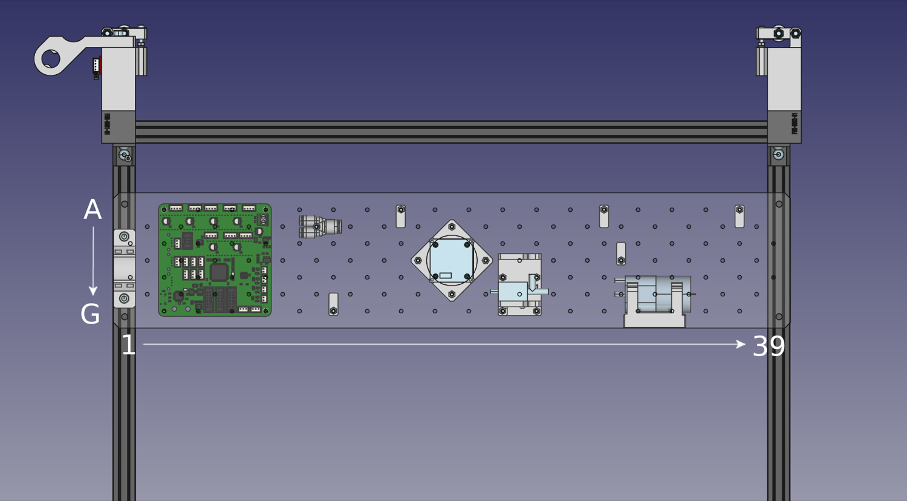{ loading=lazy }

## Soldering Pump

|  Qty | Part                            |
| ---: | ------------------------------- |
|    1 | Vacuum Pump                     |
|    1 | Vacuum Pump Wire (Labeled "P1") |
|    2 | Heatshrink (small)              |

Some LumenPnP kits shipped with a pump that had its connector pre-soldered to it. If your pump is not pre-soldered, follow along here to prepare your pump.

1. Gather your Pump, the pump wire (labeled "P1"), and two lengths of heatshrink.
  { loading=lazy }

2. Slip the heatshrink over the two exposed leads of the wire.
  { loading=lazy }

3. Wrap the red wire around the left lead as shown in the image below. Wrap the black wire around the right lead.
  { loading=lazy }

4. Solder both wires to the pump leads. The polarity does not matter.
  { loading=lazy }

5. Slip the heat shrink over the solder joints and motor lead. Use a hot air gun, lighter, or other heat source to shrink the heatshrink.
  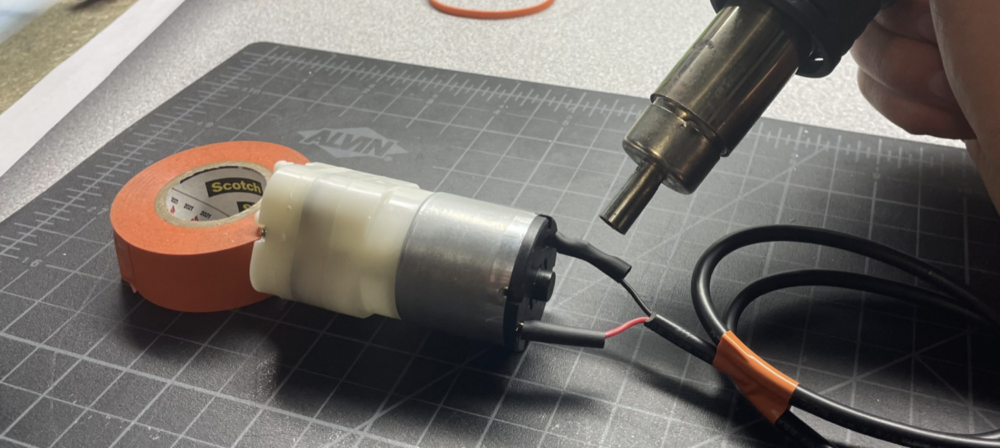{ loading=lazy }
  { loading=lazy }

## Pump mount

|  Qty | Part                  |
| ---: | --------------------- |
|    1 | FDM-0025 (Pump Mount) |
|    2 | M3 Hex Nuts           |
|    2 | Rubber Band           |
|    1 | Vacuum Pump           |
|    2 | M3x10 machine screw   |

The first thing we'll mount to the staging plate is the `Pump Mount`. This print suspends the pump using two rubber bands to ensure none of the vibration of the pump is transferred into the frame.

6. Start by press-fitting M3 nuts into the side recesses in the `Pump Mount`.
  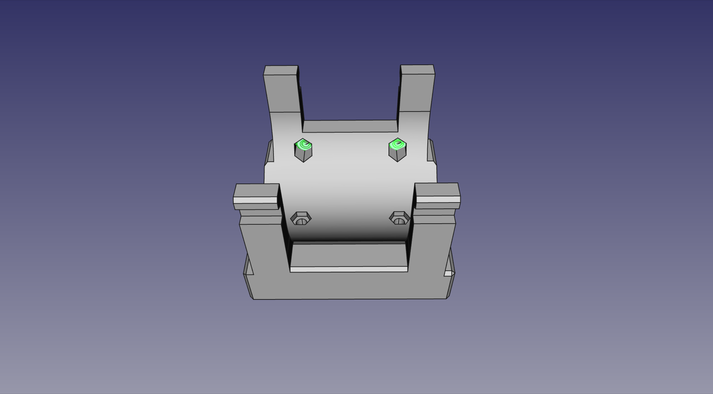{ loading=lazy }

7. Now we'll mount the pump in the `Pump Mount` using a couple rubber bands. Start by grabbing the rubber band with both hands, giving it a half twist, and folding it over on itself, making two loops.
  { loading=lazy }
  { loading=lazy }
  { loading=lazy }

1. Now stretch each rubber band over each pair of pegs on the `Pump Mount`. Guide the pump between each pair of bands so that it's suspended in the `Pump Mount`.
  { loading=lazy }
  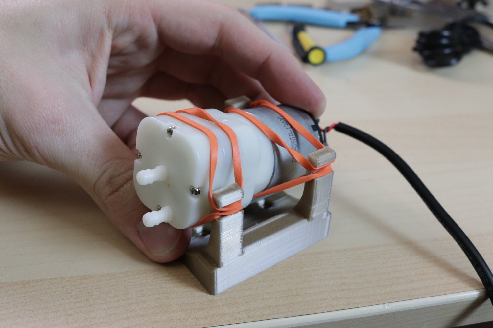{ loading=lazy }
  { loading=lazy }

1. Mount the `Pump Mount` to the staging plate using two M3 x 10mm screws in the location shown below, G31 and G33.
  { loading=lazy }
  { loading=lazy }

## Valve mount

|  Qty | Part                   |
| ---: | ---------------------- |
|    1 | FDM-0042 (Valve Mount) |
|    1 | Blowoff Valve          |
|    4 | M3 Hex Nut             |
|    6 | M3x8 machine screw     |

Now we'll attach the `Valve Mount` to the staging plate.

10. Press fit four M3 nuts into the recesses in the `Valve Mount`.
  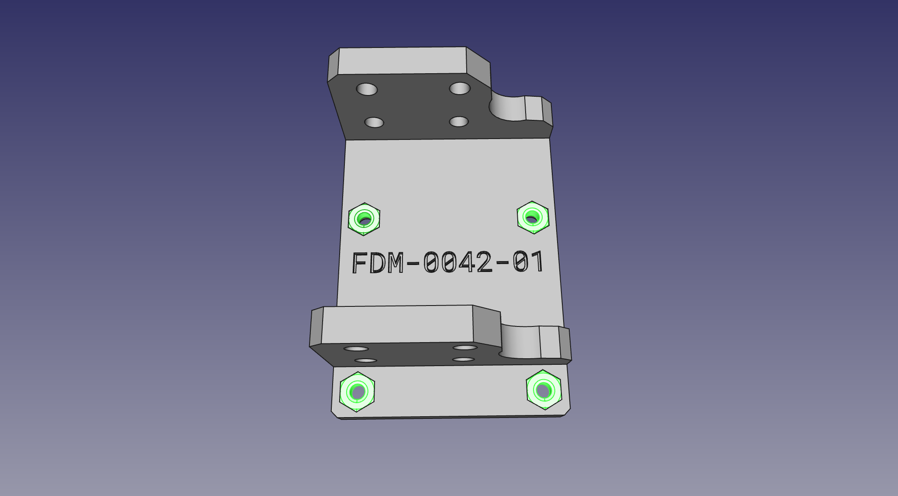{ loading=lazy }

11. Use two M3x8mm screws to attach the valve to the `Valve Mount` as shown below.
  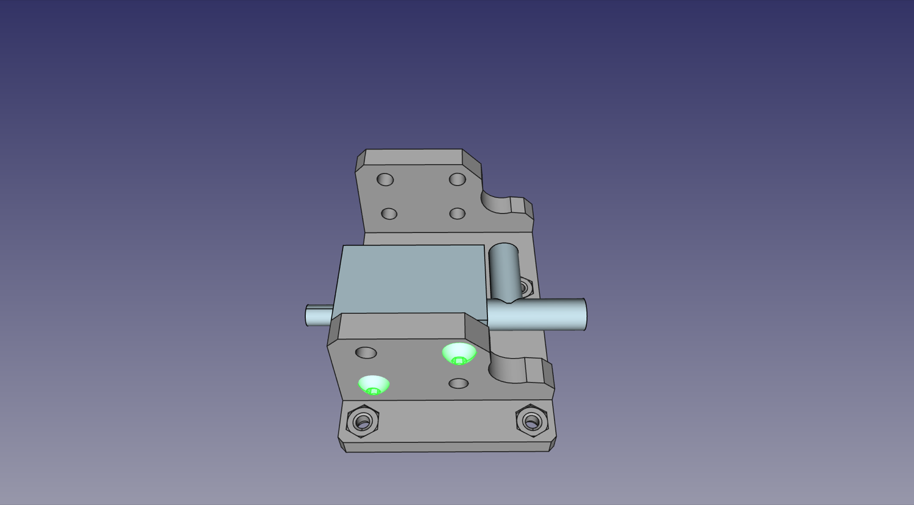{ loading=lazy }

12. Use four M3x8mm screws to mount the `Valve Mount` to the staging plate in the location shown: E23, E25, G23, G25.
  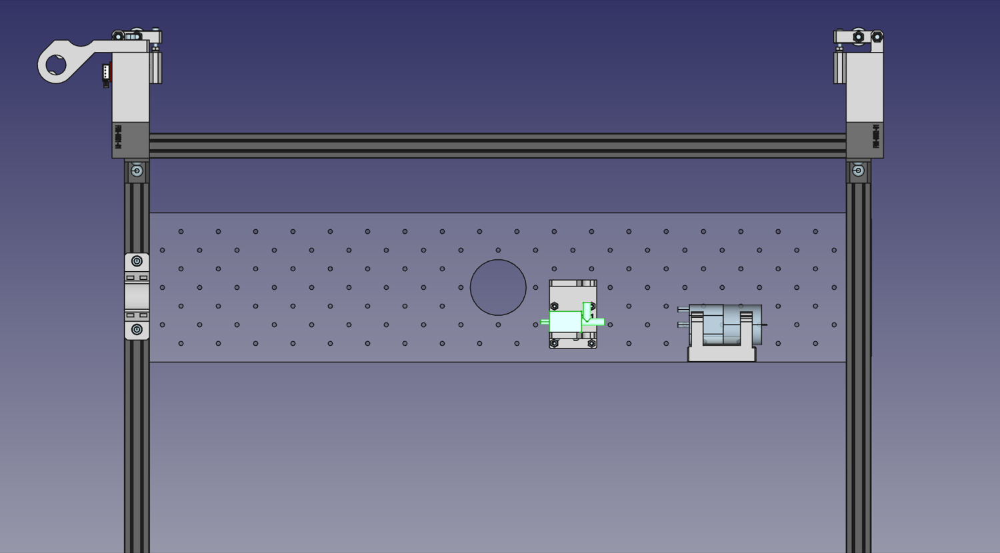{ loading=lazy }
  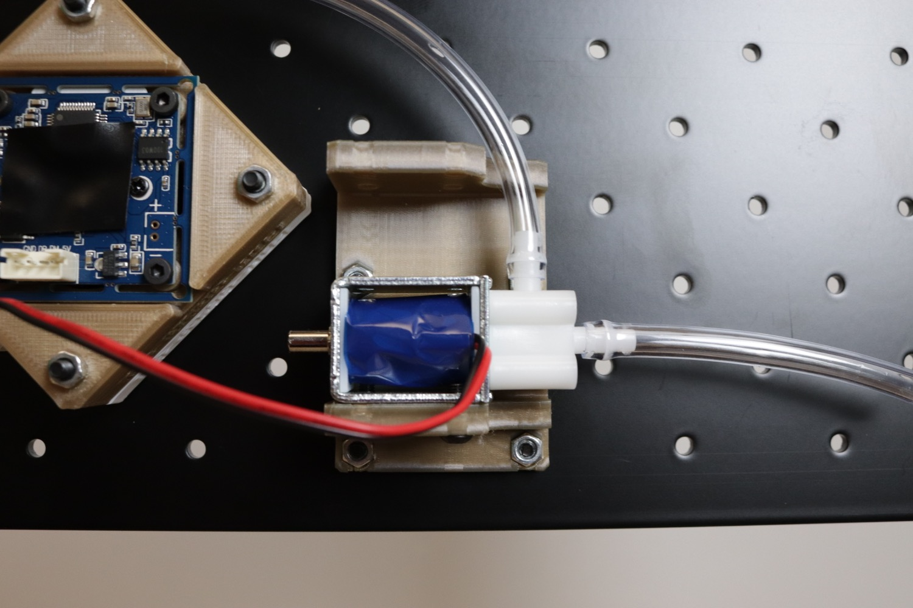{ loading=lazy }

## Pneumatic Y splitter mount

|  Qty | Part                |
| ---: | ------------------- |
|    1 | M3x30 machine screw |
|    1 | M3 Hex nut          |
|    1 | Y Splitter          |

13. Use an M3x30mm screw and an M3 nut to mount the pneumatic Y splitter to the staging plate as shown: B12.
  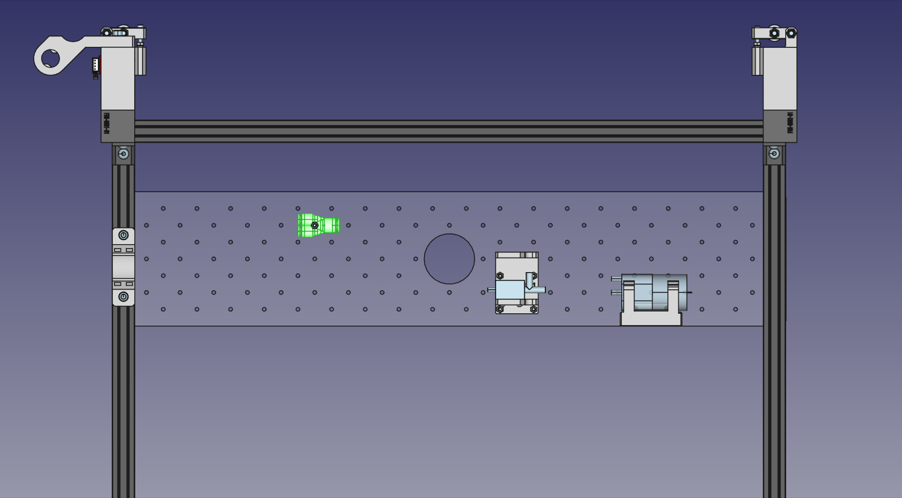{ loading=lazy }
  { loading=lazy }

## Bottom camera mount

|  Qty | Part                       |
| ---: | -------------------------- |
|    1 | FDM-0019 (Up Light Mount)  |
|    1 | FDM-0020 (Up Camera Mount) |
|    1 | Up Ring Light PCB          |
|    1 | USB Camera (Bottom)        |
|    4 | M3x30 machine screw        |
|    4 | M3 Hex Nut                 |
|    4 | M2.5x8 machine screw       |
|    1 | Super Lube                 |

14. Slide the Up Ring Light into the `Up Light Mount`. The cable connector and LEDs should be facing the printed part, away from the camera in this photo.
  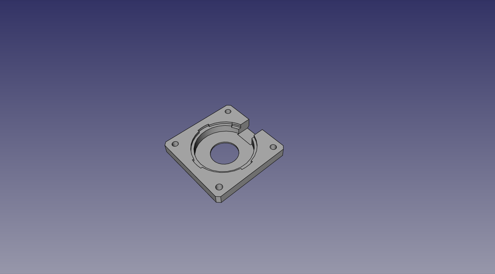{ loading=lazy }
  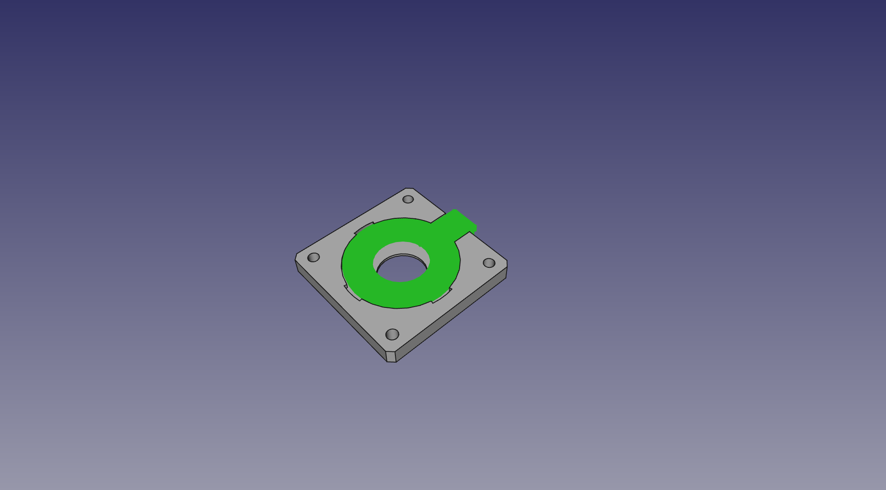{ loading=lazy }

1.  Stack the `Up Camera Mount`Up Light Mount`
  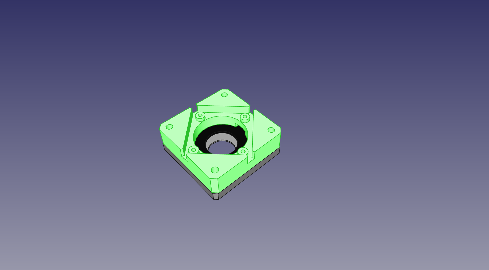{ loading=lazy }

1.  Just as with the top camera, you need to make sure you can rotate the camera's lens to adjust its focus. First carefully remove the set screw on the side of the lens assembly that is holding the lens in place. Next, unscrew the lens from the camera. You might need a light grip with pliers (preferably with soft grips) to get it to turn. With the lens removed, use a cotton swab to apply a **very small** amount of Super Lube to the lens threads. Be careful not to get any of the lubricant inside or on the lens. Wipe off any excess with a cotton swab or microfiber cloth. If necessary, you can clean the lens itself using a microfiber cloth. Screw the lens back into the camera and work the lubricant into the threads. Save the lubricant as you'll use it again later. Finally, add the set screw back to the side of the lens assembly. Tighten the set screw just enough to keep the lens in place but not so much that it prevents you from adjusting the lens with a little force, as you'll need to adjust the lens after the camera is mounted.

2.  Stack the Up Camera in the `Up Camera Mount`. The cable connector for the camera should be as close to the cable connector for the Up Ring Light as possible, as pictured below.
  { loading=lazy }
  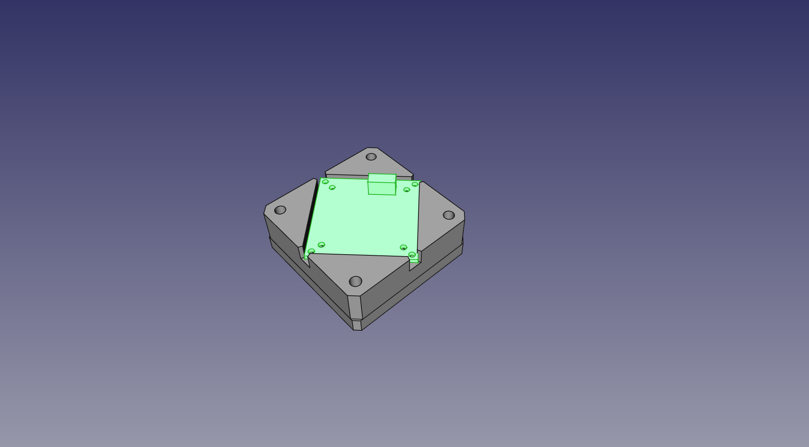{ loading=lazy }

1.  Use four M2.5x8mm screws to mount the camera into the `Up Camera Mount` by using the inner set of four holes and tapping directly into the plastic.
  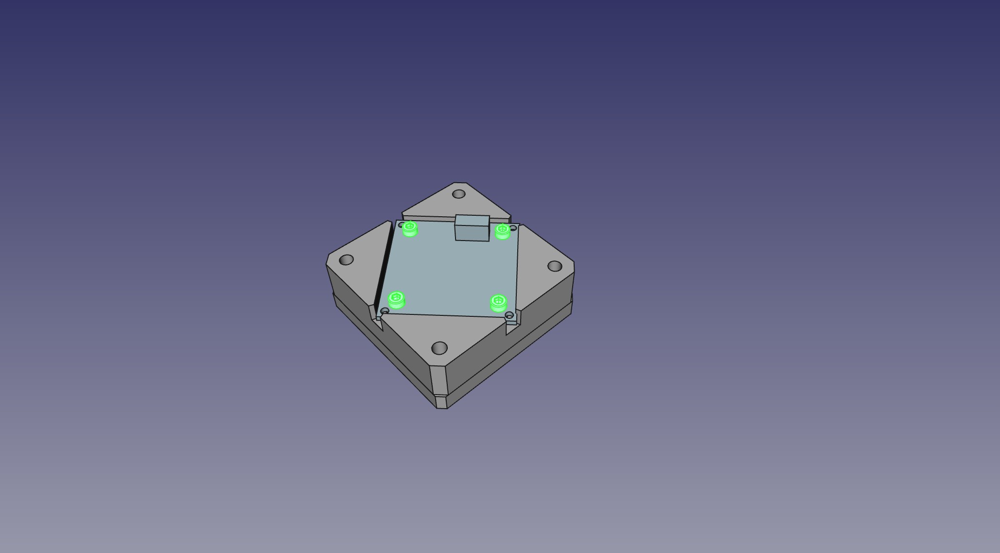{ loading=lazy }

1.  If you have the fiberglass PCB staging plate, you'll need to install a support foot to keep the staging plate sturdy. Stack the Foot Mount on top of the assembly. If you have the metal staging plate, you can skip this step.
  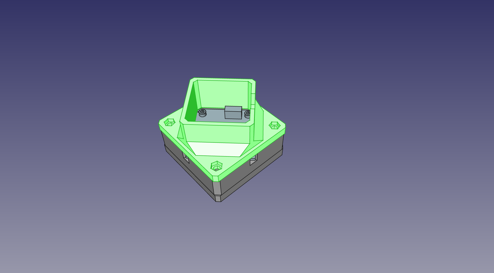{ loading=lazy }

1.  If you have the fiberglass PCB staging plate, push four M3 nuts into the recesses in the Foot Mount.
  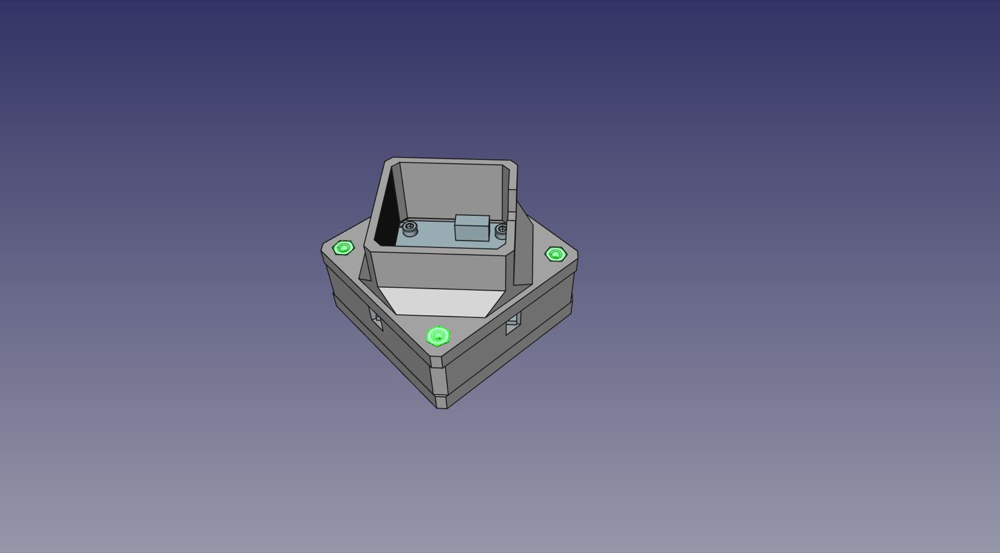{ loading=lazy }

1.  Use four M3x30mm screws and four M3 nuts mount the whole assembly to the staging plate: D18, B20, D20, F22 (if you have the fiberglass staging plate, these will be the nuts you installed in the previous step). The cable connector for the Up Ring Light should be facing down and to the left, away from the valve.
  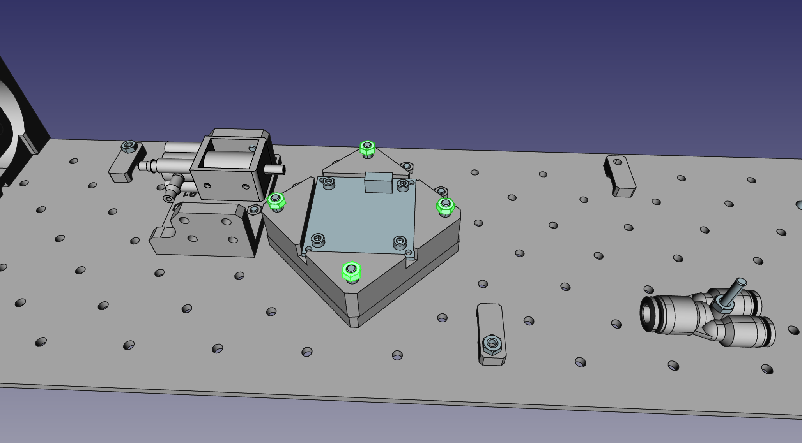{ loading=lazy }
  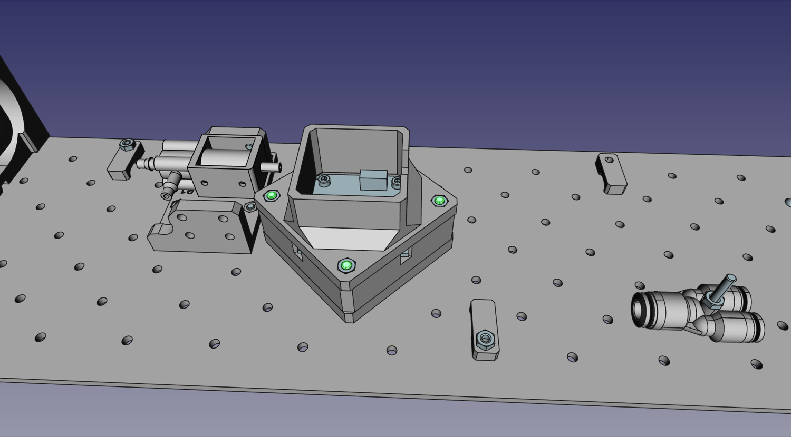{ loading=lazy }

1.  Ensure that your bottom camera matches the orientation to the image below.
  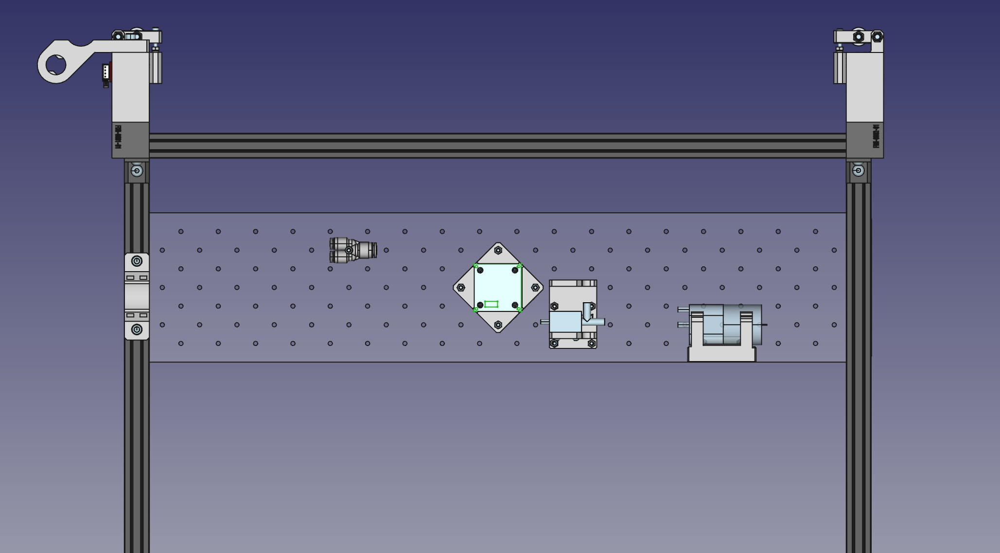{ loading=lazy }
  { loading=lazy }

1.  If you have the fiberglass PCB staging plate, note that this is where the foot will get installed when your LumenPnP is ready.
  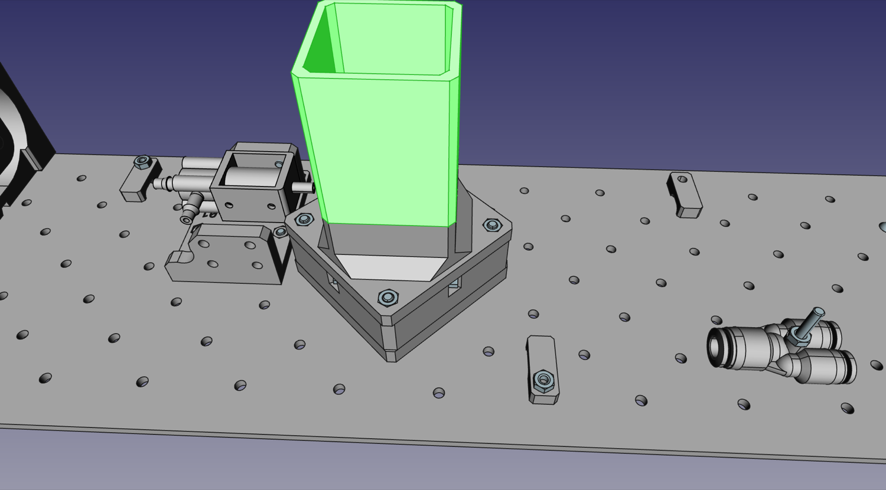{ loading=lazy }

## Nozzle Holder

|  Qty | Part                     |
| ---: | ------------------------ |
|    1 | FDM-0024 (Nozzle Holder) |
|    3 | M3 Hex Nut               |
|    3 | M3x8 machine screw       |

24. Slide three M3 nuts into the slots in the back of the `Nozzle Holder`.
  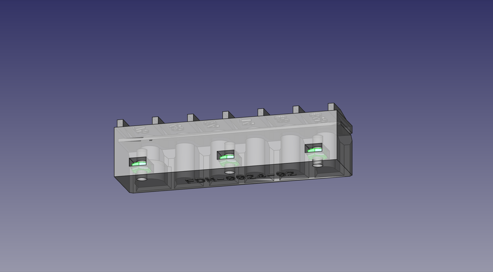{ loading=lazy }

25. Using three M3x8mm machine screws, tighten the `Nozzle Holder` on top of the staging plate as shown: B8, D8, F8. Note: we will install the datum board later, ignore it in the photo below.
  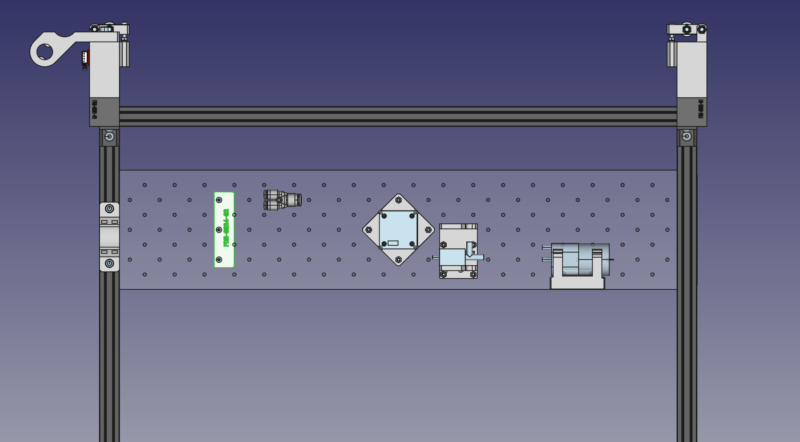{ loading=lazy }
  { loading=lazy }
  { loading=lazy }

## Next steps

Continue to [installing the motherboard](../../motherboard/installing-tht/index.md).
