# Belt Tensioners

Alright, time to get into the build! First, we're going to build the belt tensioners that are used for the X and Y axes. You need to build **three** of these.

| Qty              | Part                          |
|-----------------:|-------------------------------|
| 1 each, 3 total  | M3 Hex Nut                    |
| 1 each, 3 total  | M3x16 machine screw           |
| 1 each, 3 total  | M3 Cap Nut                    |
| 1 each, 3 total  | M5x25 machine screw           |
| 1 each, 3 total  | M5 Nyloc Hex Nut              |
| 1 each, 3 total  | M5x40 machine screw           |
| 1 each, 3 total  | M5 Hex Nut                    |
| 1 each, 3 total  | GT2 Pulley Idler              |
| 1 each, 3 total  | FDM-0037 (Belt Tension Arm)   |
| 1                | FDM-0001 (Front Left Leg)     |
| 1                | FDM-0002 (Front Right Leg)    |
| 1                | FDM-0013 (X Idler Mount)      |

## Assembling the Belt Tensioner Arms

1. Insert an M3 Hex Nut into its slot on the back of a `Belt Tension Arm`.
  

1. Insert an M3x16mm Machine Screw through the front hole in the `Belt Tension Arm` and then tighten.
  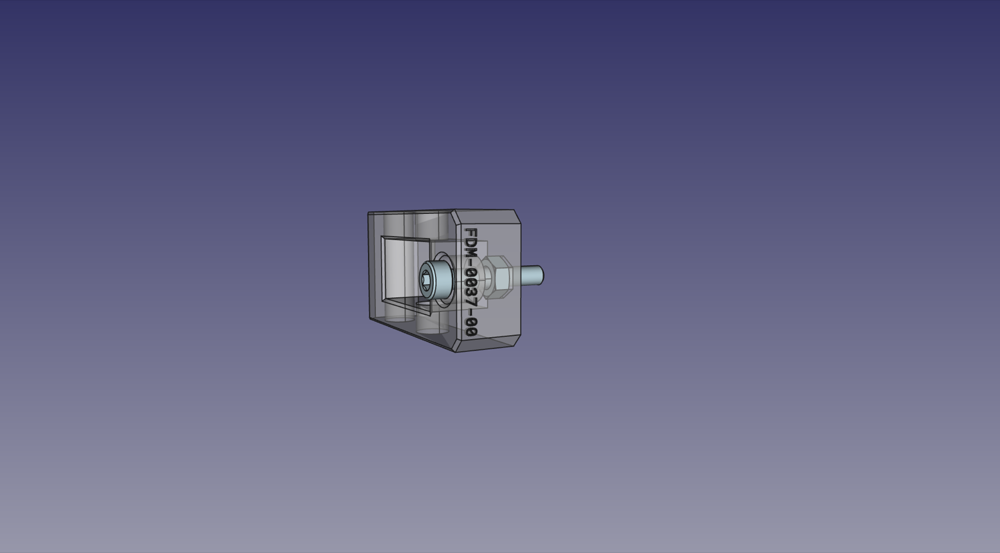

1. Thread an M3 Cap Nut on the end of the M3x16mm Machine Screw.
  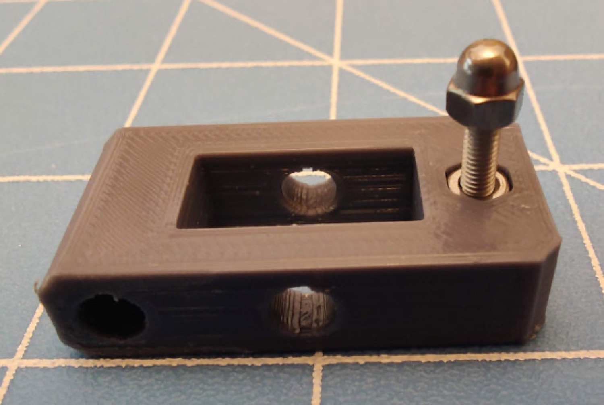

1. Insert an M5x25mm Machine Screw through the hole in the top of the `Belt Tension Arm` so that it passes through a GT2 Pulley Idler.
  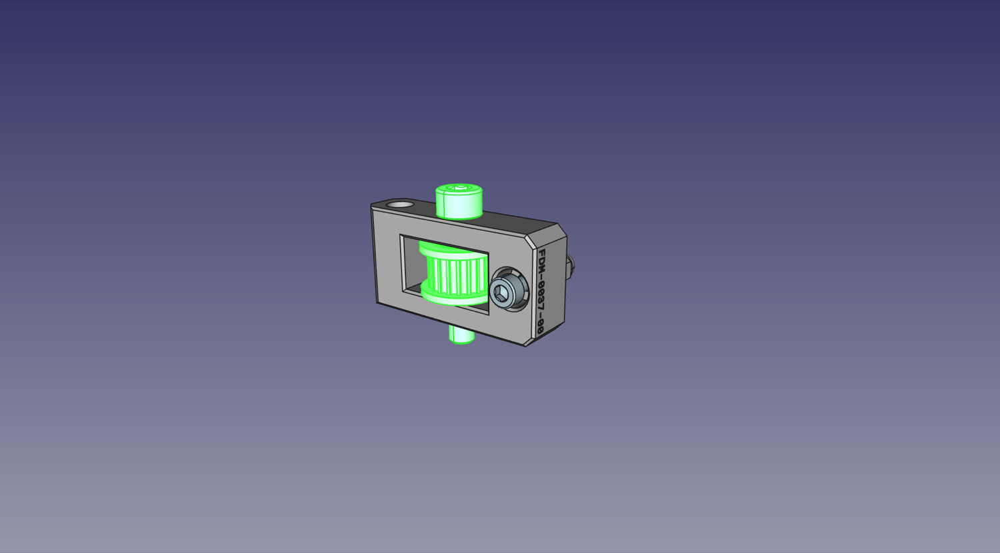

1. Add an M5 Nyloc Hex Nut on the bottom of the `Belt Tension Arm` and tighten. Make sure the idler can still spin freely.
  

1. Repeat this two more times so that you have a total of **three** arms.

## Attaching a tensioner to the left side

Now you'll attach the first tensioner to the `Front Left Leg`:

7. Insert an M5 Nyloc Hex Nut into the recess for a hex nut on the bottom of one of the idler mount arms on the `Front Left Leg`.
  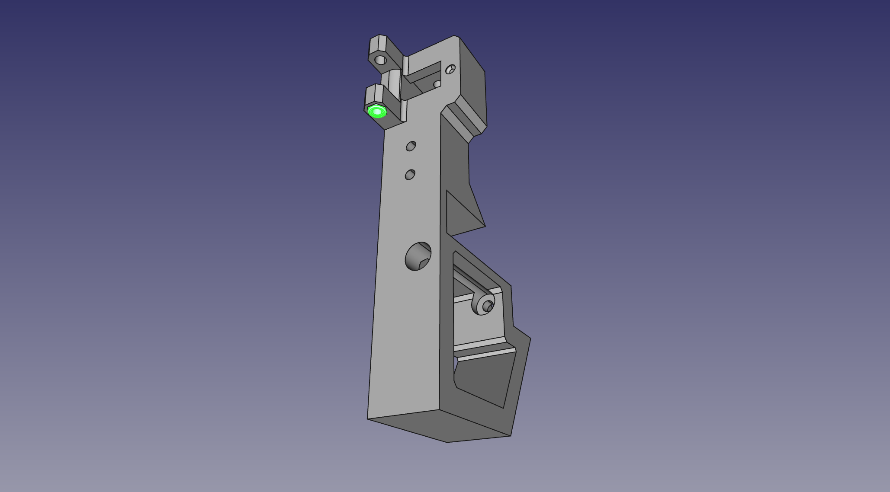

8. Insert a completed `Belt Tension Arm` assembly between the arms on the `Front Left Leg`, with the screw head of the M5x25mm facing up.
  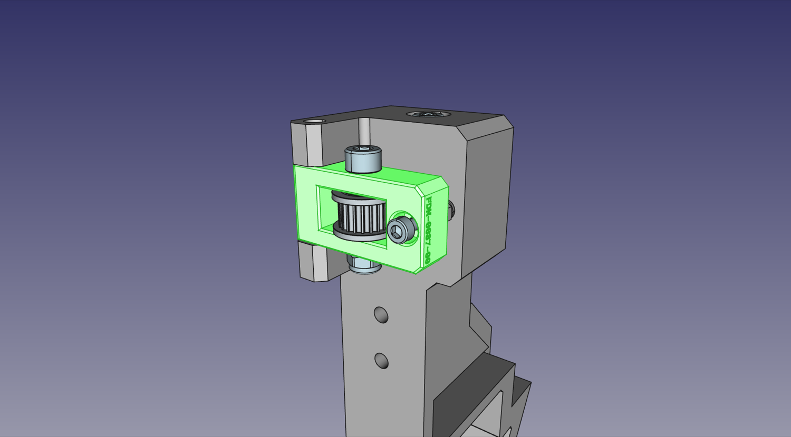

9. Insert an M5x40mm Machine Screw through the hole in the top so that it passes through the `Belt Tension Arm` and tightens into the M5 Nyloc Hex Nut. Do not over-tighten, and ensure you can still pivot the tension arm.
  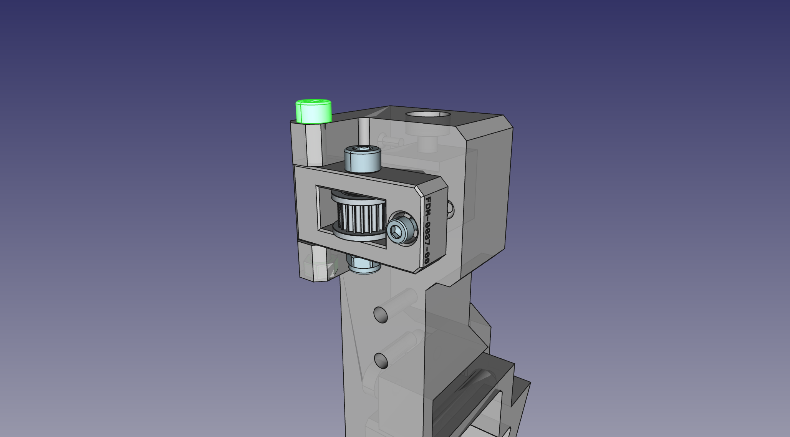
  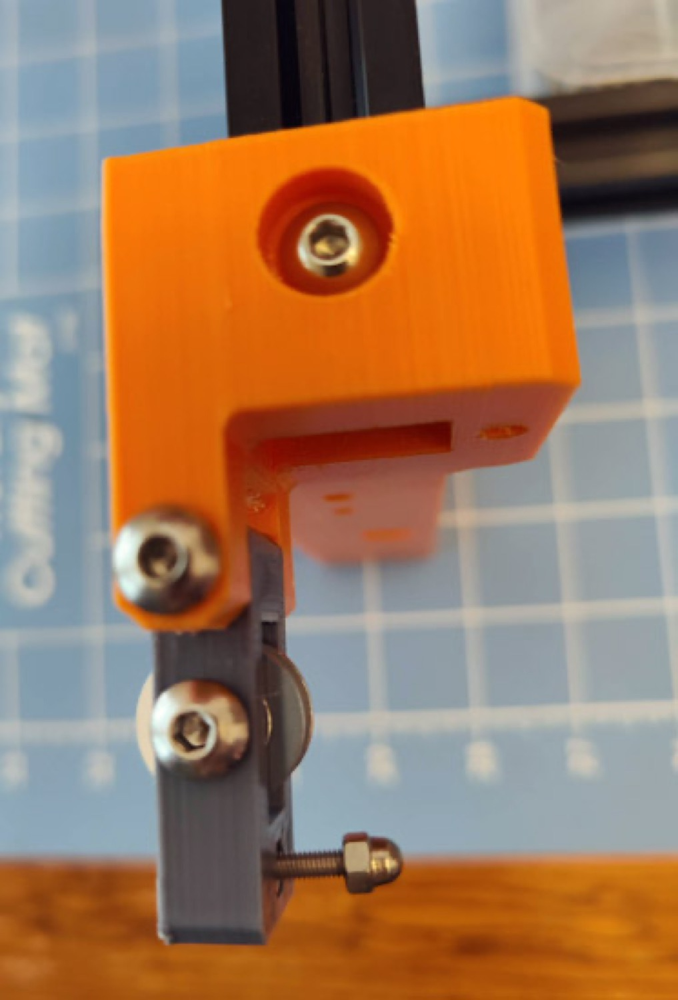

## Attaching a tensioner to the right side

Next, attach the second tensioner the the `Front Right Leg`. This is nearly identical to the first one:

10. Insert the M5 Nyloc Hex Nut into the recess for a hex nut on the bottom of one of the idler mount arms on the `Front Right Leg`.
    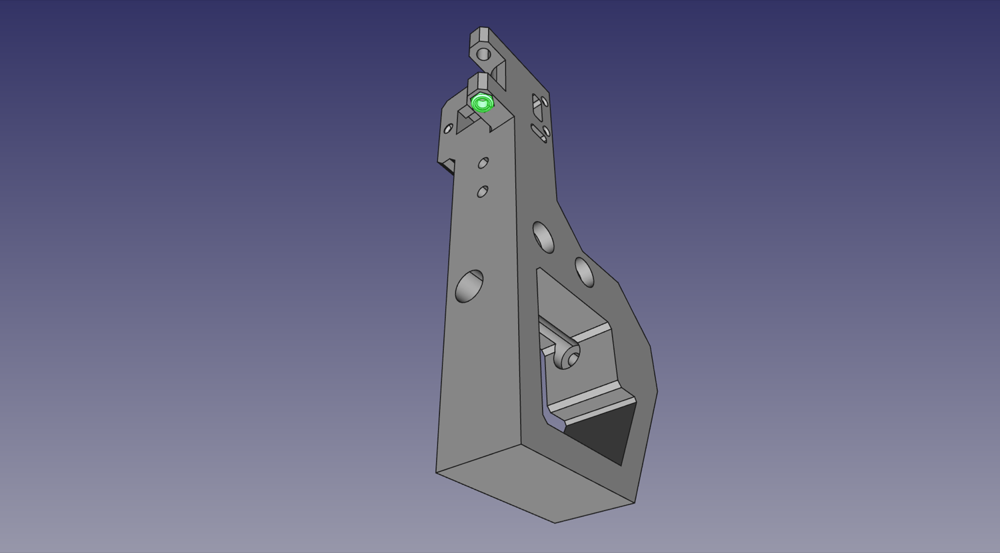

11. Insert a completed `Belt Tension Arm` assembly between the arms on the `Front Right Leg`, with the screw head of the M5x25mm facing up.
  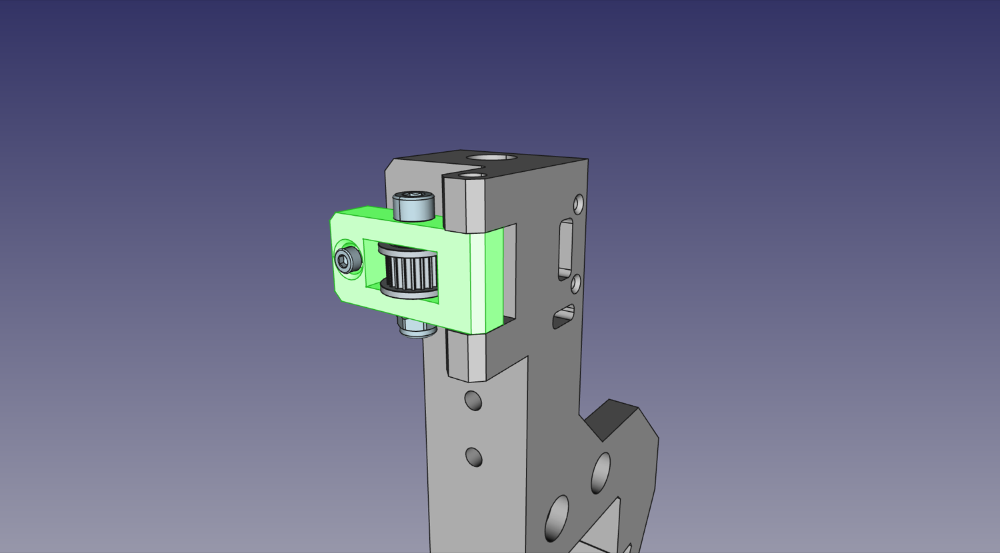

12. Insert the M5x40mm Machine Screw through the hole in the top so that it passes through the `Belt Tension Arm` and tighten into the M5 Nyloc Hex Nut. Do not over-tighten, and ensure you can still pivot the tension arm.
  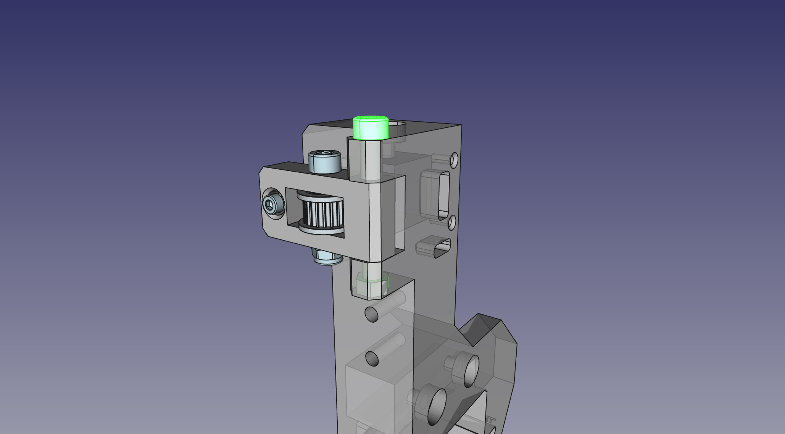
  

## Attaching a tensioner to the X idler mount

The third and final tensioner is attached to the `X Idler Mount`. This is only slightly different from the previous two:

13. Insert the M5 Nyloc hex nut into the recess on the bottom of the `X Idler Mount`.
  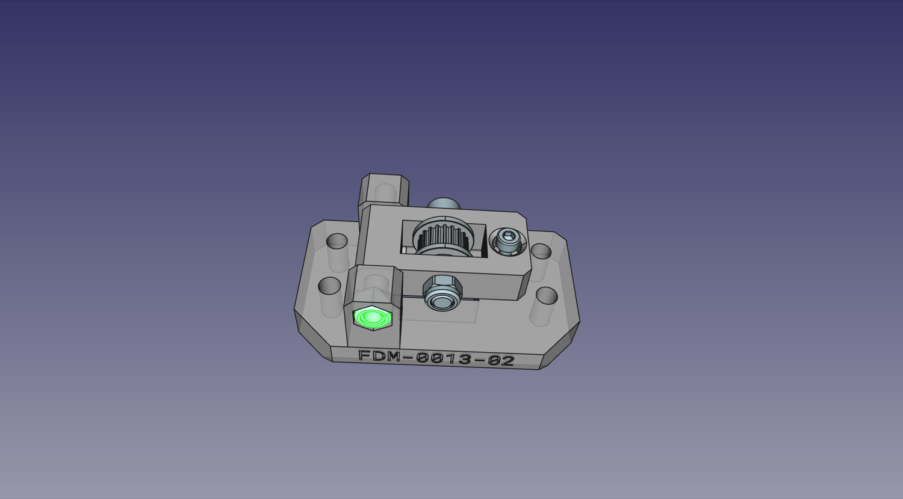

14. Insert the completed `Belt Tension Arm` into its slot in the `X Idler Mount`.
  

15. Insert the M5x40mm machine screw through the hole in the top of the `X Idler Mount` so that it passes through the `Belt Tension Arm` and tightens into the Nyloc Hex Nut.  Do not over-tighten, and ensure you can still pivot the `Belt Tension Arm`.
  
  

## Next steps

Now that all the tensioners are in the right place, continue with [assembling the left side](../3-left-side/index.md).
