# Left Side

Now that the belt tensioner arms are assembled and attached, it's time to start working on the frame. You'll start by assembling the left side of the machine as seen from the front:

{ loading=lazy }

## Assembly

| Qty | Part                               |
|----:|------------------------------------|
|   1 | FDM-0001 (Front Left Leg)          |
|   1 | FDM-0003 (Back Left Leg)           |
|   2 | Aluminum extrusions                |
|   6 | M5 T-slot nut                      |
|   6 | M5x10 machine screw                |
|   1 | NEMA17 Stepper motor               |
|   1 | GT2 Pulley (with grub screws)      |
|   6 | M3x8 machine screw                 |
|   1 | Limit switch PCB                   |
|   2 | M5x25 machine screw                |
|   1 | FDM-0007 (Frame Umbilical Mount)   |
|   1 | FDM-0046 (Umbilical Swivel Part 1) |
|   1 | FDM-0047 (Umbilical Swivel Part 2) |
|   1 | M5x40 machine screw                |

1. Take the `Front Left Leg` and insert the v-slot extrusions into the two square holes designed to take this part. Ensure that the extrusion comes to the end of the holes in which they're inserted. If you have a hard time getting the extrusion into the slots, gently slide them into place using some taps from a mallet.
  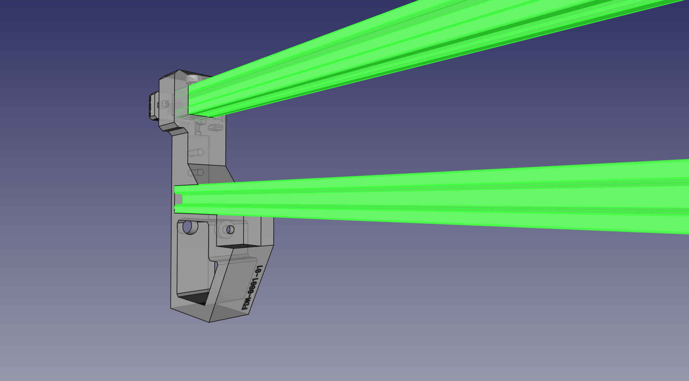{ loading=lazy }
  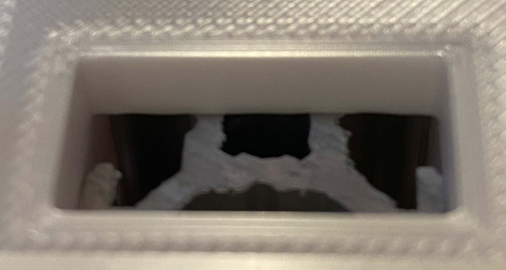{ loading=lazy }

2. Take the `Back Left Leg`. Your progress should look like the image below.
  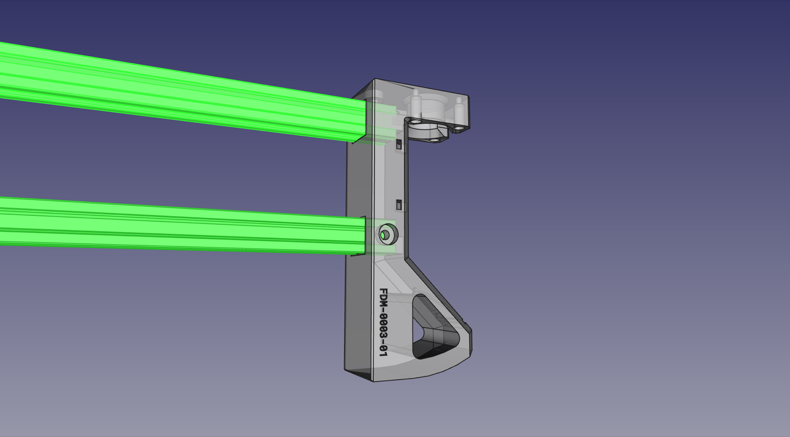{ loading=lazy }
  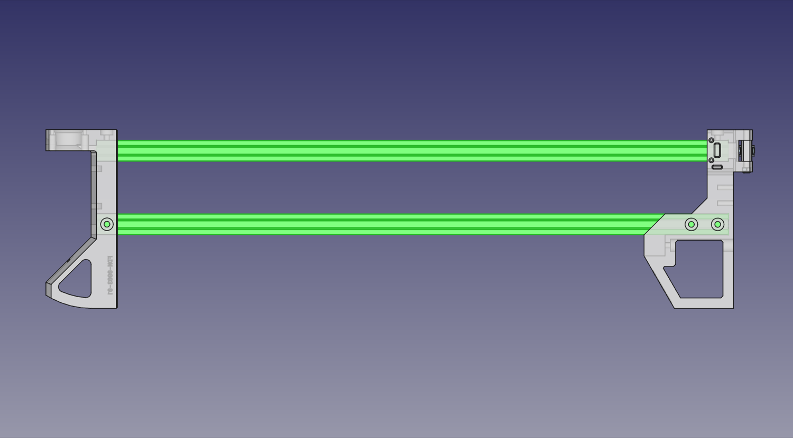{ loading=lazy }

3. On the top rail, drop in and position a slot nut underneath the hole in the top of each leg and screw a M5x10mm machine screw into the nut.
  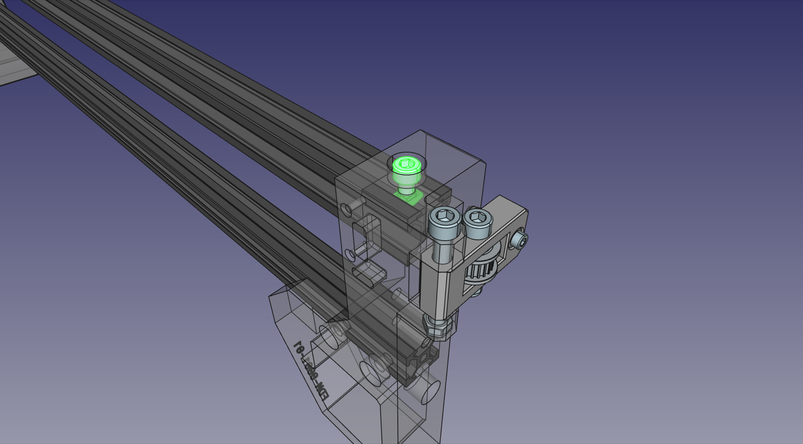{ loading=lazy }
  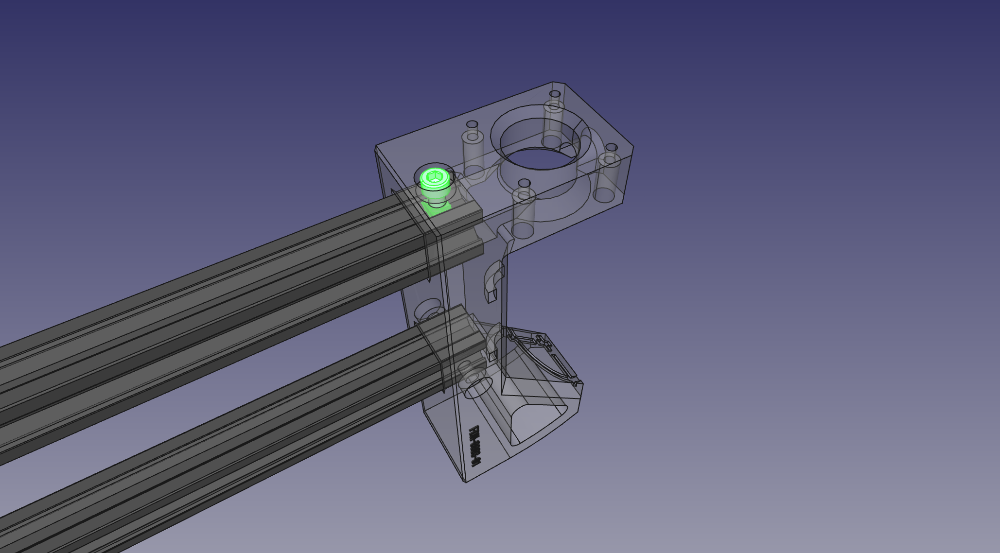{ loading=lazy }
  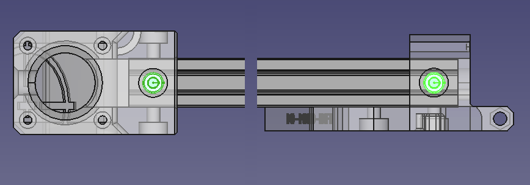{ loading=lazy }

4. On the bottom rail, the outer side has three exposed holes for machine screws (one on the `Back Left Leg`). For each, drop in and position a slot nut under it and screw a M5x10mm machine screw into it.
  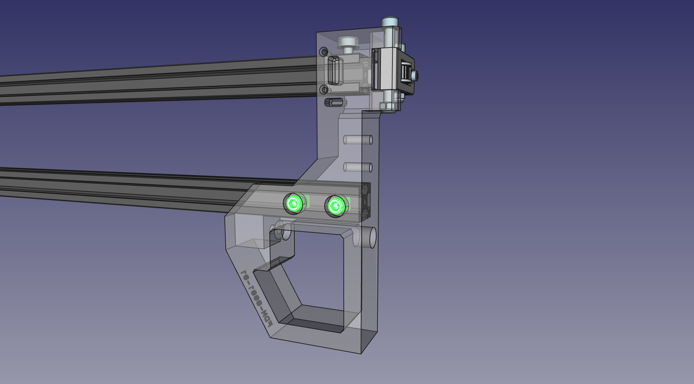{ loading=lazy }
  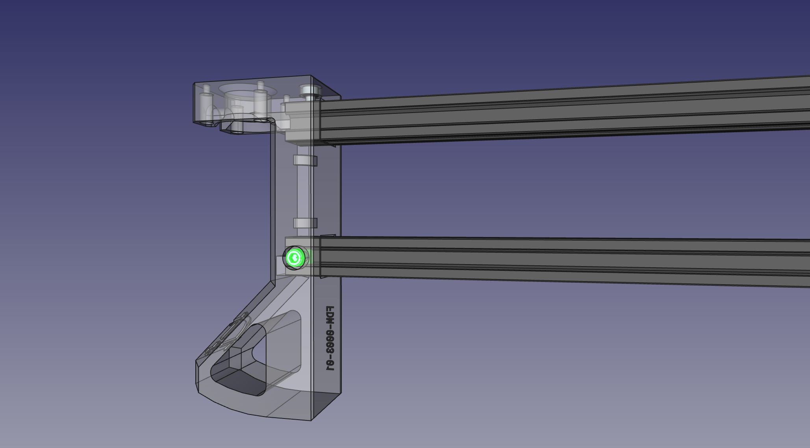{ loading=lazy }
  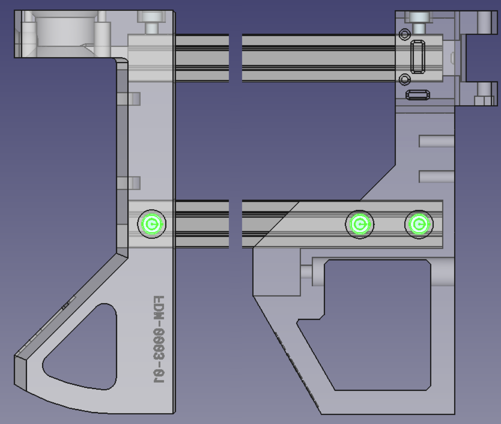{ loading=lazy }

5. On the bottom rail, the inner side has one exposed hole for a machine screw on the `Back Left Leg`. Drop in and position a slot nut under it and screw a M5x10mm machine screw into it.
  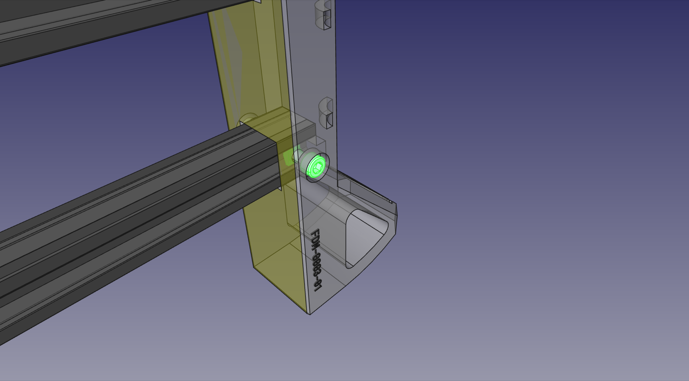{ loading=lazy }
  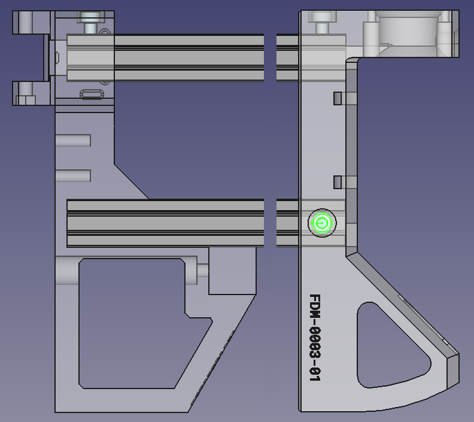{ loading=lazy }

6. Slide the GT2 Pulley onto the the motor shaft of a NEMA17 stepper motor with the set screw side facing the motor body. Align the pulley so that the end is roughly flush with the end of motor shaft, then tighten one of the set screws on the pulley into the flat side of the motor shaft. Tighten the second set screw as well.
  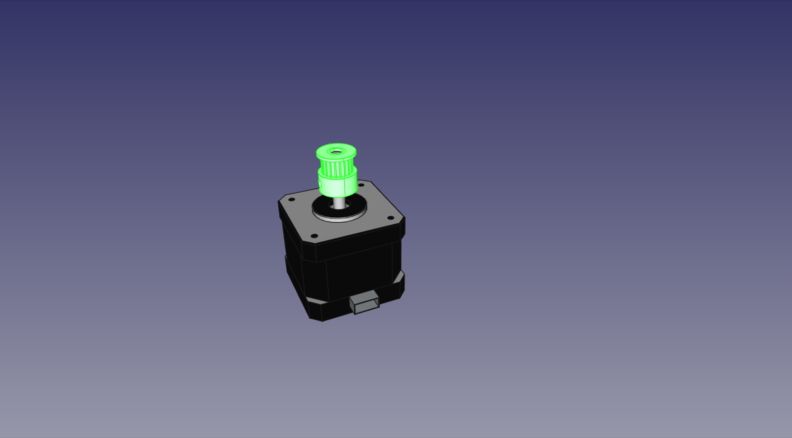{ loading=lazy }

7. Mount the NEMA17 stepper motor to the `Back Left Leg`. Attach it using four M3x8mm screws, ensuring that the connector is facing inwards towards the zip tie loops as dictated in the picture.
  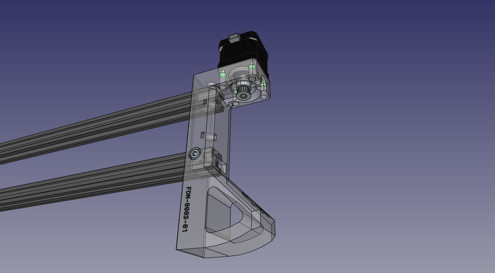{ loading=lazy }
  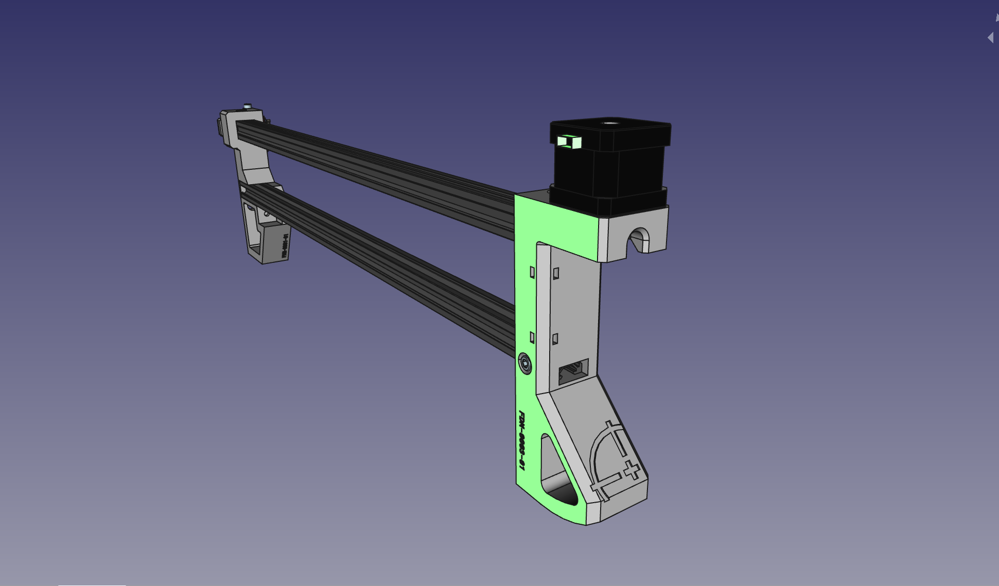{ loading=lazy }

8. Mount one of the three limit switches to the `Front Left Leg` as shown in the image. Use two M3x8mm screws and tap them directly into the print.
    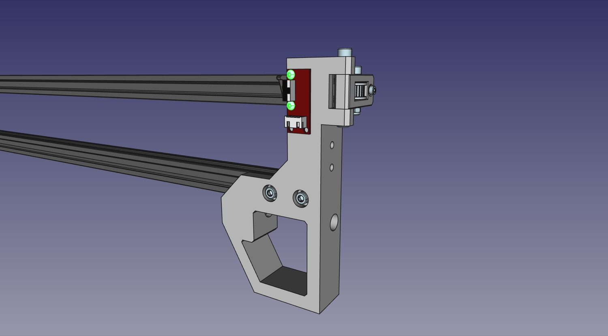{ loading=lazy }

9. Next, we'll mount the `Frame Umbilical Mount` as shown, threading directly into the part.
  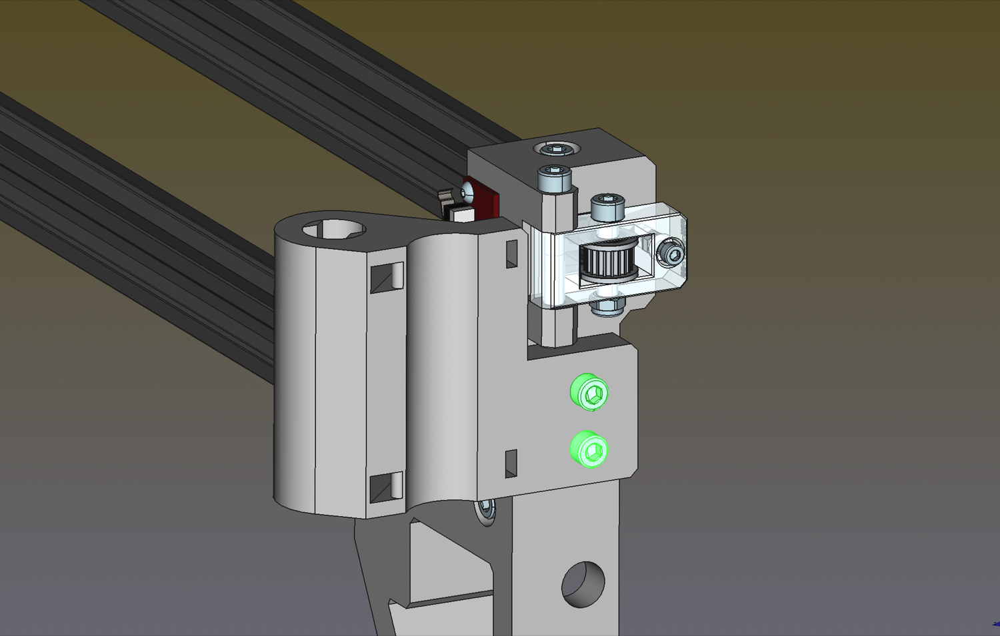{ loading=lazy }

10. Lastly, we'll assemble the umbilical swivel. `Swivel Part 1 and Swivel Part 2` fit together as shown below, and are secured in place with a M5x40mm screw and an M5 nut. Tighten so there's no play in the fit, but the two parts can swivel easily. This part helps keep the X gantry umbilical suspended over the build area. Set it aside for now.
  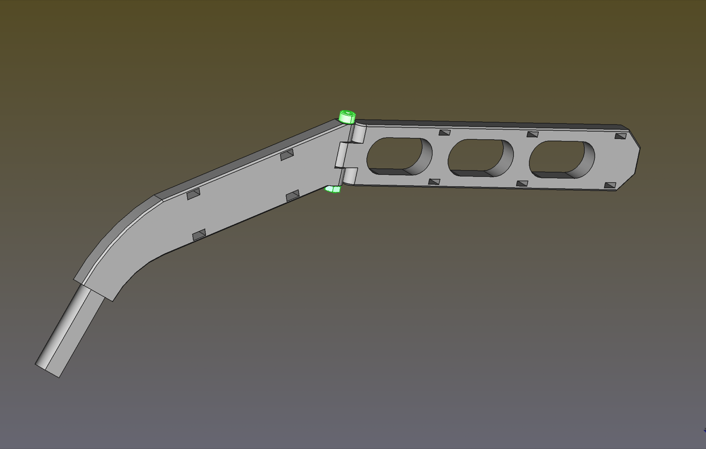{ loading=lazy }

## Next steps

Continue to [assembling the right side](../4-right-side/index.md).
