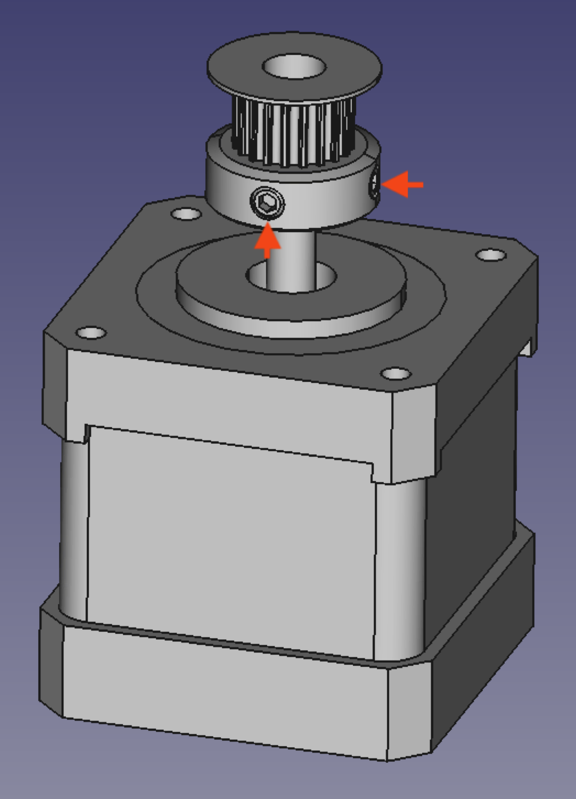
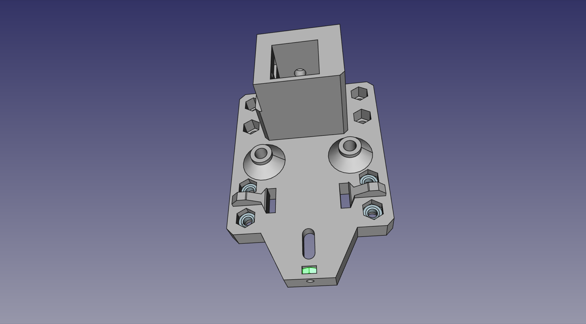
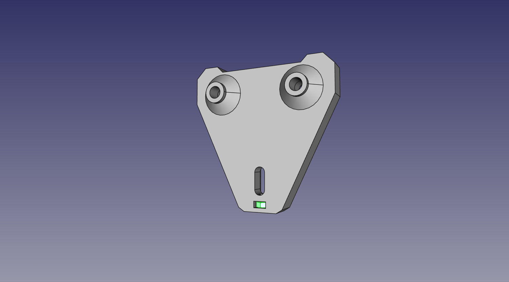
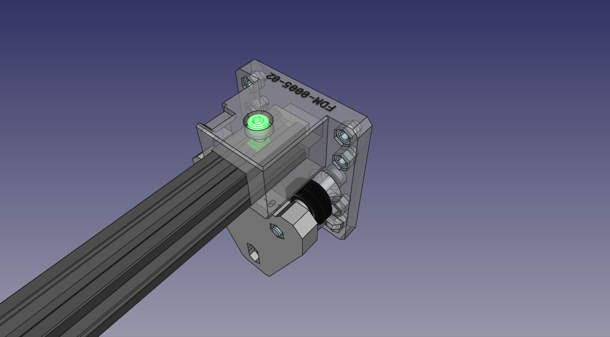

# Y Gantry Assembly

It's time to get going on the Y gantry. This is what moves the toolhead forward and back, and also carries the X gantry as well. We've got a few sub-assemblies in this one, so let's dive in!

## X Motor Mount Sub-Assembly

| Qty | Part                          |
|----:|-------------------------------|
|   1 | NEMA17 stepper motor          |
|   1 | GT2 Pulley (with grub screws) |
|   1 | FDM-0006 (X Motor Mount)      |
|   4 | M3x8 machine screw            |

1. Slide the GT2 Pulley onto the the motor shaft of a NEMA17 stepper motor with the set screw side facing the motor body. Align the pulley so that the end is roughly flush with the end of motor shaft, then tighten one of the set screws on the pulley into the flat side of the motor shaft. Tighten the second set screw as well.
  

2. Place the motor onto the `X Motor Mount` with the wires exiting the motor on the left side of the mount.
  

3. Mount the NEMA17 stepper motor to the `X Motor Mount` with four M3x8mm screws. Again, check that the connector is facing towards the left side of the mount.
  

## Y Gantry Sub-Assemblies

Note: You will need to build two identical Y Gantry Sub-Assemblies. You can build them one at a time, or in parallel, step by step.

| Qty | Parts                       |
|----:|-----------------------------|
|   1 | FDM-0005 (Y Gantry)         |
|   1 | FDM-0008 (Y Gantry Support) |
|  10 | M5 Hex Nut                  |
|   2 | M3 Hex Nut                  |
|   2 | M3x16 machine screw         |
|   2 | M5x40 machine screw         |
|   2 | V-Slot roller wheel         |

4. Insert eight M5 hex nuts into the slots indicated below on one of the `Y Gantries`.
  

5. Ensure each hex nut is fully seated into their slot. It may be helpful to pull the hex nuts fully into location by screwing a M5x10mm machine screw into them from the opposite side of the `Y Gantry`. Afterwards, remove the screw.

6. Insert a M3 Hex Nut vertically into the slot at the bottom of the `Y Gantry`.
  

7. Loosely thread an M3x16mm machine screw into the nut installed in the previous step until you can see the tip of the screw poking through the nut.
  

8. Insert an M3 nut vertically into the slot indicated below on a `Y Gantry Support`.
  

9. Loosely thread an M3x16mm machine screw into the nut installed in the previous step until you can see the tip of the screw poking through the nut.
  

10. Insert two M5x40mm machine screws, one into each of the top roller positions in the `Y Gantry`.
  

11. Slide a V-Slot roller one onto each of the two M5x40mm machine screws. Note: you may need to align one or both of the interior washers inside the rollers, as they can shift in shipping and block the hole for the screw. Simply push the washers back into place with a screwdriver tip.
  

12. Insert two M5 nuts into the back side of `Y Gantry Support` and then place the assembly onto the two M5x40mm machine screws from the last step. Loosely screw them in so they're attached; we'll tighten them in a later step.
  
  

13. Repeat steps 12-20 for the second `Y Gantry`.

## Final Assembly

| Qty | Part                                         |
|----:|----------------------------------------------|
|   1 | Aluminum extrusion                           |
|   2 | M5 T-slot nut                                |
|   2 | M5x10 machine screw                          |
|   8 | M5x25 machine screw                          |
|   1 | FDM-0010 (Y Gantry Umbilical Mount)          |
|   1 | Limit switch PCB                             |
|   2 | M3x8 machine screw                           |
|   1 | FDM-0013 (X Idler Mount) with belt tensioner |

14. Place a Y gantry assembly on each end of a v-slot extrusion. Don't worry about pushing it all the way into the print; we'll be adjusting it in a later step.
  
  

15. Drop in and position a T slot nut under the machine screw hole on the top of each gantry side and loosely thread a M5x10mm machine screw into each of the nuts. Again, we'll adjust this later.
  

16. Using four M5x25mm machine screws, attach the X idler assembly to the right side gantry body. Note that orientation does matter here: the head of the machine screw that holds the idler should be visible when looking down at the top of the machine, and the chamfers on the `X Idler Mount`.
  
  

17. Using four M5x25mm machine screws, attach the `X Motor Mount` should be at the back, on the same side as the motor's cable connector.
  
  

18. Finally, mount the X axis limit switch to the `Y Gantry`. Secure it in place using two M3x8mm screws as shown in the image below. These screws tap directly into the print.
  

## Next steps

Continue to [assembling the X Gantry](../7-x-gantry-assembly/index.md).
