# Mounting the Y Gantry to the Frame

Now the whole XY gantry assembly gets dropped onto the frame!

| Qty | Part                     |
|----:|--------------------------|
|   2 | M5x40 machine screw      |
|   4 | FDM-0009 (Roller spacer) |
|   2 | V-slot roller wheel      |
|   2 | M5 Hex Nut               |
|   4 | M5 T-slot nuts           |
|   1 | Staging Plate            |

1. Loosen the four M5x40mm screws holding the two halves of the `Y Gantries` together.
    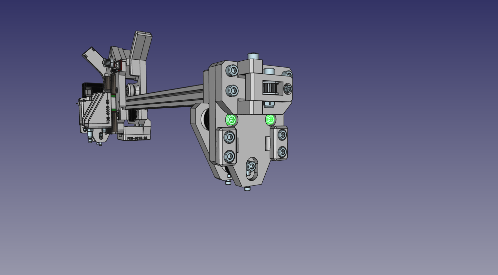

2. Loosen the two M5x10mm screws that hold the `Y Gantries` to the X extrusion. Double-check that none of the captive nuts in either of the `Y Gantries` have fallen out, since they'll be difficult to reinsert after the next step.
  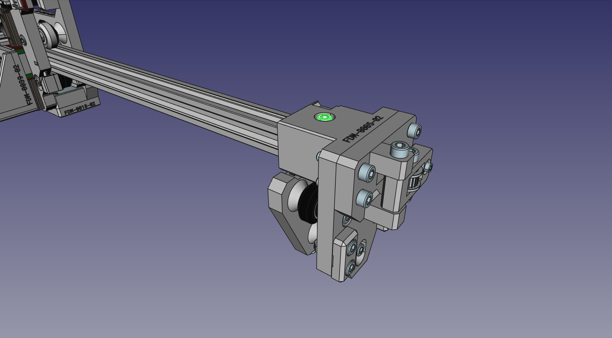

1. Slot the entire XY gantry assembly onto the top extrusions of the frame. Make sure the X motor is on the left of the machine.
  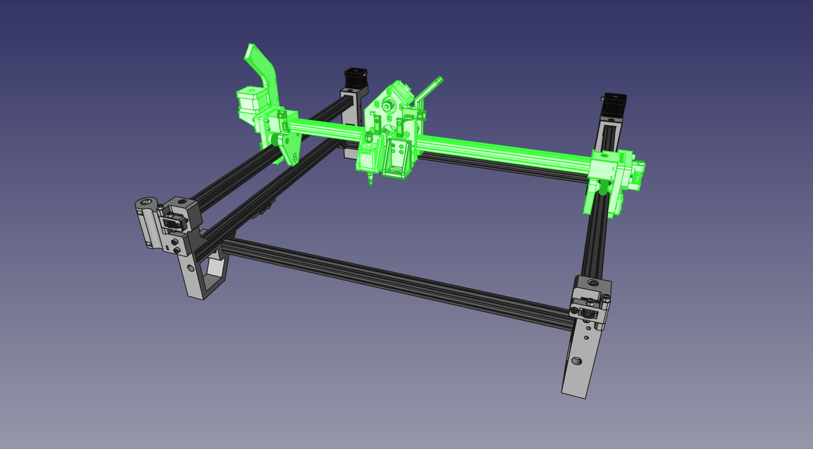
  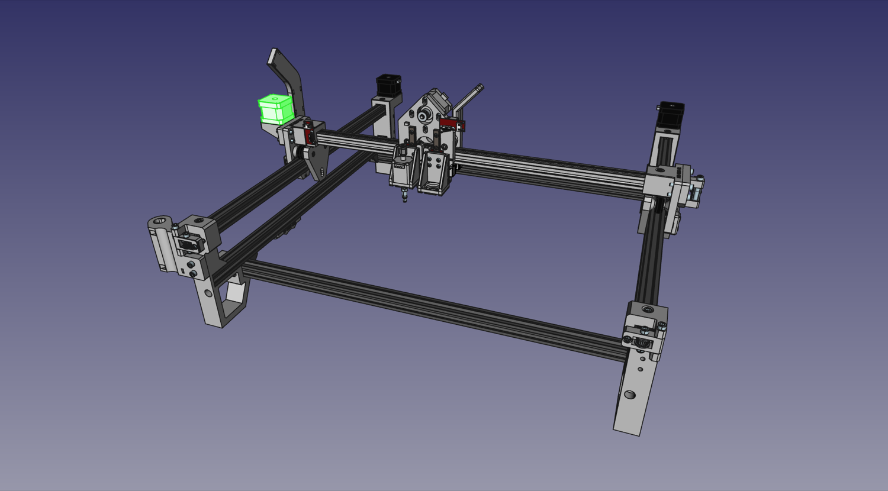

1. Re-tighten the four M5x40mm screws holding the two halves of the `Y Gantries` together.
  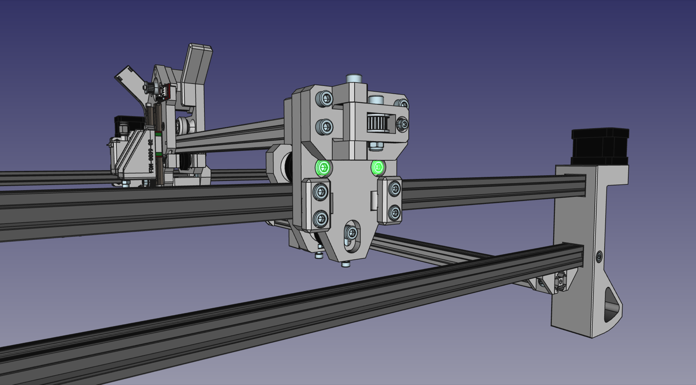

1. We'll add an additional roller to each `Y Gantry assembly` below the extrusions of the frame. Push a M5x40mm machine screw through the `Y Gantry`, then add on a `Roller Spacer`, a V-Slot roller, and then another `Roller Spacer`. Secure the assembly in place with an M5 nut slotting into the `Y Gantry Support` and threading into the screw. Note: you may need to align one or both of the interior washers inside the rollers, as they can shift in shipping and block the hole for the screw. Simply push the washers back into place with a screwdriver tip.
  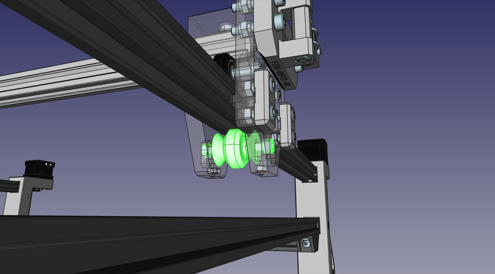

1. Now roll the entire Gantry Assembly to the very front of the machine. Adjust the fit of the X axis extrusion inside the `Y Gantries` so that the top rollers fit perfectly into the v-slot. After you adjust them, tighten both M5x10mm screws that hold the Y Gantries to the X axis extrusion.
  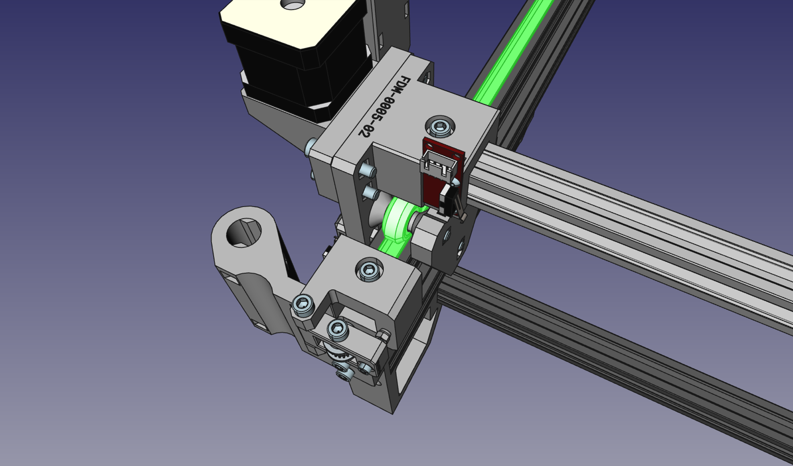
  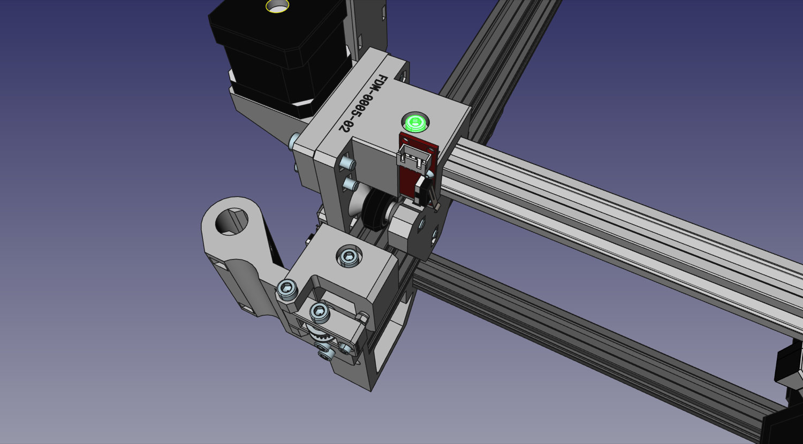

1. Now we need to make sure this spacing doesn't just work for the front of the machine, but for the entire length of it as well. Loosen the machine screws connecting the back rail to the left and right side. While applying light pressure down on the Y gantry, roll it to the back of the machine. You might find that you need to expand or contract the back legs to have the rollers ride perfectly in the v-slot. Once you have the correct spacing, tighten the bolts mounting the back rail. This locks in the Y gantry extrusion spacing for the back of the machine as well. We also recommend measuring the spacing between the rails in the front and back of the machine, and adjusting until they're the same.
  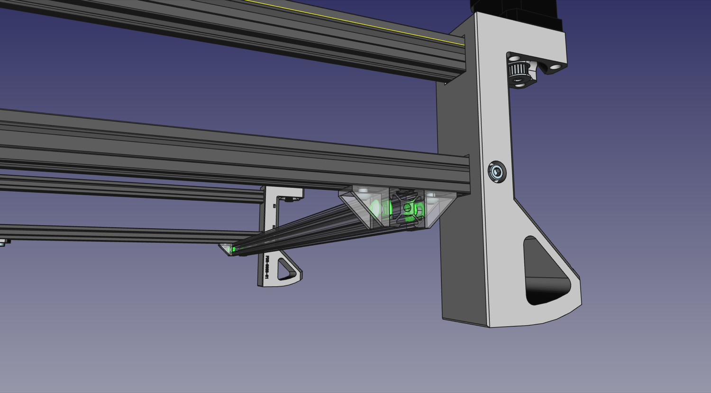
  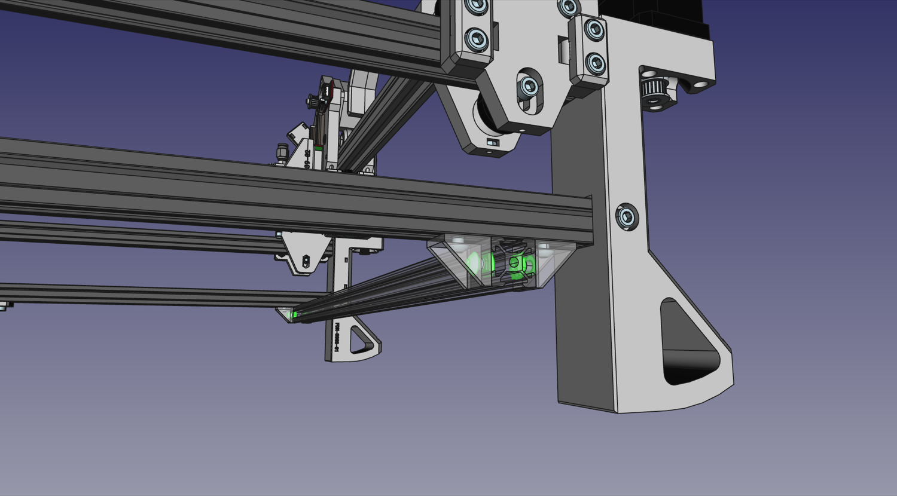

1. Use four Slot Nuts and four M5x8mm screws to loosely secure the Staging Plate to the frame. If you have the fiberglass PCB staging plate, the coordinate A1 is in the front left of the machine.
  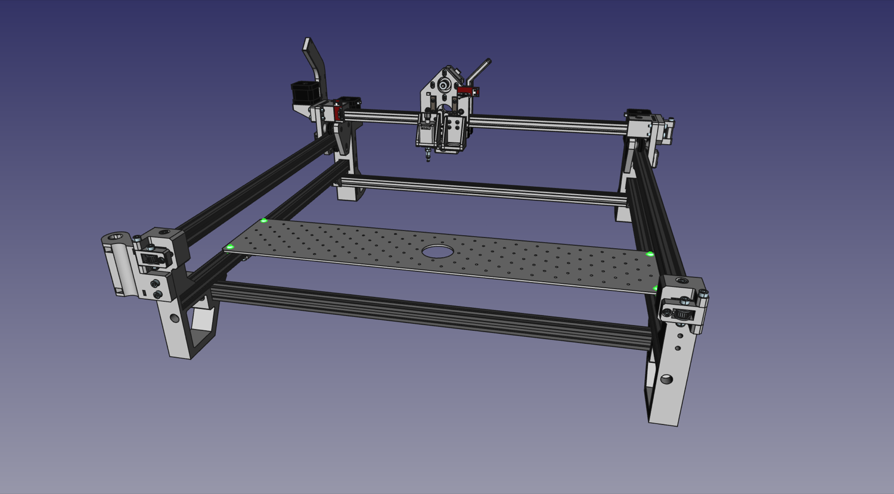

1. If you purchased additional staging plates, loosely secure them next to your first staging plate with four Slot Nuts and four M5x8mm screws.
  

1.  Adjust the Staging Plate so that it is exactly 95mm away from the `Front Left Leg` and `Front Right Leg`, then tighten it into place. This will be important for using the OpenPnP configuration provided for the machine. See below for how to measure the distance properly.
  

1.  Tighten the four M3x16mm screws, two on either `Y Gantry assembly`, so that the lower rollers are snug against the extrusion and ensure that the top rollers run well in their slots, too. Make sure that there's no play or wiggle in the fit, but don't over-tighten to the point of increasing resistance to rolling. The gantry should move easily, but not loosely.
  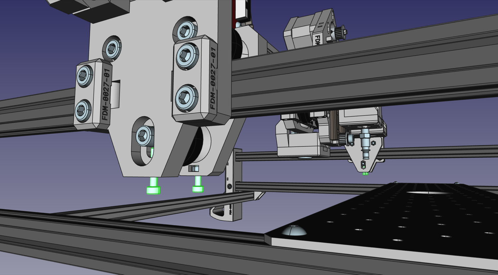

1.  Lastly, tighten the bolts that run through the bottom rollers to lock in the tension setting.

## Next steps

Continue to [attaching the belts](../10-attaching-belts/index.md).
