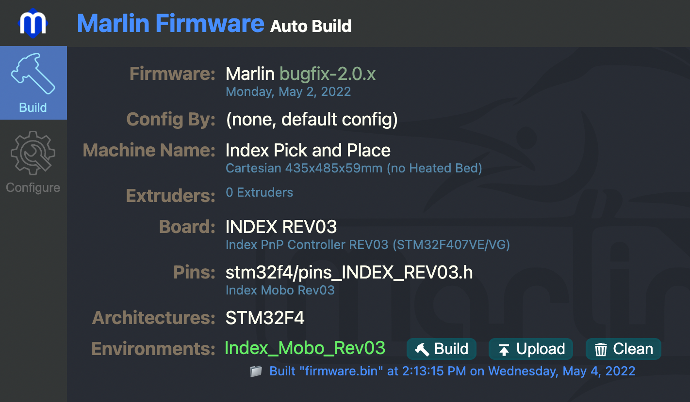
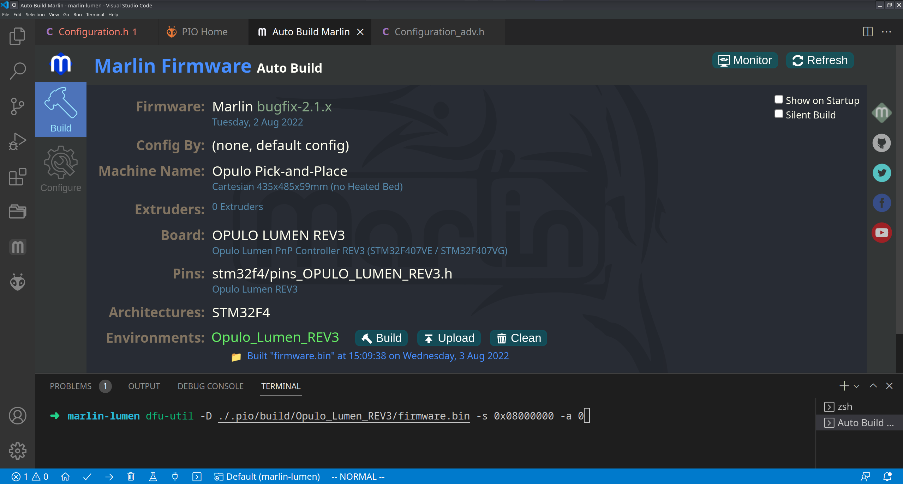
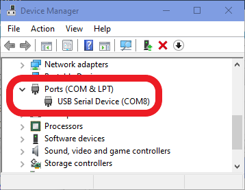
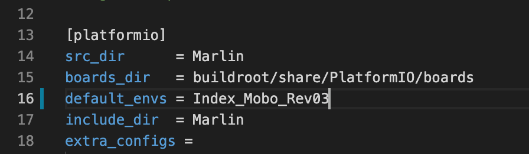
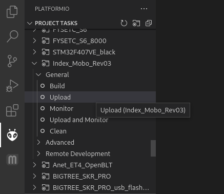
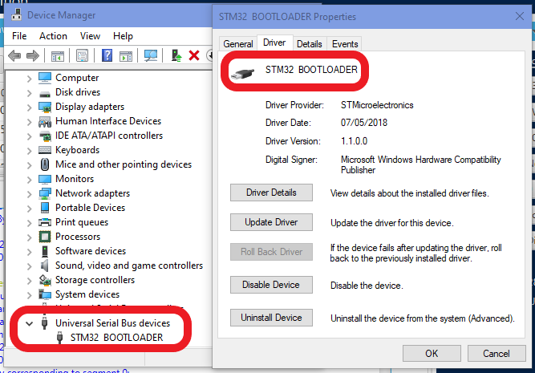
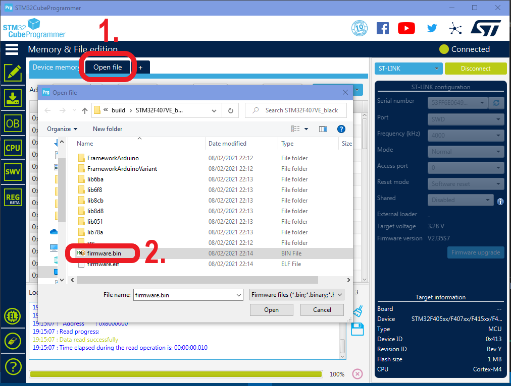

# Update the Firmware

**This step is optional.** Your motherboard comes with a correct build of Marlin pre-installed, but if you'd like to update the firmware or change settings, this will help you do so!

## Using the Auto Build Marlin VSCode Extension

!!! info "MARLIN VERSION"
    Building an older version of Marlin with the recommended config files won't work. If you are unsure whether a previously-downloaded local version of Marlin is the newest one, re-downloading it is the safest choice.

1. Download the [latest Marlin firmware](https://github.com/MarlinFirmware/Marlin/) and unzip it.
2. Install [VSCode](https://code.visualstudio.com/) and its [PlatformIO extension](https://marketplace.visualstudio.com/items?itemName=platformio.platformio-ide).
3. Open Marlin firmware's folder on VSCode.
4. Grab Marlin configuration files [here](https://github.com/MarlinFirmware/Configurations/tree/import-2.1.x/config/examples/Opulo/Lumen_REV4) and replace the files in the Marlin/Marlin folder with those new ones.
5. Install the Auto Build Marlin plugin using this [Marlin Documentation page](https://marlinfw.org/docs/basics/auto_build_marlin.html), or download it directly from the [Visual Studio Marketplace](https://marketplace.visualstudio.com/items?itemName=MarlinFirmware.auto-build).
6. Try to build Marlin using the build button with the hammer icon as shown below:


1. If this is successful, attach the LumenPnP Mobo to your computer with the USB cable. If it isn't, this might help:
    * Check the error messages for configuration errors and fix them, or replace it with the default config
    * If this fails, check that your config file version is the same as your Marlin version (e.g. a bugfix-2.0.x config file won't work in a bugfix-2.1.x)
    * When in doubt, re-download Marlin and the configuration files from the links above

2. Boot your motherboard into DFU Mode
    1. Press and hold the `BOOT` button
    2. Press the Reset button and hold for 10 seconds
    3. Release the Reset button and wait for 10 seconds
    4. Release the `BOOT` button
  

    !!! info "NOTE"
        If you have a hard time getting your board to enter DFU mode, instead try powering off the machine entirely, holding the 'BOOT' button, plugging in power, waiting 10 seconds, then release the `BOOT` button.

1. Flash the Motherboard using `dfu-util` by running the command `dfu-util -d 0x0483:0xdf11 -s 0x08000000:leave -a 0 -D ./.pio/build/Opulo_Lumen_REV3/firmware.bin` in the integrated terminal in the root of the repository.
  

    !!! info "COMMAND EXPLANATION"
        `dfu-util` is a flash tool available on all platforms.

         * `-d 0x0483:0x0df11` tells the tool to flash the STM32 chip on the motherboard. This is optional if you only have one dfu device connected.
         * `-s 0x8000000:leave` is the target memory address that the firmware is flashed to. The `:leave` part will cause the chip to reset on its own, making the machine accessible in OpenPNP without rebooting it.
         * `-a 0` makes the tool use the alt setting required for flashing the ESP32.
         * `-D ./.pio/build/Opulo_Lumen_REV3/firmware.bin` is the path to the to-be-flashed firmware. If you want to flash another file, change this.


1.  Wait for the process to finish.

2.  The machine should show up as a COM/Serial Port on your PC now, and you should be able to access it via OpenPNP. If it doesn't, press the Reset button on the board, or power-cycle the machine *after the flashing is completed*.

> This is how you can check whether your machine is connected properly:
>
> * Windows:
>   
> * Mac/Linux:
>   

!!! info "FLASHING VIA PLATFORMIO"
    Note that flashing the firmware using the Auto Build Marlin Plugin might work, but seems error-prone for most people. Therefore, if you want to try it, you can, but using `dfu-util` is generally a better idea.
If you're absolutely sure that ABM is the way to go, do this:

1. Boot your motherboard into DFU Mode
   1. Press and hold the `BOOT` button
   2. Press the Reset button and hold for 10 seconds
   3. Release the Reset button and wait for 10 seconds
   4. Release the `BOOT` button
 
1. Now, press the upload button in ABM as shown below:

1. Wait for the process to finish
2. Continue with step 11
{}

## Manually Configuring PlatformIO (for flashing via PIO)

1. Download the [latest Marlin firmware](https://github.com/MarlinFirmware/Marlin/) and unzip it.
2. Install [VSCode](https://code.visualstudio.com/) and its [PlatformIO extension](https://marketplace.visualstudio.com/items?itemName=platformio.platformio-ide)
3. Open Marlin firmware's folder on VSCode
4. Grab Marlin [configuration files](https://github.com/MarlinFirmware/Configurations/tree/import-2.1.x/config/examples/Opulo/Lumen_REV4) and replace the files in the Marlin/Marlin folder with those new ones.

5. Edit the platformio.ini file to indicate which board you're uploading to. Update `default_envs` to read `Opulo_Lumen_REV3` or `Opulo_Lumen_REV4` depending on your motherboard.
  

1. Attach the LumenPnP Mobo to your computer with the USB cable.

2. Boot your motherboard into DFU Mode
    1. Press and hold the `BOOT` button
    2. Press the Reset button and hold for 10 seconds
    3. Release the Reset button and wait for 10 seconds
    4. Release the `BOOT` button
  

!!! info "NOTE"
    If you have a hard time getting your board to enter DFU mode, instead try powering off the machine entirely, holding the 'BOOT' button, plugging in power, waiting 10 seconds, then release the `BOOT` button.


1. Upload firmware to the board via PlatformIO:
  

1. Wait for the process to finish:
  

1.  Press Reset on the board, or power-cycle the machine *after the flashing is completed*. Now it should show up as a COM/Serial Port on your PC:

* Windows:
  
* Mac/Linux:
  

## Flashing Factory Firmware

If you've put new firmware on your motherboard, but just want to get back to the firmware that your machine was flashed with, check the release for your build number and download the .bin firmware file attached to it. Put your board into DFU mode as described above, connect to your computer, and flash the binary to the board using the following command:

```shell
`dfu-util -d 0x0483:0xdf11 -s 0x08000000:leave -a 0 -D ~/path/to/firmware.bin`
```

Once flashing is completed, the machine should automatically exit DFU mode, and be accessible to OpenPNP again.

## Troubleshooting

If you aren't able to upload, you can check to see if your motherboard is booting into DFU mode correctly:

* Windows:
  

* Mac/Linux:
  

Also, reference [the Marlin instructions for uploading](https://marlinfw.org/docs/basics/install_platformio.html).

### Alternative Method (Not Recommended)

This method requires an ST-Link (V2 Clone or equivalent). Additionally you need the software  [STM32CubeProgrammer](https://www.st.com/en/development-tools/stm32cubeprog.html) by ST. This method is a bit more involved and takes longer than just using the DFU mode.

1. Compile (build) the project normally with PIO
2. This generates a .bin-file that contains the firmware
3. Connect your board to your ST-Link through the SWD header on board
4. Start STM32CubeProgrammer
5. Connect to the MCU:
  

6. Click on **Open file** and navigate to the **firmware.bin** file in *PROJECT_DIRECTORY/.pio/build/STM32F407VE_black*
  

7. Click on **Download**. This will flash the SMT32F4 with the provided firmware
  

8. Done! Now you just have to disconnect the ST-Link and press the reset button on the board.

## Next steps

Continue to [wiring and pneumatics](../../wiring-and-pneumatics/wiring-y-motors/index.md).
