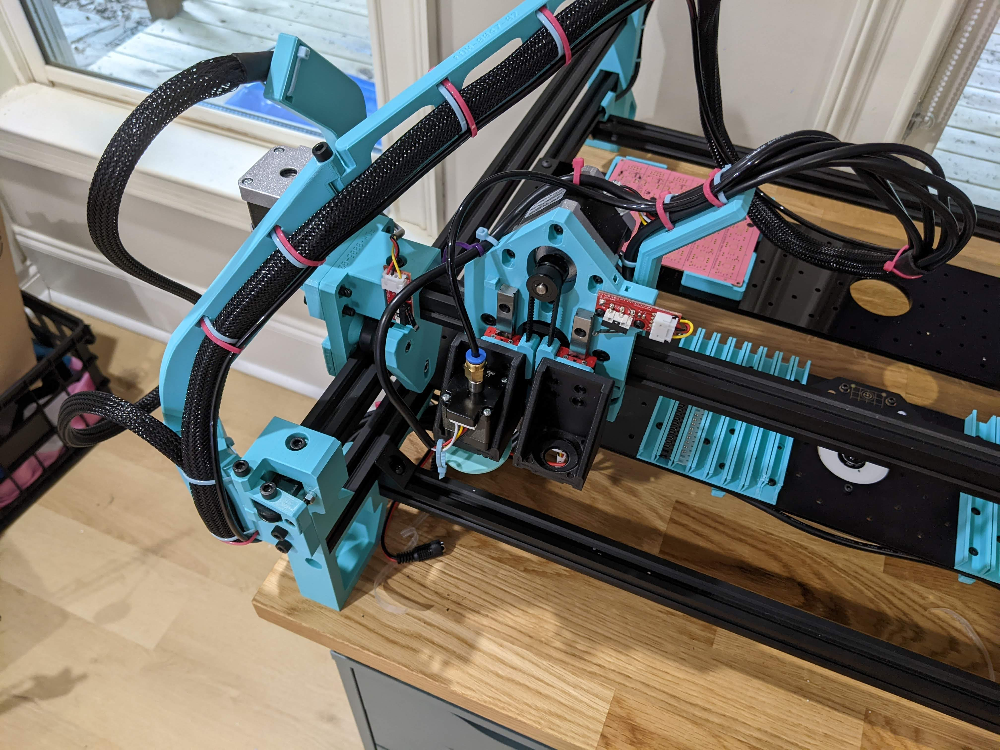

# Motor Check

Now that you're connected to your LumenPnP, we'll walk you through testing the motors and automatic homing.

## Test the limit switches

Before telling the machine to move, it's important to make sure that your limit switches are connected properly. This will make sure the machine can correctly home and prevent damage. For each of the three limit switches on the machine, tap the switch closed and watch for a red LED to light up on the limit switch PCB. If all three do, proceed with motor movement testing. If not, double check your limit switch connections.

## Manually home the machine

One more step before having the machine move: manually move the the machine's head to the lower left corner of the machine. Don't move it completely into the limit switches, leave a few centimeters of space.



Doing this makes sure that the machine head does not crash into the build plate during the homing and motor tests.

## Home each axis individually

Now you're ready to test the machine's motion. You'll do this one axis at a time to limit any possible damage due to motion issues.

You'll start with the Z axis (the nozzle head). Send the following lines of Gcode one-by-one:

```gcode
G91   ; absolute positioning
G28 Z ; home the Z axis
```

The Z axis should move to the limit switch and then back off. If it doesn't, make sure you have the motor cable for the Z axis connected correctly at both the motherboard and the motor.

Before continuing, move the Z axis to "safe" Z, which prevents it from colliding with the staging plate:

```gcode
G0 Z 31; Move the Z axis to safe Z
```

Next, you'll home the X axis. Send the following Gcode:

```gcode
G28 X;
```

The machine's head should move to the left, touch the limit switch, and back off. If it doesn't, double check the X axis motor's connection.

If the X axis homes correctly, you're ready to home the Y axis:

```gcode
G28 Y;
```

The machine's head should move to the front of the machine, touch the limit switch, and back off. If it doesn't move correctly, double check that you soldered the `Y2` connector opposite of the silkscreen as noted in the motherboard section.

If the X, Y, and Z axis all moved and homed correctly, excellent! If not, reach out to us for assistance.

## Nozzle rotation

Next we'll check the left nozzle rotation stepper motor:

```gcode
G0 A90
```

You should see your nozzle stepper rotate 90 degrees. If not, double check motor connections and make sure that the vacuum hose isn't obstructing movement.

## Next steps

Continue to [testing the actuators](../actuator-check/index.md).
