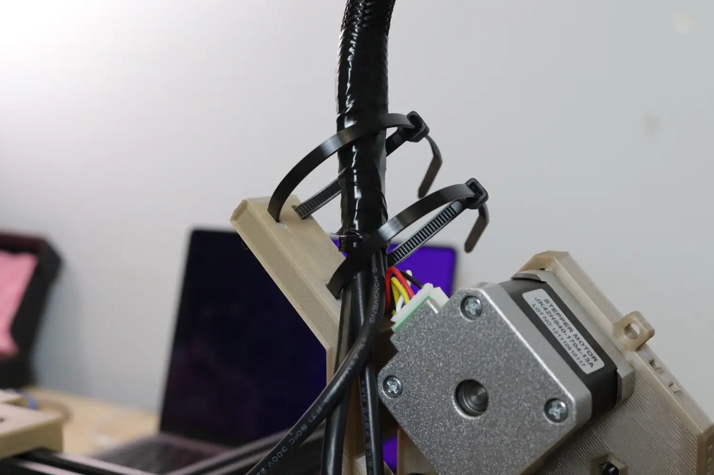
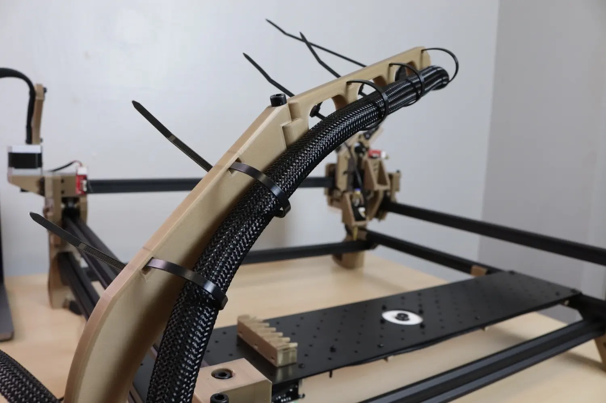

# Routing the X Gantry Umbilical

For this, all you'll need is your freshly made X gantry umbilical cable, and your bag of zip ties. Note that we'll be plugging in the unlabeled end of the cables, as the labels are meant to help identify wires on on the motherboard side.

## Plugging in the Cables

1. First, plug in the four terminal connector with only three wires into the limit switch on the right side of the X gantry.
  

2. Plug in the small four terminal JST connector into the down camera.
  

3. Plug in the three terminal JST XH connector into the down ring light.
  

4. Plug in the six terminal JST XH connector with only four wires into the Z gantry stepper motor in the center of the X gantry.
  

5. Lastly, plug the last remaining cable (four terminal connector with four wires, not JST XH) into the left gantry rotation stepper motor.
  

## Securing the Cables

6. Align the cable bundle with the `X Gantry Back` as shown in the picture below, and secure it to the guide with two large zip ties.
  
  

7. Secure the left motor cable using a small zip tie and the slot in the `X Gantry Front`
  

## Securing to the Frame

8. Move the Y gantry all the way to the back of the machine until you feel it hit the limit of travel, and do the same with the X gantry to the right of the machine. This will ensure that you don't fasten the cable too tightly such that it restricts the machine's motion.

9. Then, take the cable bundle and guide it along the `Umbilical Swivel` and around the cable bundle. Do not tighten yet, as we still need to route the pneumatic tubing through these zip ties.
  

10. Now route the cable bundle through the two loose zip ties you attached in the `Frame Umbilical Mount` in the last step. Don't tighten these yet; we still need to route the pneumatics.
  

## Next steps

Continue to [connecting the cables to the motherboard](../connecting-to-mobo/index.md).
