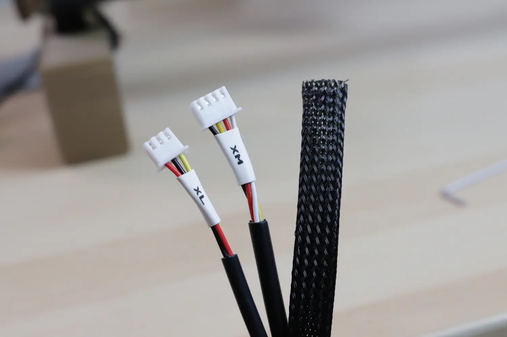
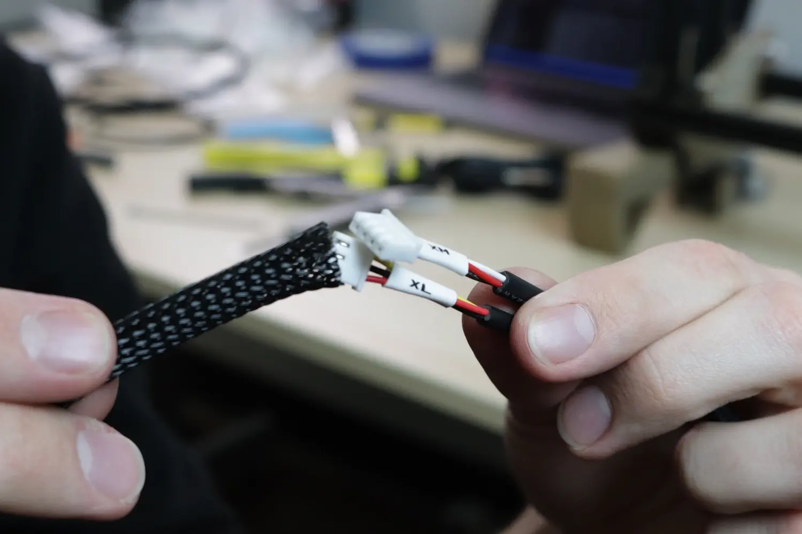
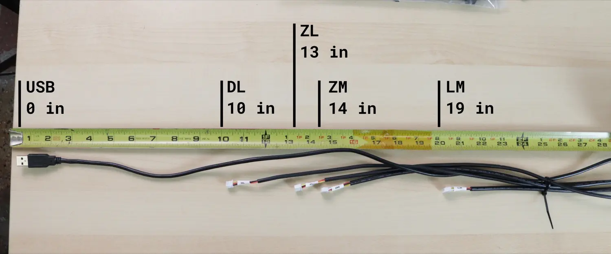
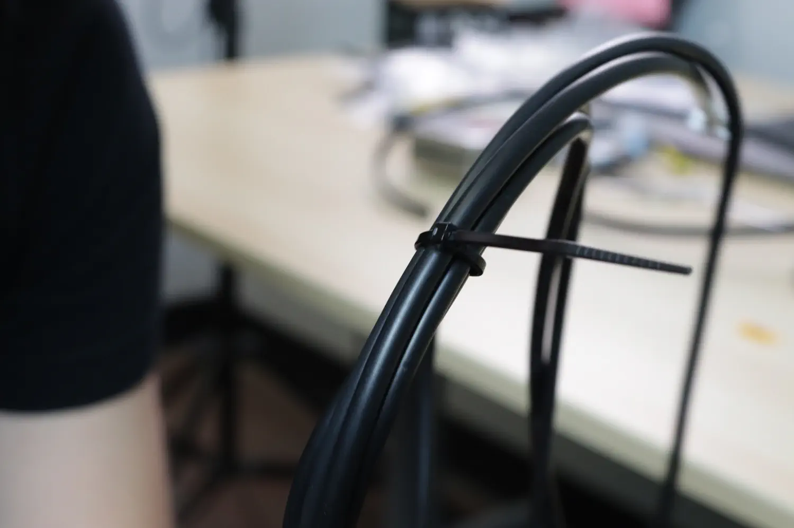

# Sheathing the Umbilicals

Now we'll assemble the two umbilical cables in the machine. The one connecting from the front left leg to the left side of the Y gantry is the Y gantry umbilical, and the one connecting from the front left leg to the X gantry is the X gantry umbilical.

## Y Gantry Umbilical

This cable bundle will contain the following:

|             Qty | Part                           |
|----------------:|--------------------------------|
|               1 | X axis limit switch cable (XL) |
|               1 | X axis motor cable (XM)        |
|               2 | Heatshrink tubing (large)      |
| 1150 mm (45 in) | Woven sheathing                |

1. To begin, we'll get these two cables laid out at the correct spacing. XL and XM should be perfectly aligned on the label side, no offset.

2. Measure out 1150mm of sheathing and cut it from the rest of the spool.
  

3. Take the piece of sheathing and expand it by compressing it. You should find that inserting the two cables at the correct offset will maintain this offset while pushing the sheathing over them. Follow the pictures below for a good method of pushing the cables through the sheathing. If it starts to fray a little bit, don't worry! This is purely a cosmetic step; you can trim off any frayed bits and use the heatshrink to clean up the ends.
  
  
  

4. Push the sheathing up until there's equal amount of exposed black cable of the shorter cable, as shown below.
  

5. With the sheathing an equal distance from the closest connector on each side, slide two pieces of heatshrink tubing over the fraying end of the sheathing, with equal amounts on the cables and on the sheathing. This is to hold the sheathing in place, keep it from fraying, and generally making it look nicer. Use a heat gun or lighter to heat the heatshrink tight onto the cable.
  
  
  

## X Gantry Umbilical
This cable bundle will contain the following:

|             Qty | Part                                     |
|----------------:|------------------------------------------|
|               1 | Z axis limit switch (ZL)                 |
|               1 | Z axis motor cable (ZM)                  |
|               1 | Left rotation motor cable (LM)           |
|               1 | Top light cable (DL)                     |
|               1 | Top camera usb cable (longer usb cable() |
|               2 | Heatshrink tubing (large)                |
| 1475 mm (58 in) | Woven sheathing                          |

6. To begin, we'll get these five cables laid out at the correct spacing. Having these spaced correctly ensures that every cable reaches every plug with strain relief and length for movement. Use the image below to make the correct spacing.
  

7. Once you have the spacing correct, use a short zip tie to hold them together at this spacing to preserve it while sheathing.
  
  

8. Now, cut a 1475mm piece of sheathing from the remainder and expand it by compressing it. You should find that inserting the cables at the correct offset will maintain this offset while pushing the sheathing over them. If it starts to fray a little bit, don't worry! This is purely a cosmetic step; you can trim off any frayed bits and use the heatshrink to clean up the ends.

9. With the sheathing an equal distance from the closest connector on each side, slide two pieces of heatshrink tubing over the fraying end of the sheathing, with equal parts on the cables and on the sheathing. This is to hold the sheathing in place, keep it from fraying, and generally making it look nicer. Use a heat gun or lighter to heat the heatshrink tight onto the cable.

## Next steps

Continue to [routing the Y gantry umbilical](../routing-y-umbilical/index.md).
