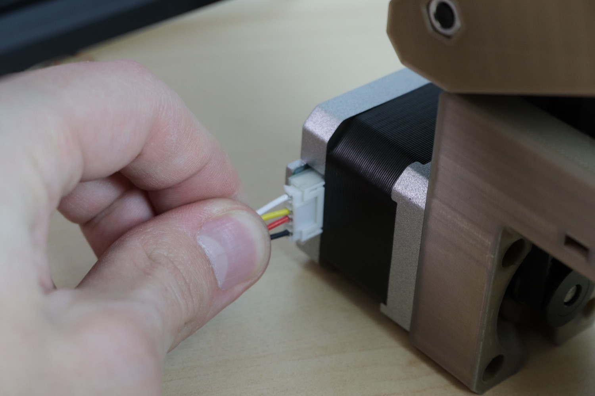
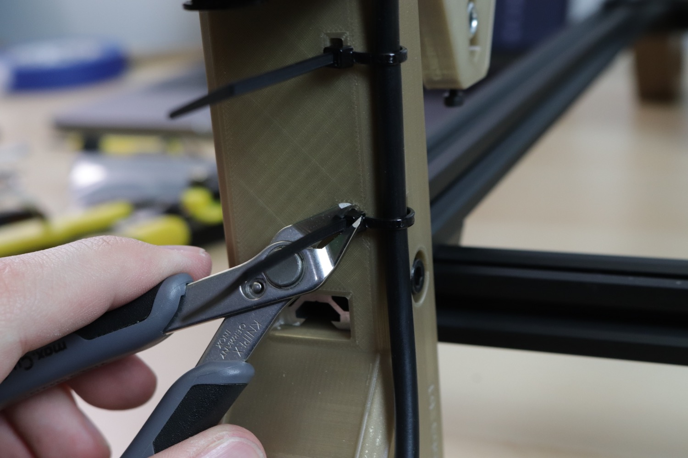
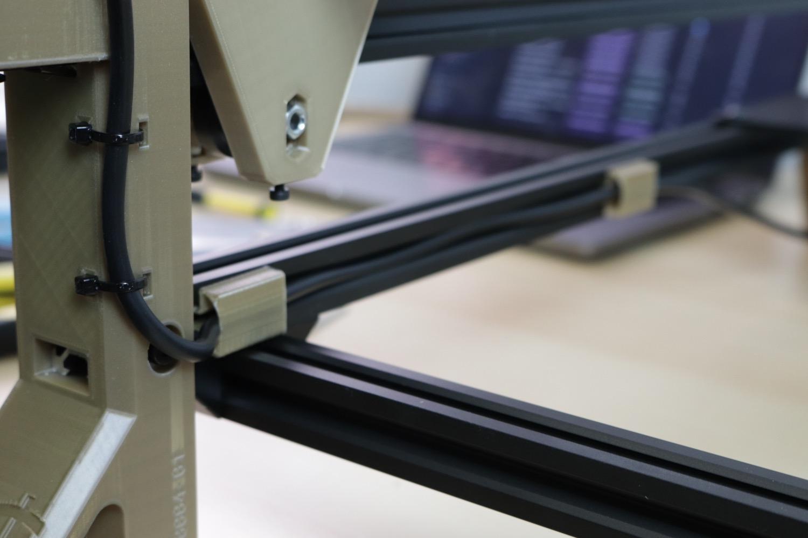
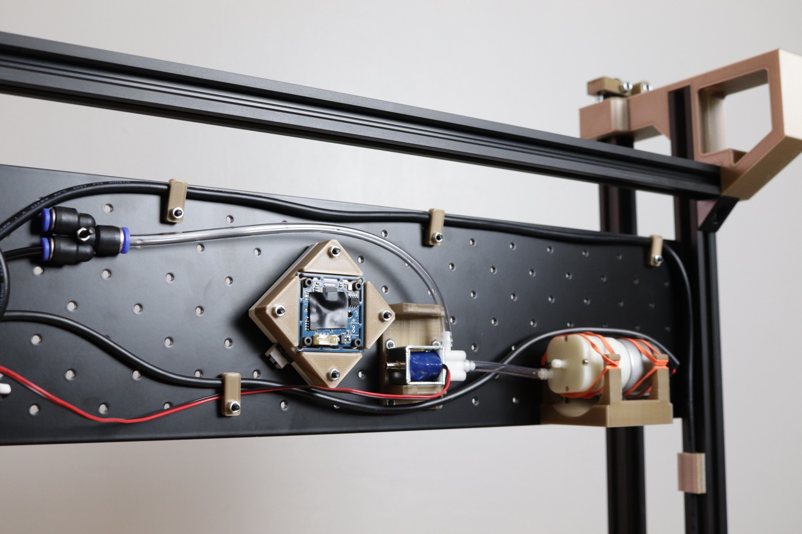

# Wiring the Y Motors

| Qty | Part                                    |
|----:|-----------------------------------------|
|   1 | Y1 Cable Harness (Labeled Y1)           |
|   1 | Y2 Cable Harness (Labeled Y2)           |
|   4 | Zip Tie                                 |
|   4 | FDM-0016 (Cable Clip)                   |
|   3 | FDM-0023 (Cable Clamp)                  |
|   3 | M3x14 machine screw                     |
|   3 | M3 Hex Nut                              |

The left and right Y motors are connected to the motherboard using the cable harnesses Y1 and Y2, respectively. Grab these from your bundle of cables.

1. Start by plugging in the **unlabeled** end of the cables into the Y motors. `Y1` goes to the left Y motor, and `Y2` goes to the right Y motor.
  { loading=lazy }
  { loading=lazy }

1. Use four zip ties to secure the wires in place using the channels in the back legs as shown below.
  { loading=lazy }
  { loading=lazy }
  { loading=lazy }

1. Next, put your LumenPnP up on its haunches, and route the cables along the inside groove of the extrusion extrusions running towards the front of the machine. Use `Cable Clips` to hold the cables in place along the extrusions.
  { loading=lazy }
  { loading=lazy }

1. Use three `Cable Clamps`, three M3x14mm bolts, and three M3 nuts to hold the right side cable on the staging plate and route it towards the motherboard neatly.
  { loading=lazy }
  { loading=lazy }
  { loading=lazy }

1. Route the cables underneath the motherboard for now; we'll plug them in in a later step.

## Next steps

Continue to [sheathing the umbilicals](../sheathing-umbilicals/index.md).