# Installing the Slot Harness for Blades

In this step, you'll install and wire slots onto the front and back rails of your LumenPnP. Slots provide power and communication to your feeders.

!!! info "If your machine is v3.2 or greater"
    Your LumenPnP came with blades pre-installed, so you can jump ahead to the [Install the Harness](#install-the-harness) section.

## Adjust Your Staging Plate

To ensure feeders will mount to your LumenPnP's front rail, we need to ensure that your staging plate is mounted at the correct position. **If you have a v3 LumenPnP, your staging plate is already at the correct distance, and can skip this section.**

!!! danger "Warning"
    Be aware that moving your primary staging plate will change where your bottom camera and homing fiducial markers are mounted. After moving the staging plate, you will need to review your machine's calibration. Specifically, the [Homing Fiducial](/openpnp/calibration/4-homing-fiducial) and [Bottom Camera Position](/openpnp/calibration/7-bottom-camera-position).

1. Unplug your LumenPnP.

2. Loosen the 4x M5x8mm button head screws that secure each staging plate to your machine.

3. Measure exactly 75mm of clearance between the front rail and the staging plate. You can use the [squaring bracket](https://github.com/opulo-inc/lumenpnp/blob/main/pnp/cad/FDM/squaring-bracket.FCStd) included in LumenPnP v3 kits. (STL available in the latest [LumenPnP Release](https://github.com/opulo-inc/lumenpnp/releases))
  

1. Re-tighten the four M5x8mm button head screws to secure the staging plate.
   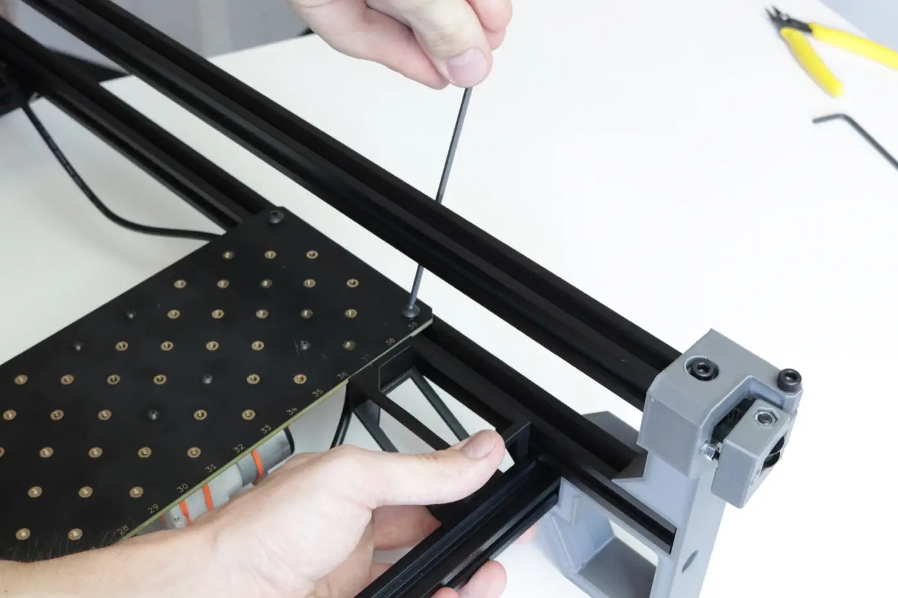

## Prepare the Slots

In your Slot Harness Kit, you'll find:

| Count | Item                                       |
| ----- | -------------------------------------------|
| 4x    | [Feeder Slot Blades][slot-url]             |
| 1x    | [Feeder Programmer][slot-url]              |
| 10x   | [Cable Clips][clip-url]                    |
| 20x   | M5x10mm Socket Head Screws (Pre-installed) |
| 20x   | M5 T-Slot Nuts (Pre-installed)             |

!!! Note
    The feeder slot blade set has positions numbered from 1-50 across its four pieces. These are the slot blades's **addresses**. It's important that you **mount each slot blade in sequential order**. These instructions will refer to each slot blade the following way moving forward:

    * Feeder Slot Blade (#1 - #12)
    * Feeder Slot Blade (#13 - #25)
    * Feeder Slot Blade (#26 - #37)
    * Feeder Slot Blade (#38 - #50)

      

## Mount the Feeder Slot Blades

0. Slighlty loosen each M5x10mm socket head screw and horizontally align every M5 T-slot nut to aid in mounting the Feeder Slot Blades to the front and back feeder rails, as shown in the above image.

1. Push the LumenPnP gantry to the back, right corner of the machine.
   
2. Lift the machine up onto its back legs.
   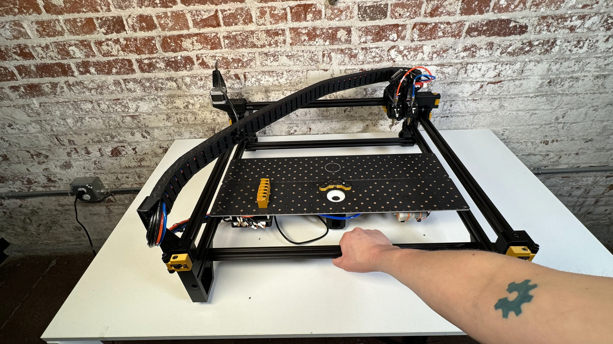
   
3. Grab a Spool Arm from your feeder packaging. This print comes with each feeder and holds a component spool. It also has a notch for aligning slots. This notch places the slot exactly 85mm away from the front left leg.
   

### Front Feeder Rail

4. Looking at your machine from the bottom, find the front left leg (in the air, on your left). Place the flat of the square end of the spool arm against the front left leg, and the back of the arm against the front rail extrusion. Use the image below for reference.
   

5. Insert `Feeder Slot Blade (#1 - #12)` into the extrusion as shown, and slide it into the notch in the spool arm.
   
   

6. Tighten the 5x M5 screws in sequential order from left to right to secure `Feeder Slot Blade (#1 - #12)` in place.
   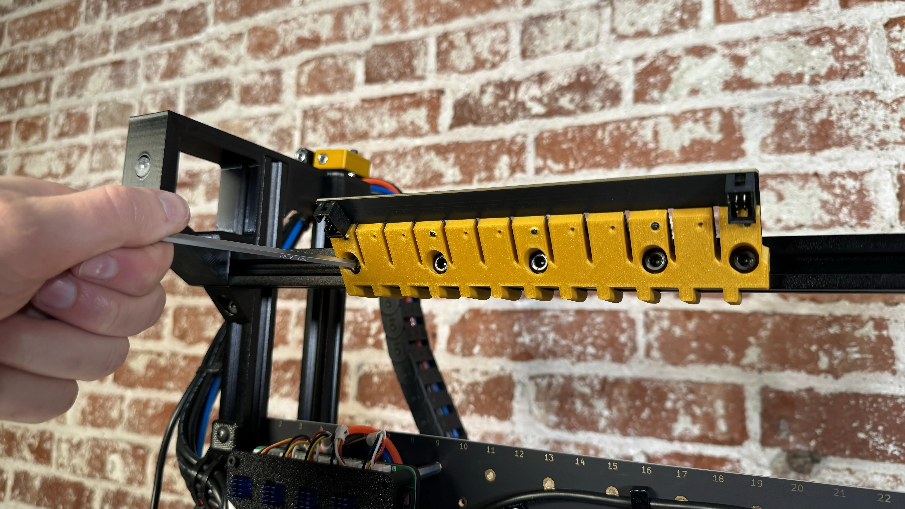
   

6. Begin mounting `Feeder Slot Blade (#13 - #25)`, with the same orientation as the previous one.
    
    

6. Gently press `Feeder Slot Blade (#13 - #25)` into the previous one while tightening to ensure there are no gaps between them.
    
    

7. `Feeder Slot Blade (#1 - #12)` and `Feeder Slot Blade (#13 - #25)` should now be firmly mounted to the front rail.
    

### Back Feeder Rail

8. Next, you'll mount slots to the back rail. Near the back right leg, place the flat of the square end of the spool arm against the metal triangle bracket. Lay the flat back of the arm against the back rail extrusion as shown in the image.
   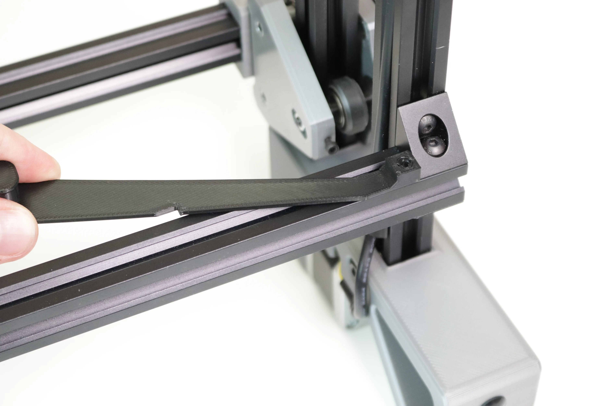

9. As before, insert `Feeder Slot Blade (#26 - #37)` into the extrusion as shown, and slide it into the notch in the spool arm. Tighten the M5 screws to secure the slot blade.
   
   
   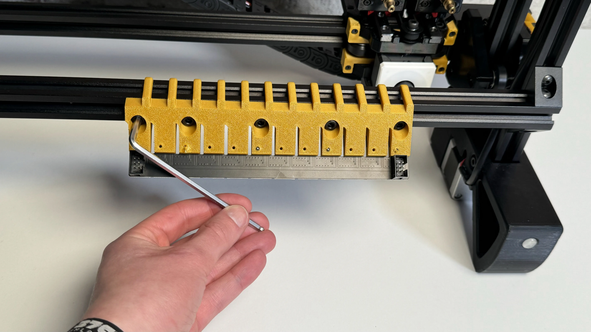

10. As you did for the front rail, next mount `Feeder Slot Blade (#38 - #50)`, while gently pushing it into the previous slot blade when tightening.
   
   
   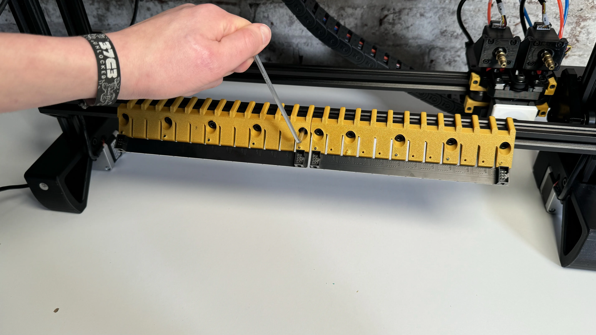
   

 11. `Feeder Slot Blade (#26 - #37)` and `Feeder Slot Blade (#38 - #50)` should now be firmly mounted to the rear rail.
   

## Install the Harness

1. If you have a cover on your motherboard, remove it by unscrewing the two M3x30 socket head screws.
   
   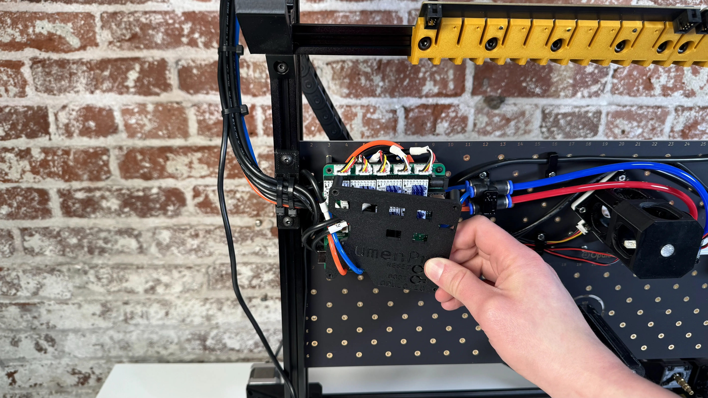

2. Identify the feeder port on your motherboard. It's the 2x3 pin connector below the Y axis stepper driver.
  

3. Find the end of the cable harness with the `← TO MOBO` label. Plug this end into the feeder port on your motherboard. Flip the cable over so that it's leading off the left side of the motherboard.
   
   

4. Fit the cover back onto the motherboard by rotating it underneath the pneumatic tubing, and pressing down around the stepper driver pins and heatsinks. Remount using the original two M3x30mm screws.
   
   
   

5. Using the cable clips, secure the cable to the bottom of the left rail as shown.
   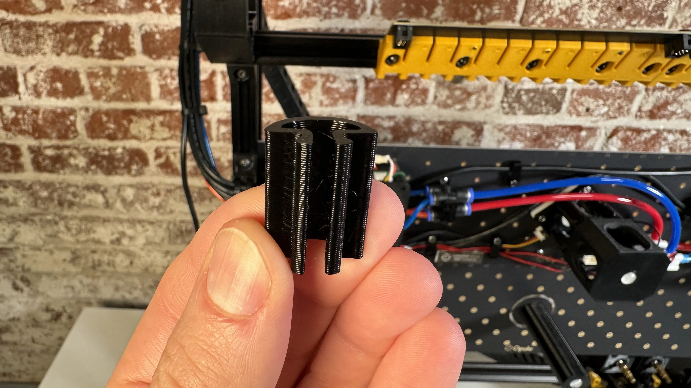
   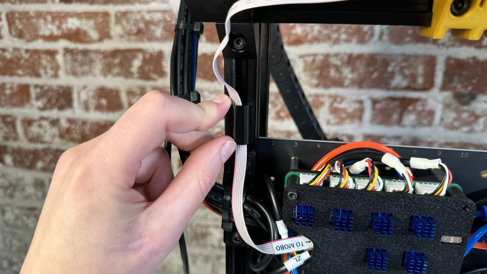

6. Fold the cable over as shown, and secure it to the bottom of the front rail using two more cable clips.
   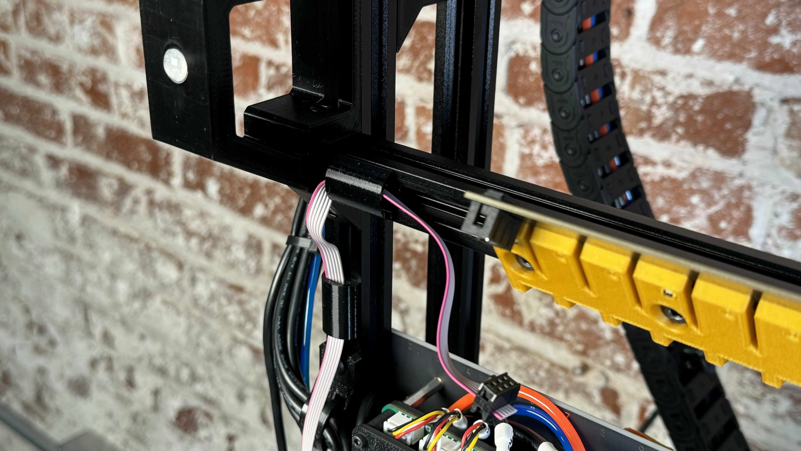
   

7. Plug the cable into the exposed connector on the backside of `Feeder Slot Blade (#1 - #12)`.
    

8. Collect one of the shorter cables from the cable bag and bend it into a "U" shape.
   
   

9. Use this cable to connect `Feeder Slot Blade (#1 - #12)` to `Feeder Slot Blade (#13 - #25)` as shown.
   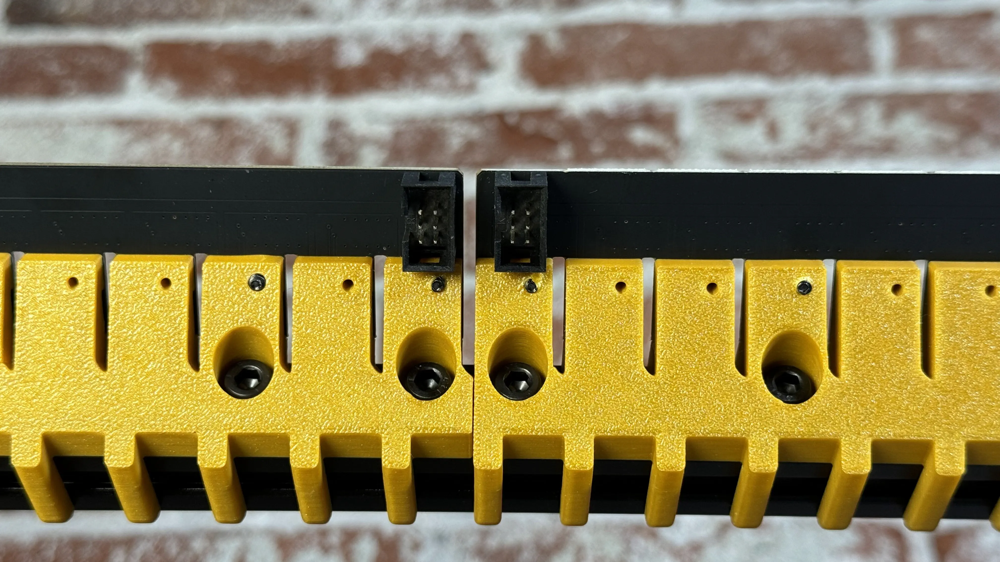
   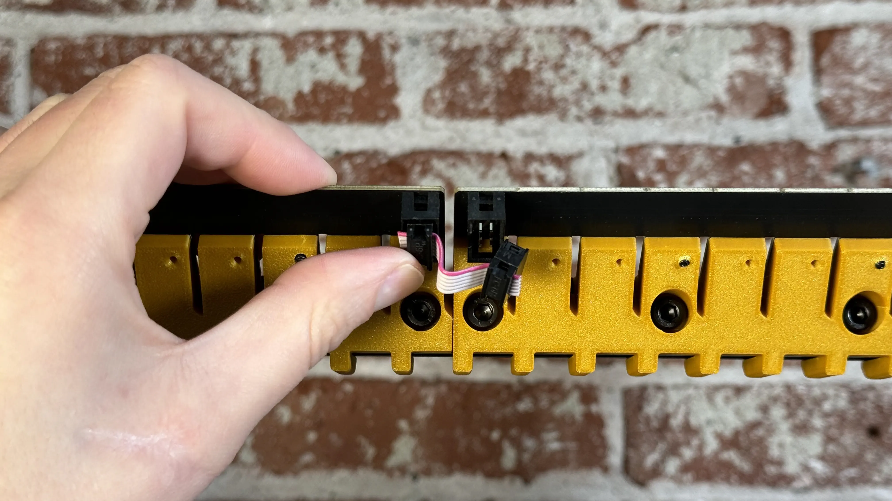
   
   

10. Collect the longer cables from the cable bag for connecting `Feeder Slot Blade (#13 - #25)` to `Feeder Slot Blade (#26 - #37)`.
    

11. Attach this cable to exposed connector on the right side of `Feeder Slot Blade (#13 - #25)`.
   

12. Attach the cable to the bottom of the right side of the front rail using two cable clips.
   
   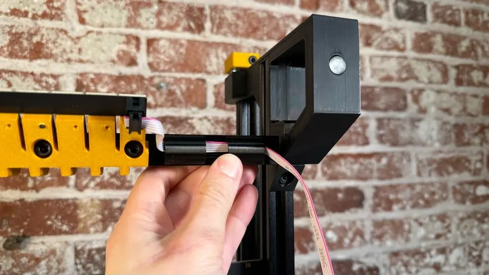

13. Fold the cable over, and secure the cable to the bottom of the right rail using three cable clips as shown.
   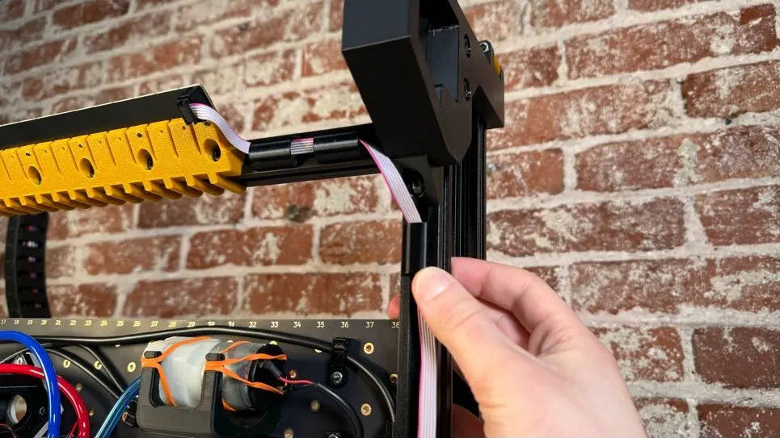
   
   

14. Fold the cable over again and secure to the bottom of the right side of the back rail using two more cable clips.
   
   

15. Plug the cable into the exposed connector on the right side of `Feeder Slot Blade (#26 - #37)`.
    

16. Collect the last short cables from the cable bag and bend it into a "U" shape.
   
   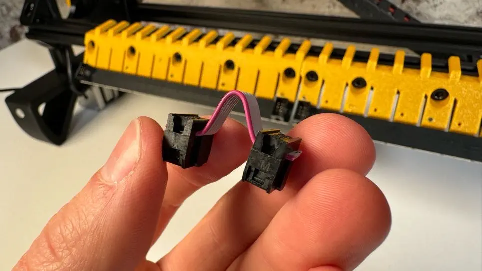

17. Use this cable to connect `Feeder Slot Blade (#26 - #37)` to `Feeder Slot Blade (#38 - #50)` as shown.
    
    

18. Take a minute to ensure that your wiring looks like the picture below.
   

19. Lower your LumenPnP back down onto its four legs.
   
   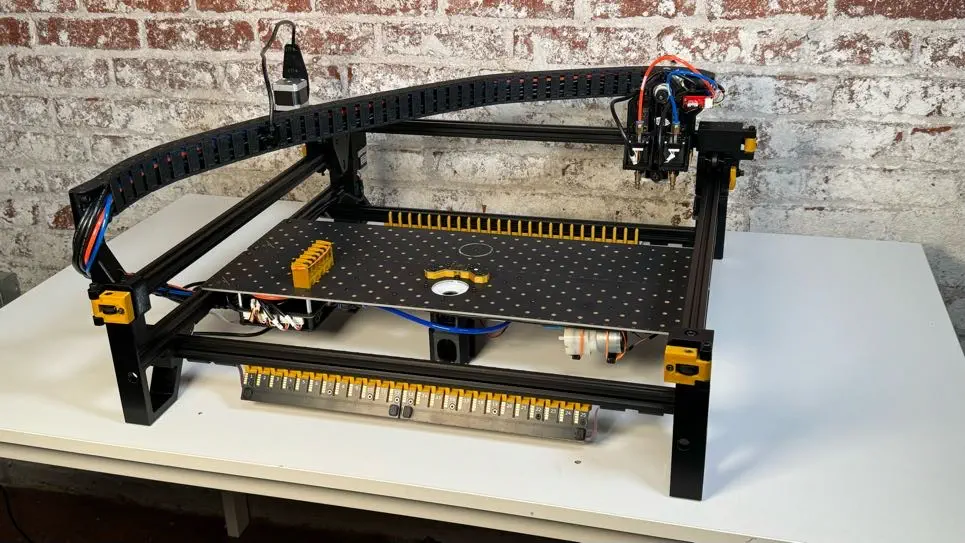

## Next Steps

If you were directed to this page by LumenPnP wiring instructions return to one of the following pages to finish plugging everything in:

* [v3.0](/semi-assembly/wiring/#finalize-wiring)
* [v3.1 / V3.2](/semi-assembly-3-1/wiring-3-1/#finalize-wiring)

Otherwise, next is [updating your software.](/feeders/3-software-update)

[clip-url]: https://github.com/opulo-inc/lumenpnp/blob/main/pnp/cad/FDM/extrusion-cable-clip.FCStd
[slot-url]: https://github.com/opulo-inc/feeder
