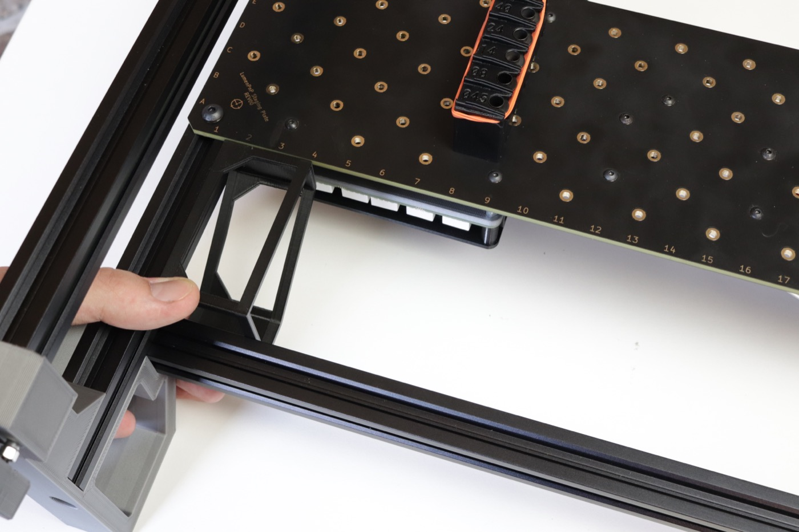
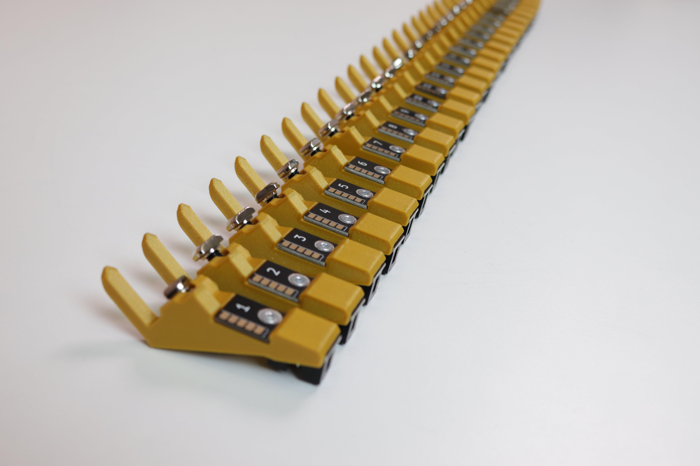

# Installing the Slot Harness

In this step, you'll install and wire slots onto the front and back rails of your LumenPnP. Slots provide power and communication to your feeders.

## Adjust Your Staging Plate

To ensure feeders will mount to your LumenPnP's front rail, we need to ensure that your staging plate is mounted at the correct position.

!!! danger
    Be aware that moving your primary staging plate will change where your bottom camera and homing fiducial markers are mounted. After moving the staging plate, you will need to review your machine's calibration. Specifically, the [Homing Fiducial](../../openpnp/calibration/4-homing-fiducial/index.md#tuning-the-homing-fiducial) and [Bottom Camera Position](../../openpnp/calibration/7-bottom-camera-position/index.md).

1. Unplug your LumenPnP.
   
2. Loosen the 4x M5x8mm button head screws that secure each staging plate to your machine.

3. Measure exactly 75mm of clearance between the front rail and the staging plate. You can use the [squaring bracket](https://github.com/opulo-inc/lumenpnp/blob/main/pnp/cad/FDM/squaring-bracket.FCStd) included in LumenPnP v3 kits. (STL available in the latest [LumenPnP Release](https://github.com/opulo-inc/lumenpnp/releases))
  

1. Re-tighten the four M5x8mm button head screws to secure the staging plate.

## Prepare the Slots

In your Slot Harness Kit, you'll find:

  - 49x Slots
  - 1x Termination Slot
  - 1x Slot Cable Harness
  - 1x Feeder Programmer
  - 10x Cable Clips
  - 50x M5x10mm Socket Head Screws
  - 50x M5 T-Slot Nuts

1. Note that each slot has a number from 1-50. This is the slot's **address**. It's important that you **mount slots in order**. You'll also notice that the 50th slot is a different color. It's important that **50 is connected last in the harness**. This allows the feeders to communicate correctly.
   
   

2. For each slot, take an M5x10mm socket head screw and insert it in the circular opening on the back. Lightly thread an M5 T-slot nut onto each one as shown.
   
   
   

3. Line up slots 1-25 in preparation for mounting to the front rail.
   
   

## Mount the Slots

1. Push the head to the back right corner of the machine.
   
2. Lift the machine up onto its back legs.
   
   
3. Grab a `spool arm` from your feeder packaging. This print comes with each feeder and holds a component spool, but it also has a notch for aligning slots.
   

4. Looking at your machine from the bottom, find the front left leg to the upper left. Place the flat of the square end of the spool arm against the front left leg, and the back of the arm against the front rail extrusion. Use the image below for reference.
   
   

5. Insert the T-slot nut of the `1` slot into the extrusion as shown, and slide it into the notch in the spool arm. (This notch places the slot exactly 85mm away from the front left leg). Tighten the M5 screw to secure the slot.
   
   

6. Begin mounting the rest of the slots in order. Make sure they are mounted with the same orientation as the first. Gently press each slot into the previous one while tightening to ensure there are no gaps between them.
   
   
   

7. Continue until slots `1`-`25` are mounted to the front rail.
   

8. Next, you'll mount slots to the back rail. Near the back right leg, place the flat of the square end of the spool arm against the triangle bracket, and the flat back of the arm against the back rail extrusion as shown in the image.
   

9. Insert the T-slot nut of the `26` slot into the extrusion as shown, and slide it into the notch in the spool arm. (This notch places the slot exactly 85mm away from the bracket). Tighten the M5 screw to secure the slot.
   

10. As you did for the front rail, mount the slots in order in the same orientation as `26`, gently pushing each slot into the previous when tightening.
   

11. Ensure that the differently colored slot `50` is in the final position.
   
   

## Install the Harness

1. If you have one installed, remove the cover to your motherboard.
   
   
   

2. Identify the feeder port on your motherboard. It's the 2x3 pin connector below the Y axis stepper driver.
  

3. Find the end of the cable harness with the "<-- TO MOBO" label. Plug this end into the feeder port on your motherboard. Flip the cable over so that it's leading off the left side of the motherboard.
   
   
   

4. Remount your motherboard cover.
   
   

5. Using the cable clips, secure the cable to the bottom of the left rail as shown.
   
   

6. Fold the cable over as shown, and secure it to the bottom of the front rail using two more cable clips.
   
   
   

1. Bend a small "U" shape into the cable in between the next 25 connectors as shown.
   
   

2. Plug the next 25 connectors into the 25 slots on the front rail.
   
   
   

1. Attach the cable to the bottom of the right side of the front rail using two cable clips.
   
   

1. Fold the cable over, and secure the cable to the bottom of the right rail using three cable clips as shown.
   
   
   

1. Fold the cable over again and secure to the bottom of the right side of the back rail using two more cable clips.
   
   

1. Bend a small "U" shape into the cable in between the final 25 connectors as shown.
   
   

1. Plug the final 25 connectors into the 25 slots on the back rail.
   
   
   
   

1. Take a minute to ensure that your wiring looks like the picture below.
   

1. Lower your machine back down onto its four legs.
   
   

## Next Steps

Next is [updating your software.](../3-software-setup/software-setup.md)
