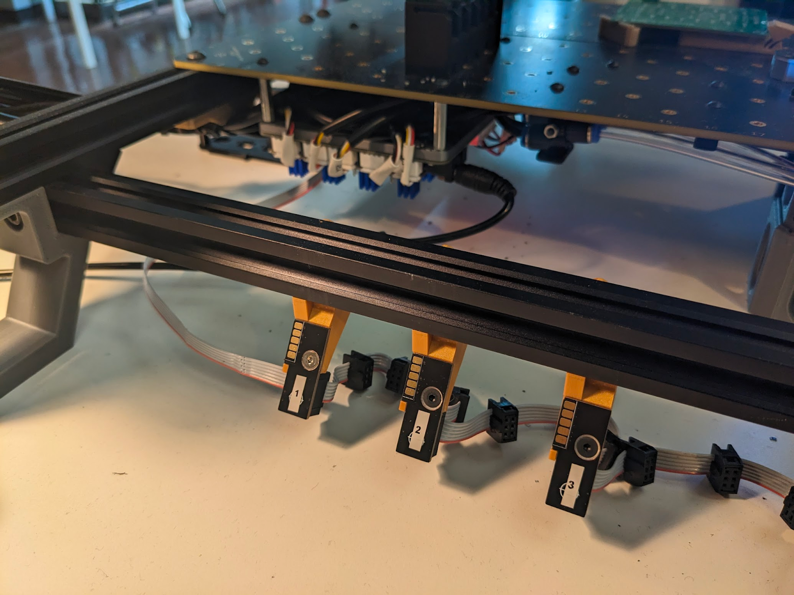

# Installing the Slot Harness

The Opulo 8mm feeders will attach to mounting points on the front or the back of your LumenPnP. We'll start by installing these feeder floor mounting points and making sure there's space to install feeders to your machine.

## Prepare to Install Feeder Floors

Opulo 8mm feeders can be installed on the front or rear aluminum extrusions of your LumenPnP. The feeders need 75mm of clearance between the aluminum extrusion they're attached to and the nearest staging plate.

!!! danger
    Be aware that moving your primary staging plate will change where your bottom camera and homing fiducial markers are mounted. After moving the staging plate, you will need to review your machine's calibration. Specifically, the [Homing Fiducial](../../openpnp/calibration/4-homing-fiducial/index.md#tuning-the-homing-fiducial) and [Bottom Camera Position](../../openpnp/calibration/7-bottom-camera-position/index.md).

1. Unplug your LumenPnP.

2. Decide now if you're going to mount feeders to the front rail, rear rail, or both.
    <!-- TODO: Image of CAD pointing out the two rails -->
3. For each rail you're going to work with, measure 75mm of clearance between it and the nearest staging plate. You can use the [squaring bracket](https://github.com/opulo-inc/lumenpnp/blob/main/pnp/cad/FDM/squaring-bracket.FCStd) included in LumenPnP v3 kits. (STL available in the latest [LumenPnP Release](https://github.com/opulo-inc/lumenpnp/releases))
  

4. If there's not enough space, loosen the four M5x8mm button head screws that secure the staging plate, and slide it back until the squaring bracket fits between the aluminum extrusion and the staging plate.

5. Re-tighten the four M5x8mm button head screws to secure the staging plate.

## Attach Feeder Floors

1. (Optional) Put your LumenPnP up on its haunches.
2. Use an M5x10mm button head screw and a T-slot nut to attach each feeder floor to the front or back rail. The gold-plated pads of the PCB should be facing up and away from the staging plates.
3. Loosen the M5x10mm button head screw to slide the feeders on the rail. There needs to be at least 100mm of space between the LumenPnP's left aluminum extrusion and the closest feeder floor. The feeder floors need to be at least 30mm apart from one another, too.
4. Tighten the M5x10mm screw when the feeder floors are appropriately spaced.
  
  <!-- TODO: GET BETTER PHOTO WITHOUT WIRES -->

## Wire Feeder Floors

1. One end of the harness will have a plug inserted into the connector; this contains the termination resistor for the bus. Take the remaining end of the harness with the empty connector, and plug it into the 2x3 IDC connector on your motherboard to the left of the R and A stepper drivers.

## Next Steps

Next is [updating your software.](../3-software-setup/software-setup.md)
