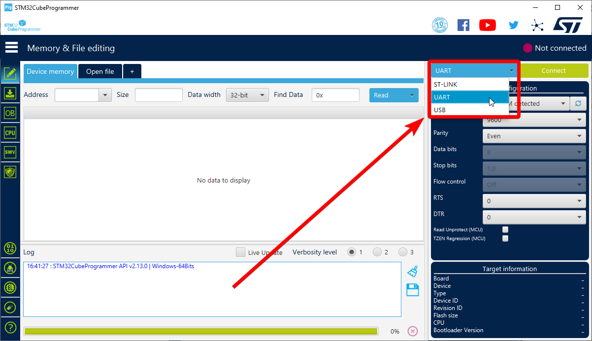
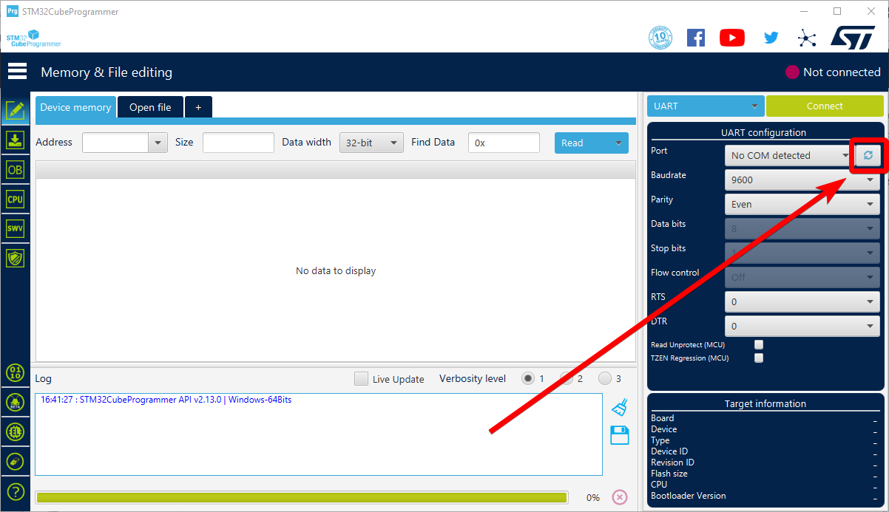
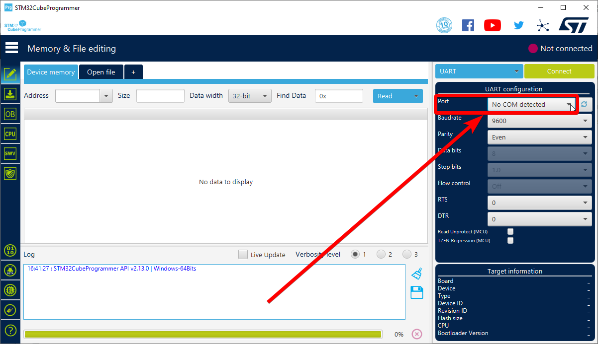
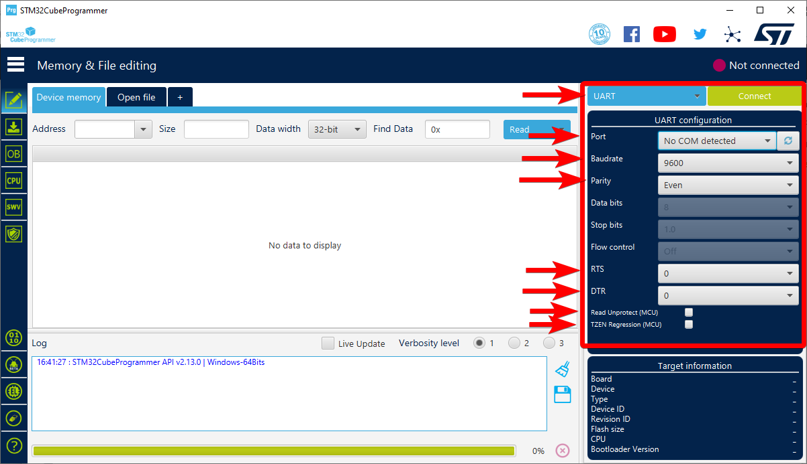
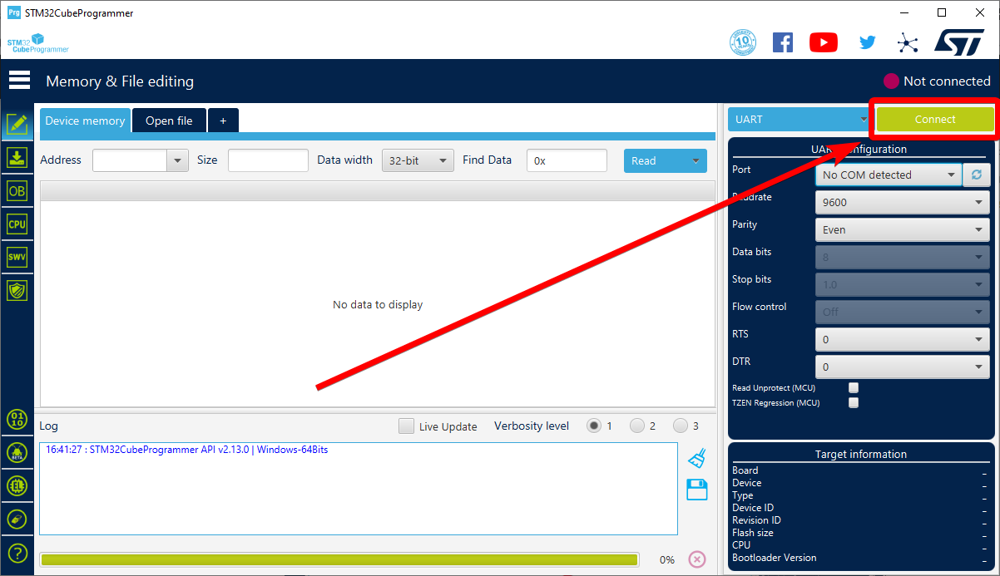
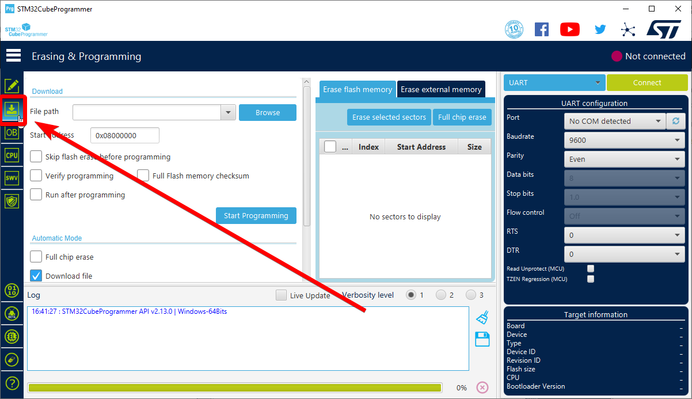
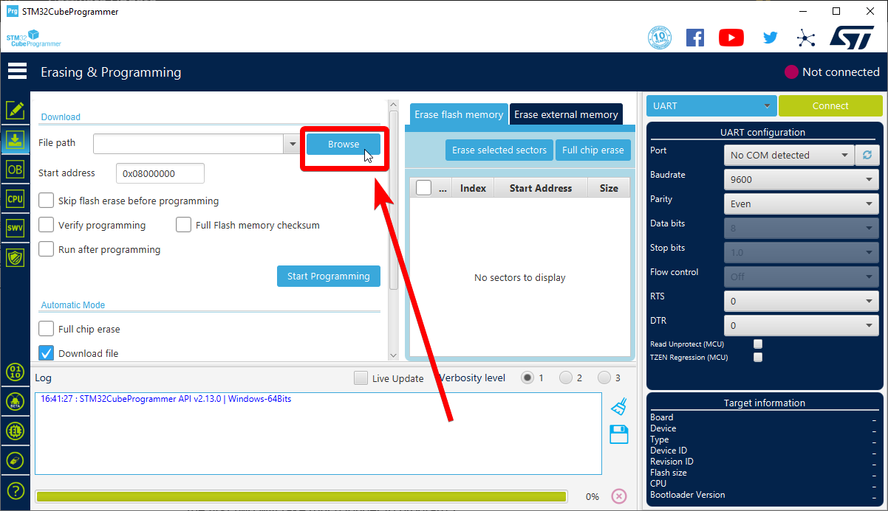
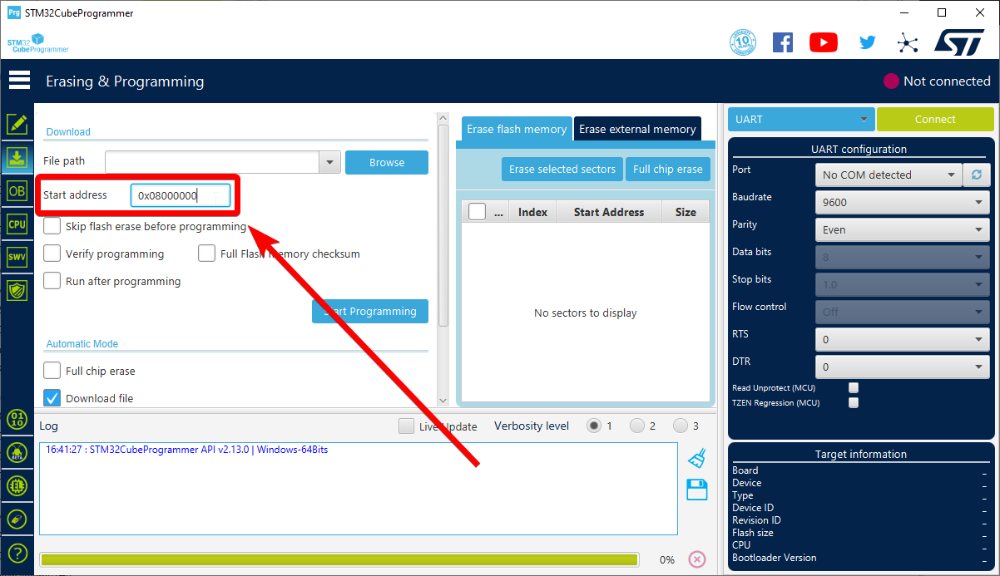
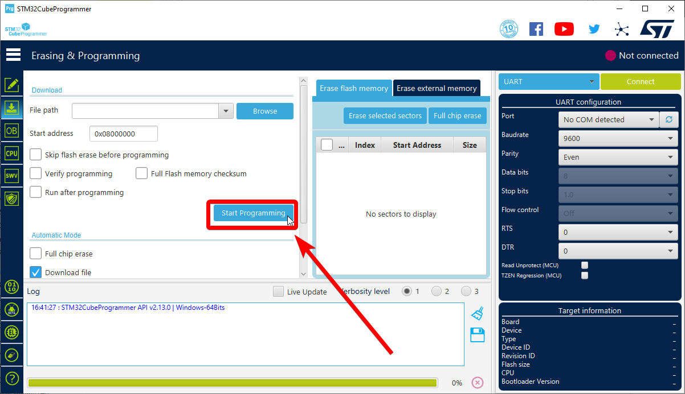

# Software Update

To enable feeder usage, you'll need to update both your LumenPnP's firmware and OpenPnP.

## Update OpenPnP

LumenPnP feeders are a new OpenPnP feature, are not yet in mainline OpenPnP. These docs are based on a 2023-04-05 release, which you can download here:

- Linux ([.deb](https://openpnp.s3-us-west-2.amazonaws.com/test/2023-04-05_08-24-36.0aa4ae8/OpenPnP-linux-test.deb))
- Windows ([32 Bit .exe](https://openpnp.s3-us-west-2.amazonaws.com/test/2023-04-05_08-24-36.0aa4ae8/OpenPnP-windows-x32-test.exe)) ([64 Bit .exe](https://openpnp.s3-us-west-2.amazonaws.com/test/2023-04-05_08-24-36.0aa4ae8/OpenPnP-windows-x64-test.exe))
- Mac ([.dmg](https://openpnp.s3-us-west-2.amazonaws.com/test/2023-04-05_08-24-36.0aa4ae8/OpenPnP-macos-test.dmg))

You can also download the most recent builds of OpenPnP that support feeders [here](https://openpnp.org/test-downloads/), but there could be updates or changes that differ from these docs.

<!-- TODO add openpnp instructions -->

## Update LumenPnP Firmware

!!! note "Machines Version v3.0.5+"
    If your machine's version number is `v3.0.5` or greater, you already have firmware that supports feeders. You can skip this section.

1. Download the LumenPnP firmware with feeder support from the latest release [here](https://github.com/opulo-inc/lumenpnp/releases).

    !!! danger "Important"
        It is important that you pick the correct firmware file for your machine.

           - If you have a v2, choose `v2-lumenpnp-firmware-feeder-support.bin`.
           - If you have a v3, choose `v3-lumenpnp-firmware-feeder-support.bin`.

2. Follow the instructions for [updating your LumenPnP's firmware](../../byop/motherboard/update-firmware/index.md).

## Update Feeder Firmware **(Optional)**

**All feeders come with firmware pre-programmed. These instructions are for updating to a new version of firmware, or putting custom firmware on the feeder.**

1. Connect the included programmer to your computer.
   <!-- TODO: Get photo of programmer plugged into computer -->
2. Download a precompiled Feeder binary from the [Photon releases page](https://github.com/photonfirmware/photon/releases), or [compile it yourself](https://github.com/opulo-inc/feeder).
3. Download and install the [STM32CubeProgrammer application](https://www.st.com/en/development-tools/stm32cubeprog.html#section-get-software-table).
4. Open the STM32CubeProgrammer application
5. On the Blue dropdown next to the connect button, select `UART`
   

6. Click the circular arrow icon to scan for new devices.
   

7. Click the `Port` drop down and select the new port that appears.
    

8. Set the following settings:
    1. `Baudrate: 9600`
    2. `Parity: Even`
    3. `RTS: 0`
    4. `DTR: 0`
    5. `Read Unprotect (MCU): Unchecked`
    6. `TZEN Regression (MCU): Unchecked`
    

9. Hold down the BOOT button located here on the feeder:
   

10. While holding the BOOT button, insert the pins of the programmer into the plated holes on the feeder as shown in the picture below. The holes are slightly offset, so the programmer pins will stay in contact with the through holes. Once connected, release the BOOT button.

    !!! Note
        The feeder does not need to be mounted on a rail for this step; it can be powered by the programmer.

    
    
    

11. Click the green connect button in STM32CubeProgrammer.
    

    !!! Danger "If You Can't Connect"
        If you can't connect to your feeder, check that the programmer is inserted into the pins in the correct orientation. Also, applying gentle pressure to the side of the programmer can help ensure that the pins are making good contact with the plated holes in the feeder PCB.

12. Once connected, Switch to the download tab on the left.

13. Click the "Browse" button and navigate to the provided `firmware.bin` file.
    

14. Ensure that the “Start address” is 0x08000000. (You can check any of the checkboxes, but the first two will take much longer to program.)
    

15. Click "Start Programming".
    

16. Wait until the software prompts that the firmware has been downloaded successfully. You may disconnect the programmer from the feeder.
    
