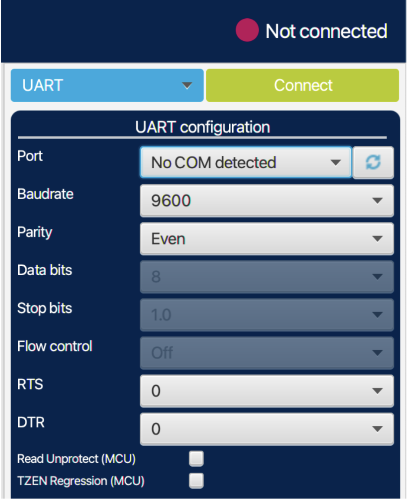
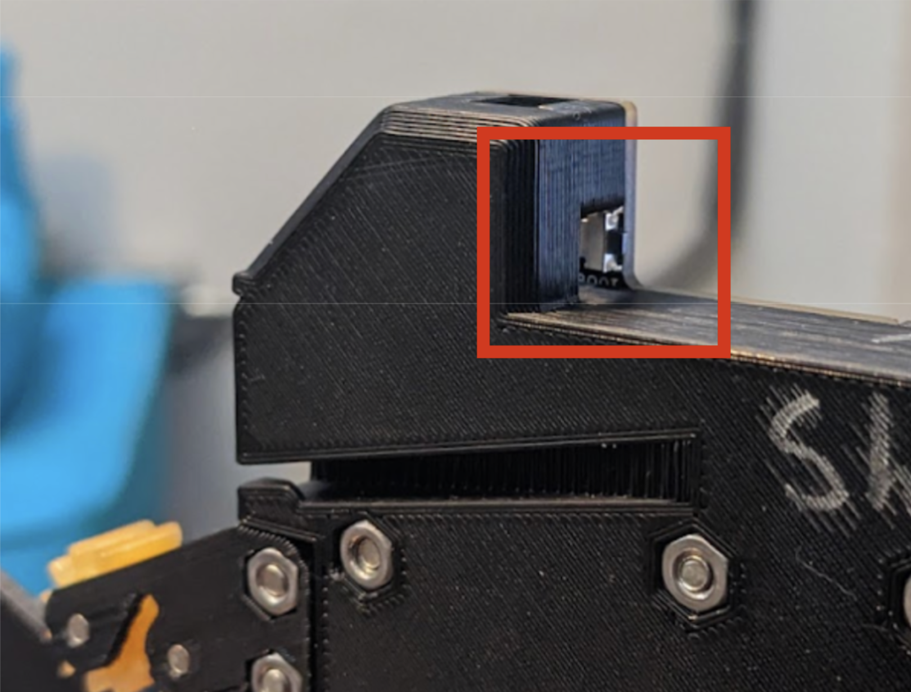
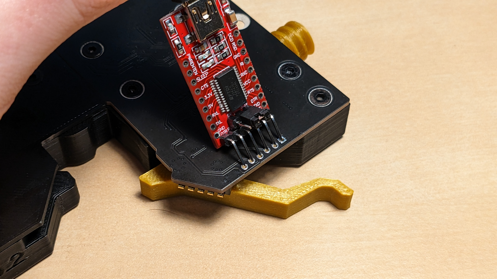
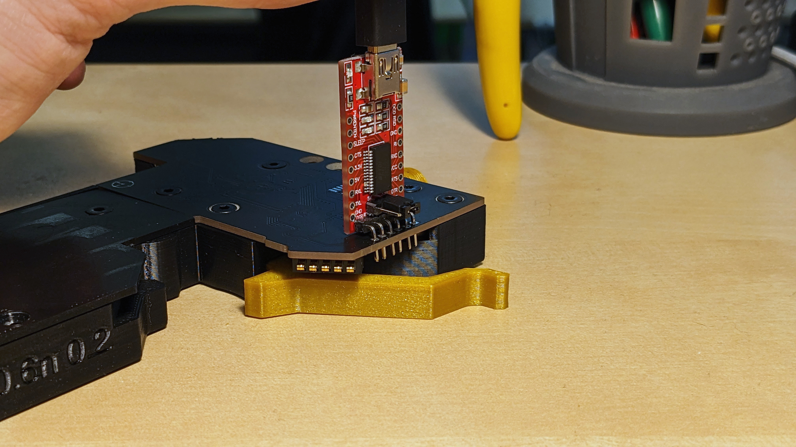
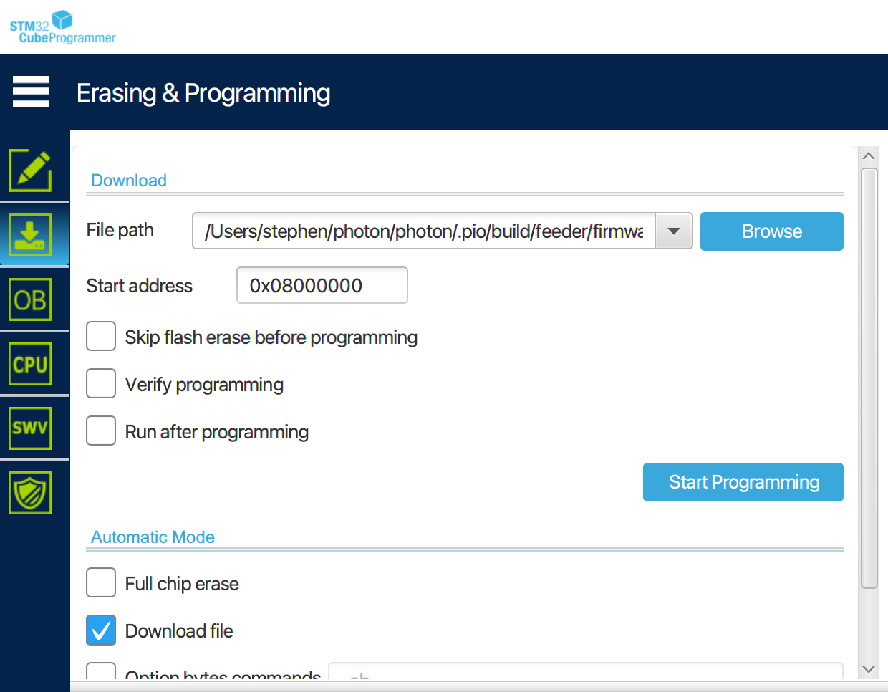
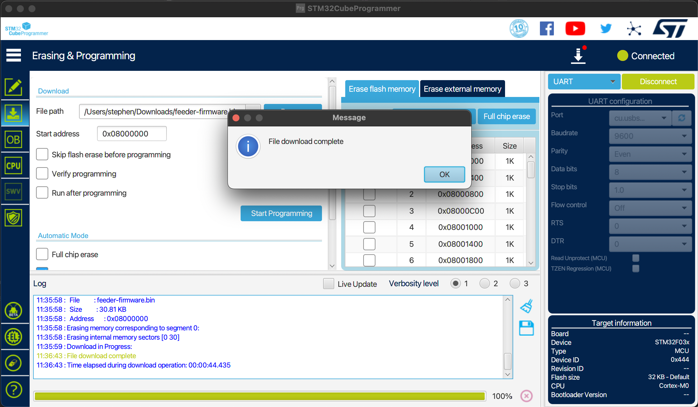

# Software Update

To enable feeder usage, you'll need to update both your LumenPnP's firmware and OpenPnP.

## Update OpenPnP

LumenPnP feeders are supported in OpenPnP version TODO and onward. Update your OpenPnP installation from
TODO instructions on how to get this version if not latest cut on site

## Update LumenPnP Firmware

!!! note "Machines Version v3.0.TODO+"
    If your machine's version number is v3.0.TODO or greater, you already have firmware that supports feeders. You can skip this section.

1. Download the LumenPnP firmware with feeder support from the latest release [here](https://github.com/opulo-inc/lumenpnp/releases).

    !!! danger "Important"
        It is important that you pick the correct firmware file for your machine. If you have a v2 LumenPnP, choose the `v2-lumenpnp-firmware-feeder-support.bin`. If you have a v3, choose `v2-lumenpnp-firmware-feeder-support.bin`.

2. Follow the instructions for [updating your LumenPnP's firmware](../../byop/motherboard/update-firmware/index.md).

## Update Feeder Firmware **(Optional)**

All feeders come with firmware pre-programmed. These instructions are for updating to a new version of firmware, or putting your own firmware on the feeder.

1. Get the firmware binary you'd like to program. You can download a precompiled binary from the Photon [releases page](https://github.com/photonfirmware/photon/releases), or compile a new one yourself.
2. Download and install the STM32CubeProgrammer application, found [here](https://www.st.com/en/development-tools/stm32cubeprog.html#section-get-software-table).
3. Connect the included programmer to your computer.
4. Open the application, scan for new ports with the circular arrow icon, select the new port that appears, and make sure all the other settings match the picture below (including selecting UART next to the connect button).
   

5. Hold down the BOOT button located here on the feeder:
   

6. While holding the BOOT button, insert the pins of the programmer into the plated holes on the feeder as shown in the picture below. The holes are slightly offset, so the programmer pins will stay in contact with the through holes. Once connected, release the BOOT button.

    !!! note
        The feeder does not need to be mounted on a rail for this step; it can be powered by the programmer.

    
    
    

7. Click the green connect button in STM32CubeProgrammer.

    

    !!! danger "If You Can't Connect"
        If you can't connect to your feeder, check that the programmer is inserted into the pins in the correct orientation. Also, applying gentle pressure to the side of the programmer can help ensure that the pins are making good contact with the plated holes in the feeder PCB.

8. Once connected, click the “Download” icon on the left, then select the provided firmware.bin file. Ensure that the “Start address” is 0x08000000. You can check any of the checkboxes, but the first two will take much longer to program. Click Start Programming.

    

9. Wait until the software prompts that the firmware has been downloaded successfully. You may disconnect the programmer from the feeder.

    
