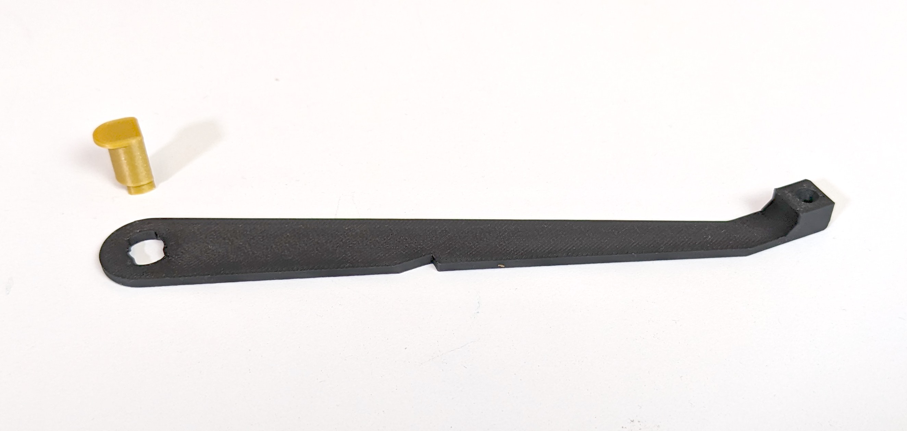
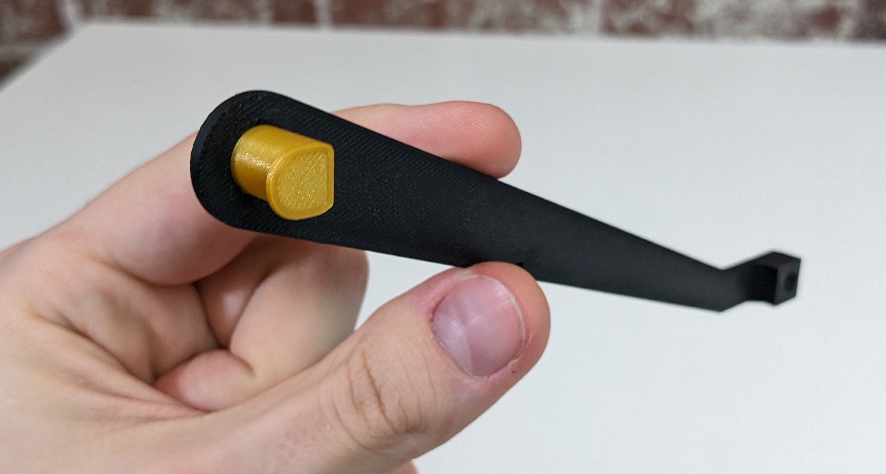
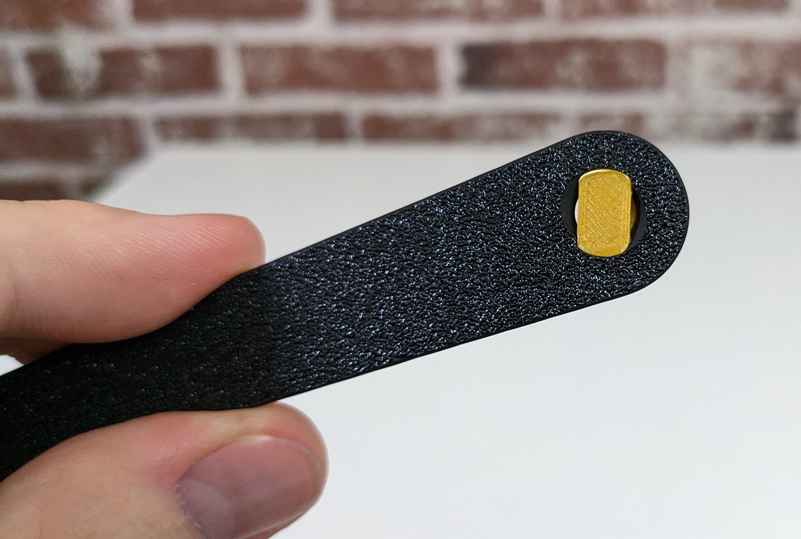
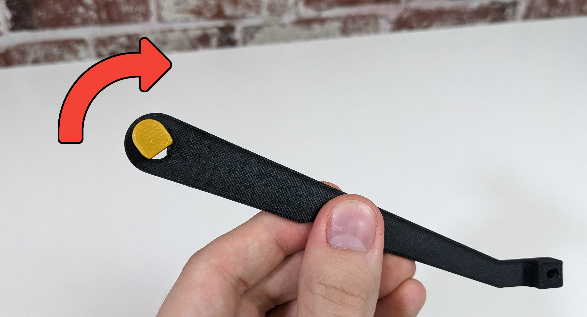
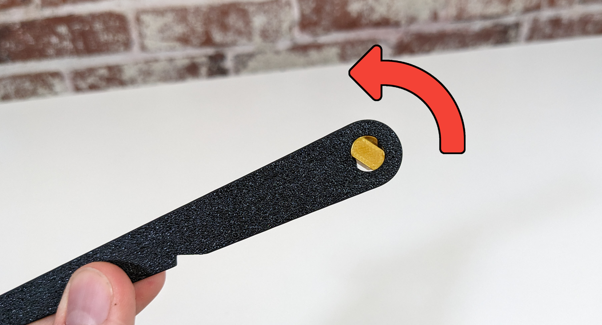
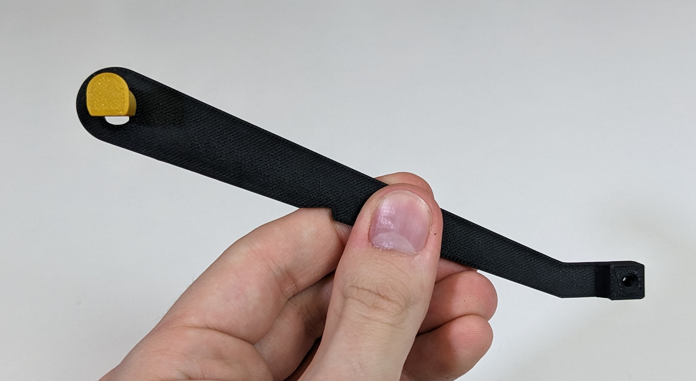
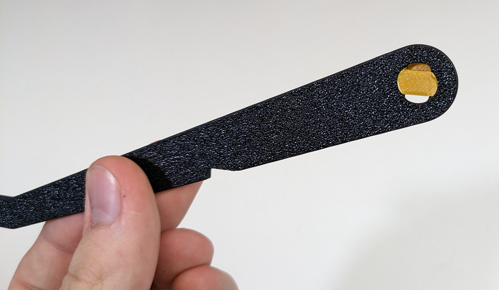
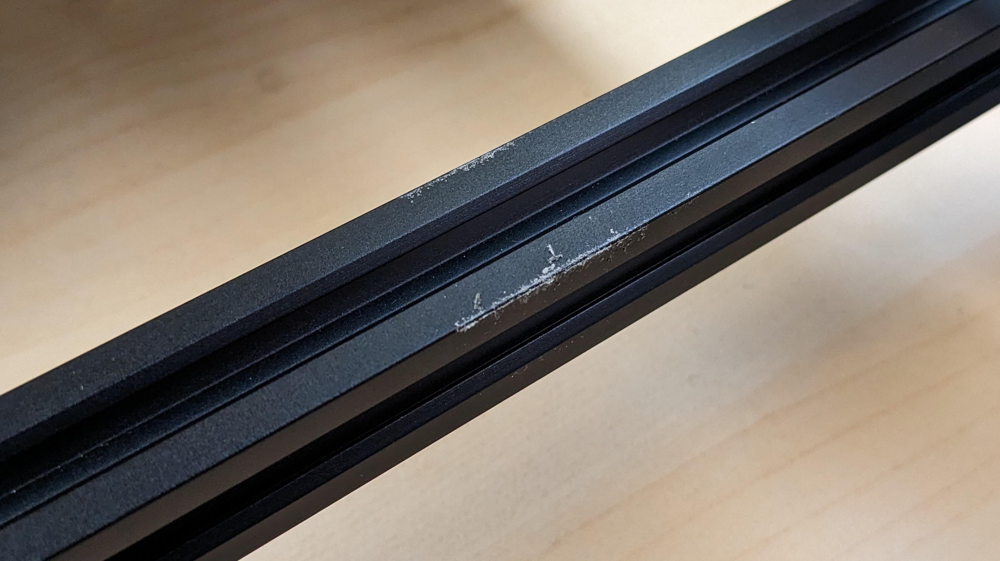

# Mounting Feeders

A feeder can be mounted on your LumenPnP with one smooth motion.

## Installing Spool Arm

1. Grab a spool arm and thimble.
   

2. Insert the V-shaped side of the thimble into the spool arm as shown, so that the thimble and the block feature on the other end of the arm are on the same side. Make sure that the flat side of the thimble is facing the rest of the arm when inserting.
   
   

3. Rotate the thimble 90 degrees so that the flat side is facing downwards, as shown below.
   
   

4. The spool arm should look like the image below.
   
   
   

5. Use a 2.0mm hex wrench to unscrew the countersunk screw in the spool arm slot,
   

6. Insert the spool arm upright, with the flat side of the arm facing the PCB.
   

7. Replace the screw.
   

## Insert Feeder

!!! note "Powder on the Rail"
    You might notice that a small amount of dust or powder develops on your machine's feeder rail. This is totally ok. The feeder prints are designed to be just a little undersized, so that they wear in to exactly the right fit over a few insertion cycles. Brush any powder away and continue use as normal.

    

!!! note "A Bit of Force is OK"
      It can take a bit of force to mount your feeder, especially the first few times as the print breaks in. As long as you are aligned correctly, you can put a bit of force into mounting the feeder.

1. Hold your feeder at a 45 degree angle downwards.
   

2. Align the peg on the slot with the channel in the feeder.
   
   
   

3. Ensure the that the feeder is hooked around the extrusion as shown in the image below.
   

4. Depress the locking arm.
   

5. Pull down on the feeder until it pops into place.
   

6. You should see the status light blink gold, indicating that the feeder has booted up.
   

7. Release the lever arm.
