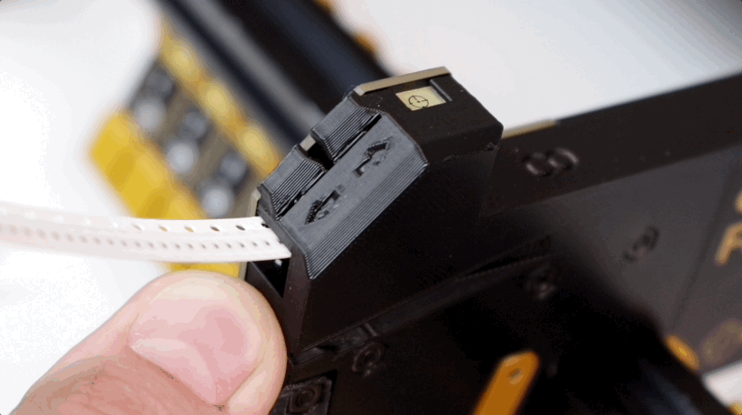

# Mounting Feeders

A feeder can be mounted on your LumenPnP with one smooth motion.

1. Before mounting, install your spool arm. Unscrew the allen key in the spool arm slot, insert the spool arm upright, and replace the screw.
   
   
   
2. Hold your feeder at a 45 degree angle downwards.
    
3. Align the peg on the slot with the channel in the feeder.
   
   
   
4. Ensure the notch in the feeders' extrusion cutout grabs into the extrusion.
   
5. Pull in on the locking arm.
   
6. Pull down on the feeder until it pops into place.
   
   
    !!! note "A Bit of Force is OK"
        It can take a bit of force to mount your feeder, especially the first few times as the print breaks in. As long as you are aligned correctly, you can put a bit of force into mounting the feeder.

1. You should see the status light blink gold, indicating that the feeder has booted up.
   

7. Release the lever arm.

