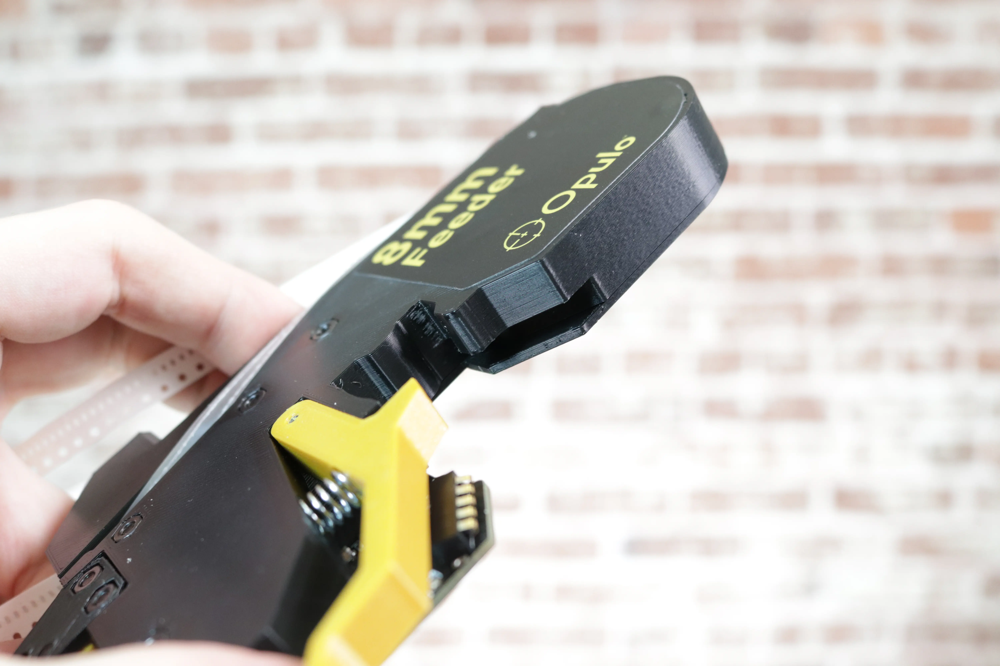
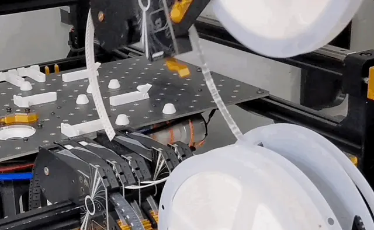

# Mounting Feeders

A feeder can be mounted on your LumenPnP with one smooth motion.

## (8mm) Installing Spool Arm

8mm feeders come with a spool arm that holds a standard 7" spool of components directly on the feeder.

1. Grab a spool arm and thimble.
   

2. Insert the V-shaped side of the thimble into the spool arm as shown, so that the thimble and the block feature on the other end of the arm are on the same side. Make sure that the flat side of the thimble is facing the rest of the arm when inserting.
   
   

3. Rotate the thimble 90 degrees so that the flat side is facing downwards, as shown below.
   
   

4. The spool arm should look like the image below.
   
   
   

5. Use a 2.0mm hex wrench to unscrew the countersunk screw in the spool slot.
   

6. Insert the spool arm upright, with the flat side of the arm facing the PCB.
   

7. Replace the screw.
   

## (12mm) Installing Ramp

Most spools for 12mm tape are wider than the LumenPnP Feeder, so they cannot be mounted to it. Instead, a ramp allows the tape to feed into the feeder from a floor-mounted spool.

1. Use a 2.0mm hex wrench to unscrew the countersunk screw in the spool slot.
   

2. Insert the ramp in the orientation shown, with the curve pointing to the tape opening.
   

3. Replace the screw.
   

## Insert Feeder

!!! note "Powder on the Rail"
    You might notice that a small amount of dust or powder develops on your machine's feeder rail. This is totally ok. The feeder prints are designed to be just a little undersized, so that they wear in to exactly the right fit over a few insertion cycles. Brush any powder away and continue use as normal.

    

!!! note "A Bit of Force is OK"
      It can take a bit of force to mount your feeder, especially the first few times as the print breaks in. As long as you are aligned correctly, you can put a bit of force into mounting the feeder.

1. Hold your feeder at a 45 degree angle downwards.
   

2. Align the peg on the slot with the channel in the feeder.
   
   
   

3. Ensure the that the feeder is hooked around the extrusion as shown in the image below.
   

4. Depress the locking arm.
   

5. Pull down on the feeder until it pops into place.
   

6. Release the lever arm. You may want to double-check that the spring finger contacts on the feeder are properly touching the metal pads on the slot until you get the hang of installing them.

!!! danger "Powering on the LumenPnP with feeders already mounted"
      With old power supplies, you might find that plugging in your LumenPnP with many feeders already mounted prevents the machine from booting. This is a known issue due to high inrush current. If you're experiencing this issue, please [contact support](https://www.opulo.io/pages/contact-support) and we'll send you an updated power supply that solves this issue. All v3.1+ machines shipped with this updated power supply.

!!! tip "Mounting inline with other feeders"

      If you're mounting a feeder inline with many others, reach under the spools to depress the lever arm, push forward to tip the feeder, then depress the lever from the top and remove.

      {: style="width:80%;margin-left:0%;"}

      The feeder can also be mounted and removed without depressing the lever arm. If you're having trouble reaching the lever arm, try mounting and removing the feeder by pushing or pulling the spool arm as shown below.

      {: style="width:80%;margin-left:0%;"}

      {: style="width:80%;margin-left:0%;"}

## Next Steps

Next, you'll [configure your attached feeders in OpenPnP.](../5-openpnp-setup/feeder-openpnp-setup.md)
