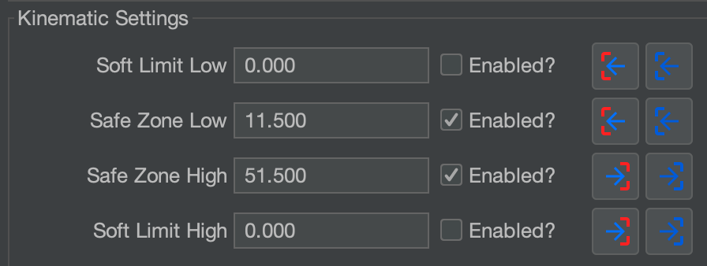
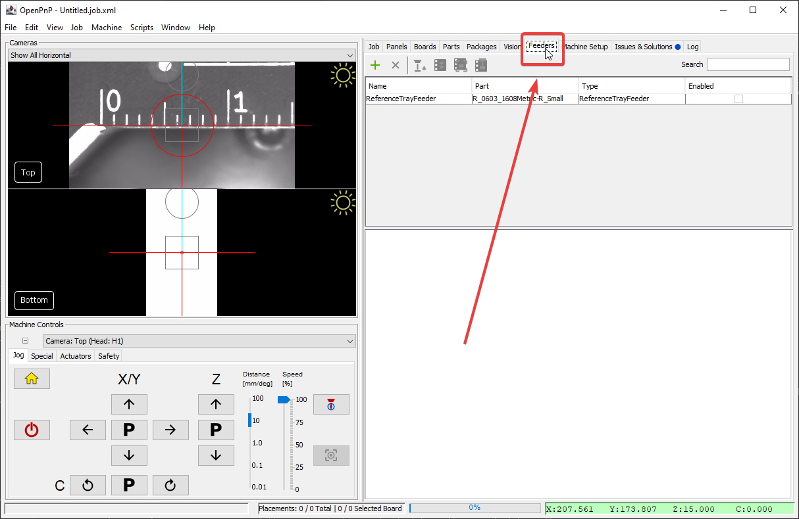
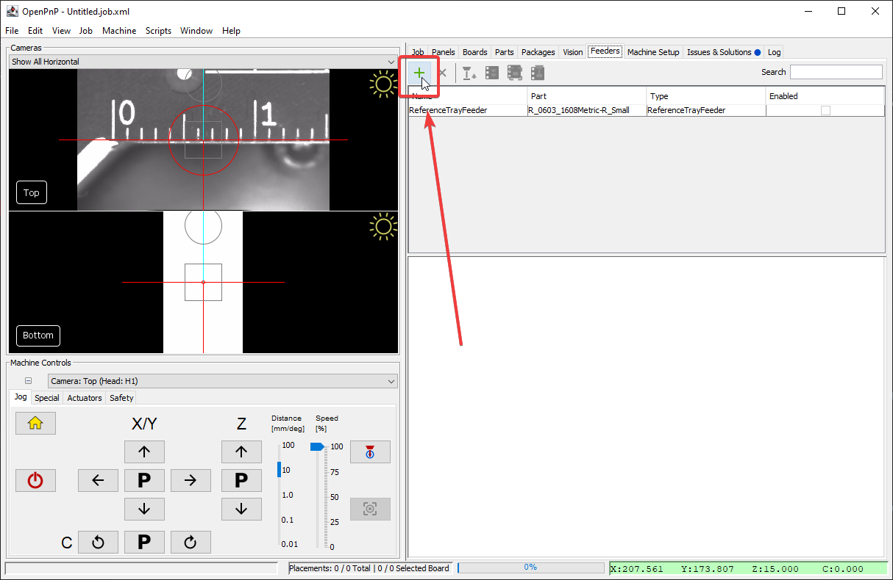
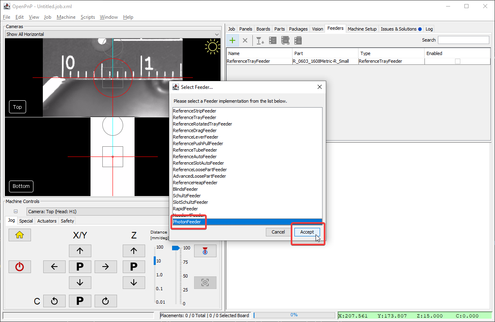
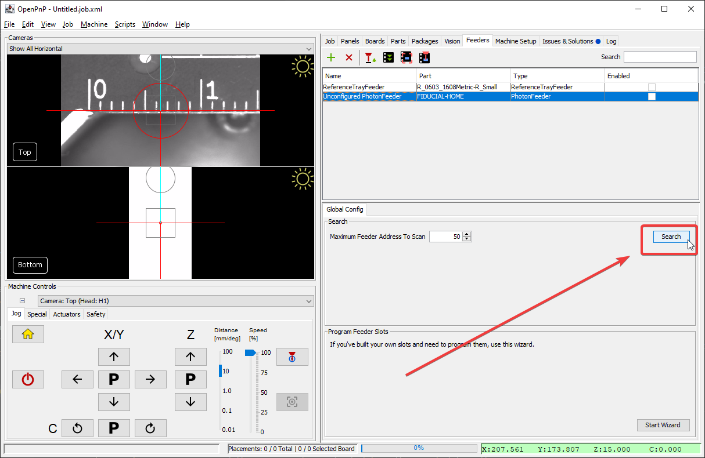
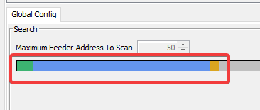
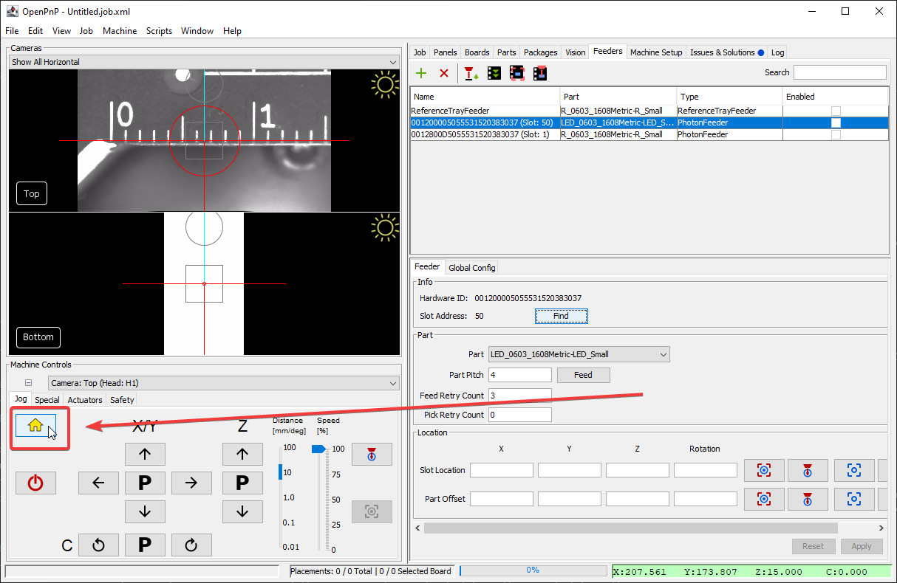
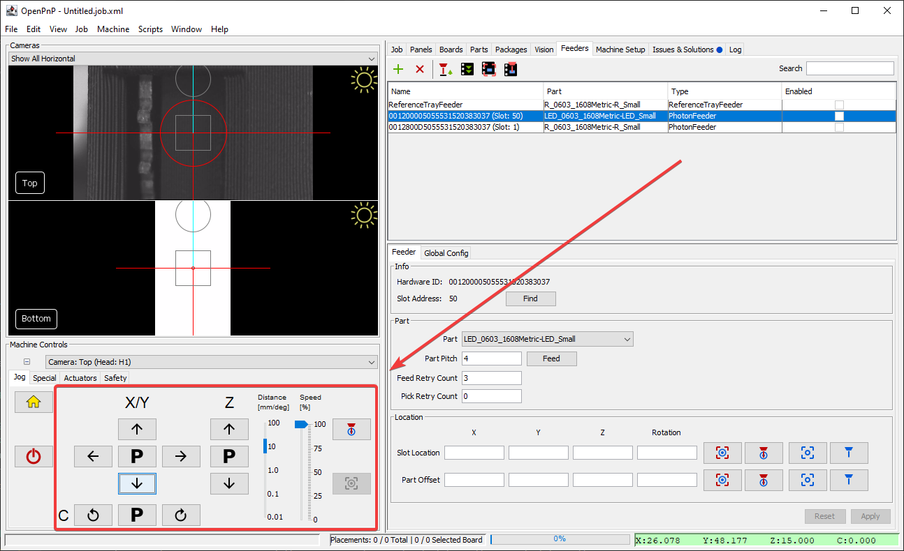
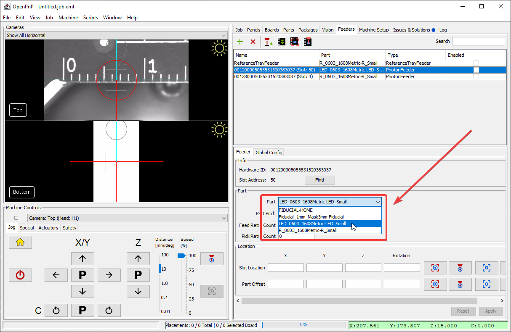
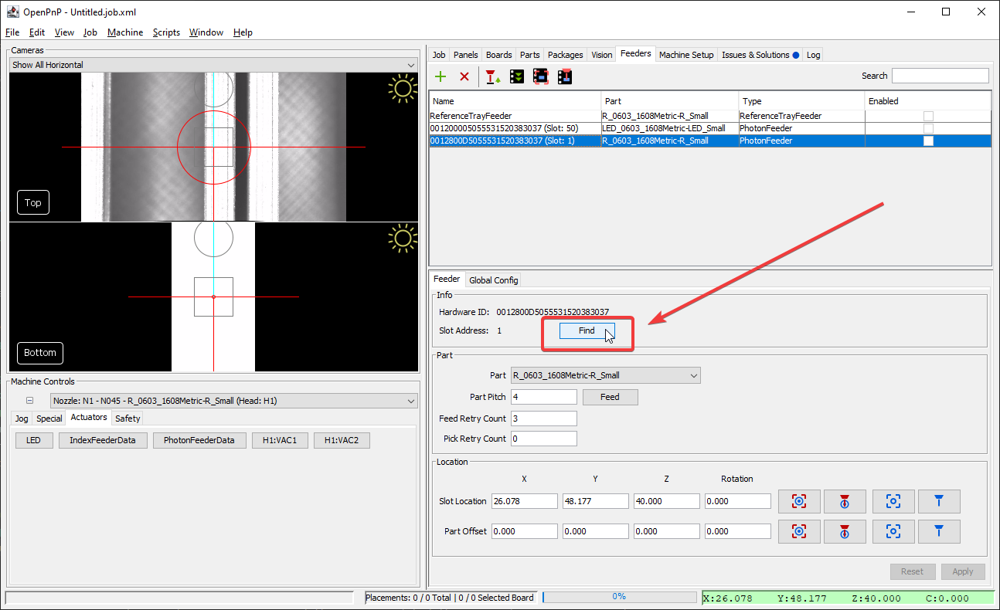

# OpenPnP Setup

Both the feeder slots, and the Photon Feeders themselves have unique identifiers that OpenPnP will use to keep your components organized easily. Even if you rearrange your feeders, OpenPnP will remember which component was loaded onto it. And since OpenPnP will remember where each feeder slot is located, the picking location will already be set for you!

If you'd like to start with a fresh config, you can download the `openpnp-config-vX.X.X.zip` file from the [most recent release](https://github.com/opulo-inc/lumenpnp/releases).

To get started the first time with your new feeders, you'll need to attach them all to your LumenPnP, and let OpenPnP scan them to save their information.

## Finding Feeders

You'll need to do these steps whenever you have brand new feeders.

!!! danger "v2 LumenPnP Config"
      If you have a v2 LumenPnP, the default Z height of your nozzle could cause a collision with feeders. We recommend printing and installing updated Z-gantries (shown below) and nozzle rack, which moves your nozzles up 13mm preventing a collision. You can download them [here](https://github.com/opulo-inc/lumenpnp/releases/download/v3.0.4/LumenPnP-STLs-v3.0.4.zip).
      
      If you have a single nozzle setup, you can also just edit the Safe Zone values in your Z axis configuration in OpenPnP to prevent a collision.
      

1. Power on your LumenPnP and connect to it.

2. Click on the `Feeders` tab.
  

3. Click the plus to add a new feeder,
   

4. Select `PhotonFeeder`.
   

5. Mount all of your new feeders to your machine. They can be in any slot.
   

6. Click the `Search` button. OpenPnP will now scan for any feeders attached. This will take a minute, and you'll see the progress showing which slots have feeders in them.
   
   

7. Once the search has completed, each physically inserted feeder will be listed. The name will be the feeder's unique ID number, followed by the slot it's in. In this example, there are two feeders inserted.
   

## Test Setup

To finish setting up your new feeders, we need to mark where they're located on your LumenPnP. As mentioned above, the locations of each feeder slot will be saved and reused, so you shouldn't need to do this every time you remove and replace a feeder.

1. Home your LumenPnP
   

2. Use the machine controls to position your camera over the feeder. This will be more precise later after you load components into the feeder, so a rough estimate is fine for now.
   

3. Save the rough feeder position with the "Capture Camera Location" button. For now, save it for both the `Slot Location` and `Part Offset`.
   

4. Click `Apply` to save your changes.
   

5. Select a part from the drop down menu.
   

6. Press the feed button to test that the feeder responds to the LumenPnP.
   

## Next Steps

You'll need to fine-tune the position of the pick location—especially the z-height. This is easiest with [tape loaded into the feeder](../6-loading-tape/loading-tape.md).

!!! tip "Moving Feeders"
      If you remove a feeder from your machine and reinsert it into another feeder slot, you'll need to tell OpenPnP to update its location. To do this, click the `Find` button in that feeder's menu. You'll see the slot number update to reflect the feeder's new slot, and its location will update accordingly!
      
