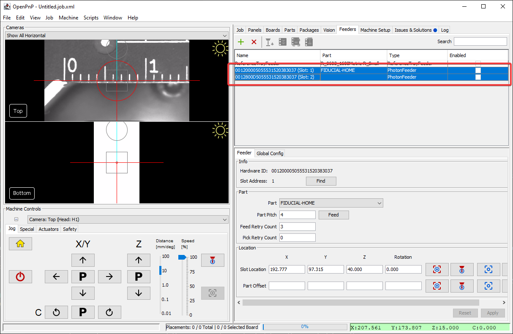
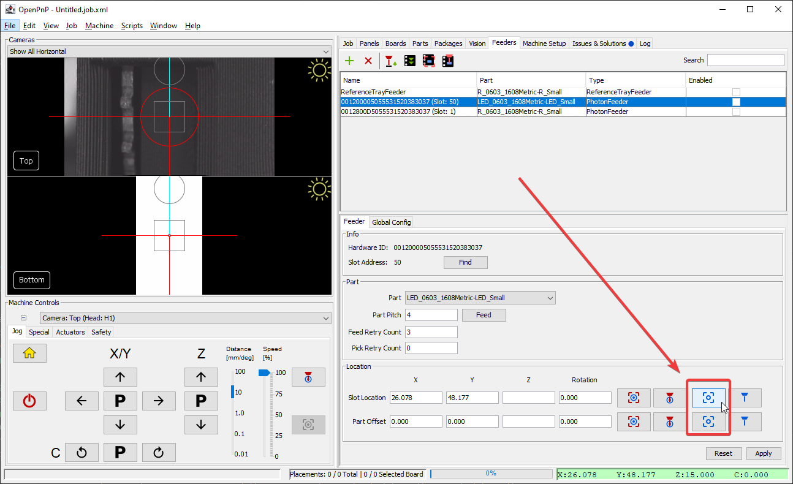
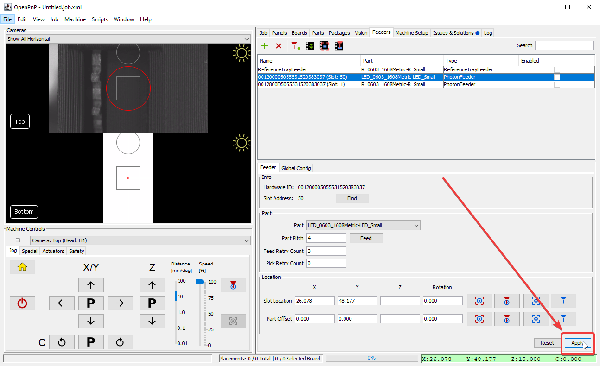

# OpenPnP Setup

Now you'll scan for and configure your LumenPnP Feeders in OpenPnP.

!!! warning "v2 LumenPnP Users"
      If you have a v2 LumenPnP, the default Z height of your nozzle could cause a collision with feeders. We recommend printing and installing updated Z-gantries (shown below) and nozzle rack, which moves your nozzles up 13mm preventing a collision. You can download them [here](https://github.com/opulo-inc/lumenpnp/releases/download/v3.0.4/LumenPnP-STLs-v3.0.4.zip).

      

## Scanning for Feeders

1. Click on the `Feeders` tab.

      

1. Click the plus to add a new feeder.

      

2. Select `PhotonFeeder`.

      

3. Mount all of your new feeders to your machine. They can be in any slot.

      

4. Click the `Search` button. OpenPnP will now scan for any feeders attached. This will take a minute, and you'll see the progress showing which slots have feeders in them.

      

      

5. Once the search has completed, each physically inserted feeder will be listed. The name will be the feeder's unique ID number, followed by the slot it's in. In this example, there are two feeders inserted.

      

!!! danger "Before Saving"
      Because of a [bug in OpenPnP](https://github.com/openpnp/openpnp/issues/1557), a part *must* be assigned to every feeder before saving your machine configuration. If you want to save your config before finishing setup, we recommend assigning the `FIDUCIAL-HOME` part to any feeders that do not yet have a part assigned.

## Configure

Now that your feeders have been discovered in OpenPnP, you'll need to configure each one.

1. Home your LumenPnP.

      

2. Use the machine controls to position your camera over the feeder. This will be more precise later after you load components into the feeder, so a rough estimate is fine for now.

      

3. Save the rough feeder position with the "Capture Camera Location" button. For now, save it for both the `Slot Location` and `Part Offset`.

      

4. Click `Apply` to save your changes.

      

5. Select a part from the drop down menu.

      

6. Press the feed button and listen for the feeder's motors moving.

      

!!! tip "Moving Feeders"
      If you remove a feeder from your machine and reinsert it into another feeder slot, you'll need to tell OpenPnP to update its location. To do this, click the `Find` button in that feeder's menu. You'll see the slot number update to reflect the feeder's new slot, and its location will update accordingly!
      

## Next Steps

Before you can try picking parts from the feeder, you need to [load some component tape](../6-loading-tape/loading-tape.md).

