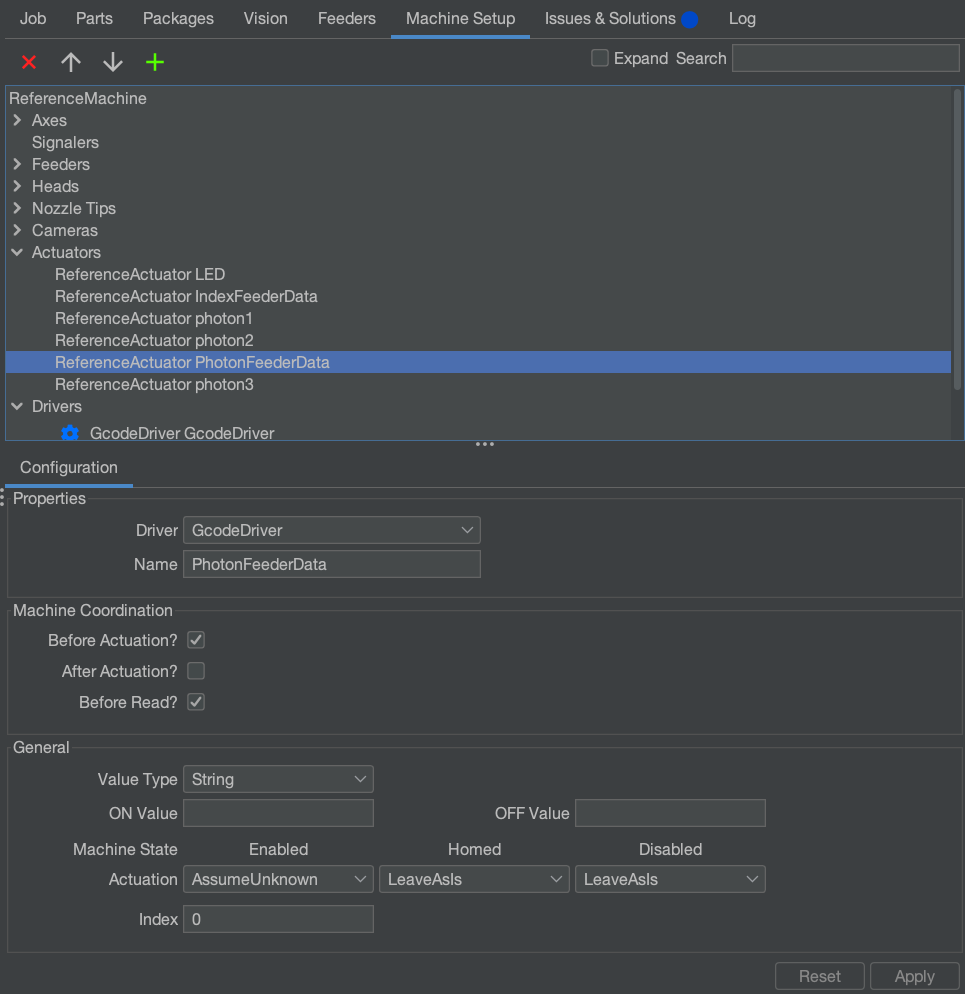
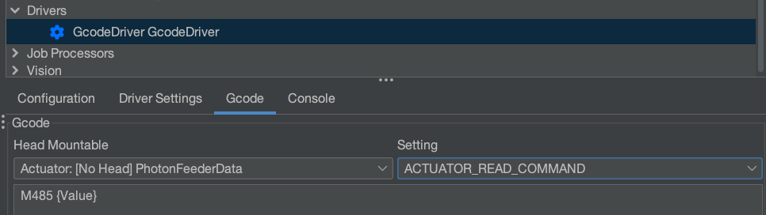
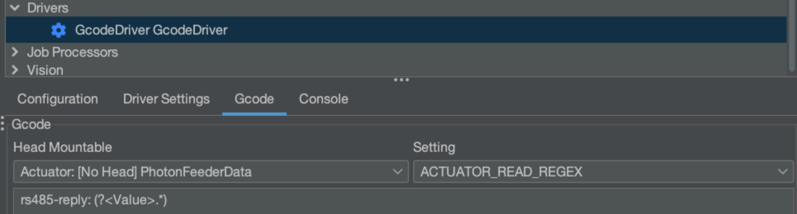
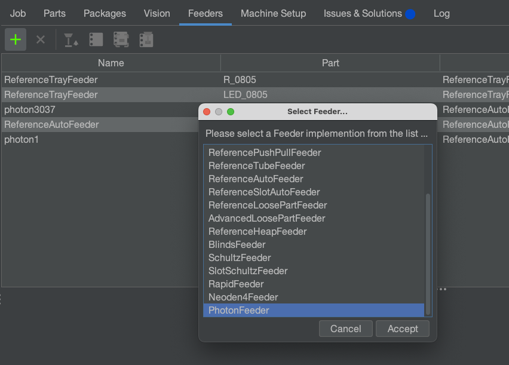
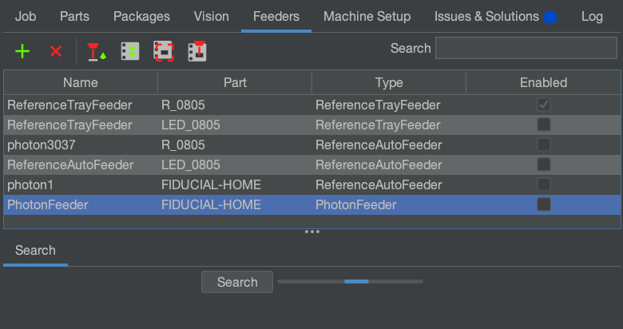
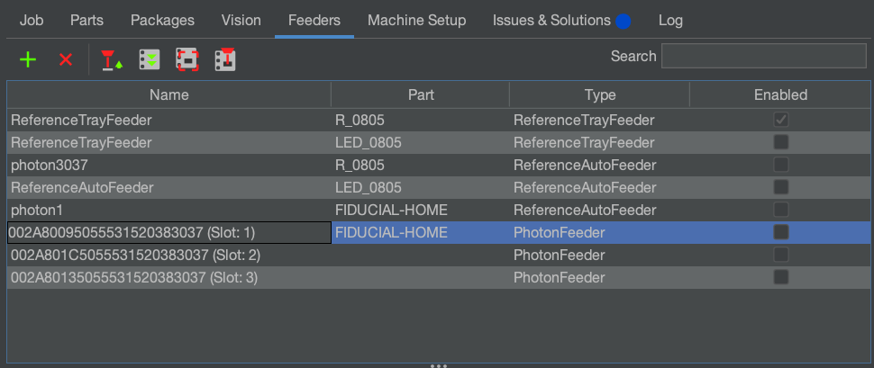
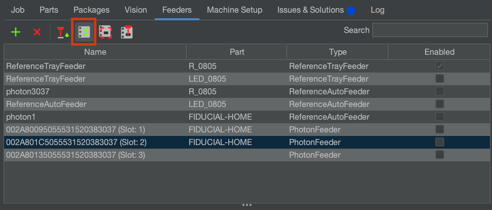
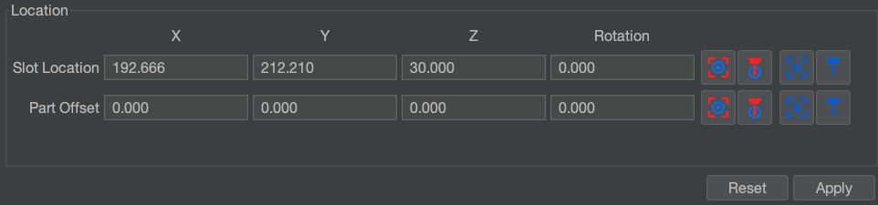

# OpenPnP Setup

## Actuator Setup

!!! note "config files from release TODO or later"
    you don't gotta set this up, it'll already be there

1. Open OpenPnP.
2. Make a new Actuator titled `PhotonFeederData` and give it the following settings:
   
3. Press Apply to save your changes.
4. Navigate to `Drivers > GcodeDriver`. Switch to the `Gcode` tab. Switch the `Head Mountable` dropdown to `Actuator: [No Head] PhotonFeederData`. Switch the `Setting` to `ACTUATOR_READ_COMMAND`. In the text box, paste in `M485 {Value}`.
   

5.  Switch the `Setting` to `ACTUATOR_READ_REGEX`. In the text box, paste in `rs485-reply: (?<Value>.*)`
   

## Add Feeders

1. Power on your LumenPnP and connect to it.
   
2. Go to the “Feeders” Tab. Click the Plus to add a new feeder, and select `PhotonFeeder`.
   

1. Mount a feeder to your machine. It can be in any slot.
   

2. Click the search button. OpenPnP will now scan for any feeders attached. This might take a minute!
   

3. Once the search has completed, you should see the feeder you loaded on your rail appear in the Feeder table. The name will be the feeder's unique ID number, followed by the slot it's in.
   

4. set part. hit feed command. Any part will work, but OpenPnP requires a part to be selected before we can test feeder operation)
   

5. Set part, set position, set all data.
   

6. try to pick

7.  You should now be able to select these feeders as part of any job.

8. Move the feeder to a new slot. hit scan or whatever to find out that it's smart
