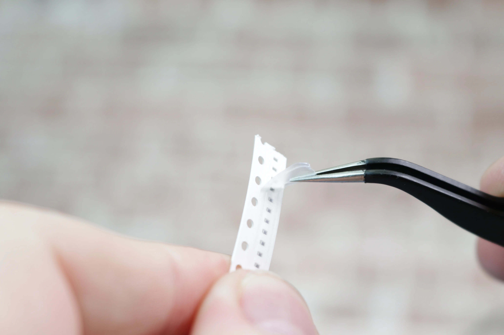
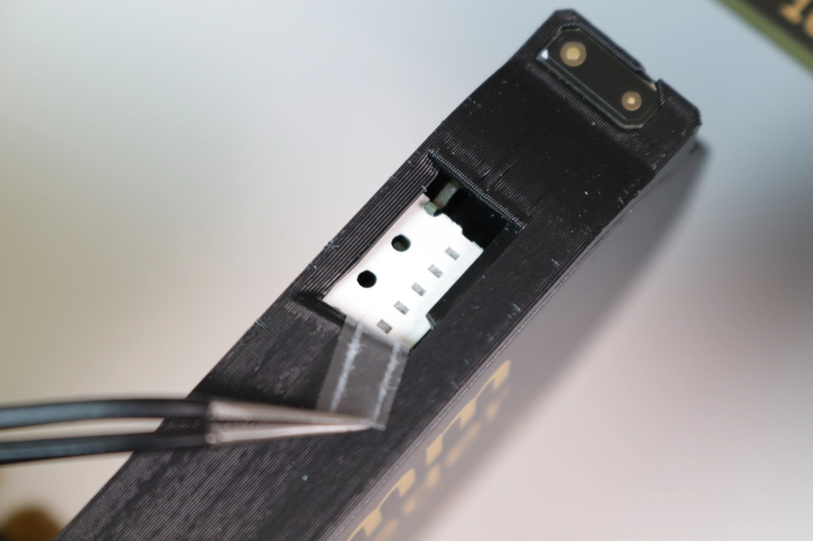
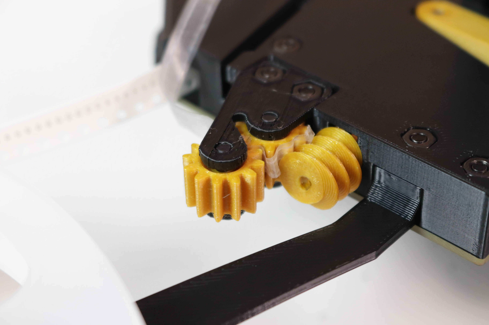

<!-- markdownlint-disable MD033-->
# Loading Tape

This video shows how tape is loaded into the feeder, and the functionality of the buttons.

!!! Note "Keep In Mind"
    Don't worry if something in the video doesn't look exactly like what you have in the box. We’re constantly tuning and tweaking things to make them better and easier to use, so you might find things look slightly different.

<iframe width="560" height="315" margin="auto" src="https://www.youtube.com/embed/rVsv2GUO0Tg" title="YouTube video player" frameborder="0" allow="accelerometer; autoplay; clipboard-write; encrypted-media; gyroscope; picture-in-picture" allowfullscreen></iframe>

!!! Note
    See also the [Feeder Buttons](../1-overview/feeder-overview.md#feeder-buttons) documentation for manually driving your feeders.

1. Cut the tape straight across one of the indexing holes, leaving a semicircle.

      

      

2. Peel back a few millimeters of film.

      

3. Feed the tape into the opening on the back of the feeder, film side up.

      

4. Align the semicircle in the tape to the first tooth on the drive wheel.

      

5. Guide the few millimeters of loose film out of the pick window.

      

6. Press and hold the forward button while pulling upwards on film.

      

7. Wrap the film around the feeder and guide it into the slot leading to the peel gears.

      

      

8. Press and hold both buttons until the status light turns blue to switch into Peel mode.

      

9. Press and hold the forward button to spin the peel motor, and feed film in between the two straight gears. Stop when the film is taught.

    

    !!! danger "Watch Out"
        Make sure that when you feed film into your peel gears, you guide the film away from the worm gear. It's important to prevent it from getting caught between the worm gear and a peel gear, as this can damage the peel gear. Ensure your film doesn't get caught when loading film.
        
        

10. Check to make sure that the film is caught behind the peg that prevents the film from leaving the slot.

      

      

11. Tap the forward button to feed a part and ensure that the tape is loaded correctly. You need to feed the feeder at least once to ensure consistent feeding in the future.

      

## Next Steps

Next, you'll [set pick position](/feeders/7-setting-pick-position/setting-pick-position/).
