<!-- markdownlint-disable MD033-->
# Loading Tape

<!-- This video shows how tape is loaded into the feeder, and the functionality of the buttons.

!!! Note "Keep In Mind"
    Don't worry if something in the video doesn't look exactly like what you have in the box. We’re constantly tuning and tweaking things to make them better and easier to use, so you might find things look slightly different.

<iframe width="560" height="315" margin="auto" src="https://www.youtube.com/embed/rVsv2GUO0Tg" title="YouTube video player" frameborder="0" allow="accelerometer; autoplay; clipboard-write; encrypted-media; gyroscope; picture-in-picture" allowfullscreen></iframe>

 -->

## 8mm and 12mm

1. Cut the tape straight across one of the indexing holes, leaving a semicircle.

      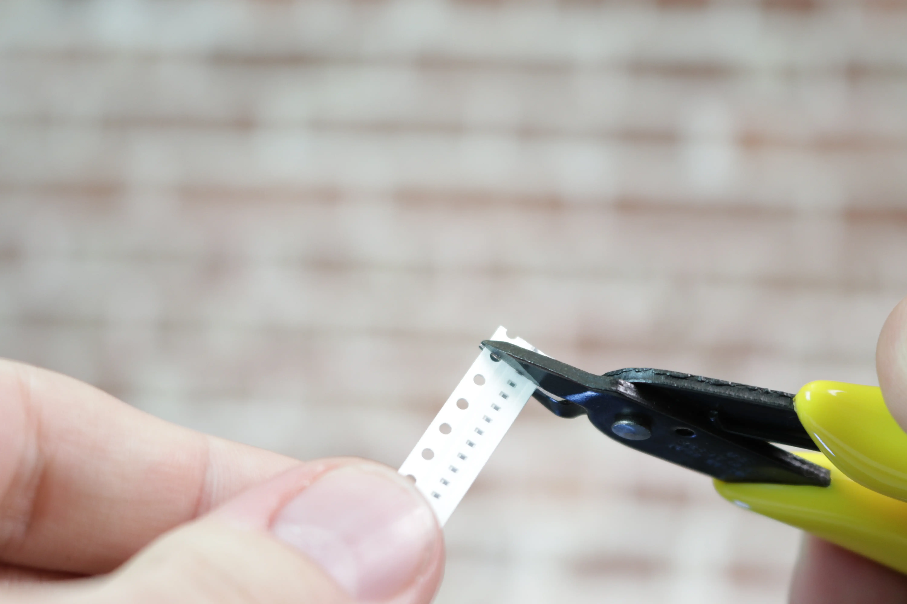

      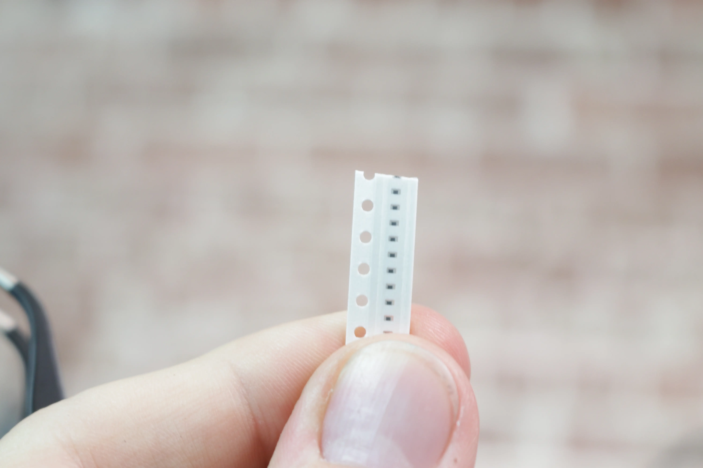

    !!! note "Using Film Extensions"

        [Film extensions](https://www.opulo.io/products/film-extensions) are strips of film with an adhesive end that allow you to load a feeder without wasting parts.

        First, remove the paper covering the adhesive on the yellow end of the extension

        
        

        Apply the adhesive end onto the film on the end of your tape. Make sure to press it down. Align the end of the adhesive with the end of the tape.

        
        

        Peel back a little bit of the film to get it started.

        

        Load the tape into the feeder, and guide the film out of the pick window.

        

        Trim the extension beyond a few centimeters beyond the peel gears.

        

        Continue to load the feeder starting from Step 7 below.

2. Peel back a few millimeters of film.

      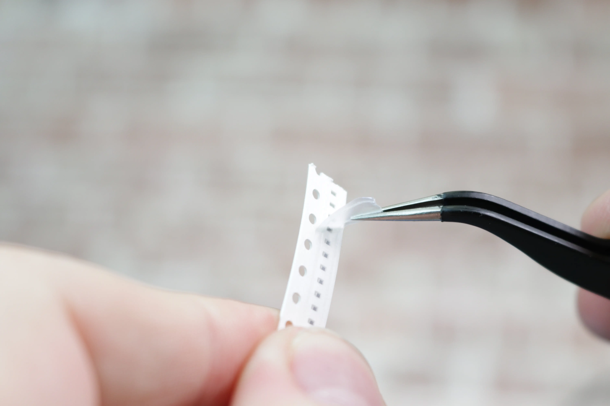

3. Feed the tape into the opening on the back of the feeder, film side up.

      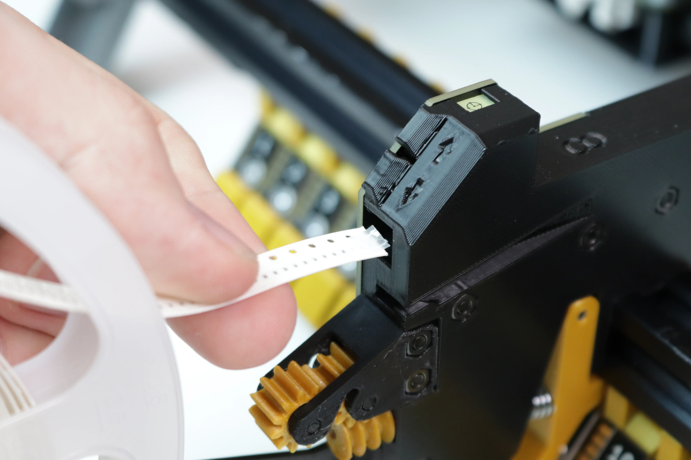

4. Align the semicircle in the tape to the first tooth on the drive wheel.

      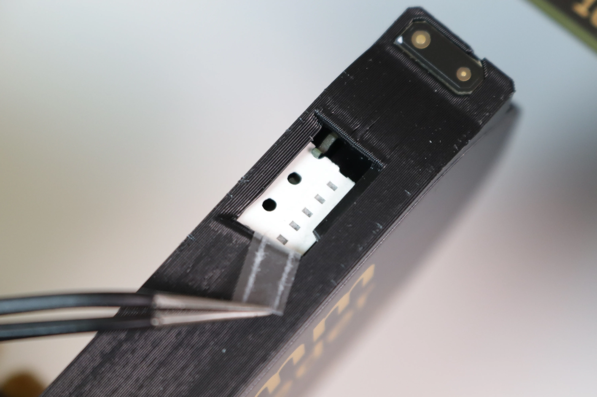

5. Guide the few millimeters of loose film out of the pick window.

      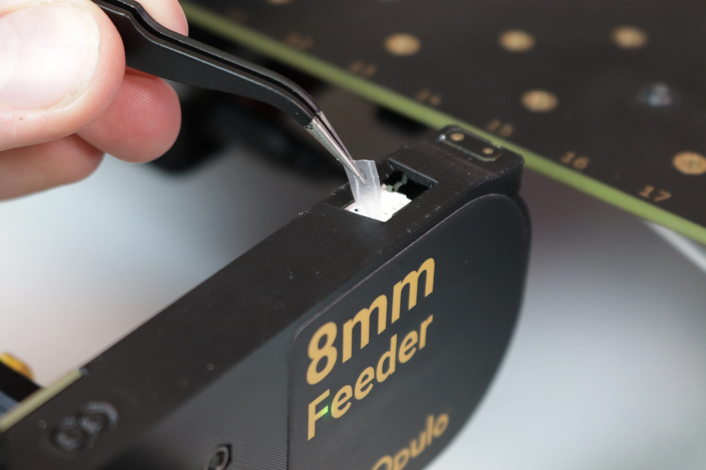

6. Press and hold the forward button while pulling upwards on film.

      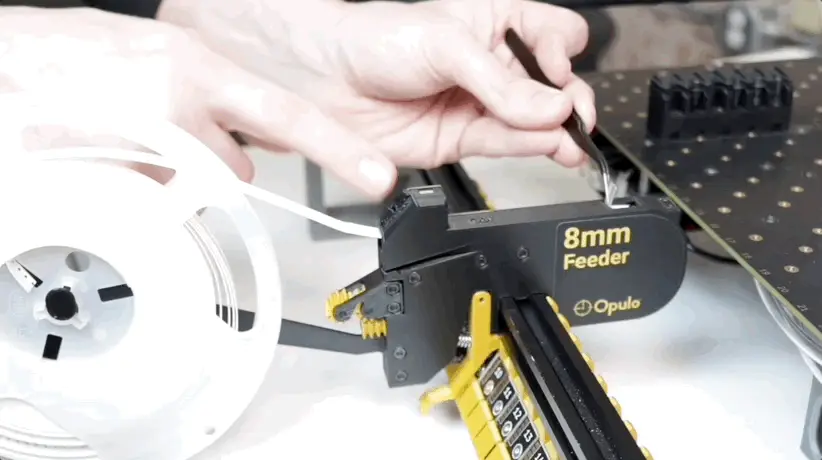

7. Wrap the film around the feeder and guide it into the slot leading to the peel gears.

      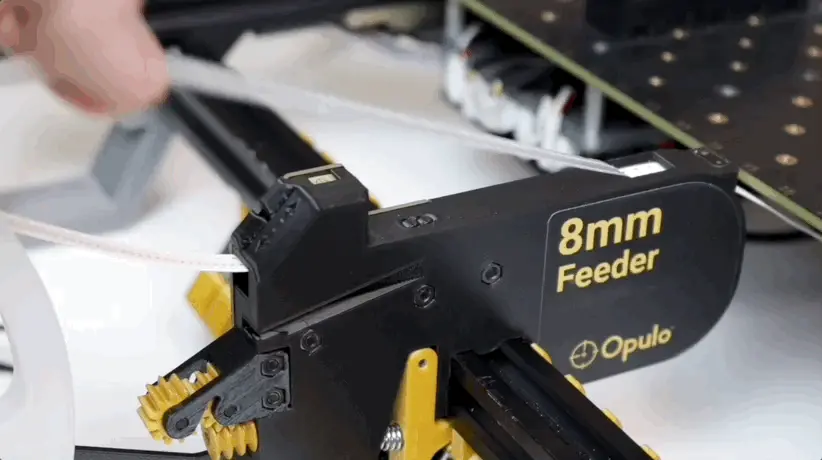

      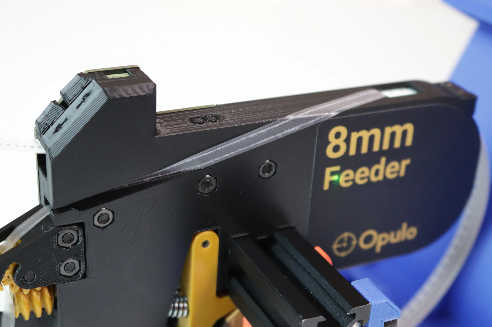

8. Press and hold both buttons until the status light turns yellow to switch into Peel mode.

    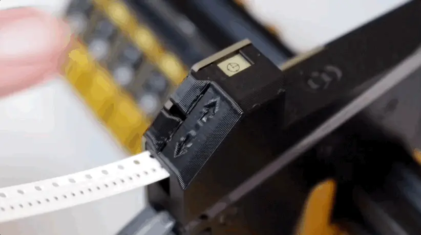

    !!! note "Toggling Modes"
        Pressing and holding both buttons toggles between Drive and Peel modes. A blue status light indicates you've switched to Drive mode, and a yellow status light indicates you've switched to Peel mode.

9. Press and hold the forward button to spin the peel motor, and feed film in between the two straight gears. Stop when the film is taut.

    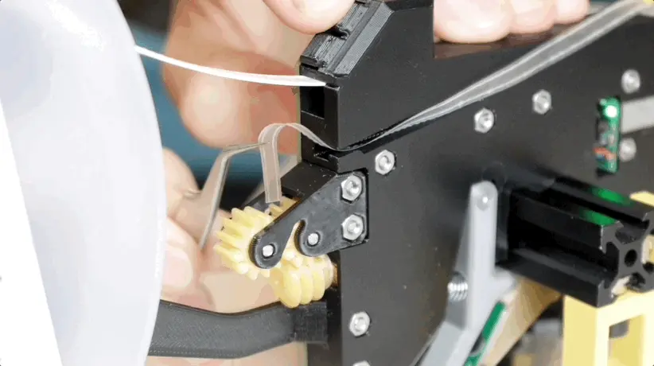

    !!! danger "Watch Out"
        Make sure that when you feed film into your peel gears, you guide the film away from the worm gear. It's important to prevent it from getting caught between the worm gear and a peel gear, as this can damage the peel gear. Ensure your film doesn't get caught when loading film.
        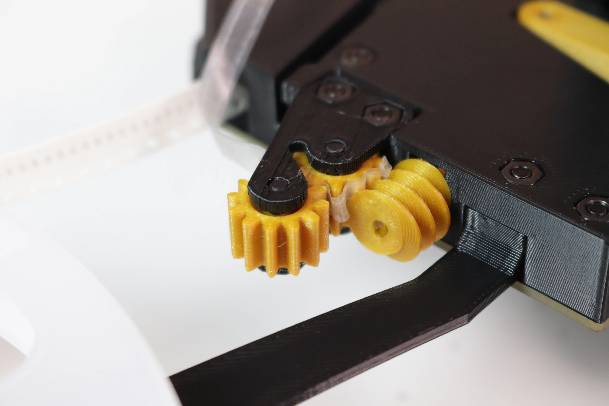
        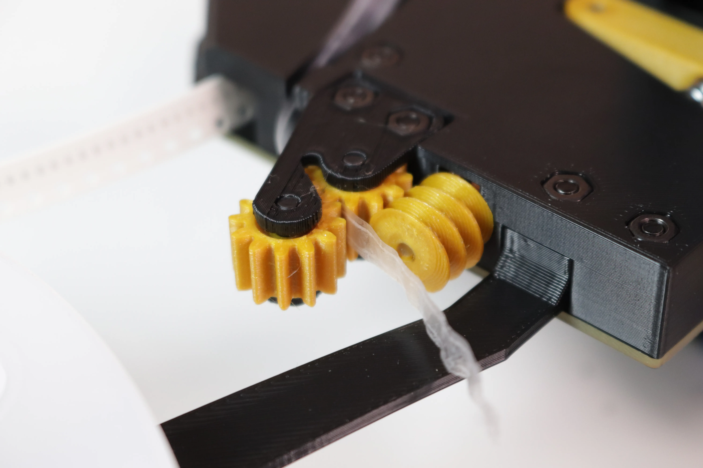

10. Check to make sure that the film is caught behind the peg that prevents the film from leaving the slot.

      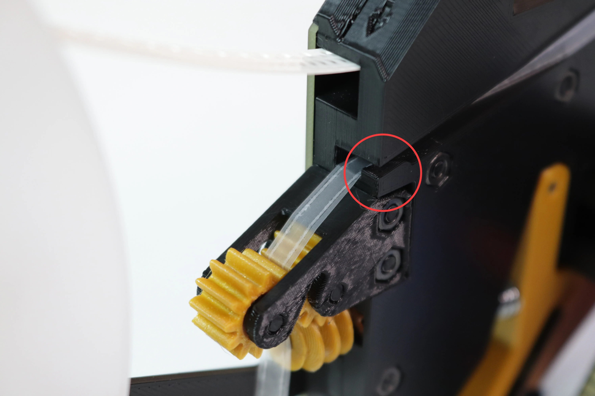

      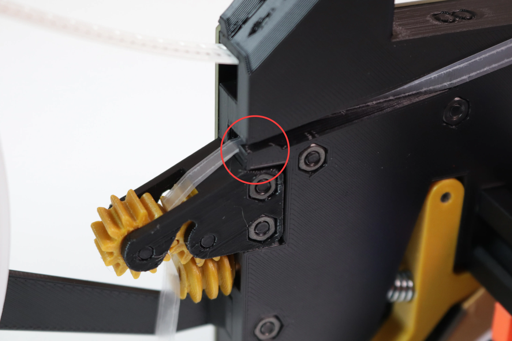

11. Tap the forward button to feed a part and ensure that the tape is loaded correctly. **You need to feed the feeder at least twice to ensure consistent feeding in the future.**

      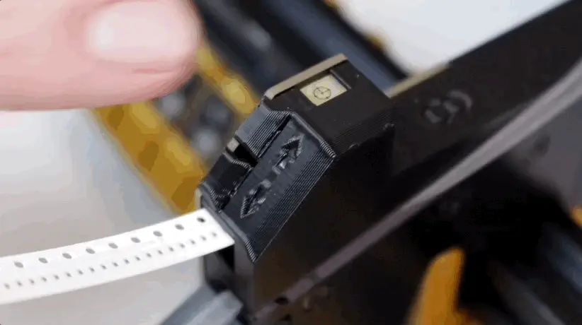

## 16mm and 24mm

1. Insert your tape into the opening on the back of the feeder. Push until you can see your tape visible in the pick window.

      

1. Lift the pick window and grab the film.

      
      

1. Press and hold the forward button on the feeder while pulling gently on the film to engage the tape with the drive wheel. Drive until parts become visible in the pick window, and when the film can reach the gold peel gears on the back of the feeder.

      

1. Press and hold both buttons on the feeder until the indicator light turns gold, indicating the feeder is in `Peel Mode`.

      

1. Press and hold the forward button on the feeder while feeding the film into the peel gears until it is sticking out the back side of the feeder.

      

1. While gently disengaging the peel gears by pressing back on the frame holding the top peel gear, pull the film through until you've taken up all the slack.

      
      

1. Inspect the film and make sure it's properly centered in the film guide right before entering the peel gears.

      

1. Your feeder should look the same as the image below.

      

!!! warning "Tape Exit Path"

      Tape exiting the feeder can lead into the tape entering the feeder. Depending on the geometry of the tape, they can catch and the exit tape can be fed back into the feeder. Be sure to guide your tape exiting to the side of the tape that is entering the feeder.

      
      

## Next Steps

Next, you'll [set pick position](../7-setting-pick-position/setting-pick-position.md).
