# Setting Pick Position

Now that you've loaded a component into the feeder, we'll fine-tune the feeder's position in OpenPnP and test picking a component.

1. Mount your prepared feeder(s) to your LumenPnP.
    { loading=lazy }

2. Re-home your LumenPnP if necessary to make sure its position is accurate.
    { loading=lazy }

3. In the `Feeders` tab, select your feeder from the list.
    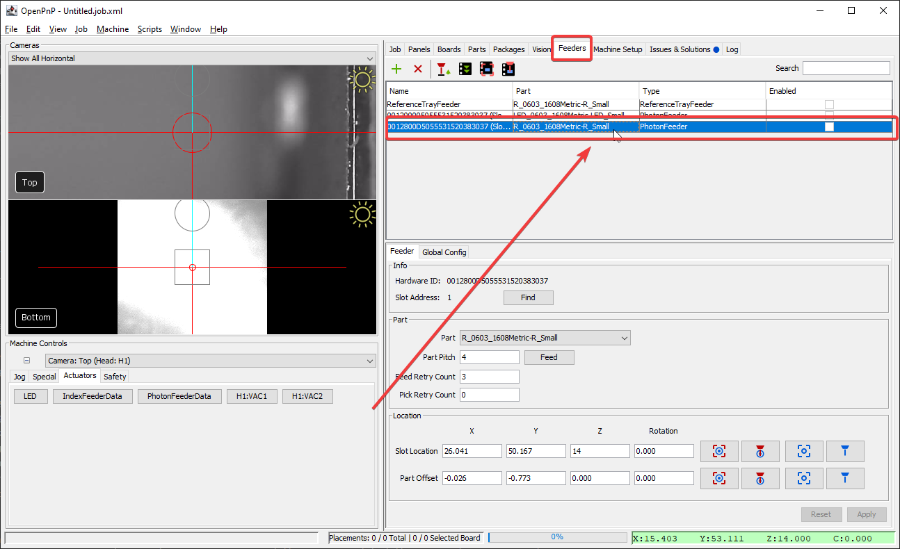{ loading=lazy }

4. Press `Find` to update which slot its installed in.
    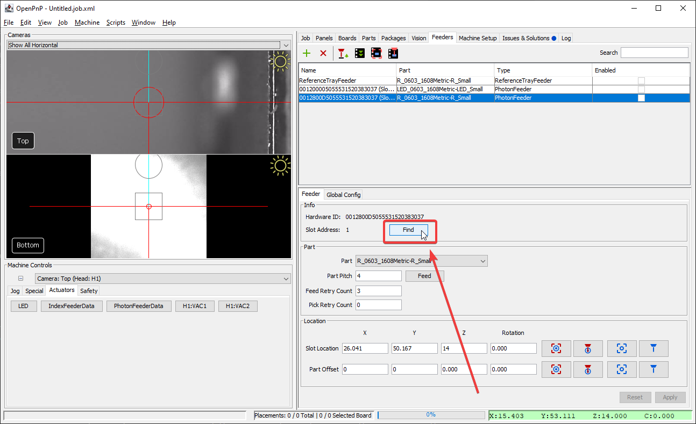{ loading=lazy }

5. Position the camera over the the feeder's location.
    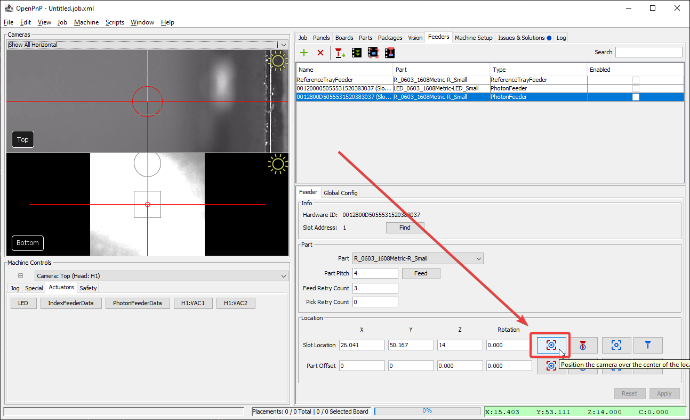{ loading=lazy }

6. Press The "Feed" button to make sure the feeder is working, and the tape is indexed properly.
    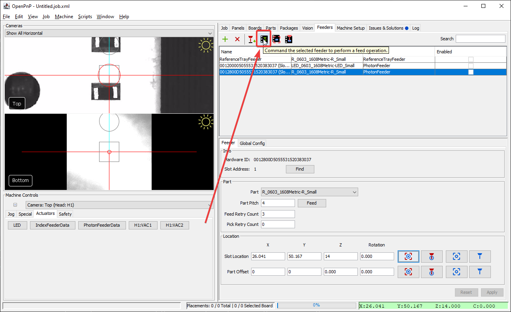{ loading=lazy }

7. Use the camera view to precisely target the center of the **slot** for one of the components.
    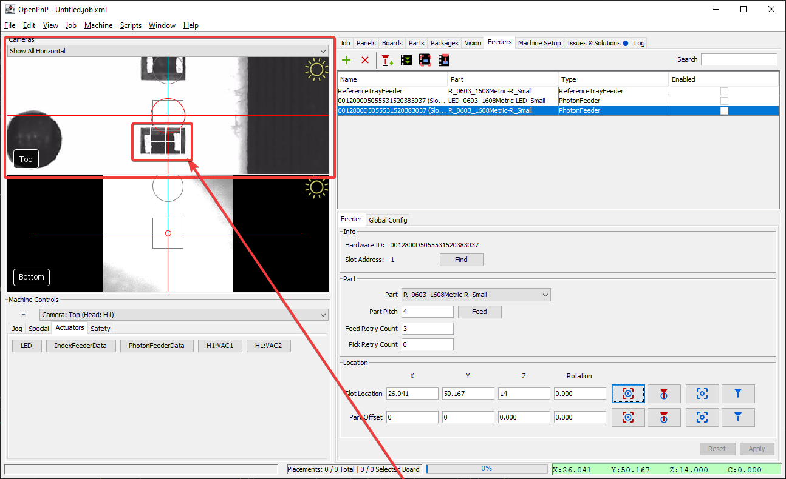{ loading=lazy }

8. Press the "Capture Camera Location" to save the camera's position to the **Part Offset** settings.
    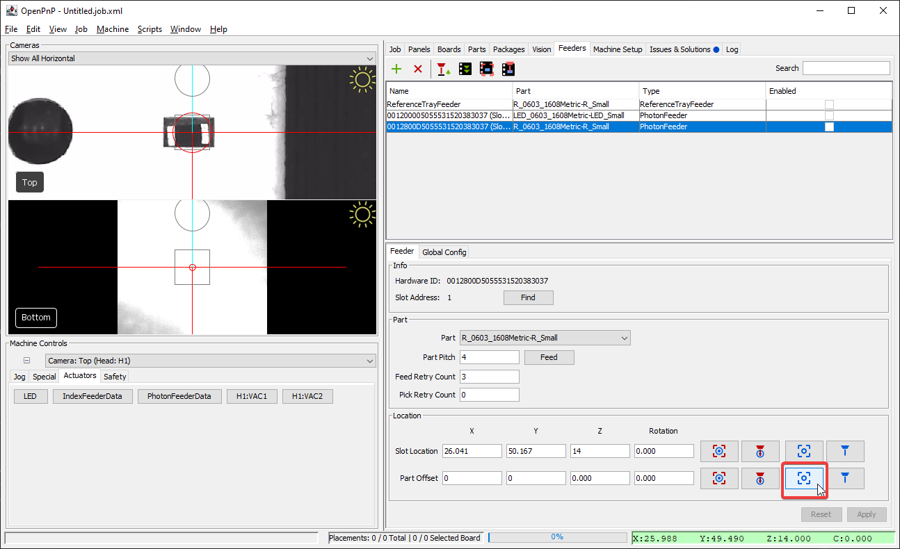{ loading=lazy }

9. Confirm that the Slot Location's Z-axis position is around `14mm`. We don't want the nozzle tip to crash into the feeder while fine-tuning it, so a higher number is better to start.
    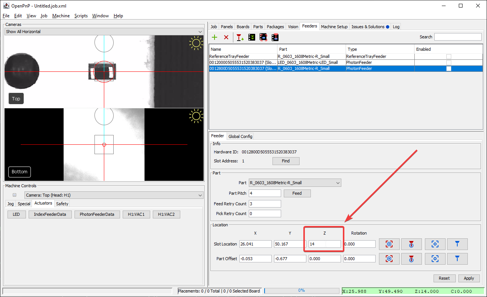{ loading=lazy }

10. Select the correct toolhead you'll be using to pick this component from the `Machine Controls` dropdown.
    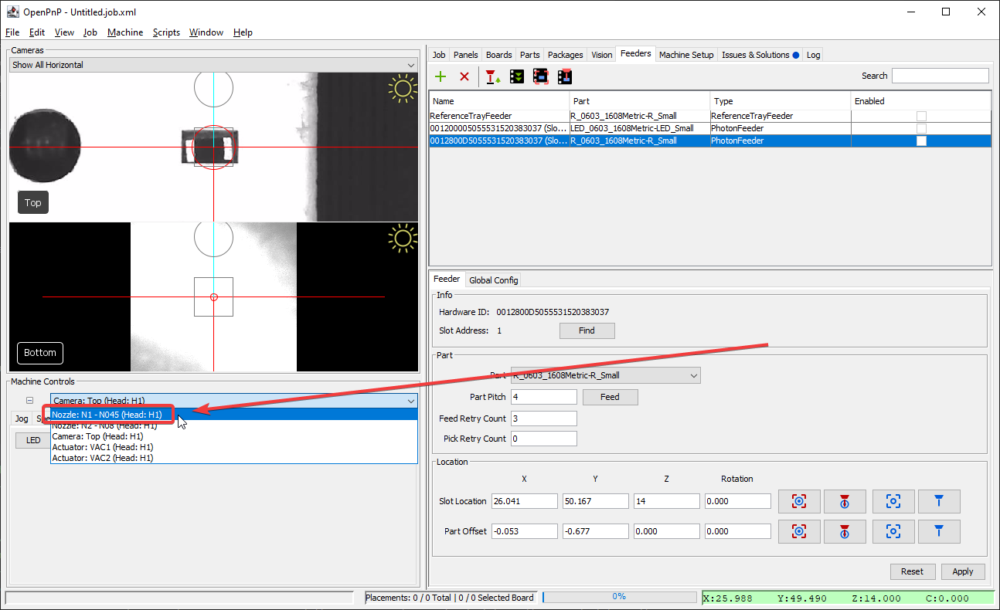{ loading=lazy }

11. Position your tool over the **Part Offset** location. Your nozzle tip should be hovering above the component. If the nozzle is not aligned correctly, you should adjust your [nozzle offset](../../openpnp/calibration/6-nozzle-offset/index.md).
    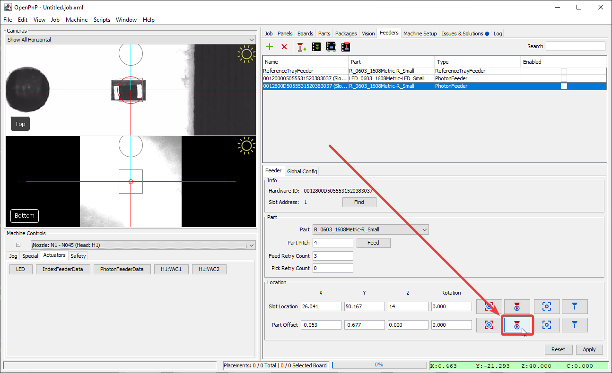{ loading=lazy }

12. Use the `Jog` controls to lower the nozzle tip until it is just touching the component in the slot.
    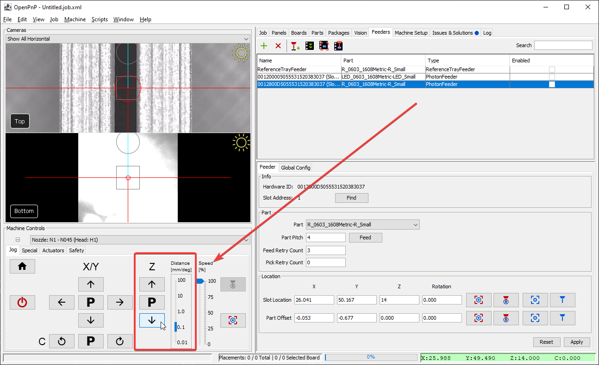{ loading=lazy }

13. Save the z-axis height with the "Capture Tool Location" button.
    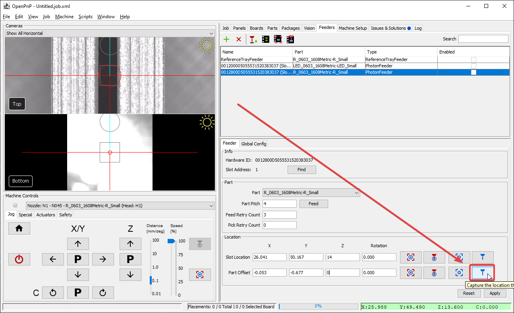{ loading=lazy }

14. Click `Apply` to save the settings.
    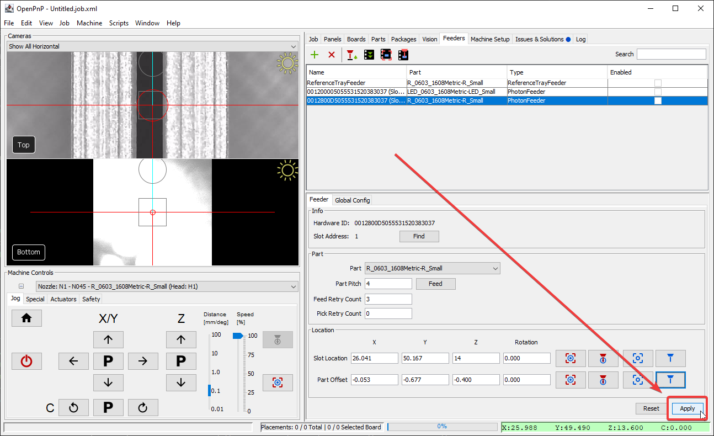{ loading=lazy }

15. Jog your machine away from the feeder.
    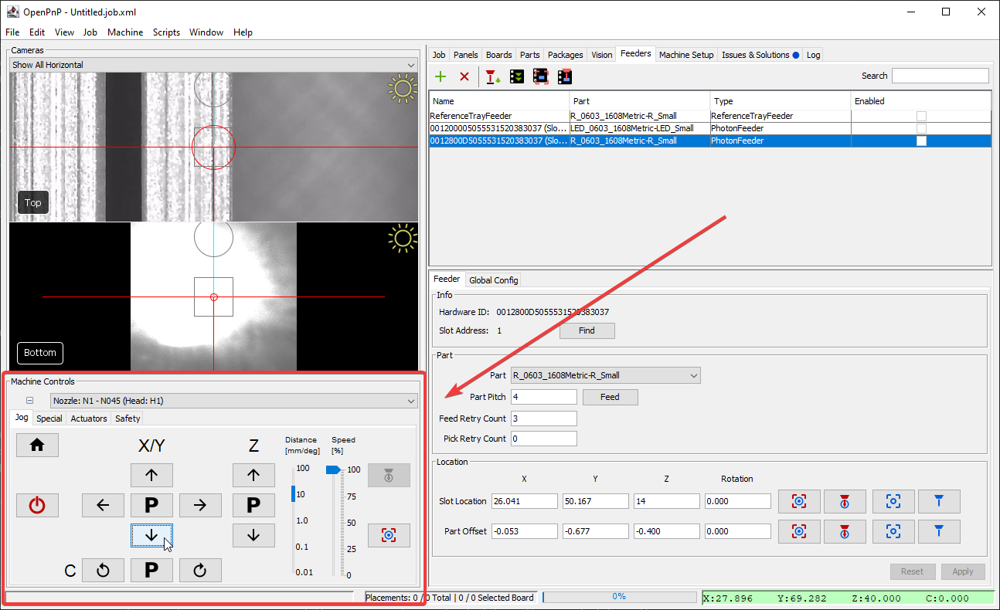{ loading=lazy }

16. Use the "Pick" button to test picking the component. If it isn't picked appropriately you may need to tune the Part Offset, especially the Z-axis.
    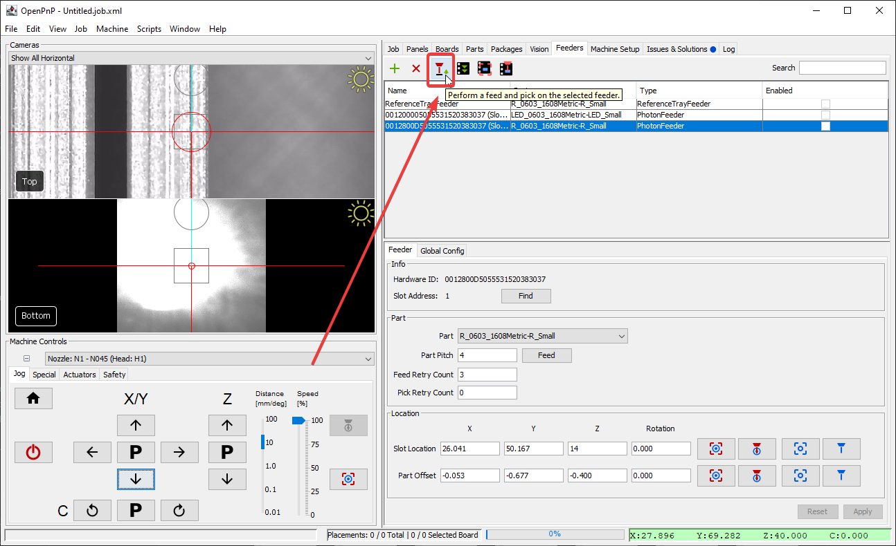{ loading=lazy }
17. Simply turn off the vacuum in `Actuators > H1:VAC1 > Off` to recycle your component.
18. Repeat this tuning with each of your feeders, and then you'll be ready to start a job!

## Next Steps

If you came here from the FTP documentation, your next step is [Setting up the Board.](../../openpnp/ftp/2-setting-up-the-board/index.md)
