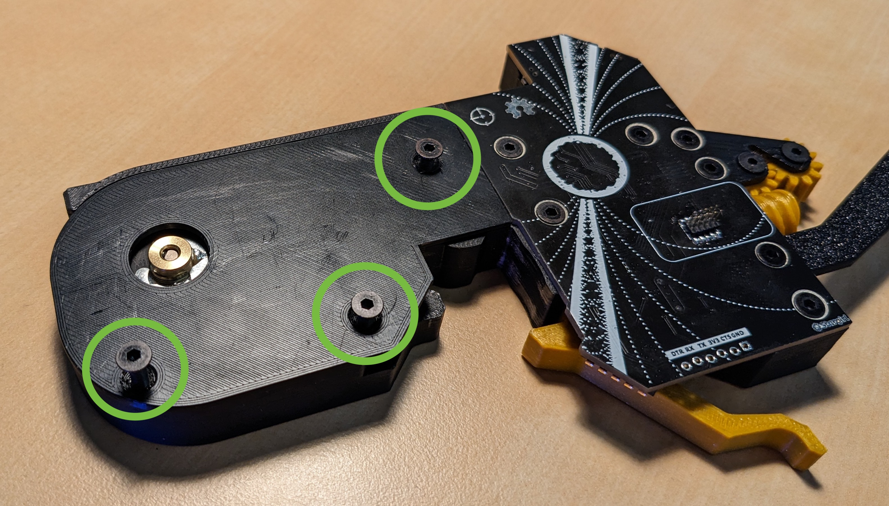
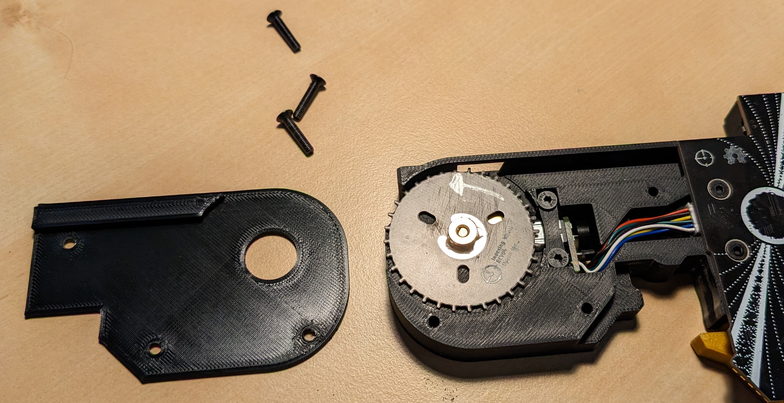
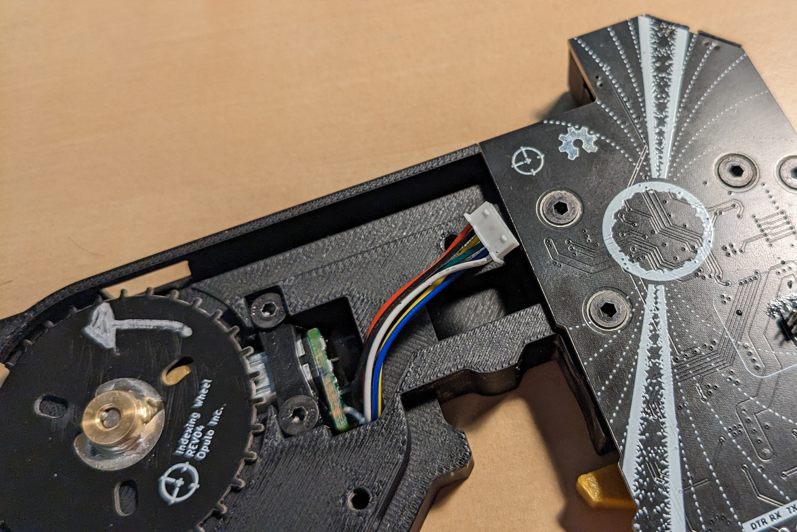
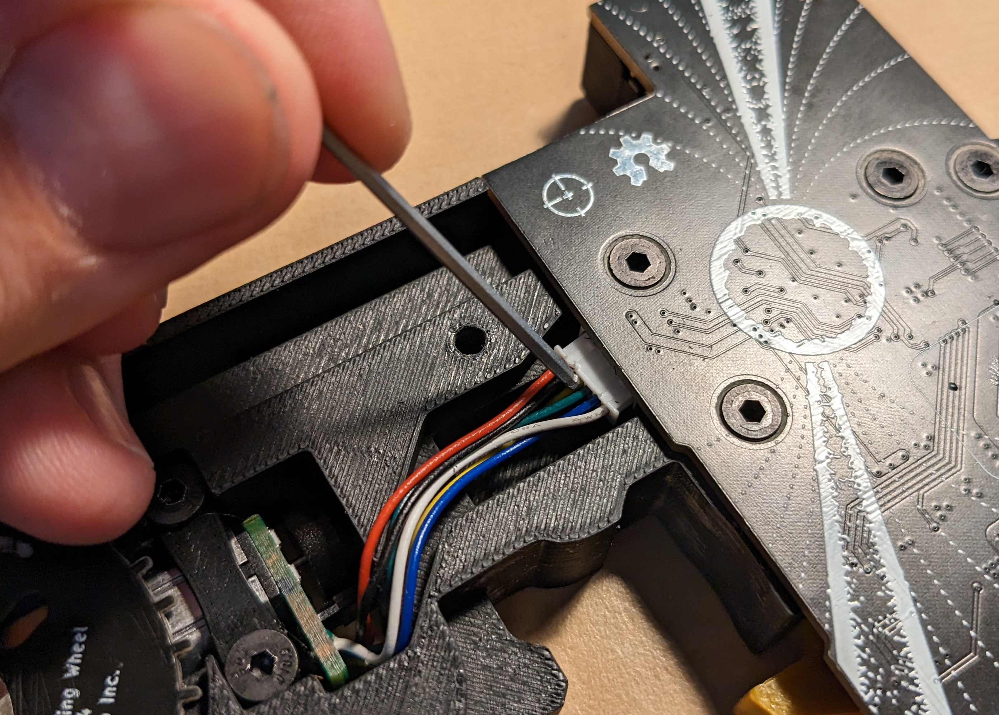
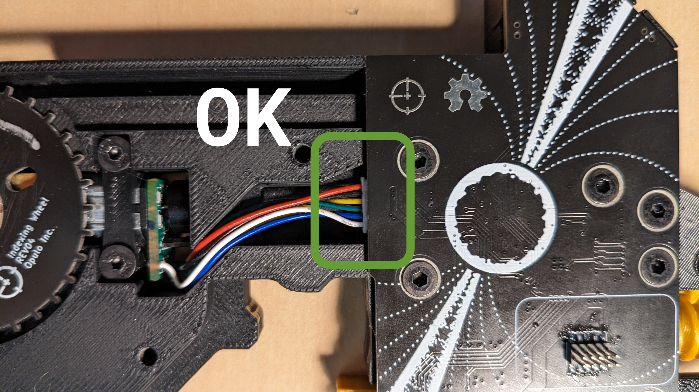
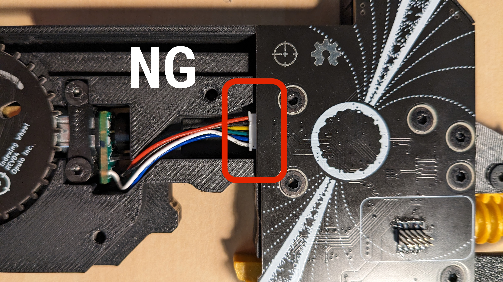

# Troubleshooting

## Red Light On Boot

A red light as soon as the feeder is connected to power means that the feeder was unable to find a slot.

- Check the spring pins and ensure that they're all straight and extended the same length.
- Try reseating the feeder a couple times. In rare instances, just the angle/way of putting dropping the feeder down can cause power to come up before the 1-Wire pin is connected.
- Try moving the feeder to a different slot. Does it still turn red?
    - If so, it's probably an issue with the feeder.
        - Check the spring pins on the feeder PCB. Are they all straight and the same length? Gently adjust them with tweezers if need be.
    - If not, it's an issue with the slot.
        - Check the pads of the slot. Are they clean and free of debris? Power off your machine and wipe them clean, then try again.

If none of these steps fix the issue, please email us at [support@opulo.io](https://opulo.io/pages/contact-support) and we'll help you out!

## Red Light After Feed

A red light after attempting to feed with either the buttons or through OpenPnP means that feeding failed. It can take a few seconds for the light to come on after commanding the feed.

- Try feeding the feeder using the forward button **with no tape loaded**. Does the red light still come on?
    - If so, try [reseating the drive motor cable](#reseating-the-drive-motor-cable).
    - If not, you probably had a tape jam. Try [reloading tape](../6-loading-tape/loading-tape.md) and make sure the tape and film's path away from the feeder is clear of obstructions.

If none of these steps fix the issue, please email us at [support@opulo.io](https://opulo.io/pages/contact-support) and we'll help you out!

### Reseating the Drive Motor Cable

 1. Remove the drive motor cover using the allen key set that came with your LumenPnP.
    
    
 2. Remove the cable plugged into the motherboard.
    
 3. Plug it back in in the orientation shown (shiny crimp side should be facing down), and push it in all the way using a small allen key.
    
    
    
 4. Bolt the drive motor cover back on, and test again.
