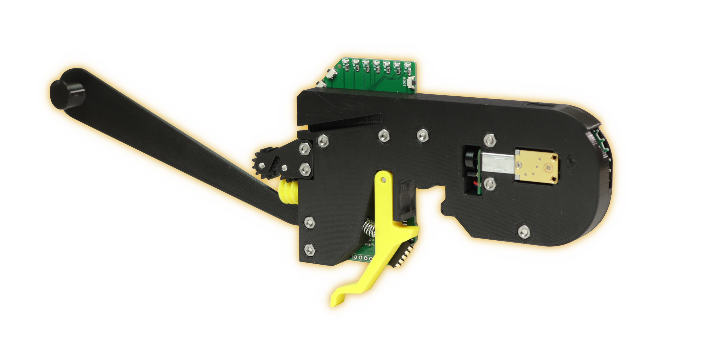

# Feeder Overview

This is the Opulo 8mm Feeder:

The 8mm feeder is an open source SMT component tape feeder that can reliably feed components as small as 0402. It is designed to work with a LumenPnP Pick and Place Machine, but can mount onto any 20mm X 20mm v-slot extrusion.

The feeder uses the open source Photon feeder controller firmware, and talks the Photon protocol over RS-485 to any Marlin host with RS-485 support.

## Loading Tape

This video shows how tape is loaded into the feeder, and the functionality of the buttons.

<iframe width="560" height="315" src="https://www.youtube.com/embed/5qwbSq9e7dI" title="YouTube video player" frameborder="0" allow="accelerometer; autoplay; clipboard-write; encrypted-media; gyroscope; picture-in-picture" allowfullscreen></iframe>

!!! danger "Keep In Mind"
        Don't worry if something in the video doesn't look exactly like what you have in the box. We’re constantly tuning and tweaking things to make them better and easier to use, so you might find things look slightly different.

### Help

If you find that there's something unclear in this documentation, please [submit a ticket on Github](https://github.com/opulo-inc/docs) about it! You can also file an issue using the link in the upper right of any page on this site. We're trying to make this as clear and understandable as possible, so every issue you tag helps us make it better for everyone else. You can also check out the [Discord server](https://discordapp.com/invite/TCwy6De) and ask questions to the community.

If you get stuck, please don't hesitate to send us an email at support@opulo.io, or use our [support form](https://opulo.io/pages/contact-support).

## Next steps

Before using the feeders, you'll [install the slot harness](../install-harness/index.md).
