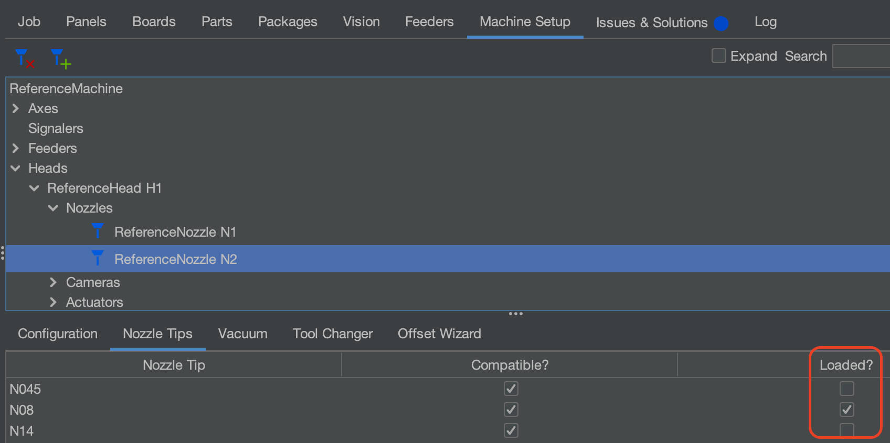
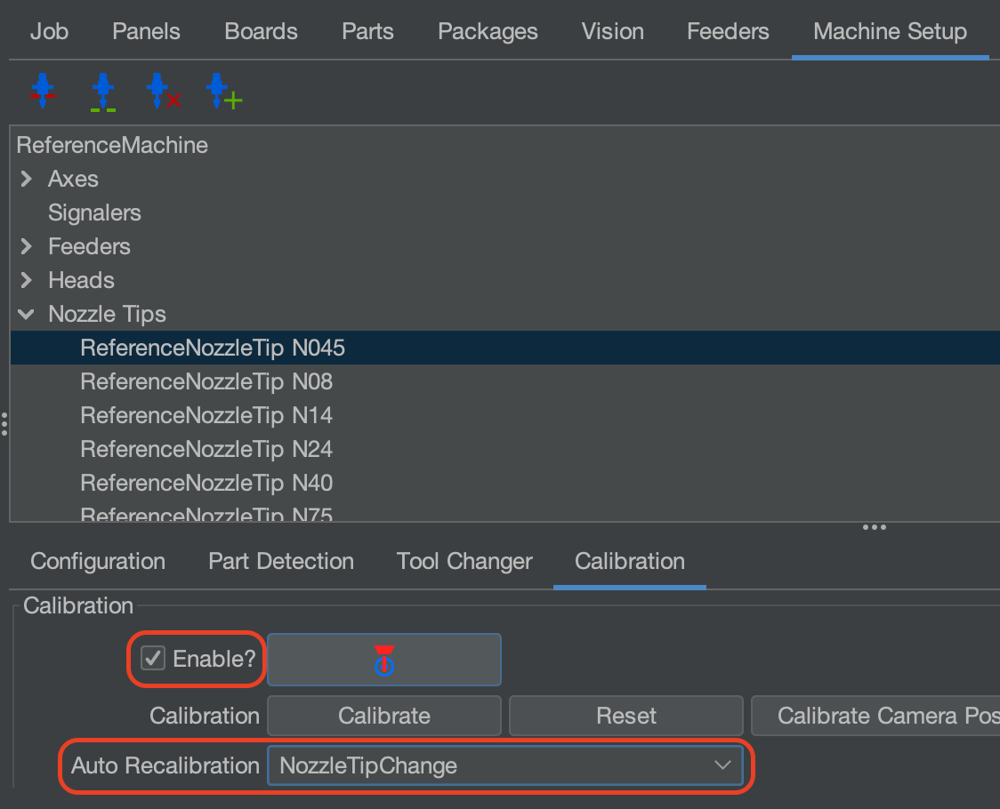

# Enable and Load Nozzle Tip on Second Nozzle
> **_NOTE:_** Ensures the N2 nozzle will be checked when homing your LumenPnP.

Confirm the Nozzle Tip you want to use is loaded on the N2 Nozzle.

1. Go to `Machine Setup` > `Heads` > `Reference Head H1` > `Nozzles` > `ReferenceNozzle N2`
2. Once there, click the checkbox for the Nozzle Tip that you have equiped under the `Loaded?` section.

Next, confirm the Nozzle Tip is enabled

1. Go to `Machine Setup` > `Nozzle Tips` > `ReferenceNozzleTip N##` > `Calibration Tab`
2. Make sure the `Enable?` checkbox is checked for the nozzles you are using. 

!!! note "Auto Recalibration"
        While you are here, make sure that you have your `Auto Recalibration` set to `Nozzle Tip Change`.

Home the LumenPnP again, and it will now check the second nozzle during its homing sequence.