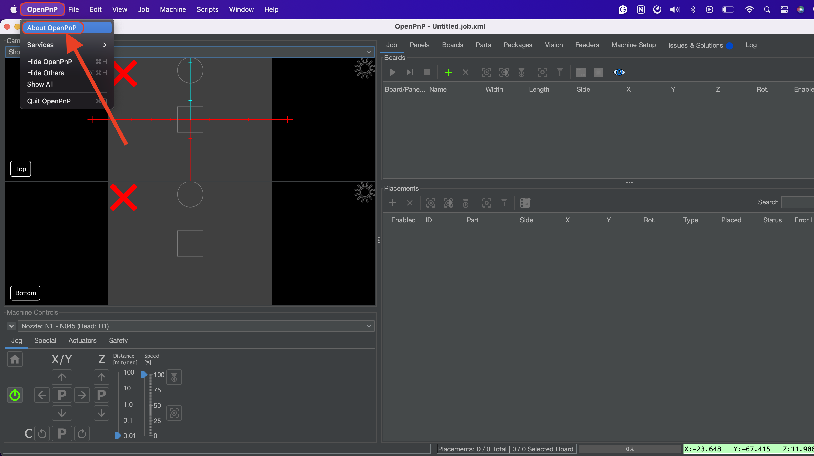
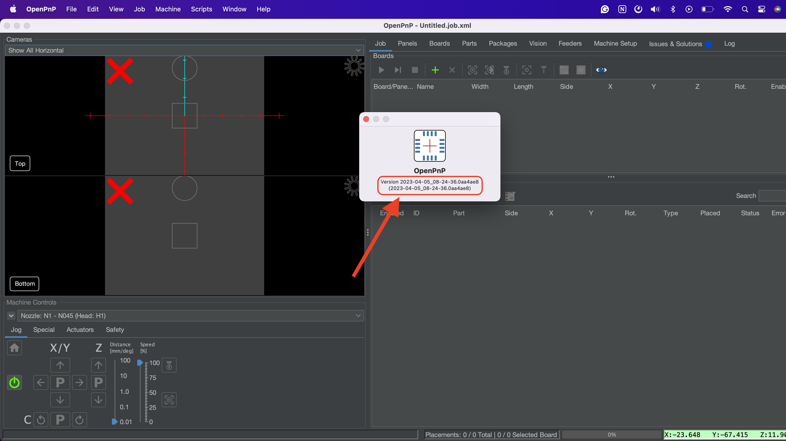
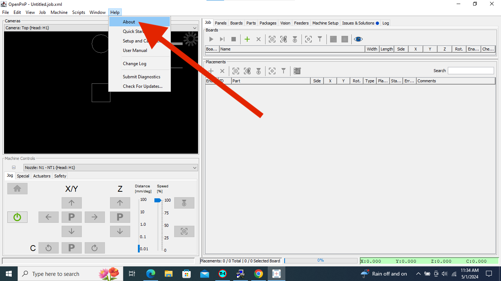
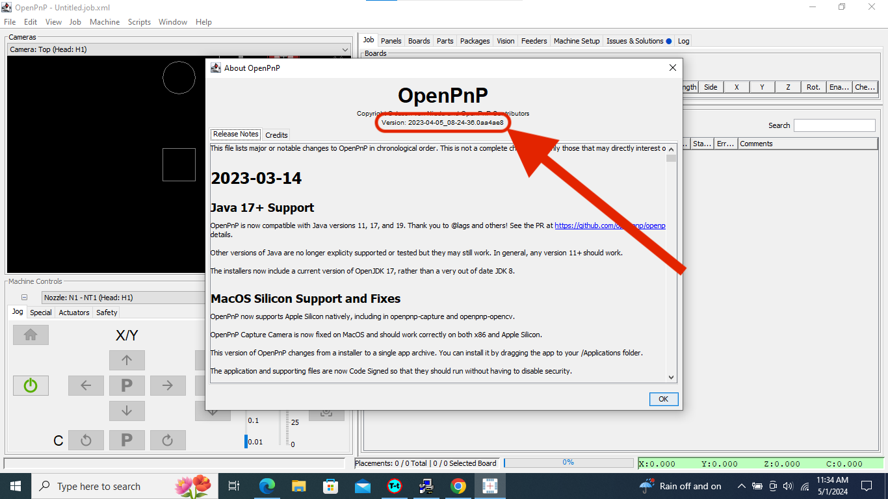
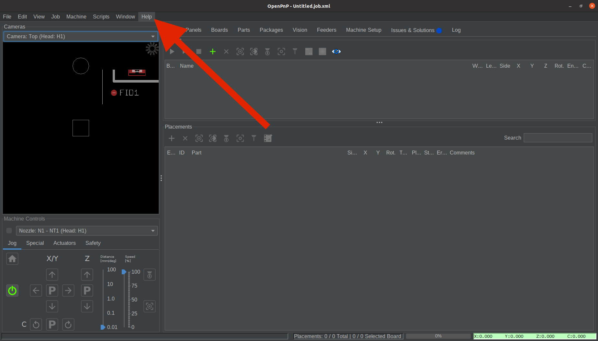
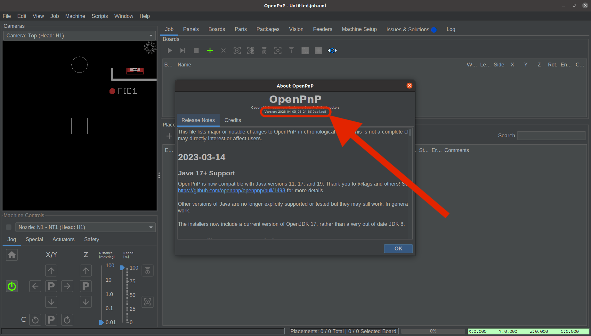

# Find OpenPnP Version

If you want to find out what version of OpenPnP you are using, please see the appropriate operating system below to find the proper pathway.

## MacOS

1. Go to the top left of the screen and click on `OpenPnP` > `About OpenPnP`.

      

2. The version will be listed as a date:

      

## Windows

1. Go to the top of the program and click on `Help` > `About`.

      

2. The version will be listed as a date:

      

## Linux

1. Go to the top of the program and click on `Help` > `About`.

      

2. The version will be listed as a date:

      