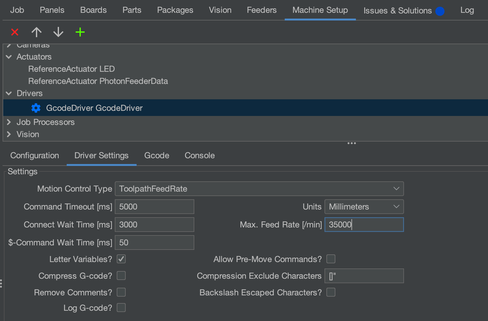

# Updating Machine Speed

If you'd like to update the max speed that OpenPnP commands the LumenPnP to run at, this is a guide for how to adjust it properly.

!!! danger "Avoid Axis Settings"
         Do not change settings in the ReferenceControllerAxis sections of your Machine Setup. These should be left as they are.

         Marlin does an exceptional job of managing acceleration, jerk, and speed control. OpenPnP tries to brute-force its own settings into the gcode stream, which ends up being confusing and disruptive.

1. Go to `Machine Setup` > `Drivers` > `GcodeDrivers` > `Driver Settings` > `Max. Feed Rate [/min]`
   
2. This field is the correct place to update the max movement speed of the LumenPnP for most operations.

!!! note "Marlin Max Feed Rate"
         Note that the LumenPnP's firmware also has its own max feed rate. If you set the OpenPnP field to be higher than Marlin's allowed max, it will simply run at its highest allowed speed.
         If you'd like to change the firmware settings, check out [Marlin's M203 command documentation](https://marlinfw.org/docs/gcode/M203.html).