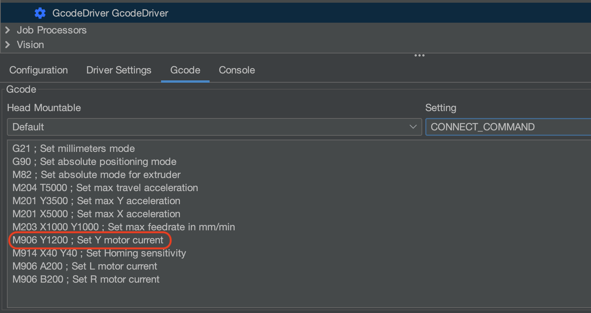
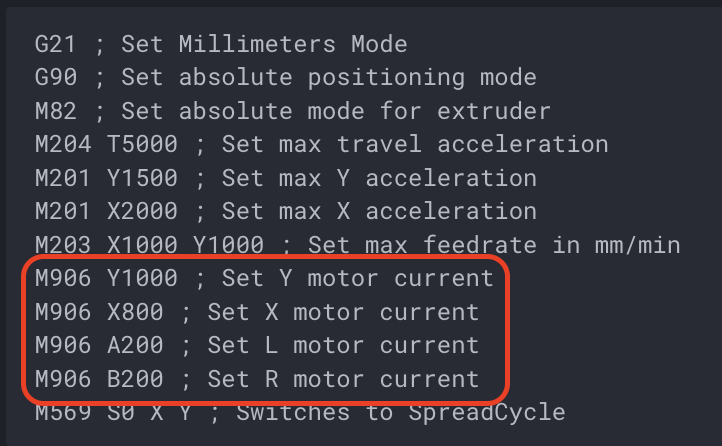
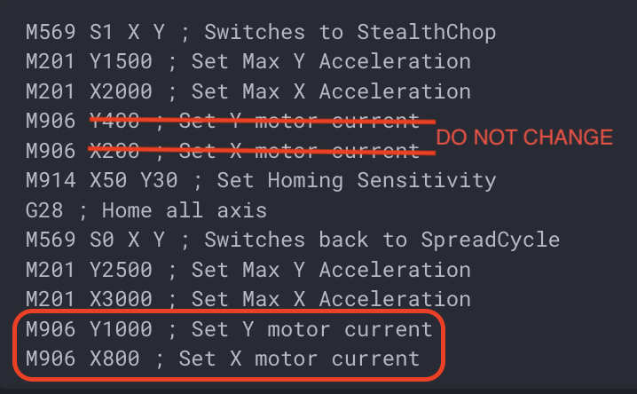

# Change Motor Current

The LumenPnP uses stepper motor drivers that allow software-defined current control. The default values work great for normal LumenPnP operation, but if you're troubleshooting an issue or want to experiment with settings, this guide will show you how to update your motor current.

!!! note "M906 Command"
        Current is set using the M906 Gcode command. To set current for an axis, you use M906, followed by the letter designating the axis, followed by the number of milliamps that should be used for the axis. For example, to set the X axis to 800 milliamps and the Y axis to 1200 milliamps, I would use `M906 X800` and `M906 Y1200`.

        The letters `A`, `B`, and `C` are used for the Left Nozzle, Right Nozzle, and Aux drivers, respectively.

        For more information, check out [Marlin's M906 documentation](https://marlinfw.org/docs/gcode/M906.html).

## LumenPnP V3.0.5 or earlier

1. In OpenPnP, navigate to `Machine Setup` > `Drivers` > `GcodeDrivers` > `Gcode` Tab > `Setting`: `CONNECT_COMMAND`
2. Look to see if your config already has an `M906` line of gcode for the axis you're updating. If there is already a command, simply update the current value in that line. If there isn't an `M906` line add it at the end.
   
3. We recommend that you do not exceed 1.5 amps (1500 milliamps) for the X or Y axis.

## LumenPnP V3.1.0 or later

For LumenPnP v3.1+, you will to update Gcode in **two places**.

1. Update your `CONNECT_COMMAND`.
    1. In OpenPnP, navigate to `Machine Setup` > `Drivers` > `GcodeDrivers` > `Gcode` Tab > `Setting`: `CONNECT_COMMAND`.
    2. You should already have an `M906` line of gcode for the axis you're updating. Update the current value in that line to the new current value.
    
2. Update your `HOME_COMMAND` (Only required if you're updating your X or Y axis).
    1. Choose `HOME_COMMAND` from the `Setting` dropdown.
    2. This section has **two groups of M906 commands**. One comes *before* the line that says `G28 ; Home all axis`, and one comes after.
    3. **Do not** change the M906 gcode that is before the G28 command. These lines set the current for proper homing.
    4. Only change the M906 commands after the G28 command. Use the same settings as you did in the `CONNECT_COMMAND`.
    

We recommend that you do not exceed 1.5 amps (1500 milliamps) for the X or Y axis.