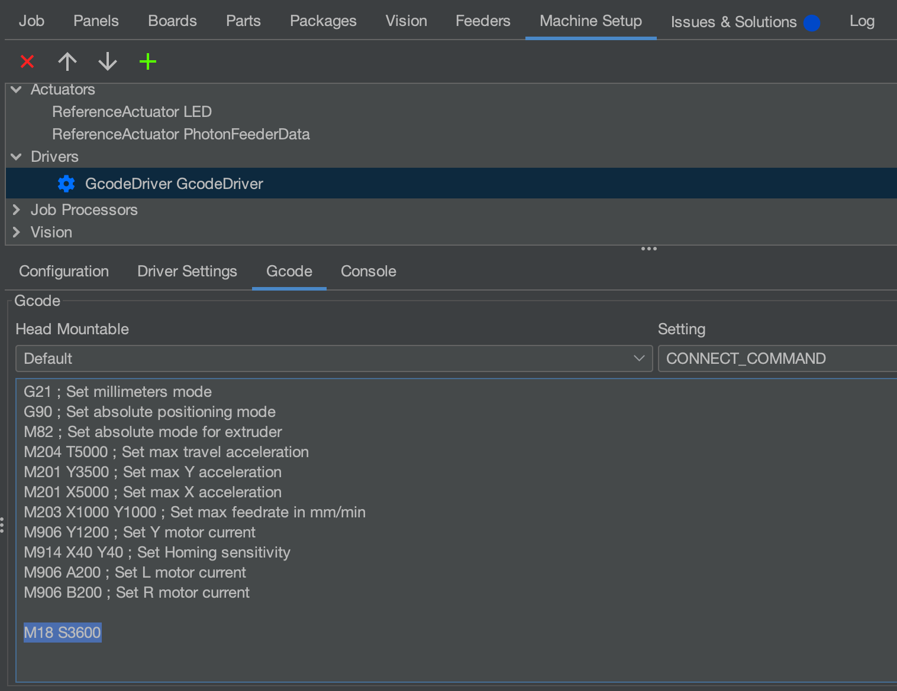

# Set Motor Disable Timeout

The LumenPnP will disable its motors after a period of inactivity to prevent the steppers from having amps of current driven through them unnecessarily. This guide shows how to update this timeout period to be whatever you'd like.

1. Go to `Machine Setup` > `Drivers` > `GcodeDriver` > `Gcode` Tab > `CONNECT_COMMAND`.
2. Add the following line at the end of the Gcode: `M18 S<seconds>` and replace `<seconds>` with the number of seconds you'd like the motors to stay powered on for after going idle.
   
3. For more information, check out the [Marlin M18 command documentation](https://marlinfw.org/docs/gcode/M018.html).