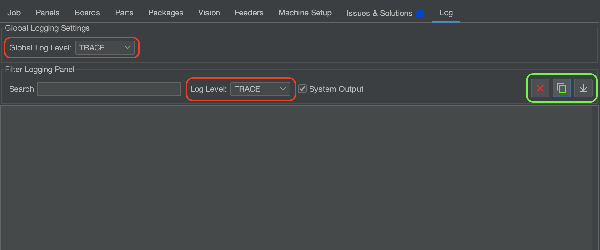

# Collecting OpenPnP Logs

See what G-code is communicating to and from the LumenPnP. These logs give better insight into what is actually happening with the Gcode when using OpenPnP. 

1. Go to the `Log` Tab that is located in the top right of OpenPnP.
2. Switch `Global Log Level` and `Log Level` to `Trace`.
3. OpenPnP is now keeping a log of the Gcode communication.
4. To save your new log report, go back to the `Log` Tab and click on the green icon. This will copy the log to your clipboard.
5. Open any text editor and paste your log inside a new file.
    