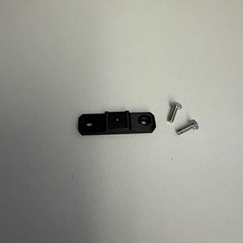
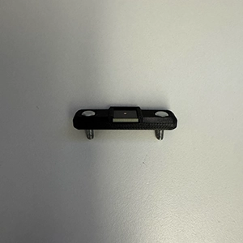
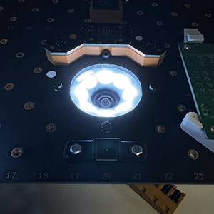
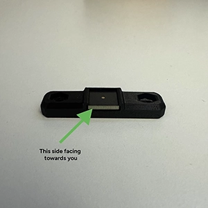
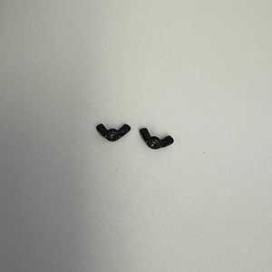
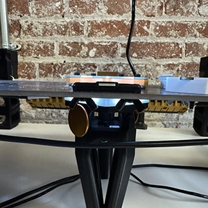

# Secondary Fiducial Assembly Kit

## Installation Instructions

1. Remove the `Secondary Fiducial Bracket` and the two `M3x10mm Hex Head Screws` from the kit.

    

2. Insert the two `M3x10mm Hex Head Screws` into the `Secondary Fiducial Bracket`.

    

3. Place the partially assembled `Secondary Fiducial Bracket` in slots 19 and 21 of row A on the Primary Staging Plate. 

    

    !!! danger "Please Note"
        One side of the PCB is exposed, while the other side is covered by the bracket. Make sure to face the side that is exposed towards you while installing. The side covered by the bracket should be facing the Ring Light. It makes it easier to see when the nozzle tip touches the secondary fiducial during calibration.

    

4. Remove the two `M3 Wing Nuts` from the kit.

    

5. Secure the `Secondary Fiducial Bracket` in place by attaching the two `M3 Wing Nuts` from the kit.

    

!!! success "Installation is complete!"

Now you are ready to use the latest recommended 'Issues and Solutions' docs guide for the LumenPnP.