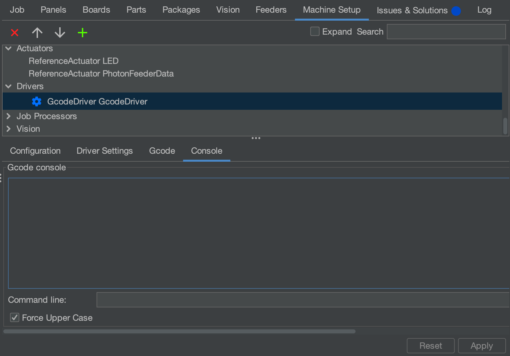
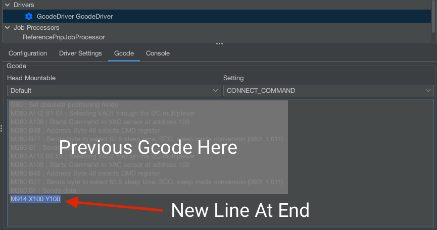

# Tune Sensorless Homing

If your machine is homing the X or Y axis too early, or not registering that it's hit the end of travel, use this guide to tune sensorless homing.

!!! note "M914 Command"
        Sensorless homing sensitivity is set using the M914 Gcode command. For more information, check out [Marlin's M914 documentation](https://marlinfw.org/docs/gcode/M914.html).

1. Connect to your machine.
2. In OpenPnP, navigate to `Machine Setup` > `Drivers` > `GcodeDriver` > `Setting`: `CONNECT_COMMAND`.
3. Find the line of Gcode starting with `M914`. Find the number after the axis you're trying to tune. This number is your starting point.
4. Now, navigate to `Machine Setup` > `Drivers` > `GcodeDriver` > `Console`.
   
5. Test homing the axis in question by sending a line of Gcode with the console. For the X axis, send `G28 X`. For the Y axis, send `G28 Y`.
6. If the axis doesn't reach the end of travel and "homes" too early, we need to make homing **less sensitive**. This is done by **lowering** the value in the M914 command.
    1. In the Console, send `M914 <AXIS><NEW_VALUE>` where `<AXIS>` is either `X` or `Y`, and `<NEW_VALUE>` is slightly less than the starting point number you found in your `CONNECT_COMMAND`. For example, `M914 X35`.
    2. Try homing the axis again.
    3. If it still homes too early, repeat setting the value lower and rehoming until it homes correctly.
7. If the axis reaches the end of travel and doesn't stop moving the motors, we need to make homing **more sensitive**. This is done by **raising** the value in the M914 command.
    1. When Marlin fails to home an axis after a certain amount of time, it halts as a safety precaution. You might need to reset your LumenPnP and reconnect to continue.
    2. In the Console, send `M914 <AXIS><NEW_VALUE>` where `<AXIS>` is either `X` or `Y`, and `<NEW_VALUE>` is slightly more than the starting point number you found in your `CONNECT_COMMAND`. For example, `M914 X45`.
    3. Try homing the axis again.
    4. If it still doesn't home correctly, repeat setting the value higher and rehoming until it homes correctly.
8. After you've found good values, add the new values to your `CONNECT_COMMAND` in the format `M914 X<NEW_VALUE> Y<NEW_VALUE>`. If there's **already** a line with `M914` in your `CONNECT_COMMAND`, edit that one instead.
   
9. Hit "Apply" to save your changes. The new sensorless values will be applied the next time you connect to your machine from OpenPnP.