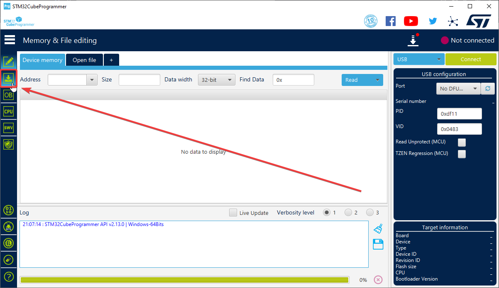
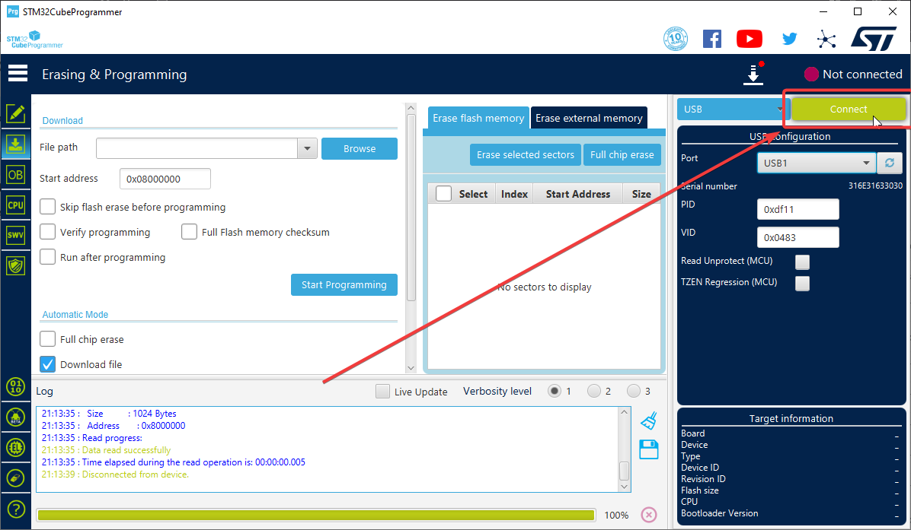
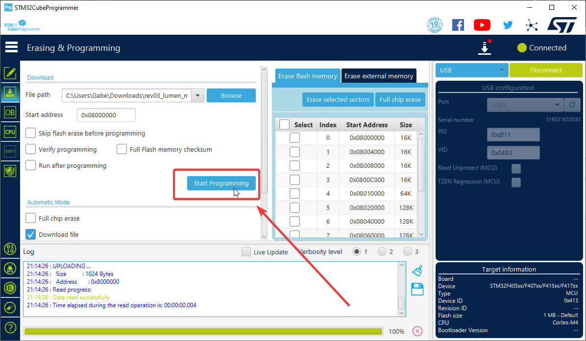
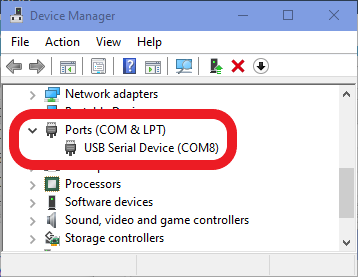
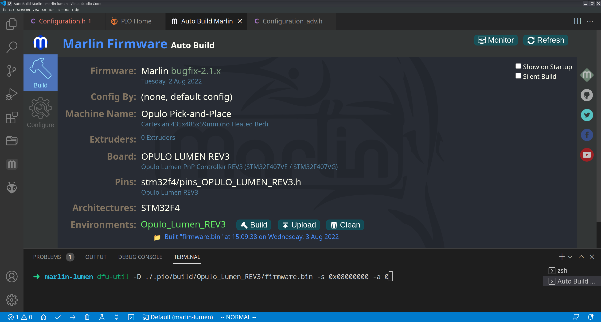
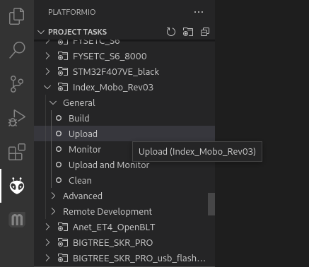
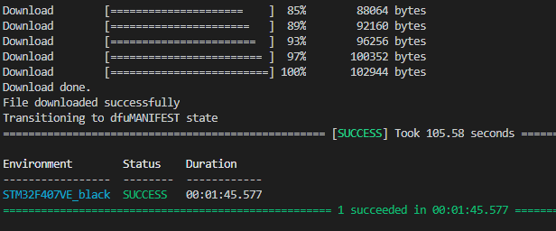
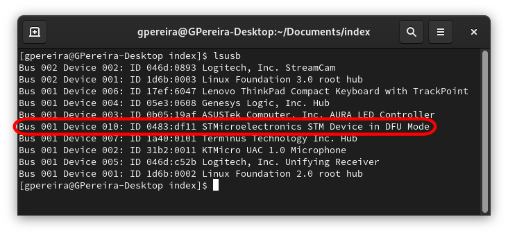

<!-- markdownlint-disable-file MD046 -->
# Update LumenPnP Firmware

All motherboards come pre-flashed with firmware from Opulo and should work out of the box without these steps. If you need to update your LumenPnP's firmware, this guide will help you do so.

## Option 1: Prebuilt Firmware and STMProgrammer (RECOMMENDED)

The easiest way to update your LumenPnP's motherboard is to use a precompiled binary of the firmware, and the [STM32CubeProgrammer](https://www.st.com/en/development-tools/stm32cubeprog.html) software by ST.

1. Download the latest [precompiled firmware](https://github.com/opulo-inc/lumenpnp/releases) `.bin` file for your motherboard version.

    !!! danger "Important"
        It is important that you pick the correct firmware file for your machine.

        - If you have a v2, choose `v2-lumenpnp-firmware-feeder-support.bin`.
        - If you have a v3, choose `v3-lumenpnp-firmware-feeder-support.bin`.
  
2. Download and install [STM32CubeProgrammer](https://www.st.com/en/development-tools/stm32cubeprog.html).
3. Open STM32CubeProgrammer.
4. Select `USB` from the connection type dropdown on the right.
    
5. Switch to the "download" tab on the left.
    

6. Attach the LumenPnP Motherboard to your computer with the included USB cable (USB C to A for Motherboard 3.0, or USB B to A for Motherboard 4.0).

7. Boot your motherboard into DFU Mode
    1. Press and hold the `BOOT` button
    2. Press the `Reset` button and hold for 10 seconds
    3. Release the `Reset` button and wait for 10 seconds
    4. Release the `BOOT` button
  

    !!! info "NOTE"
        If you have a hard time getting your board to enter DFU mode, instead try powering off the machine entirely, holding the 'BOOT' button, plugging in power, waiting 10 seconds, then release the `BOOT` button.
1. Click the refresh button in the `Port` line to detect the motherboard's port.
    

2. Select the newly discovered USB port from the `Port` dropdown menu.
    

3.  Double-check the other fields on the right match the image above:
    1. `PID: 0xdf11`
    2. `VID: 0x0483`
    3. `Read Unprotect (MCU): Unchecked`
    4. `TZEN Regression (MCU): Unchecked`

4.  Click the green `Connect` button to connect to the motherboard.
    

4. Delete all the flash on the chip by clicking the "Full Chip Erase" button.
    

5.  Click the `Browse` button to browse for the binary you downloaded earlier.
    

6.  Click the `Start Programming` button to upload the firmware to the motherboard.
    

7.  Let the upload finish.
    

8.  Press the `reset` button on the motherboard to reboot it.

9.  The machine should show up as a COM/Serial Port on your PC now, and you should be able to access it via OpenPNP. If it doesn't, press the Reset button on the board again, or power-cycle the machine *after the flashing is completed*.

This is how you can check whether your machine is connected properly:

* Windows: 
* Mac/Linux: 

## Option 2: Auto Build Marlin and `dfu-util`

!!! info "Marlin Version"
    LumenPnP feeders require some custom Marlin features that we have not yet merged into mainline. Before this happens, be sure you're pulling from our fork with these features.

1. Download the [latest Marlin firmware with feeder support][marlin] and unzip it.
2. Install [VSCode][vscode] and its [PlatformIO extension][pIO].
3. Open Marlin firmware's folder in VSCode.
4. Download the Marlin configuration files [here][marlin-config] and
5. Replace the files in the `Marlin/Marlin` folder from step #1 with the new configuration files from step #4.
6. Install the Auto Build Marlin plugin using this [Marlin Documentation page][marlin-docs], or download it directly from the [Visual Studio Marketplace][abmvs].
7. Install `dfu-util`
8. Try to build Marlin using the build button with the hammer icon as shown below. See [Troubleshooting](#troubleshooting-building-with-auto-build-marlin) for more help
    

9.  Attach the LumenPnP Motherboard to your computer with the included USB cable (USB C to A for Motherboard 3.0, or USB B to A for Motherboard 4.0).

10. Boot your motherboard into DFU Mode
    1. Press and hold the `BOOT` button
    2. Press the `Reset` button and hold for 10 seconds
    3. Release the `Reset` button and wait for 10 seconds
    4. Release the `BOOT` button
  

    !!! info "NOTE"
        If you have a hard time getting your board to enter DFU mode, instead try powering off the machine entirely, holding the 'BOOT' button, plugging in power, waiting 10 seconds, then release the `BOOT` button.

1.  In the integrated terminal in the root of the repository, flash the Motherboard using `dfu-util` by running the command:

    ```shell
    dfu-util -d 0x0483:0xdf11 -s 0x08000000:leave -a 0 -D ./.pio/build/Opulo_Lumen_REV3/firmware.bin
    ```

    
    !!! info "COMMAND EXPLANATION"
        `dfu-util` is a flash tool available on all platforms.

        * `-d 0x0483:0x0df11` tells the tool to flash the STM32 chip on the motherboard. This is optional if you only have one dfu device connected.
        * `-s 0x8000000:leave` is the target memory address that the firmware is flashed to. The `:leave` part will cause the chip to reset on its own, making the machine accessible in OpenPNP without rebooting it.
        * `-a 0` makes the tool use the alt setting required for flashing the ESP32.
        * `-D ./.pio/build/Opulo_Lumen_REV3/firmware.bin` is the path to the to-be-flashed firmware. If you want to flash another file, change this.

2.  Wait for the process to finish.

3.  The machine should show up as a COM/Serial Port on your PC now, and you should be able to access it via OpenPNP. If it doesn't, press the Reset button on the board, or power-cycle the machine *after the flashing is completed*.

 This is how you can check whether your machine is connected properly:

* Windows: 
* Mac/Linux: 

## Option 3: Auto Build Marlin Only

Note that flashing the firmware using the Auto Build Marlin Plugin might work, but seems error-prone for most people. We recommend using `dfu-util` as described above. Here are the steps to use Auto Build Marlin if you'd like to try it.

1. Download the [latest Marlin firmware with feeder support][marlin] and unzip it.
2. Install [VSCode][vscode] and its [PlatformIO extension][pIO].
3. Open Marlin firmware's folder in VSCode.
4. Download the Marlin configuration files [here][marlin-config].
5. Replace the files in the `Marlin/Marlin` folder from step #1 with the new configuration files from step #4.
6. Install the Auto Build Marlin plugin using this [Marlin Documentation page][marlin-docs], or download it directly from the [Visual Studio Marketplace][abmvs].
7. Try to build Marlin using the build button with the hammer icon as shown below. See [Troubleshooting](#troubleshooting-building-with-auto-build-marlin) for more help.
    

8. Attach the LumenPnP Motherboard to your computer with the included USB cable (USB C to A for Motherboard 3.0, or USB B to A for Motherboard 4.0).
9. Boot your motherboard into DFU Mode
    1. Press and hold the `BOOT` button
    2. Press the `Reset` button and hold for 10 seconds
    3. Release the `Reset` button and wait for 10 seconds
    4. Release the `BOOT` button
    

10. Now, press the upload button in ABM as shown below:
    

11. Wait for the process to finish
12. The machine should show up as a COM/Serial Port on your PC now, and you should be able to access it via OpenPNP. If it doesn't, press the Reset button on the board, or power-cycle the machine *after the flashing is completed*.

This is how you can check whether your machine is connected properly:

* Windows: 
* Mac/Linux: 

## Option 4: PlatformIO

1. Download the [latest Marlin firmware][marlin] and unzip it.
2. Install [VSCode][vscode] and its [PlatformIO extension][pIO].
3. Open Marlin firmware's folder in VSCode.
4. Download the Marlin configuration files [here][marlin-config].
5. Replace the files in the `Marlin/Marlin` folder from step #1 with the new configuration files from step #4.
6. Edit the `platformio.ini` file to indicate which board you're uploading to. Update `default_envs` to read `Opulo_Lumen_REV3` or `Opulo_Lumen_REV4` depending on your motherboard.
  
7. Attach the LumenPnP Motherboard to your computer with the included USB cable (USB C to A for Motherboard 3.0, or USB B to A for Motherboard 4.0).
8. Boot your motherboard into DFU Mode
    1. Press and hold the `BOOT` button
    2. Press the `Reset` button and hold for 10 seconds
    3. Release the `Reset` button and wait for 10 seconds
    4. Release the `BOOT` button
    

    !!! info "NOTE"
        If you have a hard time getting your board to enter DFU mode, instead try powering off the machine entirely, holding the 'BOOT' button, plugging in power, waiting 10 seconds, then release the `BOOT` button.

9. Upload firmware to the board via PlatformIO:
    

10. Wait for the process to finish:
    

11. The machine should show up as a COM/Serial Port on your PC now, and you should be able to access it via OpenPNP. If it doesn't, press the Reset button on the board, or power-cycle the machine *after the flashing is completed*.

This is how you can check whether your machine is connected properly:

* Windows: 
* Mac/Linux: 

## Flashing Factory Firmware

If you've put new firmware on your motherboard, but want to reinstall the firmware that your machine was flashed with, check the release for your build number and download the .bin firmware file attached to it. Put your board into DFU mode as described above, connect to your LumenPnP over USB, and flash the binary to the board using the STMProgrammer tool, or the following command (for Mac and Linux):

```shell
dfu-util -d 0x0483:0xdf11 -s 0x08000000:leave -a 0 -D ~/path/to/firmware.bin
```

Once flashing is completed, press the reset button on the motherboard boot into the new firmware.

## Troubleshooting

### Troubleshooting Building with Auto Build Marlin

If you can't build with the Auto Build Marlin tool:

1. Check the error messages for configuration errors and fix them, or replace it with the default config
2. If this fails, check that your config file version is the same as your Marlin version (e.g. a bugfix-2.0.x config file won't work in a bugfix-2.1.x)
3. When in doubt, re-download Marlin and the configuration files from the links above

### Other Troubleshooting

If you aren't able to upload, you can check to see if your motherboard is booting into DFU mode correctly:

* Windows: 
* Mac/Linux: 

Also, reference [the Marlin instructions for uploading](https://marlinfw.org/docs/basics/install_platformio.html).


[abmvs]: https://marketplace.visualstudio.com/items?itemName=MarlinFirmware.auto-build
[marlin-docs]: https://marlinfw.org/docs/basics/auto_build_marlin.html
[marlin-config]: https://github.com/MarlinFirmware/Configurations/tree/import-2.1.x/config/examples/Opulo/Lumen_REV4
[marlin]: https://github.com/sphawes/Marlin/tree/feeder-safety
[vscode]: https://code.visualstudio.com/
[pIO]: https://marketplace.visualstudio.com/items?itemName=platformio.platformio-ide
