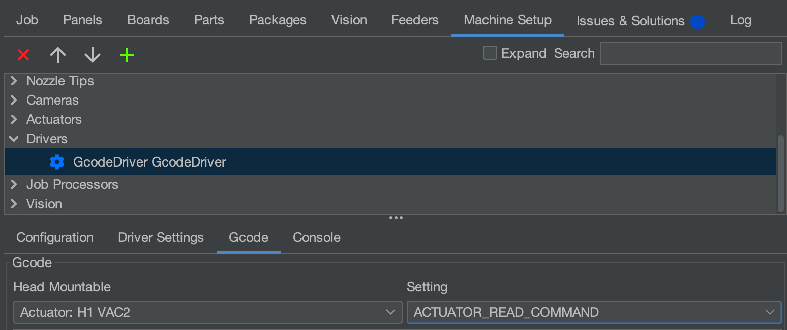

# Update Gcode Macros

OpenPnP puts general machine configuration in the same file as machine-specific configuration. This means that updating settings for your LumenPnP can also force you to redo calibration. To prevent this, this guide will walk you through which GCode macros to update so you don't need to start from scratch on calibration.

**If you're setting up your machine for the first time, you don't need to do this.** This guide is only for folks that are looking to update their machine config, but set up their machine using an older version of the configuration files.

!!! warning "OpenPnP Version"
    Be sure that you're using the recommended version of OpenPnP for this guide. You can find installation instructions [here](/openpnp/install).

!!! warning "Firmware Version"
    These macros require that your firmware is up to date with the latest firmware release for your machine. [Make sure you're up to date](/guides/update-firmware).

## v3.1+ Machines

Version 3.1 and upward of the LumenPnP uses linear rails, so speeds and currents can be adjusted for faster movement. The four GCode macros that we'll edit to take advantage of these improvements are the `CONNECT_COMMAND`, `HOME_COMMAND`, and the `ACTUATOR_READ_COMMAND` for `VAC1` and `VAC2`.

### Connect Command (v3.1+)

1. Select the `Default` and `CONNECT_COMMAND` dropdowns under `Machine Setup > Drivers > GcodeDriver GcodeDriver > Gcode`.
   

1. Paste the following Gcode into the text field:

    ```gcode
    G90 ; Set absolute positioning mode
    M260 A112 B1 S1 ; Selecting VAC1 through the I2C multiplexer
    M260 A109 ; Starts Command to VAC sensor at address 109
    M260 B48 ; Address Byte 48 selects CMD register
    M260 B27 ; Sends byte to select 62.5 sleep time, SCO, sleep mode conversion (0001 1 011)
    M260 S1 ; Sends data
    M260 A112 B2 S1 ; Selecting VAC2 through the I2C multiplexer
    M260 A109 ; Starts Command to VAC sensor at address 109
    M260 B48 ; Address Byte 48 selects CMD register
    M260 B27 ; Sends byte to select 62.5 sleep time, SCO, sleep mode conversion (0001 1 011)
    M260 S1 ; Sends data
    ```

2. Click the `Apply` button in the bottom right.

### Home Command (v3.1+)

1. Select the `Default` and `HOME_COMMAND` dropdowns under `Machine Setup > Drivers > GcodeDriver GcodeDriver > Gcode`.
   

1. Paste the following Gcode into the text field:

    ```gcode
    M204 T2000 ; Sets acceleration for homing
    G28 X ; Home X in case of first boot
    G28 ; Home all axes
    ```

1. Click the `Apply` button in the bottom right.

### VAC1 and VAC2 Actuator Read Commands (v3.1+)

1. Select the `Actuator: H1 VAC1` and `ACTUATOR_READ_COMMAND` dropdowns under `Machine Setup > Drivers > GcodeDriver GcodeDriver > Gcode`.
   

1. Paste the following Gcode into the text field:

    ```gcode
    M260 A112 B1 S1 ; Select vac1 through multiplexer
    M260 A109 B6 S1 ; Selects MSB register
    M261 A109 B1 S2 ; Request one byte back via decimal
    ```

1. Click the `Apply` button in the bottom right.

1. Select the `Actuator: H1 VAC2` and `ACTUATOR_READ_COMMAND` dropdowns under `Machine Setup > Drivers > GcodeDriver GcodeDriver > Gcode`.
   

1. Paste the following Gcode into the text field:

    ```gcode
    M260 A112 B2 S1 ; Select vac1 through multiplexer
    M260 A109 B6 S1 ; Selects MSB register
    M261 A109 B1 S2 ; Request one byte back via decimal
    ```

1. Click the `Apply` button in the bottom right.

## v3.0 Machines

Version 3.0.0 - 3.0.5 of the LumenPnP uses the REV04 motherboard, which uses integrated vacuum sensors and sensorless homing. The four GCode macros that we'll edit to take advantage of these improvements are the `CONNECT_COMMAND`, `HOME_COMMAND`, and the `ACTUATOR_READ_COMMAND` for `VAC1` and `VAC2`.

### Connect Command (v3.0)

1. Select the `Default` and `CONNECT_COMMAND` dropdowns under `Machine Setup > Drivers > GcodeDriver GcodeDriver > Gcode`.
   

1. Paste the following Gcode into the text field:

    ```gcode
    G90 ; Set absolute positioning mode
    M260 A112 B1 S1 ; Selecting VAC1 through the I2C multiplexer
    M260 A109 ; Starts Command to VAC sensor at address 109
    M260 B48 ; Address Byte 48 selects CMD register
    M260 B27 ; Sends byte to select 62.5 sleep time, SCO, sleep mode conversion (0001 1 011)
    M260 S1 ; Sends data
    M260 A112 B2 S1 ; Selecting VAC2 through the I2C multiplexer
    M260 A109 ; Starts Command to VAC sensor at address 109
    M260 B48 ; Address Byte 48 selects CMD register
    M260 B27 ; Sends byte to select 62.5 sleep time, SCO, sleep mode conversion (0001 1 011)
    M260 S1 ; Sends data
    ```

2. Click the `Apply` button in the bottom right.

### Home Command (v3.0)

1. Select the `Default` and `HOME_COMMAND` dropdowns under `Machine Setup > Drivers > GcodeDriver GcodeDriver > Gcode`.
   

1. Paste the following Gcode into the text field:

    ```gcode
    M204 T2000 ; Sets acceleration for homing
    G28 X ; Home X in case of first boot
    G28 ; Home all axes
    ```

1. Click the `Apply` button in the bottom right.

### VAC1 and VAC2 Actuator Read Commands (v3.0)

1. Select the `Actuator: H1 VAC1` and `ACTUATOR_READ_COMMAND` dropdowns under `Machine Setup > Drivers > GcodeDriver GcodeDriver > Gcode`.
   

1. Paste the following Gcode into the text field:

    ```gcode
    M260 A112 B1 S1 ; Select vac1 through multiplexer
    M260 A109 B6 S1 ; Selects MSB register
    M261 A109 B1 S2 ; Request one byte back via decimal
    ```

1. Click the `Apply` button in the bottom right.

1. Select the `Actuator: H1 VAC2` and `ACTUATOR_READ_COMMAND` dropdowns under `Machine Setup > Drivers > GcodeDriver GcodeDriver > Gcode`.
   

1. Paste the following Gcode into the text field:

    ```gcode
    M260 A112 B2 S1 ; Select vac1 through multiplexer
    M260 A109 B6 S1 ; Selects MSB register
    M261 A109 B1 S2 ; Request one byte back via decimal
    ```

1. Click the `Apply` button in the bottom right.
