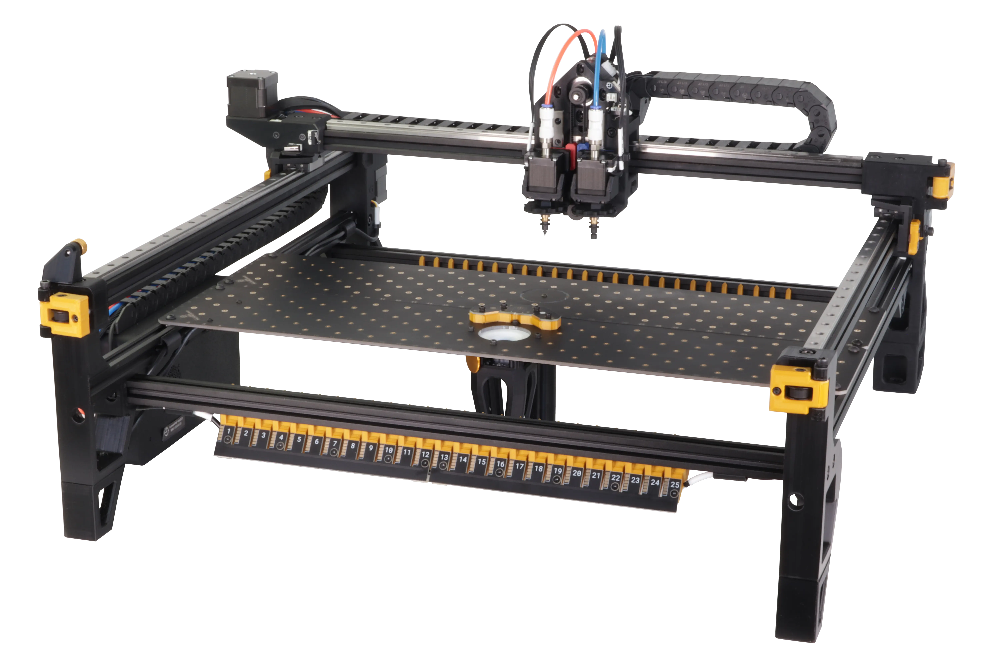

# Opulo Documentation

Welcome to the Opulo Docs site! Here you'll find build guides, setup instructions, and troubleshooting steps for Opulo products. Be sure to check out product source files on [GitHub](https://github.com/opulo-inc) and the [community Discord server](https://discordapp.com/invite/TCwy6De). You can also reach out to our [customer support](https://opulo.io/pages/contact-support) line.

Start Assembling

Your first steps are to start assembling your LumenPnP.

<a href="../semi-assembly-4-0/" class="next-step">LumenPnP Assembly →</a>

Something look wrong? Please [let us know](https://github.com/opulo-inc/docs/issues/new)!