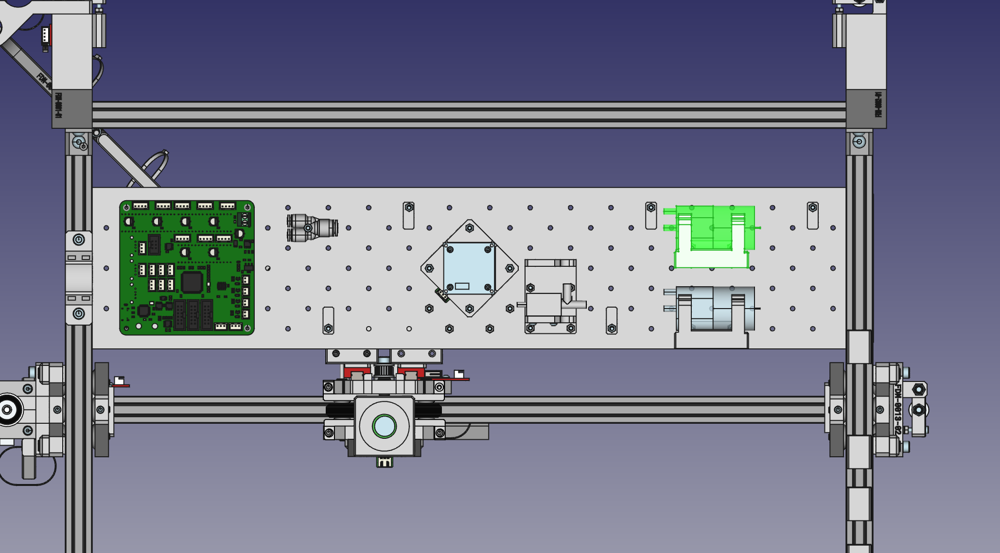
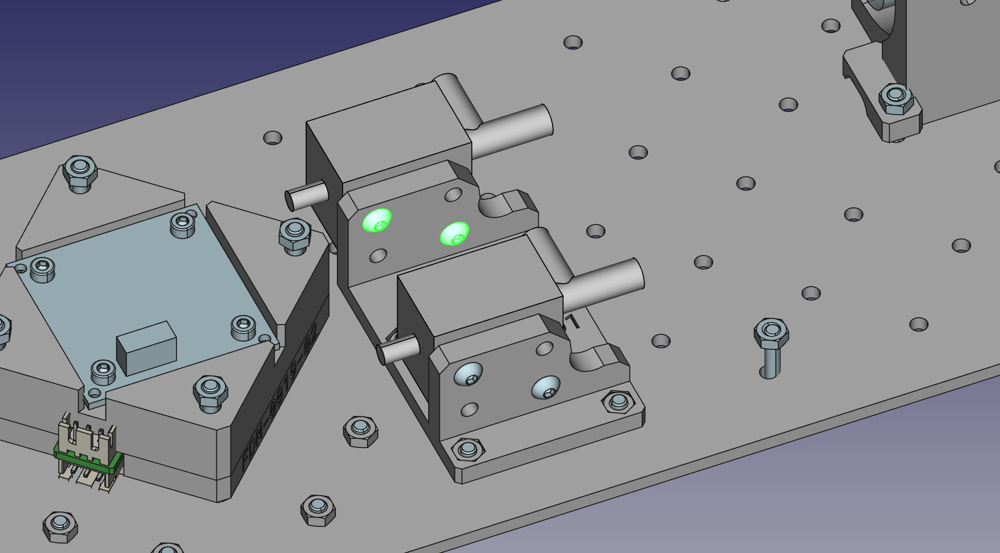
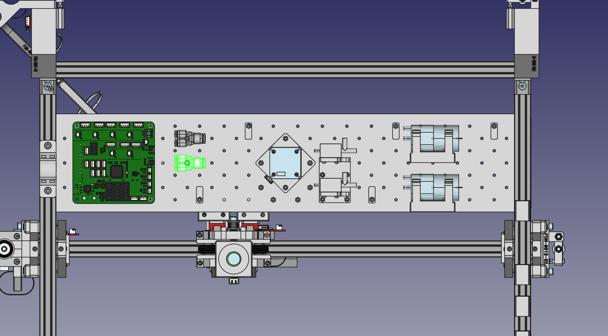
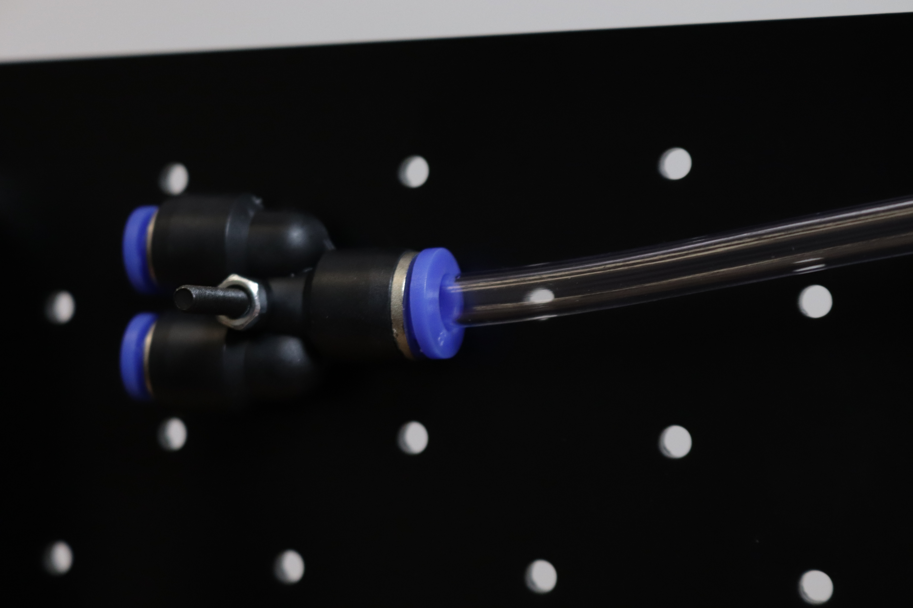
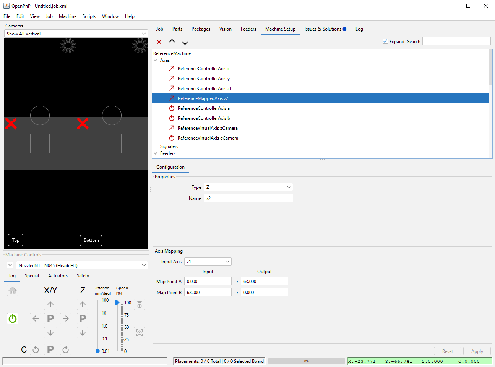
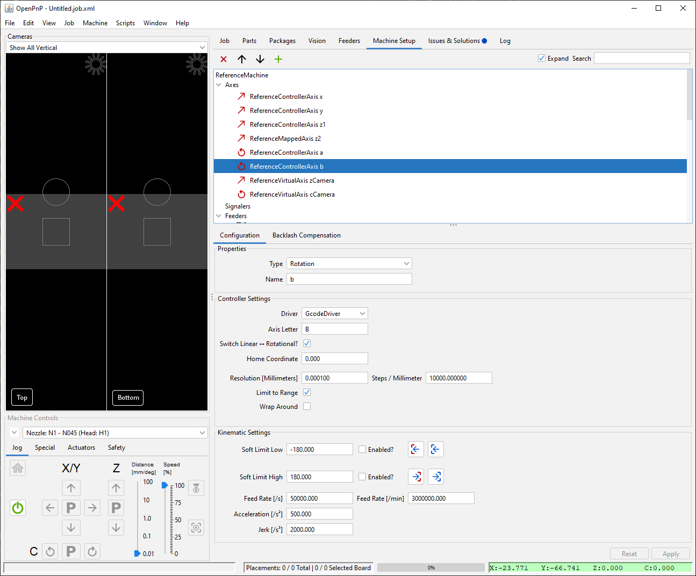
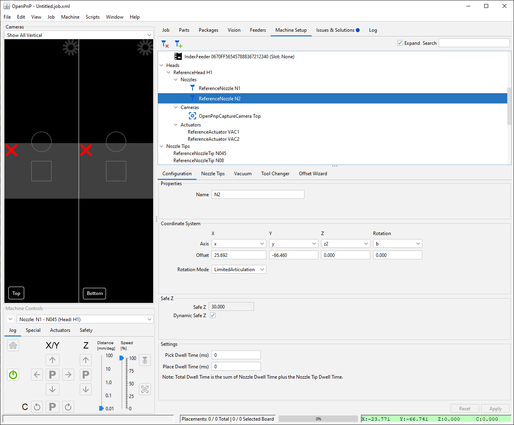

# Second Nozzle Upgrade Guide

If you built a V2 LumenPnP with only one nozzle, follow this guide to install a second one. Note that there have been subtle design changes to the 3D printed parts that attach components to the staging plate. The photos in this guide will show v2 components.

## Required Materials

[Download the LumenPnP BOM from the most recent release](https://github.com/opulo-inc/lumenpnp/releases) for specifications and links to purchase hardware for the upgrade:

|    Qty | Off The Shelf Parts          |
| -----: | ---------------------------- |
|      1 | pump-mount (3D Printed)      |
|      2 | rubber-band                  |
|      1 | Vacuum Pump                  |
|      1 | Pump Wire Harness            |
|      1 | Solenoid Valve               |
|      1 | pneumatic-y-adapter          |
|      1 | Pneumatic Adapter MS4M-M5    |
|      1 | NEMA11 Hollow Shaft Stepper  |
|      1 | CP40 Holder                  |
|      1 | R Motor Cable Harness        |
|      1 | [Stepper Motor Driver][step] |
|  325mm | Pneumatic Tubing 6mm OD      |
| 2025mm | Pneumatic Tubing 4mm OD      |
|      2 | M3x8 machine screw           |
|      2 | M3x10 machine screw          |
|      1 | M3x30 machine screw          |
|      4 | M2.5x8 machine screw         |
|      3 | M3 Hex Nuts                  |

## Installing the Tool Head

1. Attach the the prepared NEMA11 hollow shaft stepper motor (with the attached CP40 nozzle holder) to the right Z gantry with four M2.5x8mm screws. Make sure the wire port is facing outwards as shown below.
  

## Installing the Pneumatics

The new tool will need a new vacuum pump and valve. This will be mostly the same assembly as the components for the first toolhead. The main differences will be that we will mount the electronics at different places on the staging plate, and and plug them into different connections on the motherboard.

1. Start by press-fitting two M3 nuts into the side recesses in the Pump Mount. { start=2 }
  

2. Mount the pump in the Pump Mount using a couple rubber bands. Start by grabbing the rubber band with both hands, giving it a half twist, and folding it over on itself, making two loops.
  
  
  

3. Stretch each rubber band over each pair of pegs on the Pump Mount. Guide the pump between each pair of bands so that it's suspended in the Pump Mount.
  
  

4. Mount the Pump Mount to the staging plate using two M3 x 10mm screws. For example: G31 and G33 for the first tool head vacuum pump, and C31 and C33 for the new vacuum pump. (Note, the second photo below shows the newer, v3 LumenPnP pump mount, but you can opt to use the older v2 mount instead.)
  
  

5. Use two M3x8mm screws to attach the valve to the Valve Mount as shown below. (Note, the third photo below shows the newer, v3 LumenPnP valve mount, but you can opt to use the older v2 mount instead.)
  
  
  

6. Use an M3x30mm screw and an M3 nut to mount the pneumatic Y splitter to the staging plate as shown below. Example locations are B12 and D12 for the two splitters. (Note, the second photo below shows the newer v3 LumenPnP splitter mount, but you can opt to mount the splitter directly to the staging plate instead.)
  
  

## Connecting the Pneumatics and wires

1. The origin of vacuum in the machine is our vacuum pump. The off-center port is the one that provides vacuum. Use about 95mm of the 6mm clear tubing and push it onto the off-center port on the vacuum pump. Push the other end onto the inline plastic port of the valve as shown below.
  
  

2. Use a 230mm section of the 6mm clear tubing and push it onto the right-angle plastic port of the valve, and push the other side into the single, larger port of the Y splitter.
  
  

3. Switch to using the smaller, 4mm black tubing. Cut a 225mm length of 4mm OD tubing and push one side into a fork of the Y splitter, and route the other end underneath the motherboard and onto the `VAC2` sensor port. Gently press the tube onto the vacuum sensor.
  
  

4. Now take 1.8 meters of 4mm black tubing and push it into the other fork of the Y splitter. Take the loose end, and route it underneath the motherboard.

5. Route both the black tubing and the wire for the new toolhead up along the X umbilical. Attach them with new zip ties, or slip it inside your existing ones, alongside the first tool head's tubing and wires.
  

6. With the pneumatic tubing dangling loose past the end of the swivel arm, cut any excess tubing (still allowing some slack for motor rotation). Push the other end into the pneumatic coupling on the back side of the rotation stepper motor. Extra slack will allow the motor to rotate freely 180 degrees in each direction, so err on the side of leaving more than less. If the tubing falls away from the umbilical, use one or two small zip ties to secure them together.
  

7. Plug the cable into the new tool motor. Make sure it has enough slack so that it isn't strained if the tool is raised or lowered.
  

8. Plug the new cable (labeled `RM`) into the first port in the second row, labeled `R`. (Note this image shows a Rev 4 motherboard, but the connector is in the same place on the Rev 3 motherboard.)
    

9. Install the new stepper motor driver into the slot below your cable. The orientation should match your other drivers.

    !!! danger "Note"
        It is very important to not plug in or unplug stepper motor drivers or motors while the board is powered on. Make sure to unplug the power supply before inserting or removing drivers or motors.
    

## Configuring OpenPnP

With the hardware set up, we need to tell OpenPnP about the newly installed toolhead.

### Add Z-axis

1. Select the `Machine Setup` tab
2. Click the `Expand` checkbox if necessary
3. Click on `Axes`
4. Click on the Add button
5. Select `ReferenceMappedAxis` and click `Accept`
6. Configure the new axis with the following settings:
   1. Type: `Z`
   2. Name: `z2`
   3. Input Axis: `z1` (or whatever you had named your original Z axis)
   4. Map Point A: Input: `0`
   5. Map Point A: Output: `63`
   6. Map Point B: Input: `63`
   7. Map Point B: Output: `0`
7. Click `Apply` to save the changes

### Add Rotation Axis

1. Click on the Add button
2. Select `ReferenceControllerAxis` and click `Accept`
3. Configure the new axis with the following settings:
    1. Type: `Rotation`
    2. Name: `b`
    3. Driver: `GcodeDriver`
    4. Axis Letter: `B`
    5. Switch Linear <> Rotational: Checked
    6. Home Coordinate: `0`
    7. Resolution \[Millimeters\]: `0.0001`
    8. Steps / Millimeter: `10000`
    9. Limit to Range: Checked
    10. Wrap Around: Unchecked
    11. Soft Limit Low: `-180`
    12. Soft Limit Low Enabled: Unchecked
    13. Soft Limit High: `180`
    14. Soft Limit High Enabled: Unchecked
    15. Feed Rate \[/s\]: `50000`
    16. Acceleration \[/s2\]: `500`
    17. Jerk \[/s3\]: `2000`
4. Click `Apply` to save the changes

### Add 2nd Vacuum

1. Click on `Heads > ReferenceHead H1 > Actuators`
2. Click on the Add button
3. Select `ReferenceActuator` and click `Accept`
4. Configure the new Actuator with the following settings:
    1. Driver: `GcodeDriver`
    2. Name: `VAC2`
    3. Axis X: `x`
    4. Axis Y: `y`
    5. Axis Z: `z2`
    6. Axis Rotation: `b`
    7. Offset X: `0`
    8. Offset Y: `0`
    9. Offset Z: `0`
    10. Offset Rotation: `0`
    11. Axis Interlock?: Unchecked
    12. Safe Z: `30`
    13. Before Actuation: Checked
    14. After Actuation: Unchecked
    15. Before Read?: Checked
    16. Value Type: `Boolean`
    17. Actuation Enabled: `AssumeUnknown`
    18. Actuation Homed: `LeaveAsIs`
    19. Actuation Disabled: `LeaveAsIs`
    20. Index: `0`
5. Click `Apply` to save the changes

### Add 2nd Nozzle

1. Click on `Nozzles`
2. Click on the Add button
3. Select `ReferenceNozzle` and click `Accept`
4. Configure the new Nozzle with the following settings:
    1. Name: `N2`
    2. Axis X: `x`
    3. Axis Y: `y`
    4. Axis Z: `z2`
    5. Axis Rotation: `b`
    6. Offset X: `25.692`
    7. Offset Y: `-66.460`
    8. Offset Z: `0`
    9. Offset Rotation: `0`
    10. Rotation Mode: `LimitedArticulation`
    11. Safe Z: `30`
    12. Dynamic Safe Z: Checked
    13. Pick Dwell Time (ms) `0`
    14. Place Dwell Time (ms) `0`
5. Switch to the `Nozzle Tips` tab
6. Mark all the nozzle tips as Compatible
7. Switch to the `Vacuum` tab
8. Set the Vacuum Actuator to `VAC2`
9. Leave the Blow Off Actuator blank
10. Set the Sensing Actuator to `VAC2`
11. Click `Apply` to save the changes

## Fine Tuning

1. Attach a nozzle to your new second tool head
2. Set [your new nozzle's offset](../../../openpnp/calibration/6-nozzle-offset/index.md).
3. Try homing your machine again. If you get the `Nozzle tip calibration: not enough results from vision. Check pipeline and threshold` error, you will need to tune your [Bottom Camera Vision Pipeline](../../../openpnp/vision-pipeline-adjustment/4-nozzle-calibration-pipeline.md).
4. Test picking components out of your feeders. Follow the instructions in the [FTP](../../../openpnp/ftp/1-installing-the-feeders/index.md#installing-the-n045-nozzle) guide. Make sure to activate your newly created tool head, and assign a nozzle tip to it.

[step]: https://wiki.fysetc.com/Silent2209/
