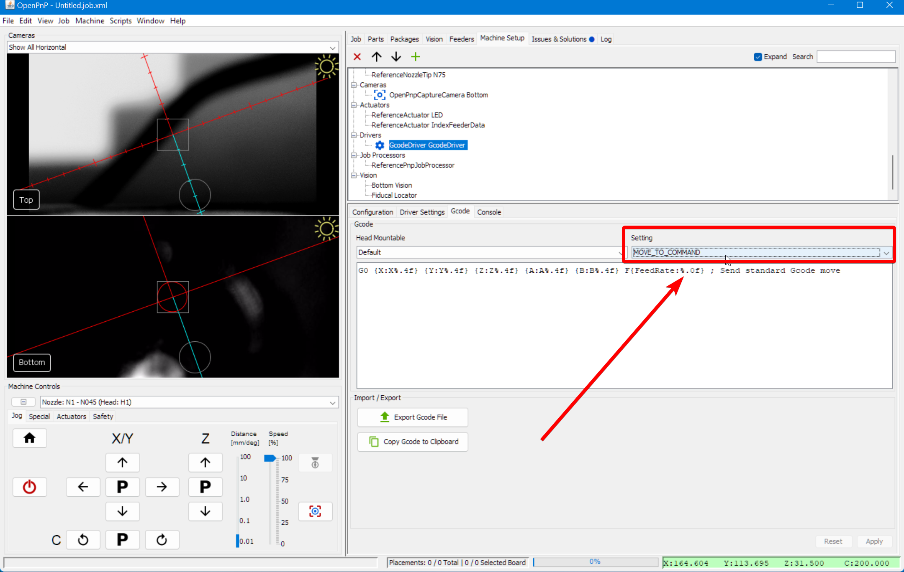
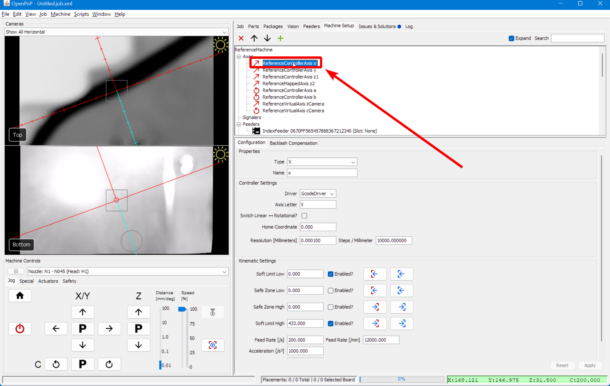

<!-- markdownlint-disable MD029 MD031 MD032 -->
# Calibrating Backlash Compensation

This calibration is not needed. Semi-assembled (v3) LumenPnP machines should have only a limited amount of backlash in each axis and the default machine configuration in OpenPnP already applies a consistent, tested backlash compensation. **We highly recommend using the settings below for your X and Y axes instead.**


If you still want to perform this calibration, use the instructions below and read the OpenPnP docs page about automatic backlash compensation [here](https://github.com/openpnp/openpnp/wiki/Calibration-Solutions#calibrating-backlash-compensation).

## Set Up Acceleration Control

1. Click on the `Machine Setup` tab in the top right pane.
  

2. Click on the "Expand" checkbox if necessary.
  

3. Select `GcodeDriver GcodeDriver` from the list.
  

4. Switch to the `gcode` tab.
  

5. Select `MOVE_TO_COMMAND` in the setting drop-down.
  

6. Paste the following into the large text box:
  ```gcode
  {Acceleration:M204 S%.2f}
  G1 {X:X%.4f} {Y:Y%.4f} {Z:Z%.4f} {A:A%.4f} {B:B%.4f} {FeedRate:F%.2f} ; move to target
  ```
  

7. Click `Apply` to save your changes.
  

8. Switch to the `Driver Settings` tab.
  

9. Change the Motion Control Type to `ConstantAcceleration`. Note that you may want to change this back to `ToolpathFeedRate` when you're done running the backlash calibration.
  

    !!! warning "Command Timeout"
        You also might need to increase your `Command Timeout` value in this tab. Try increasing it to 10000 ms to ensure OpenPnP doesn't timeout during calibration.

10. Click `Apply` to save your changes.
  

## Running The Calibration

1. Click on the `Machine Setup` tab in the top right pane.
  

2. Click on the "Expand" if necessary.
  

3. Click on `Axes > ReferenceControllerAxisX`.
  

4. Select the `Backlash Compensation` tab.
  

5. Next, click the `Calibrate now` button. The machine will go through a long routine (between 5-15 minutes) where it measures the machine's backlash, and determines the best settings to account for it.

6. When it's done, you'll see the output data from the calibration. We suggest selecting `OneSidedPositioning` for the Compensation Method, but experiment with the different options to see which gives you the best results.
  

7. Restart from step 10 with the Y axis selected.
