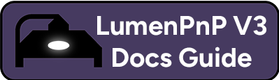
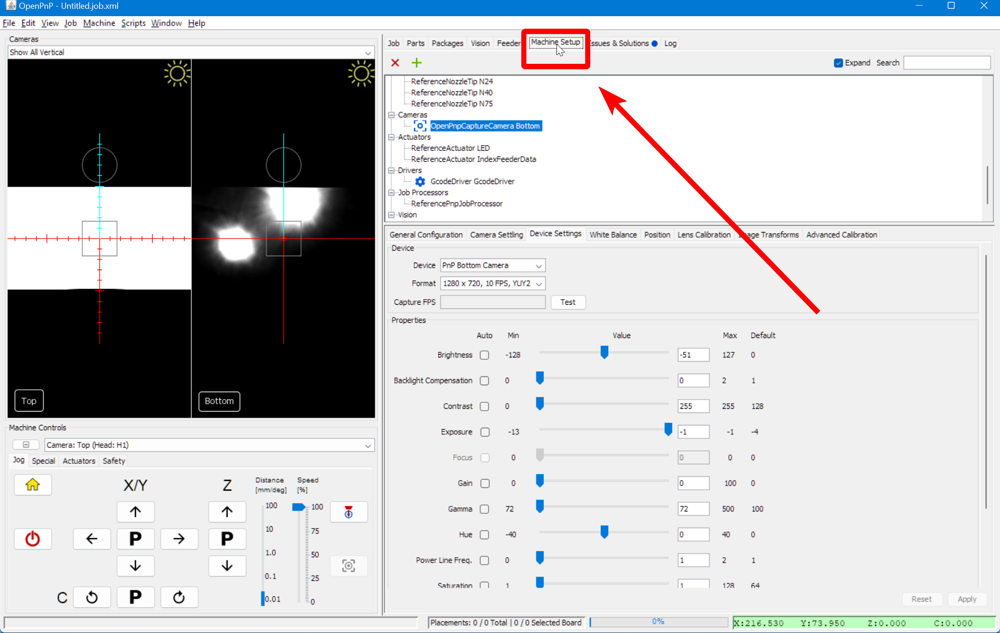
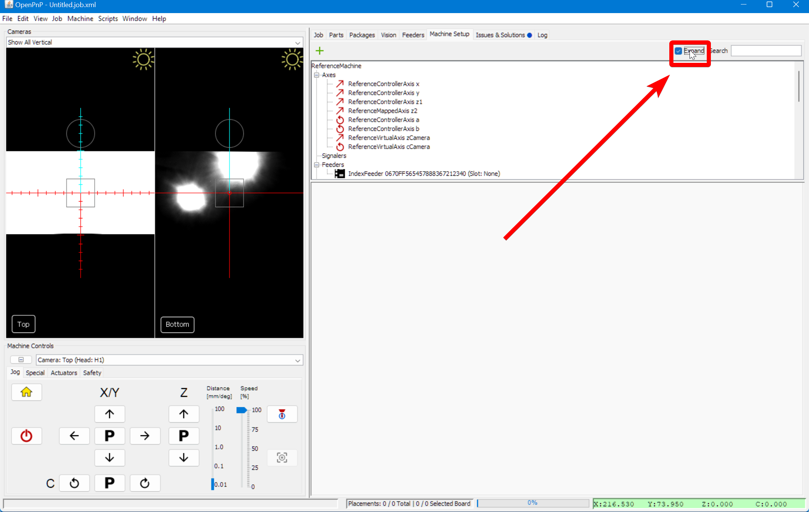

# Camera Fisheye

Now that you're connected to the LumenPnP, you'll need to set up the cameras so that they can accurately fine-tune the machine's position. The LumenPnP is a robust machine, but it needs both cameras to make sure it can pick and place components reliably every time. The first step is to correct for the fisheye effect of the webcams to help make sure they can identify distances accurately. This is not a step you will need to re-run unless you replace your webcams or lenses. See the [original OpenPnP documentation for reference](https://github.com/openpnp/openpnp/wiki/Camera-Lens-Calibration).

This calibration uses a specific pattern of dots to correct for any fisheye effect in your webcams

* If you have a v2 LumenPnP kit, you can find this pattern is on the back side of your datum board (shown below).
* If you have a v3 semi-assembled LumenPnP machine, you can find this pattern on the back side of the FTP board in your Getting Started Kit.
* If you're having a hard time getting the camera to pick up on the pattern on the datum board or FTP board, you can print out the original `Circle Grid Camera Calibration Patterns` [here](https://nerian.com/support/calibration-patterns/).

## Bottom Camera Calibration

1. Click on the `Machine Setup` tab.  
    

2. Click on the "Expand" checkbox to open all of the features about your machine.  
    

3. Click on `Cameras > OpenPnpCaptureCamera Bottom`.  
    

4. In the lower detail pane, switch to the `Lens Calibration` tab.  
    

    !!! info "Tip"
        To see both camera views at the same time, click on the dropdown in the top left of the UI and select `Show All Vertical` or `Show All Horizontal`.
        

5. Click `Start Lens Calibration`.  
    

6. Hold the pattern under the bottom camera as shown below. Use the camera view in OpenPnP to move the pattern into focus. If you can't get the whole pattern in focus and in the field of view, screw in the lens a few turns to adjust the camera's focal distance and try again. (The image shows calibrating the top camera, but it is the same process.)  
    

    !!! info "Tip"
        If you're having trouble adjusting the focus, try using the community-created [lens adjustment tool](https://www.printables.com/model/208453-lumen-pnp-lens-adjustment-tool).

7. Slowly move the calibration pattern around the camera's field of view until OpenPnP tells you that it's gathered enough photos. OpenPnP will flash when it takes an image of the pattern, and will require you to take 25 pictures for an accurate calibration.
  

8. Confirm that the `Apply Calibration?` checkbox is enabled after calibration is complete.  
    

## Top Camera Calibration

1. Again, navigate to the `Machine Setup` tab.

2. Again, click the "Expand" checkbox if necessary.

3. Navigate to `Heads > ReferenceHead H1 > Cameras > OpenPnPCaptureCamera Top`.  
    

4. Continue with the same steps starting from number 4 above.

## Next Steps

Next, we'll work on homing your machine with the [Homing Fiducials](../4-homing-fiducial/index.md).
