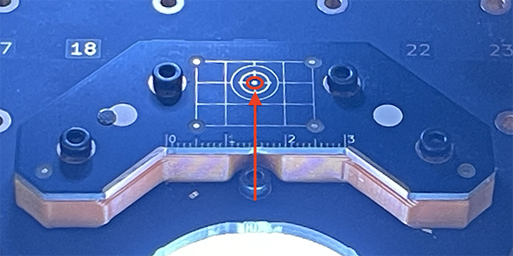
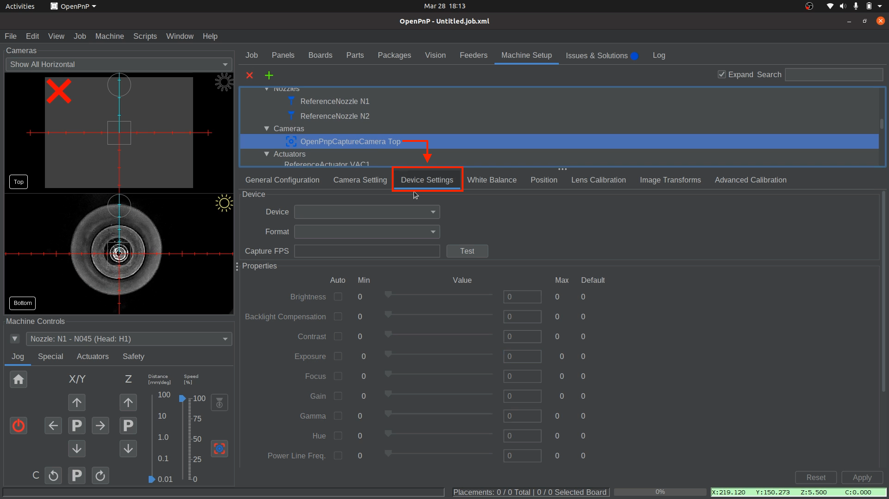
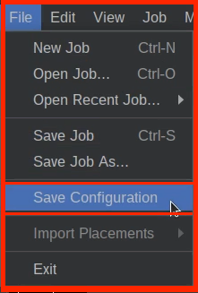
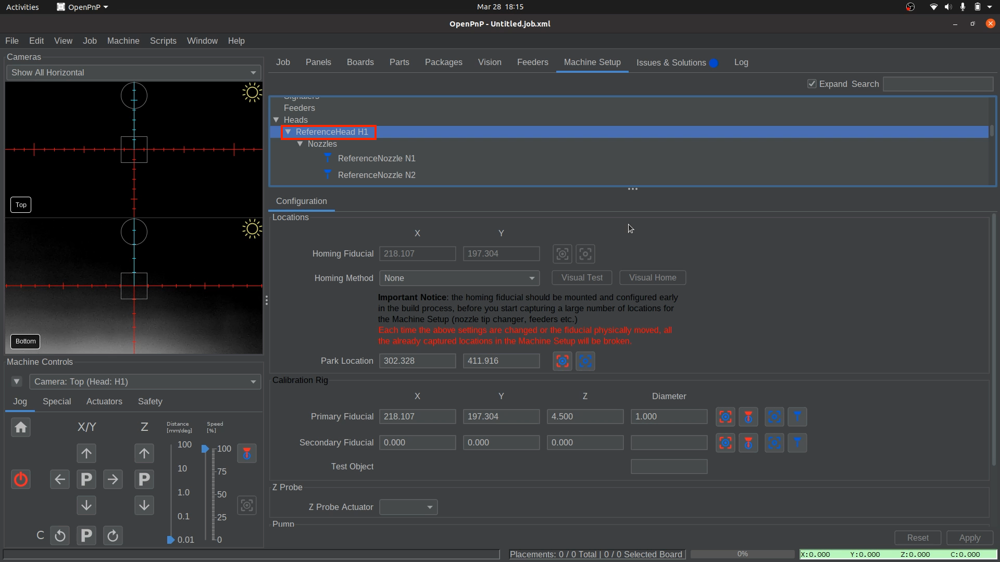
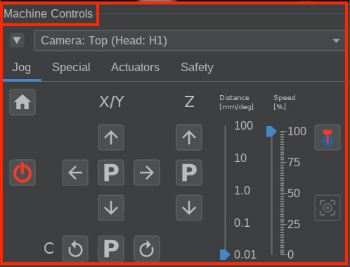
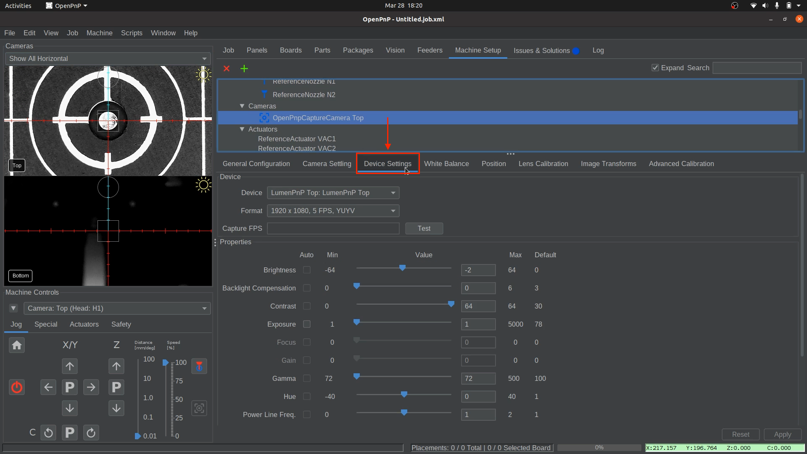
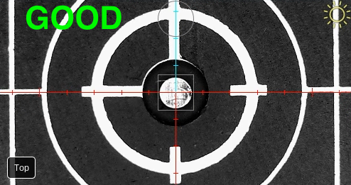

# Configure Top Camera and Homing Fiducial

First, we will establish a connection with the top camera, like we did with the bottom camera.

Then, we can set up the **datum board**, which is a key component to the homing sequence. The center dot on the datum board is called the **"homing fiducial"**, and is the key calibration point, allowing fine-tuning of the machine’s XY position **to compensate for minor variations in limit switch accuracy**. configuring the homing fiducial ensures **precise and repeatable homing** for the LumenPnP.

Finally, we will go back and fine-tune the top camera exposure settings for proper homing calibration. **We will use the top camera aligned above the datum board's homing fiducial to properly adjust the exposure**.

---

## Configuring the Top Camera

Now that your bottom camera exposure has been fine-tuned, the same thing needs to be done to the top camera. We'll connect to the top camera in this step and adjust the exposure.

🚨 The **homing fiducial** is the 1mm dot in the center of the Opulo logo, located toward the center of the datum board. 🚨  
  

1. **Select the Top Camera in OpenPnP**
    * Navigate to `Machine Setup > Heads > ReferenceHead H1 > Cameras > OpenPnpCaptureCamera Top > Device Settings tab`.  
      
  

1. **Choose the Correct Camera Device**
    * In the `Device Settings` tab, select `LumenPnP Top` from the `Device` dropdown.  
      
  

1. **Set Resolution and Frame Rate**
    * In the `Format` dropdown menu, select `1280x720, 10fps`. *A low frame rate is crucial to avoid bandwidth/performance issues*.  
      
  

1. **Apply and Verify**
    * Click `Apply` to save the **Top Camera settings**. One of the red "X"s in the camera feed should disappear. The image might be entirely black, but we'll fix that in the following steps.  
         

2. **Save Your Configuration**
    * Save your OpenPnP configuration now. `File > Save Configuration`.  
       
  

---

## Preparing for Homing

1. Confirm the following settings before homing the LumenPnP.
   * Go to Machine Setup > Heads > ReferenceHead H1 > `Homing Method` is set to `None`
   * Go to Machine Setup > Nozzle Tips > ReferenceNozzleTip N045 > Calibration Tab > **Auto Recalibration**: `Manual`
   * Go to Machine Setup > Nozzle Tips > ReferenceNozzleTip N24 > Calibration Tab > **Auto Recalibration**: `Manual`

1. **Level the nozzles before homing**.

    !!! danger "🚨 Critical Warning: Level Nozzles Before Homing 🚨"
        **Before pressing the homing button**—now and every time in the future—**you must ensure that your nozzles are level**.  
        ⚠️ **Failure to do this can cause crashes and potentially damage your machine.**  
        OpenPnP **does not** remember the previous nozzle positions from the last homing sequence, meaning it **cannot adjust movements based on past alignment**. If the nozzles are not level before homing, they may collide with the machine, leading to misalignment or serious hardware damage.
         
  

1. Click the **Home button** to perform a rough homing sequence.
    * The Nozzles will move to X, Y, and Z zero positions **(front-left corner of the LumenPnP)** and park there.  
       

---

## Setting Homing Fiducial Location

1. Navigate to  `Machine Setup > Heads > ReferenceHead H1`.  
       
  

1. In the **Configuration tab**, change the **Homing Method** to `ResetToFiducialLocation`.
    * This sets the **homing sequence** to always finish by **scanning the fiducial**, which helps correct any minor inaccuracies caused by the endstops.  
       
  

1. Apply and Save
    * Click `Apply` in the lower right corner to save your changes.  
         
    * Save your OpenPnP configuration now. `File > Save Configuration`.  
         

    !!! Warning "Caution"
          **DO NOT** click the **homing button** again until you have fine-tuned the homing fiducial location, as explained in the next section.
  

1. Click on the **"Position Camera Over Location"** icon button shown below.
    * This moves the **top camera** to the **approximate position** above the datum board.  
       
  

1. Ensure **LED lights** are still on:
    * Ensure your **Top and Bottom ring lights** are still set to `On`. If not, go back to the **Machine Controls** in the bottom-left section of OpenPnP and go to `Actuators tab > LED > On` and close the actuator window.  

2. Navigate to `Machine Setup > Heads > ReferenceHead H1 > Cameras > OpenPnPCaptureCamera Top`.  
       
  

1. In the lower detail pane, switch to the `Device Settings` tab if you are not already there.  
       
  

1. Located the `Exposure` slider and **check** the check box labeled `Auto`. The camera will attempt to find the correct exposure.

2. Then, **uncheck** the `Auto` box to ensure we are now in "**manual adjustment**" mode.  
         

3. If the image is still difficult to see, slightly adjust the exposure until the datum board is easily visible. This will be fine-tuned after setting the homing fiducial location.
    * 🚨 **Keep all other camera settings at their default value, and only adjust the exposure slider**.

4. Return to the `Machine Controls` (bottom left of OpenPnP) so we can fine-tune the homing fiducial location.  
       
  

1. Align the Top Camera:
    * Towards the bottom right of OpenPnP, **use the jog controls** to position the **center of the reticle** directly over the **Homing Fiducial** in the perfect-center of the **Opulo logo**. Adjust the `Distance` slider as needed.  
       
  

1. Now that we're **perfectly centered** on the homing fiducial, We need to save this location in **two** different places.
    * Navigate back to  `Machine Setup > Heads > ReferenceHead H1`.  
         
    * **First Location**: click the `Capture Camera Location` button to save the fiducial’s position for the **Homing Fiducial**.  
         
    * **Second Location**: Scroll down to the **Calibration Rig** section and click the `Capture Camera Location` button next to the **Primary Fiducial** field.  
         

2. **Apply and Save**
    * Click `Apply` in the lower right corner to save your changes.  
         
    * Save your OpenPnP configuration now. `File > Save Configuration`.  
         
  

---

## Fine-tune Camera Exposure

In order for OpenPnP to reliably detect the LumenPnP's homing fiducial, we'll need to **set the exposure and camera settings for your top camera** correctly.

1. Navigate to `Machine Setup > Heads > ReferenceHead H1 > Cameras > OpenPnPCaptureCamera Top`.  
      
  

1. In the lower detail pane, switch to the `Device Settings` tab.  
      
  

1. Right click on the top camera's feed and select `Show Image Info?` to enable the image info card. This will give you the brightness histogram of the image.
    * Use the histogram as a general guide rather than a precise measurement. It’s a helpful tool but not exact. For the best results, refer to the comparison photos below, which show examples of 'too bright,' 'too dark,' and 'good exposure' to help you fine-tune your settings after using the histogram.  
      
  

1. Adjust the Top Camera exposure using the slider or entering an exposure value.
    * 🚨 **Keep all other camera settings at their default value, and only adjust the exposure slider**.
    * Aim for a **sharp peak on the right side** and a larger **cluster to the left** in the histogram. See the image below for reference.  
    !!! Warning "🚨 Important 🚨"
        The reference image below is just an example. **Your histogram may look very different** depending on lighting conditions, camera placement, and other environmental factors. **Do not try to match it exactly.** Instead, focus on achieving the key characteristics: a distinct peak on the right and a noticeable cluster to the left. Adjust gradually until the image is clear and well-exposed.  
          
    * Locate and adjust the `Exposure` slider, or manually enter varying exposure values, until the Datum Board is easy to see.  
         
         
         
    !!! caution "Not seeing anything in the top camera feed?"
        Ensure the lens caps on the top camera has been removed.
  

1. Once you've found a good exposure value, **record your exposure value** by saving them in a text file or writing them down:
    * OpenPnP may not retain camera settings after restart, so **save the exposure value** for reference.
    * This means every time you boot up OpenPnP you'll have to:
        * Toggle **Auto Exposure** `on`, then `off`. (This puts your camera into manual exposure mode)
        * **Type your recorded exposure value into the exposure field beside the slider**.
        * **Turn off the histogram view** the same way you turned it on.
  

1. **Apply and Save**
    * Click `Apply` in the lower right corner to save your changes.  
         
    * Save your OpenPnP configuration now. `File > Save Configuration`.  
         

---

## Test Fiducial Homing

1. Click on the **Home button** in the `Machine Controls Pane > Jog Tab` and watch your machine home using the limit switches, then moves the top camera over the homing fiducial and find its exact location. When the camera scans the fiducial, it will have a red-colored hue that scans for the fiducial's circle.  
      
  

1. If you receive the error `FIDUCIAL-HOME no matches found`, OpenPnP was not able to find your homing fiducial. You need to adjust your [Homing Fiducial Pipeline](../../../openpnp/v4/vision-pipeline-adjustment/2-homing-fiducial-pipeline.md).  
      

---

## Next Steps

Next is the [MM/Pixel Calibration.](../5-mm-per-pixel/index.md)
