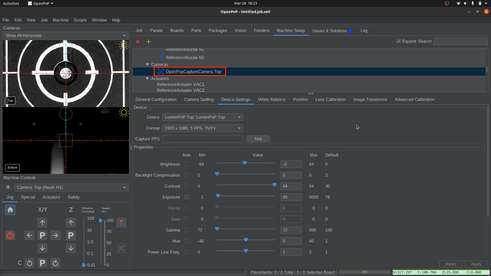
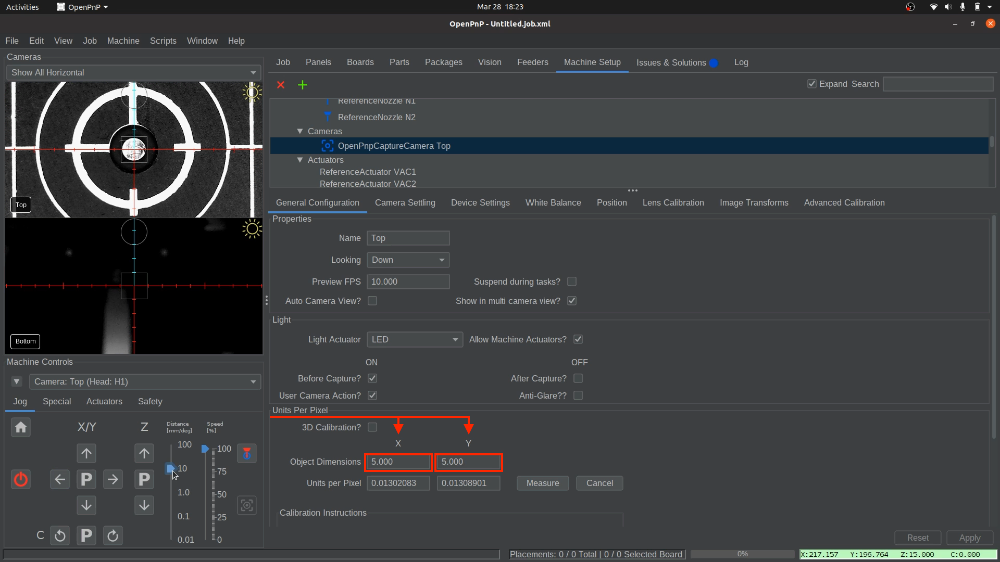
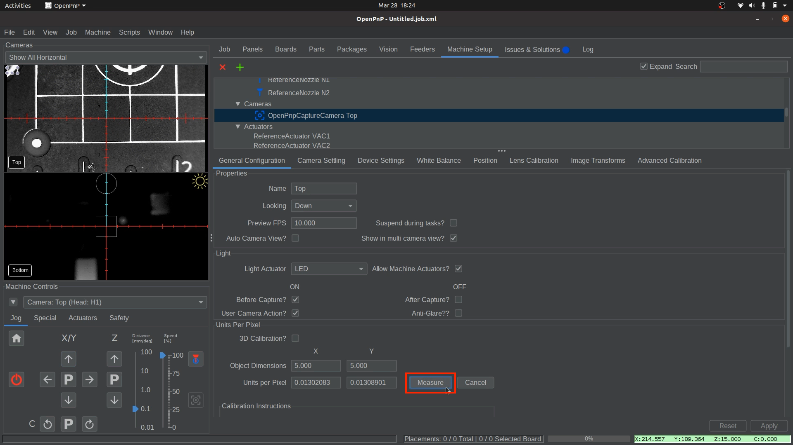
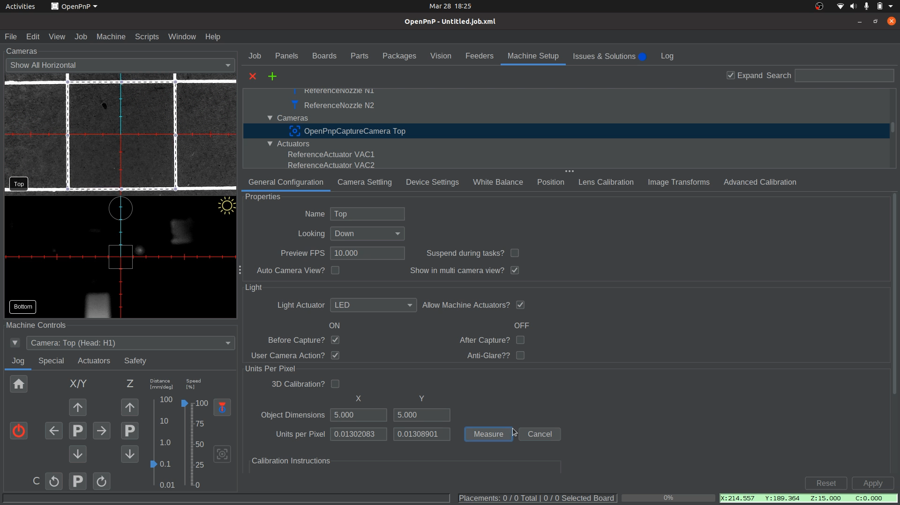
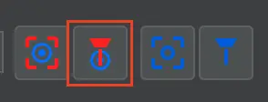
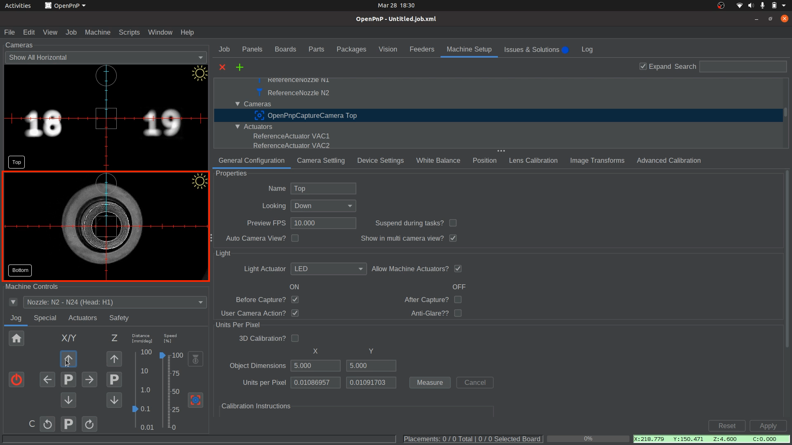
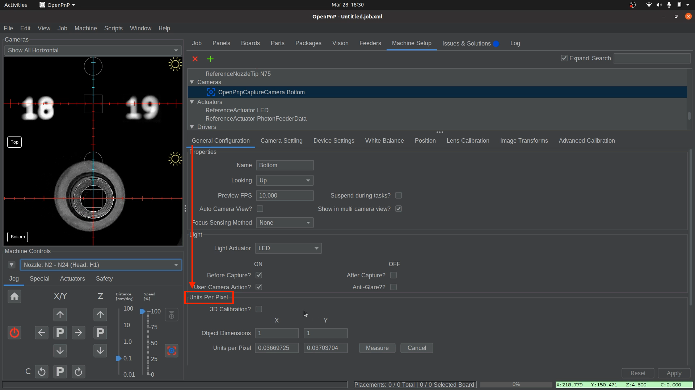

# MM/Pixel Calibration

This next step calibrates the relationship between pixels and millimeters to make our cameras more accurate.

---

## Top Camera Calibration

In this step, we will calibrate the mm/pixels for the **Top Camera**. This requires us to set the dimensions and use a virtual bounding box to outline and measure one of the squares on the datum board, known as a golden guideline square. This allows us to calibrate the **top camera’s Units per pixel**, giving us accurate top camera movement.
  

1. **Select the Top Camera**.
    * Confirm that your `Top Camera` is still centered on your `Homing Fiducial`
    * Navigate to `Machine Setup > Heads > ReferenceHeadH1 > Cameras > OpenPnPCaptureCamera Top`.  
     
  

1. **Click on the `General Configuration` tab**.  
     
  

1. **Scroll down to the** `Units Per Pixel` **section**.
    * Locate the Object Dimension Fields for **X** and **Y**.  
     
  

1. **Set the Object Dimensions**.
    * In the **X** Object Dimension field, enter `5`.
    * In the **Y** Object Dimension field, enter `5`.
    * Double-check that both **X and Y** are set correctly before proceeding.  
     
  

1. **Locate a calibration square to be measured**.
    * Jog the machine until a **golden guideline square** is fully visible in the top camera view. The square should be roughly centered in the camera's reticles. The whole square must be visible. If necessary, use the scroll wheel to zoom out and ensure the entire square is visible.
    * In `Machine Controls`, you can adjust the `Distance Slider` to jog in larger or smaller increments when locating the golden guideline square.  
     
  

1. **Align and Measure**.
    * locate and click the `Measure` button.  
       
    * Click and drag in the camera view to create a bounding box. Align it with the center of the golden guideline square to align with the lines along its edge. The square is exactly 5mm x 5mm.  
       
       

    !!! Note "Squareness"
        Don't worry if the box's square doesn't perfectly align with the camera image. Any slight skew will be adjusted for during jobs with fiducial calibration.
  

1. **Finalize Calibration**.
    * Once you have it perfectly outlined, click the `Measure` button again to update the Units Per Pixel values.  
       
    * Click `Apply` in the lower right corner to save your changes.  
       
    * Save your OpenPnP configuration now. `File > Save Configuration`.  
      
  

1. **Confirm Top Camera Calibration**.
    * First, ensure your top camera view is fully zoomed out.
    * Click and drag the center reticle (located in the middle of the camera feed) to one of the corners of the Golden Guideline Square.
    * If the mm/pixel calibration is correct, the **Top Camera** will move to be precisely over your chosen corner.
     

---

## Bottom Camera Calibration

The following steps will calibrate the mm/pixels for the **Bottom Camera**. This requires us to set the dimensions and use a virtual bounding box to outline the nozzle tip. This allows us to calibrate the **bottom camera’s Units per pixel**, giving us accurate bottom camera movement.

1. **Home your machine using the "Home" button**.
    * The LumenPnP will perform the homing process and position the top camera over the homing fiducial. In future steps, the homing sequence will also scan the nozzle tips after calibrating the homing fiducial, but for now, it should only scan the homing fiducial.

1. **Select the bottom Camera**.
    * Navigate to `Machine Setup > Cameras > OpenPnPCaptureCamera Bottom`

1. **Access the Position Tab**.
    * Click on the Position tab to begin setting the bottom camera’s location.
    * Enter `31.5` into the `Z position field`. (*This step is specific to any LumenPnP V3 machine, and is vital that it is set to 31.5.*)   
     
  

1. **Save the 31.500 Z Position**
    * Click `Apply` in the lower right corner to save the bottom camera position in OpenPnP.  
       

1. **Select Nozzle: N2 (Right Nozzle)**.
    * In the drop-down under `Machine Controls`, select `Nozzle: N2 - N24 (Head: H1)` to control the nozzle on the right. This way, for any nozzle commands we run, OpenPnP knows to base them on Nozzle: N2 and **not** the other nozzle.  
     
  

1. **Align Nozzle Tip Over the Bottom Camera**.
    * In the `Position Tab`, click on the button to bring the nozzle tip over the bottom camera. This will jog the Nozzle: N2 (right toolhead) to be roughly over the bottom camera.  
       
    * In `Machine Controls`, Use the arrows to center the nozzle tip in the bottom camera feed.  
     
    !!! Tip "Fine-Tuning Focus"
        The bottom camera’s focus is pre-adjusted before shipping, but you can fine-tune it if needed. loosen the set-screw in the side and slightly rotate the bottom camera lens until the image appears sharp.

2. **Go to the `General Configuration` tab**.
    * Navigate to `Machine Setup > Cameras > OpenPnPCaptureCamera Bottom`
    * Select the `General Configuration` tab.  
     
  

1. **Scroll down to the** `Units Per Pixel` **section**.
    * Locate the Object Dimension Fields for **X** and **Y**.  
     
  

1. **Set the Object Dimensions**
    * In the **X** Object Dimension field, enter `4`.
    * In the **Y** Object Dimension field, enter `4`.
    * Double-check that both **X and Y** are set correctly before proceeding.  
     
  

1. **Align and Measure**
    * locate and click the `Measure` button.  
       
    * Click and drag in the camera view to create a bounding box. Align it with the center of the nozzle tip so that it's **perfectly tangent to the edges** as shown in the image.  
     
  

1. **Finalize Bottom Camera Calibration**
    * Once you have it perfectly outlined, click the `Measure` button again to update the Units Per Pixel values.  
       
    * Click `Apply` in the lower right corner to save your changes.  
       
    * Save your OpenPnP configuration now. `File > Save Configuration`.  
      
  

1. **Confirm Bottom Camera Calibration**.
    * First, ensure your bottom camera view is fully zoomed out.
    * Click and drag the center reticle (located in the middle of the camera feed) to the edge of the nozzle tip and then back to the center of the tip.
    * The **Bottom Camera** should now be centered on the nozzle tip again.  
       
    * If it's inaccurate, repeat the bottom camera calibration and confirm you are using the larger N24 nozzle tip on Nozzle: N2 (right toolhead).

---

## Next Steps

Next is [Nozzle Offset Calibration](../6-nozzle-offset/index.md).