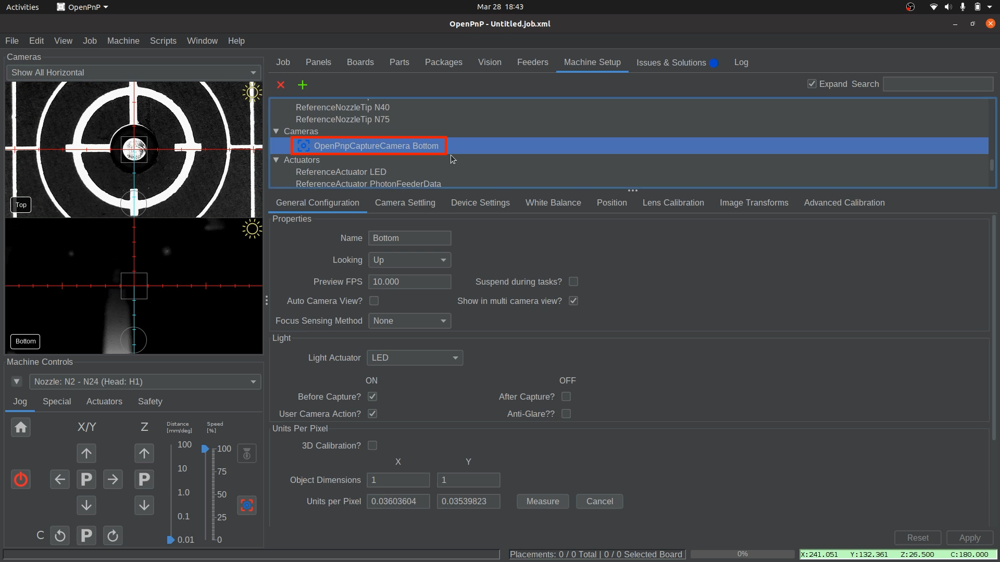
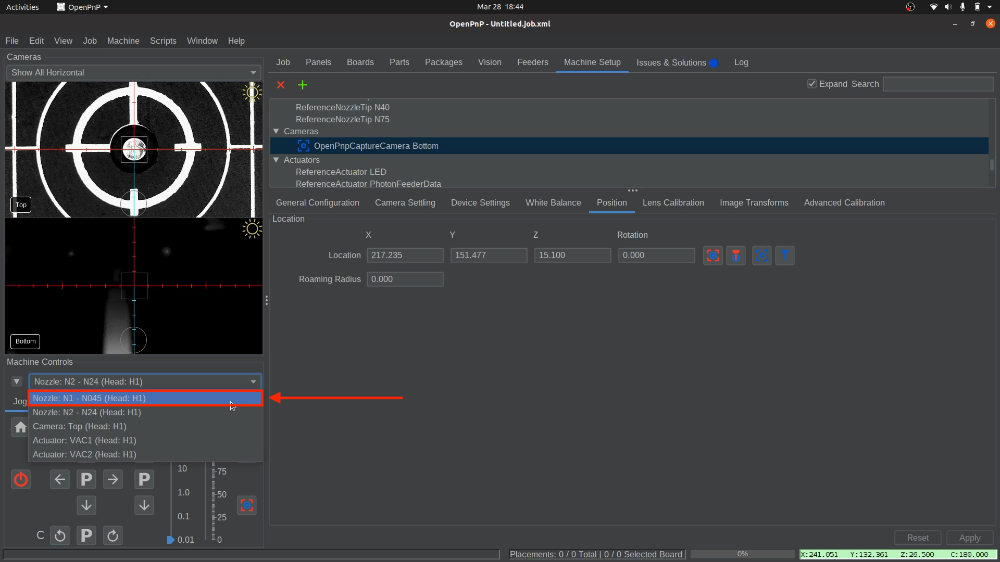
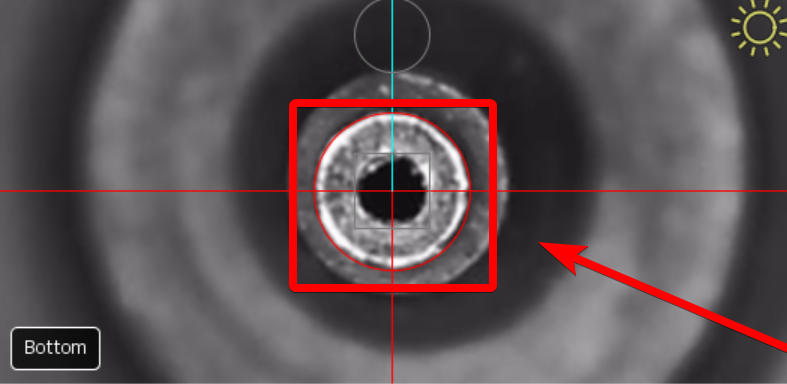
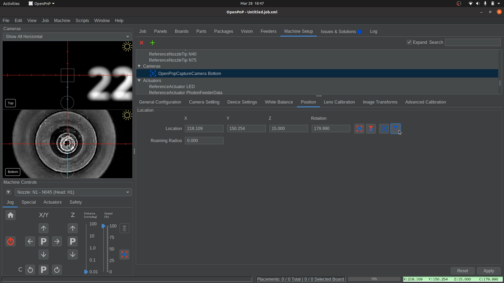

# Bottom Camera Position

---

Now that we have precise alignment between the nozzle tips and the top camera, we can use the calibrated nozzle to set our bottom camera position.

1. **Home your machine using the "Home" button**.
    * The LumenPnP will perform the homing sequence and level both nozzles to be the same height.
    * Ensure you keep the nozzles level throughout these steps, as you will use this to assist with setting the bottom camera position.  
     
  

1. **Open the Bottom Camera Settings**.
    * Navigate to `Machine Setup > Cameras > OpenPnpCaptureCamera Bottom`.  
     
  

1. **Access the Position Tab**.
    * Click on the Position tab to begin setting the bottom camera’s location.
    * Enter 31.5 into the Z position field. (*This step is specific to any LumenPnP V3 machine.*)   
     
  

1. **Save the 31.500 Z Position**
    * Click `Apply` in the lower right corner to save the bottom camera position in OpenPnP.  
       

1. **Select Nozzle: N1**.
    * From the machine controls dropdown, select `Nozzle: N1 - N045 (Head:H1)`. This ensures the left nozzle is used for positioning.  
     
  

1. **Align Nozzle Tip Over the Bottom Camera**.
    * Without changing the Z-height, jog the Nozzle: N1 (left toolhead) over the bottom camera and use OpenPnP’s viewfinder to center the nozzle tip in the image.  
     
    !!! Tip "Fine-Tuning Focus"
        The bottom camera’s focus is pre-adjusted before shipping, but you can fine-tune it if needed. loosen the set-screw in the side and slightly rotate the bottom camera lens until the image appears sharp.
  

1. **Capture the Bottom Camera Position**.
    * Once the nozzle tip is sharp and centered, click the "Capture Toolhead Location" button to save the position. (*The image in this step is of a V4 camera, which is different than the V3 camera. The image may not represent what you will see.*)
    !!! note "Blurry or Pixelated?"
        If you are zoomed in very close to the nozzle tip, what may appear as blurriness could actually be pixelation. Try zooming out to check if this is the case.
     
  

1. **Apply and Save the Captured Nozzle Position**
    * Click `Apply` in the lower right corner to save the bottom camera position in OpenPnP.  
       
    * Save your OpenPnP configuration now. `File > Save Configuration`.  
        
  

---

## Next Steps

Next is [Nozzle Tip Calibration](../8-nozzle-tip-calibration/nozzle-tip-calibration.md).

