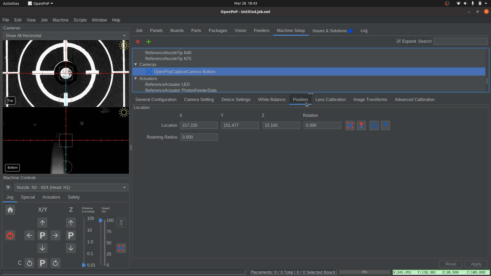

# Bottom Camera Position

---

Now that we have precise alignment between the nozzle tips and the top camera, we can use the calibrated nozzle to set our bottom camera position.

1. **Open the Bottom Camera Settings**.
    * Navigate to `Machine Setup > Cameras > OpenPnpCaptureCamera Bottom`.  
     
  

2. **Access the Position Tab**.
    * Click on the Position tab to begin setting the bottom camera’s location.  
     
  

3. **Select Nozzle: N1**.
    * From the machine controls dropdown, select `Nozzle: N1 - N045 (Head:H1)`. This ensures the left nozzle is used for positioning.  
     
  

4. **Position Nozzle: N1 at Datum Board Height**.
    * Jog Nozzle: N1 (left toolhead) until it just barely touches the top surface of the datum board. This establishes a consistent Z-height reference.  
     
  

5. **Align Nozzle Tip Over the Bottom Camera**.
    * Without changing the Z-height, jog the Nozzle: N1 (left toolhead) over the bottom camera and use OpenPnP’s viewfinder to center the nozzle tip in the image.  
     
     
    !!! Tip "Fine-Tuning Focus"
        The bottom camera’s focus is pre-adjusted before shipping, but you can fine-tune it if needed. loosen the set-screw in the side and slightly rotate the bottom camera lens until the image appears sharp.
  

6. **Capture the Bottom Camera Position**.
    * Once the nozzle tip is sharp and centered, click the "Capture Toolhead Location" button to save the position.
    !!! note "Blurry or Pixelated?"
        If you are zoomed in very close to the nozzle tip, what may appear as blurriness could actually be pixelation. Try zooming out to check if this is the case.
     
  

7. **Apply and Save the Captured Nozzle Position**
    * Click `Apply` in the lower right corner to save the bottom camera position in OpenPnP.  
       
    * Save your OpenPnP configuration now. `File > Save Configuration`.  
        
  

---

## Next Steps

Next is [Nozzle Tip Calibration](../8-nozzle-tip-calibration/nozzle-tip-calibration.md).

