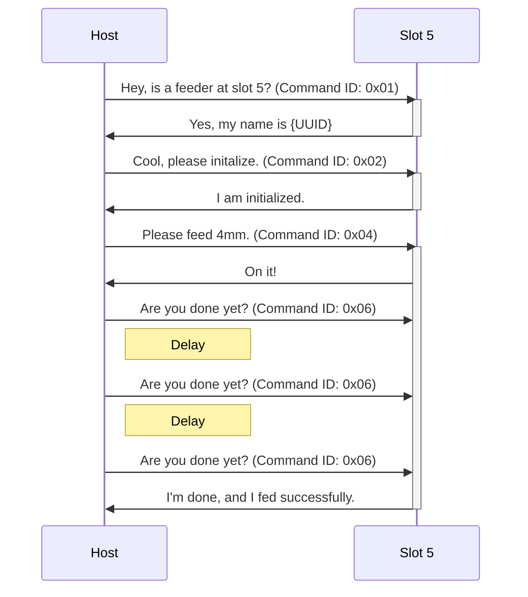
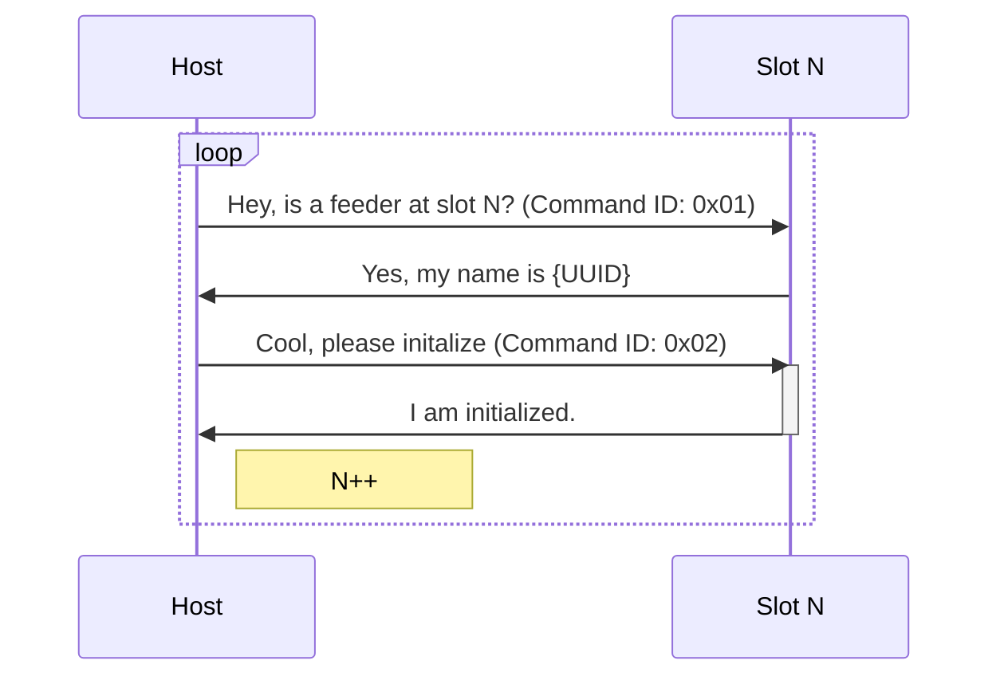

# Photon Protocol

The Photon Protocol is designed to facilitate **two different types of addressing**. In Photon, you can address a feeder using both its UUID (the hard-coded name of that unique device) and its slot (the physical location on the machine). This is so that we can:

- keep track of what part is loaded into a feeder even when it's moved to a different location
- find a feeder regardless of where it's loaded on the machine
- easily discover new feeders when they're loaded onto the machine

Only the host may initiate communication. Every Photon interaction is comprised of two packets: one packet from the host with a command and optional payload, and a response from a feeder with a status and optional payload of information.

The following is the basic Photon packet structure.


The packet is made up of two parts: the header and the payload. The header contains exactly five bytes: "to" address, "from" address, packet ID, payload length, and the CRC. The payload *always* has at least one byte, either a command ID or a status. The payload can have optional further bytes.

The host can send either broadcast and unicast commands. Unicast commands are meant for only the device in a certain slot. Broadcast commands are effectively speaking to the whole bus, and are instead addressing based on UUID, initialization status, or potentially other factors.

**Example Feeder Init and Feed**



**Example Bus Scan**



## Header Bytes

### To Address

This byte indicates which address the packet is intended for. This address value is equivalent to the slot addresses.

Valid values are anywhere between `0x00` and `0xFF`. Address `0x00` is reserved for the host, and address `0xFF` is reserved for broadcast commands.

### From Address

This byte indicates which address the packet is coming from. This address value is equivalent to the slot addresses.

Valid values are anywhere between `0x00` and `0xFF`. Address `0x00` is reserved for the host, and `0xFF` should not be used.

### Packet ID

The Packet ID is an identifying byte that allows the devices on the bus to keep track of requests. When a feeder responds to a command, it includes the Packet ID of the initiating packet. This allows the host to determine which packet the feeder is responding to.

This byte is a value between `0x00` and `0xFF`. The host should increment this value for every command sent, and roll back to `0x00` once it reaches `0xFF`.

### Payload Length

The payload length is the number of bytes contained in the payload. This number will always be at least `0x01`, as each packet has at least a Command ID or Status.

### CRC

The CRC byte is a checksum calculated on the entire packet sans the checksum byte. The checksum can be calculated as shown below:

JavaScript

``` javascript
calcCRC(data){
    let crc = 0;
    for(var i = 0; i<data.length; i++){
        crc = crc ^ (data[i] << 8);
        for(let j = 0; j < 8; j++){
            if ((crc & 0x8000) != 0) {
            crc = crc ^ (0x1070 << 3);
            }
            crc <<= 1;
        }
    }
    return (crc >> 8) & 0xFF;
}
```

C

``` c
uint8_t crc8(uint8_t data, size_t len) {
    uint32_t crc = 0;

    for (size_t i = 0; i < len; i++) {
        crc ^= (data << 8);
        for (size_t bit_n = 0; bit_n < 8; bit_n++) {
            if (crc & 0x8000) {
                crc ^= (0x1070 << 3);
            }
            crc <<= 1;
        }
    }

    return (uint8_t)(crc >> 8);
}
```

Once the CRC is calculated, it should be spliced into the packet in the appropriate location. The CRC should be recalculated and compared with the received CRC for every received packet to confirm data integrity.

## Payload

The first byte of the payload is always a Command ID when coming from the host, and always a Status when coming as a response from a feeder. The Command ID tells the feeder what action to perform or what information to send. The Status tells the host the status of the command.

The rest of the payload is used for any other information that needs to be sent, depending on the situation.

| Command Code | Name                     |
| ------  | ----------------------------- |
| `0x01`  | `GET_FEEDER_ID`                 |
| `0x02`  | `INITIALIZE_FEEDER`             |
| `0x03`  | `GET_VERSION`                   |
| `0x04`  | `MOVE_FEED_FORWARD`             |
| `0x05`  | `MOVE_FEED_BACKWARD`            |
| `0x06`  | `MOVE_FEED_STATUS`              |
| `0xbf`  | `VENDOR_OPTIONS`                |
| `0xc0`  | `GET_FEEDER_ADDRESS`            |
| `0xc1`  | `IDENTIFY_FEEDER`               |
| `0xc2`  | `PROGRAM_FEEDER_FLOOR`          |
| `0xc3`  | `UNINITIALIZED_FEEDERS_RESPOND` |

| Status Code | Name                    |
| ----------- | ----------------------  |
|    `0x00`   | `OK`                    |
|    `0x01`   | `WRONG_FEEDER_ID`       |
|    `0x02`   | `COULDNT_REACH`         |
|    `0x03`   | `UNINITIALIZED_FEEDER`  |
|    `0x04`   | `FEEDING_IN_PROGRESS`   |
|    `0x05`   | `FAIL`                  |
|    `0xFE`   | `TIMEOUT`               |
|    `0xFF`   | `UNKNOWN`               |

## Unicast Commands

### GET_FEEDER_ID `0x01`

| Send                 |              |
| -------------------- | ------------ |
| Requires Initialized | NO           |
| Addressing           | UNICAST      |
| Payload              | NONE         |

| Receive              | Value              | Position |
| -------------------- | ------------ | ------- |
| Status               | `OK`         | 0       |
| Payload              | 12 Byte UUID | 1-13    |

GET_ID is used to get a feeder's UUID knowing only it's slot address. GET_ID is used mainly to scan the bus address space and see if a feeder is present in a slot, and get its UUID for initilizing.

#### Example

Send:

```
[02] [00] [07] [01] [C0] [01]
 |    |    |    |    |    |
 |    |    |    |    |   Sending Command 0x01 means GET_ID
 |    |    |    |    |
 |    |    |    |   Checksum
 |    |    |    |
 |    |    |   Payload Length of 1
 |    |    |
 |    |   Packet ID
 |    |
 |   From Address
 |
To Address
```

Receive:

```
[00] [02] [07] [0D] [D7] [00] [02] [48] ..... [37] [30]
 |    |    |    |    |    |    |_____________________|
 |    |    |    |    |    |    |
 |    |    |    |    |    |    |
 |    |    |    |    |    |   12 Byte UUID
 |    |    |    |    |    |
 |    |    |    |    |   Status 0x00 means OK
 |    |    |    |    |
 |    |    |    |   Checksum
 |    |    |    |
 |    |    |   Payload Length of 13
 |    |    |
 |    |   Packet ID
 |    |
 |   From Address
 |
To Address
```

### INITIALIZE_FEEDER `0x02`

| Send                 |              |
| -------------------- | ------------ |
| Requires Initialized | NO           |
| Addressing           | UNICAST      |
| Payload              | 12 Byte UUID |

| Receive              | Value              | Position |
| -------------------- | ------------ | ------- |
| Status               | `OK` (0x00), `WRONG_FEEDER_ID` (0x01)   | 0       |
| Payload              | 12 Byte UUID | 1-13    |

INITIALIZE_FEEDER is used to initialize a feeder and allow it to perform other functions.

#### Example

Send:

```
[02] [00] [07] [0D] [C0] [02] [02] [48] ..... [37] [30]
 |    |    |    |    |    |    |_____________________|
 |    |    |    |    |    |    |
 |    |    |    |    |    |    |
 |    |    |    |    |    |   12 Byte Feeder UUID
 |    |    |    |    |    |
 |    |    |    |    |   Sending Command 0x02 means INITIALIZE
 |    |    |    |    |
 |    |    |    |   Checksum
 |    |    |    |
 |    |    |   Payload Length of 13
 |    |    |
 |    |   Packet ID
 |    |
 |   From Address
 |
To Address
```

Receive:

```
[00] [02] [07] [0D] [D7] [00] [02] [48] ..... [37] [30]
 |    |    |    |    |    |    |_____________________|
 |    |    |    |    |    |    |
 |    |    |    |    |    |    |
 |    |    |    |    |    |   12 Byte Feeder UUID
 |    |    |    |    |    |
 |    |    |    |    |   Status 0x00 means OK
 |    |    |    |    |
 |    |    |    |   Checksum
 |    |    |    |
 |    |    |   Payload Length of 13
 |    |    |
 |    |   Packet ID
 |    |
 |   From Address
 |
To Address
```

### GET_VERSION `0x03`

| Send                 |              |
| -------------------- | ------------ |
| Requires Initialized | YES           |
| Addressing           | UNICAST      |
| Payload              | None |

| Receive              | Value              | Position |
| -------------------- | ------------ | ------- |
| Status               | `OK`         | 0       |
| Payload              | Version      | 1    |

GET_VERSION is used to get the version of the protocol used by a specific feeder.

#### Example

Send:

```
[02] [00] [07] [01] [C0] [03]
 |    |    |    |    |    |
 |    |    |    |    |    |
 |    |    |    |    |    |
 |    |    |    |    |    |
 |    |    |    |    |    |
 |    |    |    |    |   Sending Command 0x02 means GET_VERSION
 |    |    |    |    |
 |    |    |    |   Checksum
 |    |    |    |
 |    |    |   Payload Length of 1
 |    |    |
 |    |   Packet ID
 |    |
 |   From Address
 |
To Address
```

Receive:

```
[00] [02] [07] [02] [D7] [00] [01]
 |    |    |    |    |    |    |
 |    |    |    |    |    |    |
 |    |    |    |    |    |    |
 |    |    |    |    |    |   Protocol Version
 |    |    |    |    |    |
 |    |    |    |    |   Status 0x00 means OK
 |    |    |    |    |
 |    |    |    |   Checksum
 |    |    |    |
 |    |    |   Payload Length of 2
 |    |    |
 |    |   Packet ID
 |    |
 |   From Address
 |
To Address
```

### MOVE_FEED_FORWARD `0x04`

| Send                 |              |
| -------------------- | ------------ |
| Requires Initialized | YES           |
| Addressing           | UNICAST      |
| Payload              | Distance to move (in tenths of a mm) |

| Receive              | Value              | Position |
| -------------------- | ------------ | ------- |
| Status               | `OK`         | 0       |
| Payload              | Expected Feed Time in milliseconds | 1-2 (Big Endian)   |

MOVE_FEED_FORWARD is used to command a feeder to feed a certain distance forward. It returns the expected amount of time it will take to perform the feed.

#### Example

Send:

```
[02] [00] [07] [02] [C0] [04] [28]
 |    |    |    |    |    |    |
 |    |    |    |    |    |    |
 |    |    |    |    |    |    |
 |    |    |    |    |    |   Distance (in tenths of a mm)
 |    |    |    |    |    |
 |    |    |    |    |   Sending Command 0x04 means MOVE_FEED_FORWARD
 |    |    |    |    |
 |    |    |    |   Checksum
 |    |    |    |
 |    |    |   Payload Length of 2
 |    |    |
 |    |   Packet ID
 |    |
 |   From Address
 |
To Address
```

Receive:

```
[00] [02] [07] [03] [D7] [00] [02] [48]
 |    |    |    |    |    |    |____|
 |    |    |    |    |    |    |
 |    |    |    |    |    |    |
 |    |    |    |    |    |   2 Byte Expected Time to Feed
 |    |    |    |    |    |
 |    |    |    |    |   Status 0x00 means OK
 |    |    |    |    |
 |    |    |    |   Checksum
 |    |    |    |
 |    |    |   Payload Length of 3
 |    |    |
 |    |   Packet ID
 |    |
 |   From Address
 |
To Address
```

### MOVE_FEED_BACKWARD `0x05`

| Send                 |              |
| -------------------- | ------------ |
| Requires Initialized | YES           |
| Addressing           | UNICAST      |
| Payload              | Distance to move (in tenths of a mm) |

| Receive              | Value              | Position |
| -------------------- | ------------ | ------- |
| Status               | `OK`         | 0       |
| Payload              | Expected Feed Time in milliseconds | 1-2 (Big Endian)   |

MOVE_FEED_BACKWARD is used to command a feeder to feed a certain distance backwards. It returns the expected amount of time it will take to perform the feed.

#### Example

Send:

```
[02] [00] [07] [02] [C0] [05] [28]
 |    |    |    |    |    |    |
 |    |    |    |    |    |    |
 |    |    |    |    |    |    |
 |    |    |    |    |    |   Distance (in tenths of a mm)
 |    |    |    |    |    |
 |    |    |    |    |   Sending Command 0x05 means MOVE_FEED_BACKWARD
 |    |    |    |    |
 |    |    |    |   Checksum
 |    |    |    |
 |    |    |   Payload Length of 2
 |    |    |
 |    |   Packet ID
 |    |
 |   From Address
 |
To Address
```

Receive:

```
[00] [02] [07] [0D] [D7] [00] [02] [48]
 |    |    |    |    |    |    |____|
 |    |    |    |    |    |    |
 |    |    |    |    |    |    |
 |    |    |    |    |    |   2 Byte Expected Time to Feed
 |    |    |    |    |    |
 |    |    |    |    |   Status 0x00 means OK
 |    |    |    |    |
 |    |    |    |   Checksum
 |    |    |    |
 |    |    |   Payload Length of 3
 |    |    |
 |    |   Packet ID
 |    |
 |   From Address
 |
To Address
```

### MOVE_FEED_STATUS `0x06`

| Send                 |              |
| -------------------- | ------------ |
| Requires Initialized | YES          |
| Addressing           | UNICAST      |
| Payload              | None |

| Receive              | Value              | Position |
| -------------------- | ------------ | ------- |
| Status               | `OK` (0x00), `COULDNT_REACH` (0x01) | 0       |
| Payload              | None |     |

MOVE_FEED_STATUS is used to determine if a feeder has finished a feed command, and get the status of the last feed. Feeding is blocking, so this command is intended to be used to probe a feeder until a response is received with the last feed's status.

#### Example

Send:

```
[02] [00] [07] [01] [C0] [06]
 |    |    |    |    |    |
 |    |    |    |    |    |
 |    |    |    |    |    |
 |    |    |    |    |    |
 |    |    |    |    |    |
 |    |    |    |    |   Sending Command 0x06 means MOVE_FEED_STATUS
 |    |    |    |    |
 |    |    |    |   Checksum
 |    |    |    |
 |    |    |   Payload Length of 1
 |    |    |
 |    |   Packet ID
 |    |
 |   From Address
 |
To Address
```

Receive:

```
[00] [02] [07] [01] [D7] [00]
 |    |    |    |    |    |
 |    |    |    |    |    |
 |    |    |    |    |    |
 |    |    |    |    |    |
 |    |    |    |    |    |
 |    |    |    |    |   Status 0x00 means OK
 |    |    |    |    |
 |    |    |    |   Checksum
 |    |    |    |
 |    |    |   Payload Length of 1
 |    |    |
 |    |   Packet ID
 |    |
 |   From Address
 |
To Address
```

### VENDOR_OPTIONS `0xBF`

| Send                 |              |
| -------------------- | ------------ |
| Requires Initialized | YES           |
| Addressing           | UNICAST      |
| Payload              | Implementation Dependent |

| Receive              | Value              | Position |
| -------------------- | ------------ | ------- |
| Status               | Implementation Dependent        | 0       |
| Payload              | Implementation Dependent |     |

VENDOR_OPTIONS is a section used to add vendor-specific commands behind a dedicated command ID. The specifics of this command depend on your implementation.

#### Example

Send:

```
[02] [00] [07] [0D] [C0] [BF] [02] [48] ..... [37] [30]
 |    |    |    |    |    |    |_____________________|
 |    |    |    |    |    |    |
 |    |    |    |    |    |    |
 |    |    |    |    |    |   Vendor-Specific Payload
 |    |    |    |    |    |
 |    |    |    |    |   Sending Command 0xBF means VENDOR_OPTIONS
 |    |    |    |    |
 |    |    |    |   Checksum
 |    |    |    |
 |    |    |   Payload Length is dependent on implementation
 |    |    |
 |    |   Packet ID
 |    |
 |   From Address
 |
To Address
```

Receive:

```
[00] [02] [07] [0D] [D7] [3F] [02] [48] ..... [37] [30]
 |    |    |    |    |    |    |_____________________|
 |    |    |    |    |    |    |
 |    |    |    |    |    |    |
 |    |    |    |    |    |   Vendor-Specific Payload
 |    |    |    |    |    |
 |    |    |    |    |   Vendor-Specific Status
 |    |    |    |    |
 |    |    |    |   Checksum
 |    |    |    |
 |    |    |   Payload Length dependent on implementation
 |    |    |
 |    |   Packet ID
 |    |
 |   From Address
 |
To Address
```

## Broadcast Commands

### GET_FEEDER_ADDRESS `0xC0`

| Send                 |              |
| -------------------- | ------------ |
| Requires Initialized | NO           |
| Addressing           | BROADCAST      |
| Payload              | 12 Byte UUID |

| Receive              | Value              | Position |
| -------------------- | ------------ | ------- |
| Status               | `OK`         | 0       |
| Payload              | None |    |

GET_FEEDER_ADDRESS is used to get the slot address of a feeder based on its UUID. If a feeder's UUID matches the one sent in the payload, it will respond with status `OK` (0x00) with a "From" address that indicates its slot.

#### Example

Send:

```
[FF] [00] [07] [0D] [C0] [C0] [02] [48] ..... [37] [30]
 |    |    |    |    |    |    |_____________________|
 |    |    |    |    |    |    |
 |    |    |    |    |    |    |
 |    |    |    |    |    |   12 Byte Feeder UUID
 |    |    |    |    |    |
 |    |    |    |    |   Sending Command 0xC0 means GET_FEEDER_ADDRESS
 |    |    |    |    |
 |    |    |    |   Checksum
 |    |    |    |
 |    |    |   Payload Length of 13
 |    |    |
 |    |   Packet ID
 |    |
 |   From Address
 |
Broadcast Address
```

Receive:

```
[00] [02] [07] [01] [D7] [00]
 |    |    |    |    |    |
 |    |    |    |    |    |
 |    |    |    |    |    |
 |    |    |    |    |    |
 |    |    |    |    |    |
 |    |    |    |    |   Status 0x00 means OK
 |    |    |    |    |
 |    |    |    |   Checksum
 |    |    |    |
 |    |    |   Payload Length of 1
 |    |    |
 |    |   Packet ID
 |    |
 |   From Address
 |
To Address
```

### IDENTIFY_FEEDER `0xC1`

| Send                 |              |
| -------------------- | ------------ |
| Requires Initialized | NO           |
| Addressing           | BROADCAST    |
| Payload              | 12 Byte UUID |

| Receive              | Value              | Position |
| -------------------- | ------------ | ------- |
| Status               | `OK`         | 0       |
| Payload              | None         |         |

IDENTIFY_FEEDER is used to cause the feeder to do some action that makes it identifiable by a user. For example, the LumenPnP feeders flash their main indicator light when they receive this command.

#### Example

Send:

```
[FF] [00] [07] [0D] [C0] [C1] [02] [48] ..... [37] [30]
 |    |    |    |    |    |    |_____________________|
 |    |    |    |    |    |    |
 |    |    |    |    |    |    |
 |    |    |    |    |    |   12 Byte Feeder UUID
 |    |    |    |    |    |
 |    |    |    |    |   Sending Command 0xC1 means IDENTIFY_FEEDER
 |    |    |    |    |
 |    |    |    |   Checksum
 |    |    |    |
 |    |    |   Payload Length of 13
 |    |    |
 |    |   Packet ID
 |    |
 |   From Address
 |
Broadcast Address
```

Receive:

```
[00] [02] [07] [01] [D7] [00]
 |    |    |    |    |    |
 |    |    |    |    |    |
 |    |    |    |    |    |
 |    |    |    |    |    |
 |    |    |    |    |    |
 |    |    |    |    |   Status 0x00 means OK
 |    |    |    |    |
 |    |    |    |   Checksum
 |    |    |    |
 |    |    |   Payload Length of 1
 |    |    |
 |    |   Packet ID
 |    |
 |   From Address
 |
To Address
```

### PROGRAM_FEEDER_FLOOR `0xC2`

| Send                 |              |
| -------------------- | ------------ |
| Requires Initialized | NO           |
| Addressing           | BROADCAST    |
| Payload              | 12 Byte UUID |
|                      | Address to Program |

| Receive              | Value              | Position |
| -------------------- | ------------------ | ------- |
| Status               | `OK`               | 0       |
| Payload              | None       |     |


PROGRAM_FEEDER_FLOOR is used to program an address into a slot. This should only need to be done once per slot.

#### Example

Send:

```
[FF] [00] [07] [0E] [C0] [C2] [02] [48] ..... [37] [30] [05]
 |    |    |    |    |    |    |_____________________|   |
 |    |    |    |    |    |    |                         |
 |    |    |    |    |    |    |                         |
 |    |    |    |    |    |    |                        Address to program
 |    |    |    |    |    |    |
 |    |    |    |    |    |   12 Byte Feeder UUID
 |    |    |    |    |    |
 |    |    |    |    |   Sending Command 0xC2 means PROGRAM_FEEDER_FLOOR
 |    |    |    |    |
 |    |    |    |   Checksum
 |    |    |    |
 |    |    |   Payload Length of 14
 |    |    |
 |    |   Packet ID
 |    |
 |   From Address
 |
Broadcast Address
```

Receive:

```
[00] [05] [07] [01] [D7] [00]
 |    |    |    |    |    |
 |    |    |    |    |    |
 |    |    |    |    |    |
 |    |    |    |    |    |
 |    |    |    |    |    |
 |    |    |    |    |   Status 0x00 means OK
 |    |    |    |    |
 |    |    |    |   Checksum
 |    |    |    |
 |    |    |   Payload Length of 1
 |    |    |
 |    |   Packet ID
 |    |
 |   From Address (which was just programmed)
 |
To Address
```

### UNINITIALIZED_FEEDERS_RESPOND `0xC3`

| Send                 |              |
| -------------------- | ------------ |
| Requires Initialized | NO           |
| Addressing           | BROADCAST    |
| Payload              | None         |

| Receive              | Value              | Position |
| -------------------- | ------------------ | ------- |
| Status               | `OK`               | 0       |
| Payload              | 12 Byte UUID       | 1-12    |

UNINITIALIZED_FEEDERS_RESPOND causes all feeders on the bus that are not initialized to respond. This command should only be used when it's known that there's only one uninitialized feeder on the bus. This command is mainly used for helping in slot programming utilies.

#### Example

Send:

```
[FF] [00] [07] [0E] [C0] [C3]
 |    |    |    |    |    |
 |    |    |    |    |    |
 |    |    |    |    |    |
 |    |    |    |    |    |
 |    |    |    |    |    |
 |    |    |    |    |    |
 |    |    |    |    |    |
 |    |    |    |    |   Sending Command 0xC3 means UNINITIALIZED_FEEDERS_RESPOND
 |    |    |    |    |
 |    |    |    |   Checksum
 |    |    |    |
 |    |    |   Payload Length of 1
 |    |    |
 |    |   Packet ID
 |    |
 |   From Address
 |
Broadcast Address
```

Receive:

```
[00] [02] [07] [0D] [D7] [00] [02] [48] ..... [37] [30]
 |    |    |    |    |    |    |_____________________|
 |    |    |    |    |    |    |
 |    |    |    |    |    |    |
 |    |    |    |    |    |   12 Byte Feeder UUID
 |    |    |    |    |    |
 |    |    |    |    |   Status 0x00 means OK
 |    |    |    |    |
 |    |    |    |   Checksum
 |    |    |    |
 |    |    |   Payload Length of 13
 |    |    |
 |    |   Packet ID
 |    |
 |   From Address
 |
To Address
```
