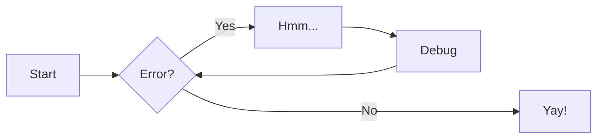

# Photon Protocol

The Photon Protocol is designed to facilitate ids and uuids

Only the host may initiate communication. Every Photon interaction is comprised of two packets: one packet from the host with a command and optional payload, and a response from a feeder with a status and optional payload of information.

broadcast and unicast

The following is the basic Photon packet structure.


The packet is made up of two parts: the header and the payload. The header contains exactly five bytes: "to" address, "from" address, packet ID, payload length, and the CRC. The payload *always* has at least one byte, either a command ID or a status. The payload can have optional further bytes.



## Header Bytes

### To Address

This byte indicates which address the packet is intended for. This address value is equivalent to the slot addresses.

Valid values are anywhere between `0x00` and `0xFF`. Address `0x00` is reserved for the host, and address `0xFF` is reserved for broadcast commands.

### From Address

This byte indicates which address the packet is coming from. This address value is equivalent to the slot addresses.

Valid values are anywhere between `0x00` and `0xFF`. Address `0x00` is reserved for the host.

### Packet ID

The Packet ID is an identifying byte that allows the devices on the bus to keep track of requests. When a feeder responds to a command, it includes the Packet ID of the initiating packet. This allows the host to determine which packet the feeder is responding to.

This byte is a value between `0x00` and `0xFF`. The host should increment this value for every command sent, and roll back to `0x00` once it reaches `0xFF`.

### Payload Length

The payload length is the number of bytes contained in the payload. This number will always be at least `0x01`, as each packet has at least a Command ID or Status.

### CRC

The CRC byte is a checksum calculated on the entire packet sans the checksum byte. The checksum can be calculated as shown below:

JavaScript

``` javascript
calcCRC(data){
    let crc = 0;
    for(var i = 0; i<data.length; i++){
        crc = crc ^ (data[i] << 8);
        for(let j = 0; j < 8; j++){
            if ((crc & 0x8000) != 0) {
            crc = crc ^ (0x1070 << 3);
            }
            crc <<= 1;
        }
    }
    return (crc >> 8) & 0xFF;
}
```

C

``` c
uint8_t crc8(uint8_t data, size_t len) {
    uint32_t crc = 0;

    for (size_t i = 0; i < len; i++) {
        crc ^= (data << 8);
        for (size_t bit_n = 0; bit_n < 8; bit_n++) {
            if (crc & 0x8000) {
                crc ^= (0x1070 << 3);
            }
            crc <<= 1;
        }
    }

    return (uint8_t)(crc >> 8);
}
```

Once the CRC is calculated, it should be spliced into the packet in the appropriate location. The CRC should be recalculated and compared with the received CRC for every received packet to confirm data integrity.

## Payload

The first byte of the payload is always a Command ID when coming from the host, and always a Status when coming as a response from a feeder. The Command ID tells the feeder what action to perform or what information to send. The Status tells the host the status of the command.

The rest of the payload is used for any other information that needs to be sent, depending on the situation.

| Command Code | Name                     |
| ------  | ----------------------------- |
| `0x01`  | Get Feeder ID                 |
| `0x02`  | Initialize Feeder             |
| `0x03`  | Get Version                   |
| `0x04`  | Move Feed Forward             |
| `0x05`  | Move Feed Backward            |
| `0x06`  | Move Feed Status              |
| `0xbf`  | Vendor Options                |
| `0xc0`  | Get Feeder Address            |
| `0xc1`  | Identify Feeder               |
| `0xc2`  | Program Feeder Floor          |
| `0xc3`  | Uninitialized Feeders Respond |

| Status Code | Name                    |
| ----------- | ----------------------  |
|    `0x00`   | `OK`                    |
|    `0x01`   | `WRONG_FEEDER_ID`       |
|    `0x02`   | `COULDNT_REACH`         |
|    `0x03`   | `UNINITIALIZED_FEEDER`  |
|    `0x04`   | `FEEDING_IN_PROGRESS`   |
|    `0x05`   | `FAIL`                  |
|    `0xFE`   | `TIMEOUT`               |
|    `0xFF`   | `UNKNOWN`               |

## Command IDs

Each Command ID the host can send a feeder have certain payload requirements, and certain expected responses from the feeder.

### GET_ID `0x01`

| Send                 |              |
| -------------------- | ------------ |
| Requires Initialized | NO           |
| Addressing           | UNICAST      |
| Payload              | NONE         |

| Receive              |              |         |
| -------------------- | ------------ | ------- |
| Status               | `OK`         | 0       |
| Payload              | 12 Byte UUID | 1-13    |

GET_ID is used to get a feeder's UUID knowing only it's slot address. GET_ID is used mainly to scan the bus address space and see if a feeder is present in a slot, and get its UUID for initilizing.

#### Example

Send:
```
[02] [00] [07] [01] [C0] [01]
 |    |    |    |    |    |
 |    |    |    |    |   Sending Command 0x01 means GET_ID
 |    |    |    |    |
 |    |    |    |   Checksum   
 |    |    |    |  
 |    |    |   Payload Length of 1    
 |    |    |  
 |    |   Packet ID
 |    |  
 |   From Address
 |  
To Address
```

Receive:
```
[00] [02] [07] [13] [D7] [00] [02] [48] ..... [37] [30]
 |    |    |    |    |    |    |_____________________|
 |    |    |    |    |    |    | 
 |    |    |    |    |    |    | 
 |    |    |    |    |    |   12 Byte UUID
 |    |    |    |    |    |
 |    |    |    |    |   Status 0x00 means OK
 |    |    |    |    |
 |    |    |    |   Checksum   
 |    |    |    |  
 |    |    |   Payload Length of 13    
 |    |    |  
 |    |   Packet ID
 |    |  
 |   From Address
 |  
To Address
```


