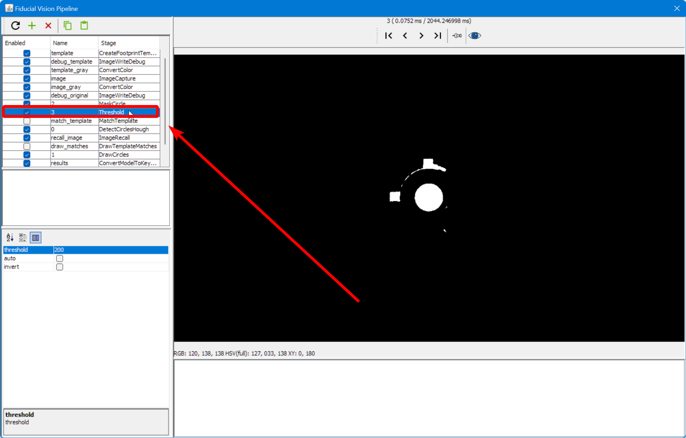
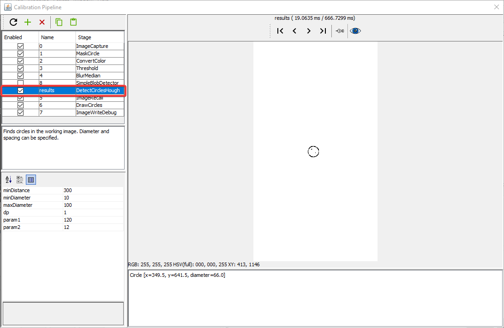
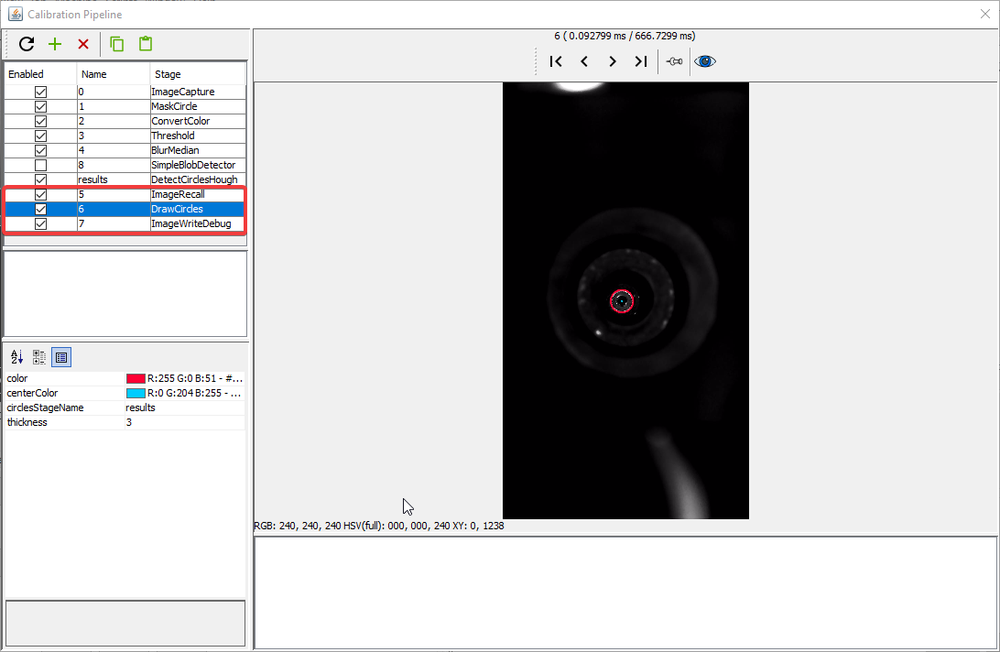
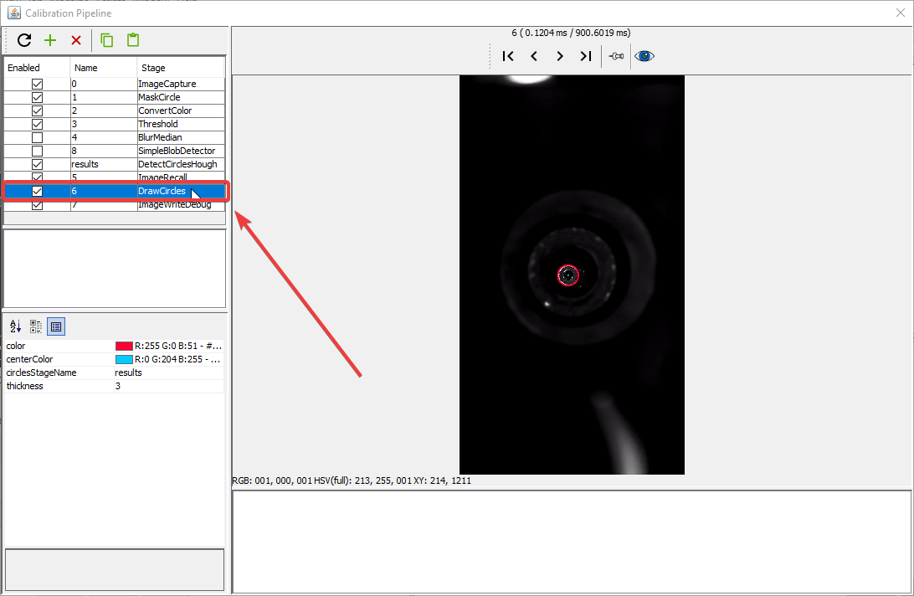
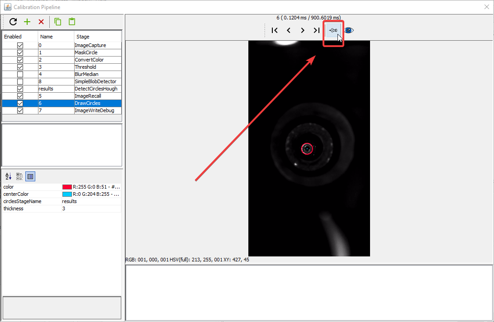
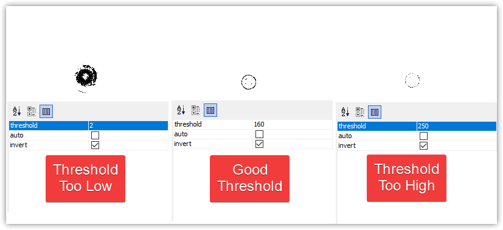
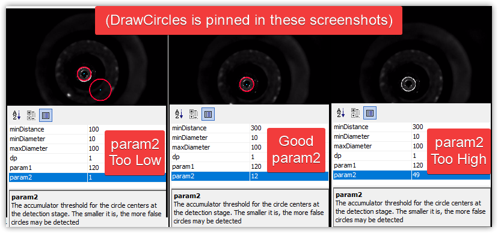
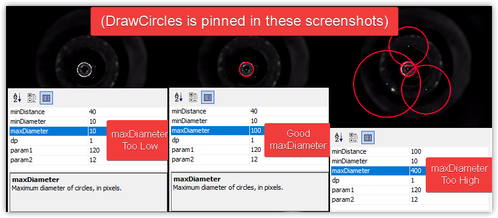

Computer vision is one of the most important and complicated elements of a pick and place machine, and the LumenPnP is no different. Vision is used in four main places:

1. Finding your homing fiducial
2. Finding the fiducial marks on your PCBs
3. Finding the tips of your nozzles, and
4. Confirming and orienting the parts the machine has picked up.

We've included good settings in the [default machine configuration](../../../openpnp/calibration/1-import-config/index.md) to get you started, but you will likely need to tune the settings for your exact needs depending on the ambient light in your room, the settings you used when [configuring your cameras](../../../openpnp/calibration/2-connect-to-machine/index.md#bottom-camera-config), and the kinds of components you're placing. This page is to get you set up to place components for your [FTP](../../../openpnp/ftp/index.md), and learn the basics of how adjusting computer vision works.

**For more information, we highly recommend reading the [OpenPnP documentation](https://github.com/openpnp/openpnp/wiki/Bottom-Vision).**

## Intro to Vision Tuning

### Computer Vision Basics

Computer vision used in OpenPnP takes photos from your top or bottom camera and passes them through a "Pipeline" of stages to identify what is in the image. Stages fall into a few categories:

1. Manipulating the photo to make it easier for the computer to identify parts of the photo. For example: `Threshold`.
2. Identifying certain elements of the photo. For example: `DetectCirclesHough`.
3. Showing you more information on the screen so that you can build, debug, and tweak the pipeline. For example: `DrawCircles`.

Because each of these kinds of stages live together in the pipeline, it can be a little confusing trying to decode how each stage works and what they're for.

Each stage of the pipeline has "parameters" that control its function. For example, the `ImageWriteDebug` step will ask you for parts of a file name to use when saving a debug image. Another more typical example is the `Threshold` stage, which will use a `threshold` parameter to pick which parts of your image will become white, and which will become black. When editing your vision pipeline, you should be able to start with simply tuning the parameters for the stages in the default pipeline. As you get more experienced, and if you're setting up more complicated placement jobs, you may need to add more stages to the pipeline to fine tune it for your needs.

### Pipeline Organization

As of the `2022-08-01_18-07-09.2a36a8d` update, OpenPnP added the "Vision" tab in the Machine Configuration section, which lets you create more specific pipelines for unique scenarios. Now you can define multiple specific pipelines to handle identification of different PCB components differently for better performance. This adds more functionality, but can be confusing when getting started. In general we recommend having four main pipelines to get started (when doing the FTP and beyond):

1. Finding your homing fiducial (Top Camera)
2. Finding the fiducial marks on your PCBs (Top Camera)
3. Finding the tips of your nozzles (Bottom Camera)
4. Confirming and orienting the parts the machine has picked up. (Bottom Camera)

Number 4 above is the one that you might expand when you move on to placing more complicated components. Note also that this "Vision" tab is brand new in OpenPnP, and so guidance here is subject to change as the feature gets refined in future OpenPnP releases.

### Pipeline Editing View

The pipeline editing view has several sections and features you should know about to make your tuning go more smoothly.

1. The list of stages. Click on a stage to show it's results in the main view, and show its parameters in the stage settings.
2. The main view. This shows the result of the currently selected stage unless a particular stage is pinned (see #5).
3. Stage output. This shows error messages if there's a problem with your stage or pipeline.
4. Stage settings. This lets you change the settings for the selected stage.
5. Pin Image. This lets you keep the results of the currently selected stage on on main view, even if you select another stage. Use this to pin a debugging stage so that you can quickly see the results of changes to a stage you're editing.

## Top Camera Vision Pipeline

### Homing Fiducials

If you find that the machine is having a hard time finding the homing fiducial, you might need to edit the Vision Pipeline. The iterative strategy here is:

1. Open the Pipeline.
2. Check the current output and identify the problem that is causing homing to fail.
3. Adjust the stage settings to change the pipeline output.
4. Review the new pipeline output.
5. Return to step 2 as necessary.

#### Open the Pipeline

1. Click on the `Machine Setup` tab in the top right pane.
  

2. Click on the "Expand" checkbox if necessary.
  

3. Click on `Heads > ReferenceHead H1`.
  

4. Click on the "Position Camera over location" icon button show below. This will move the top camera to where your datum board is mounted.
  

5. Confirm that your top camera is positioned exactly over the homing fiducial.
  

6. Adjust the exposure of your camera image as mentioned in the [Homing Fiducial Section](../../../openpnp/calibration/4-homing-fiducial/index.md#double-check-camera-exposure).

7. Go to the `Vision` tab.
  

8. Select on `FiducialVision` from the type dropdown.
  

9. Select `- Default Machine Fiducial Locator -` from the pipeline list.
  

10. Click on Pipeline `Edit`.
  

#### Check the debug results

1. Click on the `DrawCircles` stage.
  

2. The main view will show a circle if OpenPnP was able to identify what it thinks is the homing fiducial.
    1. If there are more than one circle, then we need to more clearly distinguish the real homing fiducial.
    2. If there is one circle, but it is not correctly drawn around the homing fiducial, then we need to more clearly distinguish the homing fiducial.
    3. If there are no circles, we need to loosen the filtering to make the real homing fiducial easier to identify.
    4. If the image looks like the good one above, your pipeline is properly tuned. If you've still been getting failures when homing, you may need to slightly loosen the filtering.

#### Adjust Pipeline

1. Click on the `Threshold` stage
  

2. Raise or lower the `threshold` parameter as necessary until the image is precise.
    1. If the image is too black, raise the `threshold` setting.
    2. If the image is too bright, lower the `threshold` setting.
   <!--  -->

3. Click on the `DrawCircles` stage and check if the fiducial has been correctly identified.
  

4. If not, pin the view of the `DrawCircles` stage.
  

5. Click on the `DetectCirclesHough` stage.
  

6. Raise or lower the `param2` parameter as necessary until the correct number of circles are identified.
    1. If there are no circles, lower the `param2` setting.
    2. If there are too many circles, raise the `param2` setting.
<!-- TODO: Photo shop image -->
#### Review Pipeline Output

1. When the fiducial is correctly identified, close the pipeline editor.
  

2. When prompted, save the edits you've made.
  

3. Try homing the machine to see if it can identify the homing fiducial.
  

### PCB Fiducials

1. Go to the `Vision` tab.
  

2. Select on `FiducialVision` from the type dropdown.
  

3. Select `FIDUCIAL-1X2` from the pipeline list. <!-- TODO: images are wrong here -->
  

4. Click on Pipeline `Edit`.
  

5. Continue with the same procedure as the [Homing fiducial](#check-the-debug-results) section above.

## Bottom Camera Vision Pipeline

### Nozzles

#### Position Nozzle Over Bottom Camera

1. Install a nozzle tip on your first toolhead. In this example we'll work with the N045 nozzle tip.
  

2. Click on the `Machine Setup` tab in the top right pane.
  

3. Click on the "Expand" checkbox to open all of the features about your machine.
  

4. Click on `Heads > ReferenceHead H1 > Nozzles > ReferenceNozzle N1`
  

5. Click on the `Nozzle Tips` tab.

6. Click the `Loaded?` checkbox for the nozzle you're tuning.

7. Click on `Nozzle Tips > ReferenceNozzleTip N045` (or whichever nozzle you're tuning).

8. Click on the `Calibration` tab.

9. Home your LumenPnP to make sure your toolhead's location is accurate. Ignore the `Nozzle tip calibration: not enough results from vision. Check pipeline and threshold` error if it appears.
  

10. Select the `Nozzle: N1 - N045 (Head:H1)` from the machine controls dropdown. (Or whichever tip you're tuning)
  

11. Click the "Position tool over location" button to bring the left nozzle above the bottom camera.
  

12. Click on Pipeline `Edit`.

#### Stage Breakdown

Stages 0-4 pre-process the image from the camera to make the tip of the nozzle clearer. Their goal is to outline the tip of the nozzle on its own so that it's exact position can be calculated. Of these stages, #3, `Threshold` is the most useful to tune. (See below for details)

The Results stage, `DetectCirclesHough`, takes the highlighted nozzle tip and calculates it's exact location by fitting a perfect circle to the tip. It's important that this calculation be reliable and repeatable. It's also important not to have extra erroneous circles detected, which could throw off the nozzle tip calibration and lead to imprecise picking.

Stages 5-7 are for debugging and showing you visually the output of the Results Stage. The most useful stage here is the #6 `DrawCircles` stage. After adjusting a setting, review the `DrawCircles` stage and check if the fiducial has been correctly identified. It may be helpful to pin the `DrawCircles` stage, too.

!!! Tip
    It may be helpful to pin the DrawCircles stage so you can see the results of the pipeline. This saves you having to click back and forth between stages while making adjustments.
    
    

#### General Strategy

The main view will show a circle if OpenPnP was able to identify what it thinks is the nozzle tip.

1. If there are more than one circle, then we need to more clearly distinguish the real nozzle tip.
2. If there is one circle, but it is not correctly drawn around the nozzle tip, then we need to more clearly distinguish the nozzle tip.
3. If there are no circles, we need to loosen the filtering to make the nozzle tip easier to identify.
4. If the image looks like the good one above, your pipeline is properly tuned. If you've still been getting failures when homing, you may need to slightly loosen the filtering.

You will need to take an iterative approach to tune your vision pipeline. Because your machine's cameras and lighting conditions are unique, there is unfortunately no one-size-fits-all solution here. Make small changes and track how they affect the identification of the tip of your nozzle.

!!! Note "Check the Debug Results"
    Unlike the homing fiducial tuning, nozzle tip tuning needs to be able to identify the nozzle multiple times as it is rotated. This can make it slightly trickier to see the issues with your calibration pipeline. You may need to run a round of calibration and watch the results live to see which orientation of the toolhead gives the pipeline the most trouble.
    

#### Threshold Tuning

The `Threshold` stage is the most commonly edited stage. It turns the camera image into black and white, which starkly defines the tip of your nozzle. It is important that only the tip of your nozzle is outlined in black after this step. Raise or lower the `threshold` parameter as necessary until the image is precise.

* If the image is too dark, raise the `threshold` setting.
* If the image is too bright, lower the `threshold` setting.

#### DetectCirclesHough Tuning

`DetectCirclesHough` is the other commonly edited stage. You'll need to experiment with the following adjustments:

The `param2` parameter adjusts how likely the algorithm will be to detect a circle.

1. If there are no circles, lower the `param2` setting.
2. If there are too many circles, raise the `param2` setting.

Depending on your nozzle tip, may also need to adjust the `maxDiameter` setting.

1. Raise the `maxDiameter` setting if there are no circles detected at all after adjusting the other settings.
2. Lower the `maxDiameter` setting if very large circles are drawn around noise in the image.

<!-- ### Part Recognition

1. Go to the `Vision` tab.
  

1. Select on `BottomVision` from the type dropdown.
  

1. Select `- Default Machine Bottom Vision -` from the pipeline list.
  

1. Click on Pipeline `Edit`.
   -->
