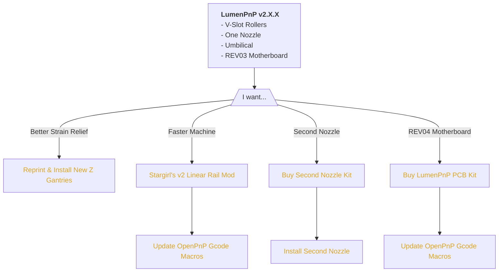
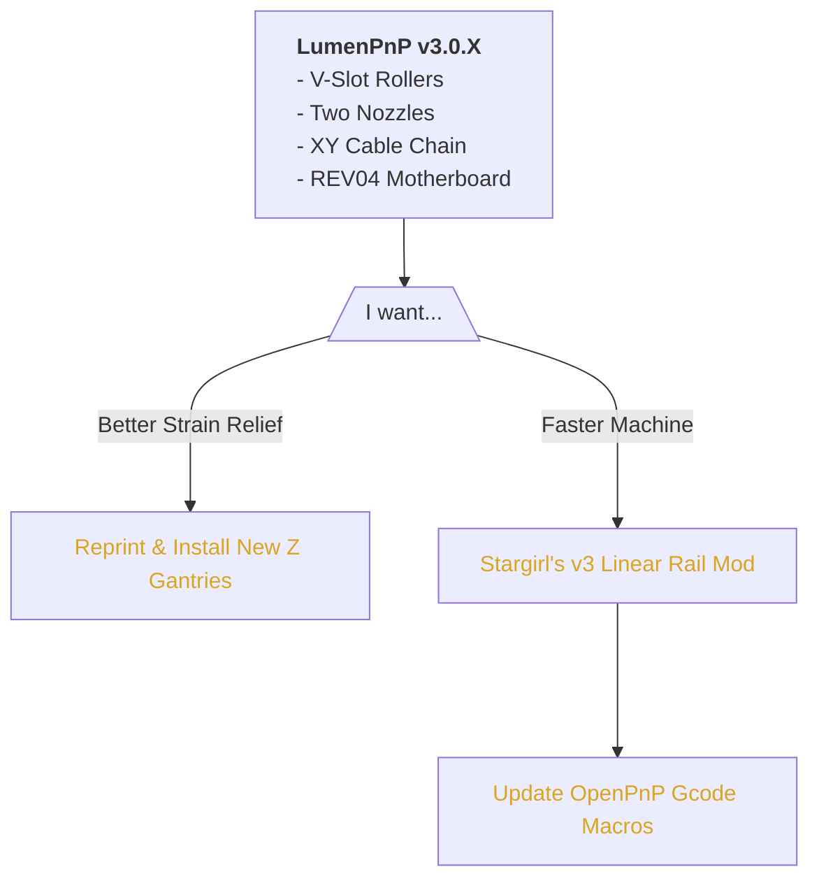

# LumenPnP Versions

The LumenPnP is always being upgraded and improved. This page is a reference for determining what and how to upgrade parts of your machine, depending on what version you built or bought.

## Summary of Versions

### v2.X.X

{: style="width:60%;margin-left:10%;"}

The v2 of the LumenPnP was a kit. It came as a box of parts and circuit boards, and users would 3D print all the plastic parts themselves. The LumenPnP v2 had:

- **V-Slot Rollers** for linear motion
- A **REV03** Motherboard
- **Umbilicals** for cable management
- **One Nozzle** and pneumatic system
- **No** foot extensions
- **No** included feeder slots

### v3.0.X

{: style="width:60%;margin-left:10%;"}

v3.0 versions of the LumenPnP were the first to come semi-assembled. They arrived with all printed parts included, and bolted together from just a handful of subassemblies. The LumenPnP v3.0 had:

- **V-Slot Rollers** for linear motion
- A **REV04** Motherboard
- **Cable chain** for cable management
- **Two Nozzles** and pneumatic systems
- **No** foot extensions
- **No** included feeder slots

### v3.1.X

{: style="width:60%;margin-left:10%;"}

v3.1.X was a significant improvement to the previous version, introducing linear rails and upgrading to cable chain.

- **Linear rails** for linear motion
- A **REV04** Motherboard
- **Cable chain** for cable management
- **Two Nozzles** and pneumatic systems
- Included **foot extensions**
- Feeder **slots** included

### v3.2.X

{: style="width:60%;margin-left:10%;"}

v3.2.X of the machine is almost identical to v3.1.X, except that the slots (where feeders interface with the machine) are ganged together into "blades" to make them easier to manufacure.

- **Linear rails** for linear motion
- A **REV04** Motherboard
- **Cable chain** for cable management
- **Two Nozzles** and pneumatic systems
- Included **foot extensions**
- Feeder **blades** included

## v2.X.X Upgrade Paths

## v3.0.X Upgrade Paths

## Upgrades

### Stargirl's v2 Linear Rail Mod

Community member Stargirl developed a linear rail modification for the v2 LumenPnP. Many folks in the community have performed this mod with great success. If you'd like to upgrade your v2 to linear rails, use [Stargirl's instructions on Printables](https://www.printables.com/model/235331-lumen-pnp-linear-rail-mods).

Once you've added the linear rails, you can greatly increase the speed of your machine. Do this by changing the "Max. Feed Rate [/min]" in your GcodeDriver's Driver Settings in OpenPnP to `35000`.

### Stargirl's v3 Linear Rail Mod

Community member Stargirl developed a linear rail modification for the v3.0 LumenPnP. Many folks in the community have performed this mod with great success. If you'd like to upgrade your v3.0 to linear rails, use [Stargirl's instructions on Printables](https://www.printables.com/model/278803-lumenpnp-linear-rail-mods-v3).

Once you've added the linear rails, you can greatly increase the speed of your machine. Do this by changing the "Max. Feed Rate [/min]" in your GcodeDriver's Driver Settings in OpenPnP to `35000`.

### New Z Gantries

In machines prior to v3.1, there wasn't much strain relief for the L and R motors.

{: style="width:60%;margin-left:10%;"}

Starting in v3.1, the z-gantry print got a location to secure the cable using a zip tie.

{: style="width:60%;margin-left:10%;"}

Reprinting your z-gantries from the [v3.1 release](https://github.com/opulo-inc/lumenpnp/releases/tag/v3.1.0) and zip tieing the cables to the print will greatly improve the strain relief for your machine's cables.

!!! warning "v2 Users"
    If you're performing this upgrade on a v2, the height of the nozzles will change by performing this upgrade. Update your OpenPnP configuration to make your Z axis match reality.

### Update OpenPnP Gcode Macros

If you're upgrading your machine's hardware, it's very likely you'll need to update how OpenPnP controls it as well. Depending on what you changed, you'll have to splice new Gcode into OpenPnP to support it. In general, speed settings are based on if your machine has linear rails or rollers.

To update your Gcode Macros, visit [our guide for doing so](/guides/update-gcode-macros).
